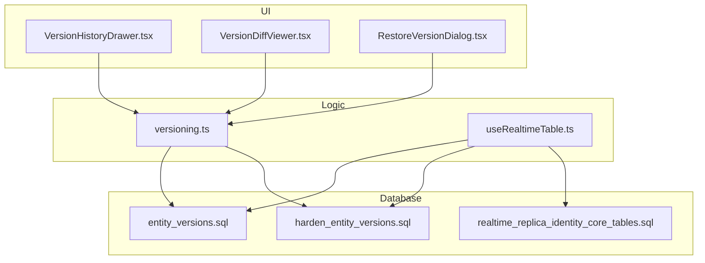
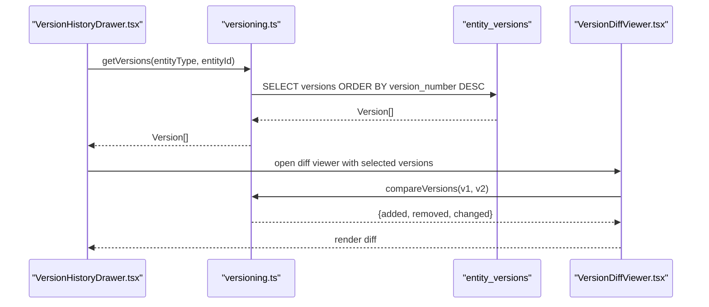
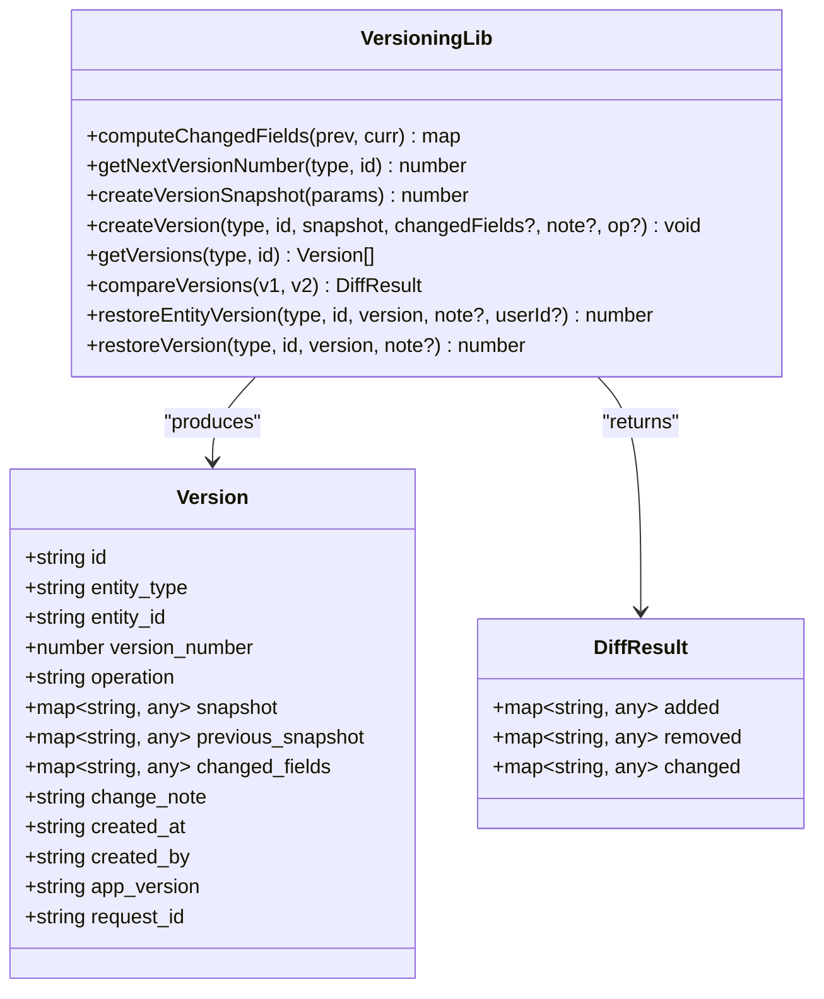
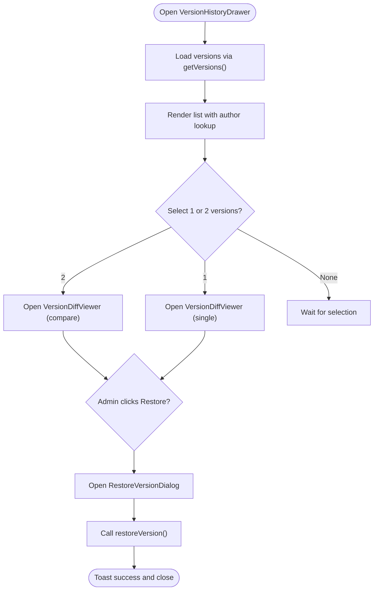
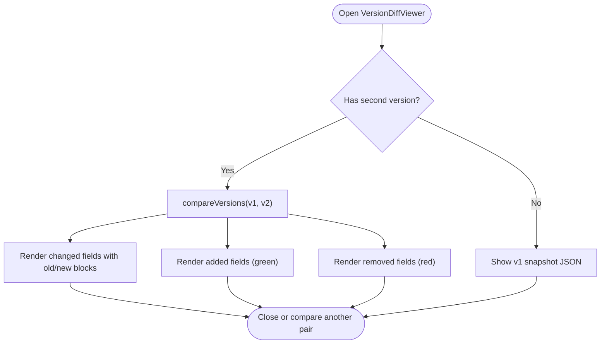
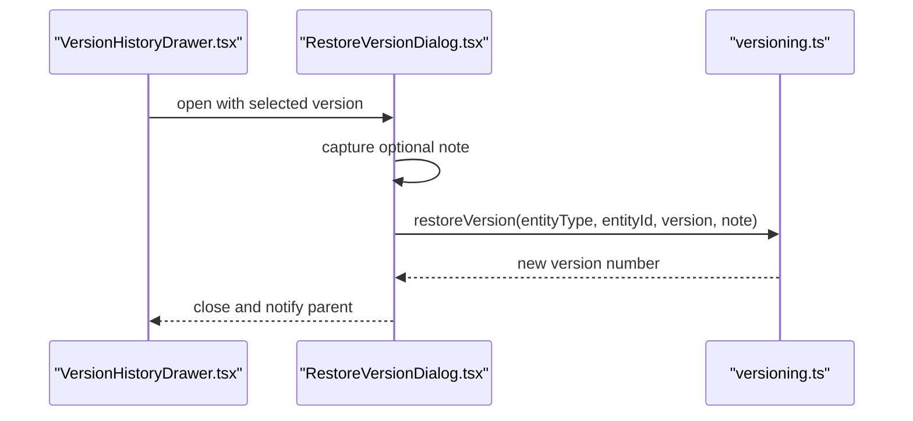
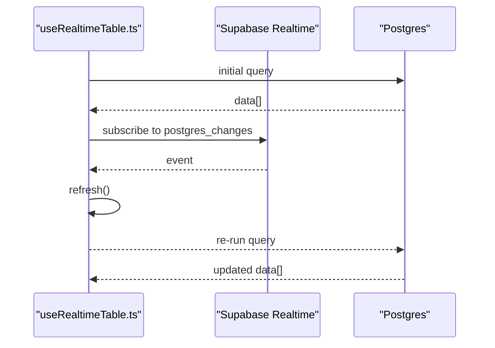
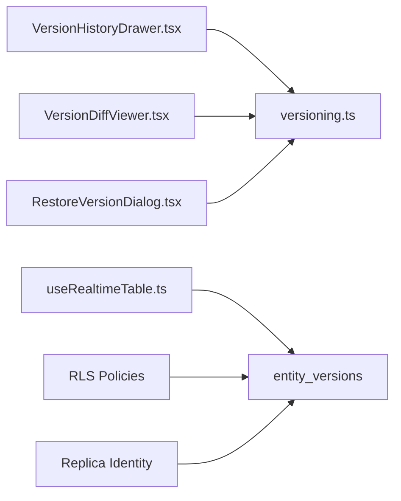

# Conflict Resolution

<cite>
**Referenced Files in This Document**
- [versioning.ts](file://src/lib/versioning.ts)
- [RestoreVersionDialog.tsx](file://src/components/pcready/RestoreVersionDialog.tsx)
- [VersionDiffViewer.tsx](file://src/components/pcready/VersionDiffViewer.tsx)
- [VersionHistoryDrawer.tsx](file://src/components/pcready/VersionHistoryDrawer.tsx)
- [useRealtimeTable.ts](file://src/hooks/useRealtimeTable.ts)
- [entity_versions.sql](file://supabase/migrations/20260503120000_entity_versions.sql)
- [harden_entity_versions.sql](file://supabase/migrations/20260509123300_harden_entity_versions.sql)
- [realtime_replica_identity_core_tables.sql](file://supabase/migrations/20260514182000_realtime_replica_identity_core_tables.sql)
- [versioning.test.ts](file://src/__tests__/versioning.test.ts)
</cite>

## Table of Contents
1. [Introduction](#introduction)
2. [Project Structure](#project-structure)
3. [Core Components](#core-components)
4. [Architecture Overview](#architecture-overview)
5. [Detailed Component Analysis](#detailed-component-analysis)
6. [Dependency Analysis](#dependency-analysis)
7. [Performance Considerations](#performance-considerations)
8. [Troubleshooting Guide](#troubleshooting-guide)
9. [Conclusion](#conclusion)

## Introduction
This document explains how the system detects and resolves concurrent modifications in real-time, focusing on tickets, devices, and inventory data. It covers the version history and restore mechanisms, the diff viewer for visualizing changes and merge conflicts, optimistic locking and conflict handling, and UI components that guide users through conflict resolution. It also includes practical examples, performance considerations, and troubleshooting advice.

## Project Structure
The conflict resolution system is composed of:
- A versioning library that snapshots entity states, computes diffs, and supports restoration.
- UI components for viewing version history, comparing versions, and restoring a selected version.
- Real-time synchronization hooks that keep views up-to-date with database changes.
- Database migrations that define the version history table and harden policies for safe auditing and restoration.

**Diagram sources**
- [VersionHistoryDrawer.tsx:1-243](file://src/components/pcready/VersionHistoryDrawer.tsx#L1-L243)
- [VersionDiffViewer.tsx:1-232](file://src/components/pcready/VersionDiffViewer.tsx#L1-L232)
- [RestoreVersionDialog.tsx:1-82](file://src/components/pcready/RestoreVersionDialog.tsx#L1-L82)
- [versioning.ts:1-271](file://src/lib/versioning.ts#L1-L271)
- [useRealtimeTable.ts:1-50](file://src/hooks/useRealtimeTable.ts#L1-L50)
- [entity_versions.sql:1-41](file://supabase/migrations/20260503120000_entity_versions.sql#L1-L41)
- [harden_entity_versions.sql:1-44](file://supabase/migrations/20260509123300_harden_entity_versions.sql#L1-L44)
- [realtime_replica_identity_core_tables.sql:1-30](file://supabase/migrations/20260514182000_realtime_replica_identity_core_tables.sql#L1-L30)

**Section sources**
- [VersionHistoryDrawer.tsx:1-243](file://src/components/pcready/VersionHistoryDrawer.tsx#L1-L243)
- [VersionDiffViewer.tsx:1-232](file://src/components/pcready/VersionDiffViewer.tsx#L1-L232)
- [RestoreVersionDialog.tsx:1-82](file://src/components/pcready/RestoreVersionDialog.tsx#L1-L82)
- [versioning.ts:1-271](file://src/lib/versioning.ts#L1-L271)
- [useRealtimeTable.ts:1-50](file://src/hooks/useRealtimeTable.ts#L1-L50)
- [entity_versions.sql:1-41](file://supabase/migrations/20260503120000_entity_versions.sql#L1-L41)
- [harden_entity_versions.sql:1-44](file://supabase/migrations/20260509123300_harden_entity_versions.sql#L1-L44)
- [realtime_replica_identity_core_tables.sql:1-30](file://supabase/migrations/20260514182000_realtime_replica_identity_core_tables.sql#L1-L30)

## Core Components
- Versioning library:
  - Computes changed fields between snapshots.
  - Creates version snapshots with unique version numbers.
  - Compares two versions to produce added/removed/changed sets.
  - Restores an entity to a target version and records a “restore” operation.
- Version history UI:
  - Lists versions, allows selecting versions for comparison, and restores versions (admin-restricted).
- Diff viewer:
  - Presents single-version snapshot details and side-by-side comparisons.
- Real-time hook:
  - Subscribes to Postgres changes and refreshes local data.

Key responsibilities:
- Detecting concurrent modifications via version snapshots and diffs.
- Resolving conflicts by restoring a chosen version or comparing differences.
- Enforcing access control for restoration via row-level security policies.

**Section sources**
- [versioning.ts:56-271](file://src/lib/versioning.ts#L56-L271)
- [VersionHistoryDrawer.tsx:44-110](file://src/components/pcready/VersionHistoryDrawer.tsx#L44-L110)
- [VersionDiffViewer.tsx:58-232](file://src/components/pcready/VersionDiffViewer.tsx#L58-L232)
- [useRealtimeTable.ts:10-49](file://src/hooks/useRealtimeTable.ts#L10-L49)

## Architecture Overview
The system maintains a version history table and exposes UIs to inspect and restore versions. Real-time channels keep views synchronized with database updates.

**Diagram sources**
- [VersionHistoryDrawer.tsx:44-71](file://src/components/pcready/VersionHistoryDrawer.tsx#L44-L71)
- [versioning.ts:162-207](file://src/lib/versioning.ts#L162-L207)
- [VersionDiffViewer.tsx:58-67](file://src/components/pcready/VersionDiffViewer.tsx#L58-L67)

## Detailed Component Analysis

### Versioning Library
The library centralizes snapshotting, diff computation, retrieval, and restoration.

Key behaviors:
- Snapshot creation increments the next version number and optionally computes changed fields.
- Restoration updates the target entity to match the selected version’s snapshot and records a “restore” version.
- Diffs are computed by comparing field sets and values across snapshots.

**Diagram sources**
- [versioning.ts:8-22](file://src/lib/versioning.ts#L8-L22)
- [versioning.ts:56-271](file://src/lib/versioning.ts#L56-L271)

**Section sources**
- [versioning.ts:56-271](file://src/lib/versioning.ts#L56-L271)

### Version History Drawer
The drawer lists versions, supports selection for comparison, and triggers restoration after confirmation.

Access control:
- Restoration requires admin role.
- Version visibility and creation are governed by RLS policies.

**Diagram sources**
- [VersionHistoryDrawer.tsx:44-110](file://src/components/pcready/VersionHistoryDrawer.tsx#L44-L110)
- [VersionDiffViewer.tsx:58-67](file://src/components/pcready/VersionDiffViewer.tsx#L58-L67)
- [RestoreVersionDialog.tsx:22-38](file://src/components/pcready/RestoreVersionDialog.tsx#L22-L38)
- [harden_entity_versions.sql:36-43](file://supabase/migrations/20260509123300_harden_entity_versions.sql#L36-L43)

**Section sources**
- [VersionHistoryDrawer.tsx:44-110](file://src/components/pcready/VersionHistoryDrawer.tsx#L44-L110)
- [harden_entity_versions.sql:22-43](file://supabase/migrations/20260509123300_harden_entity_versions.sql#L22-L43)

### Diff Viewer
The diff viewer renders either a single version’s snapshot or a side-by-side comparison, highlighting additions, removals, and changes.

Field formatting:
- Human-friendly labels and values with long-value preformatted blocks.

**Diagram sources**
- [VersionDiffViewer.tsx:58-232](file://src/components/pcready/VersionDiffViewer.tsx#L58-L232)
- [versioning.ts:182-207](file://src/lib/versioning.ts#L182-L207)

**Section sources**
- [VersionDiffViewer.tsx:58-232](file://src/components/pcready/VersionDiffViewer.tsx#L58-L232)
- [versioning.ts:182-207](file://src/lib/versioning.ts#L182-L207)

### Restore Version Dialog
The dialog collects an optional note and performs the restore action with loading states.

**Diagram sources**
- [VersionHistoryDrawer.tsx:232-241](file://src/components/pcready/VersionHistoryDrawer.tsx#L232-L241)
- [RestoreVersionDialog.tsx:22-38](file://src/components/pcready/RestoreVersionDialog.tsx#L22-L38)
- [versioning.ts:263-271](file://src/lib/versioning.ts#L263-L271)

**Section sources**
- [RestoreVersionDialog.tsx:22-38](file://src/components/pcready/RestoreVersionDialog.tsx#L22-L38)
- [versioning.ts:263-271](file://src/lib/versioning.ts#L263-L271)

### Real-Time Synchronization
The real-time hook subscribes to Postgres changes and refreshes data to reflect concurrent edits.

Replica identity:
- Tables are configured with full replica identity to ensure old and new row images are available for change events.

**Diagram sources**
- [useRealtimeTable.ts:10-49](file://src/hooks/useRealtimeTable.ts#L10-L49)
- [realtime_replica_identity_core_tables.sql:4-7](file://supabase/migrations/20260514182000_realtime_replica_identity_core_tables.sql#L4-L7)

**Section sources**
- [useRealtimeTable.ts:10-49](file://src/hooks/useRealtimeTable.ts#L10-L49)
- [realtime_replica_identity_core_tables.sql:1-30](file://supabase/migrations/20260514182000_realtime_replica_identity_core_tables.sql#L1-L30)

## Dependency Analysis
- UI components depend on the versioning library for data and actions.
- Real-time hook depends on Supabase client and database table configurations.
- Database policies enforce who can view and create versions and who can restore.

**Diagram sources**
- [VersionHistoryDrawer.tsx:1-243](file://src/components/pcready/VersionHistoryDrawer.tsx#L1-L243)
- [VersionDiffViewer.tsx:1-232](file://src/components/pcready/VersionDiffViewer.tsx#L1-L232)
- [RestoreVersionDialog.tsx:1-82](file://src/components/pcready/RestoreVersionDialog.tsx#L1-L82)
- [versioning.ts:1-271](file://src/lib/versioning.ts#L1-L271)
- [useRealtimeTable.ts:1-50](file://src/hooks/useRealtimeTable.ts#L1-L50)
- [entity_versions.sql:1-41](file://supabase/migrations/20260503120000_entity_versions.sql#L1-L41)
- [harden_entity_versions.sql:1-44](file://supabase/migrations/20260509123300_harden_entity_versions.sql#L1-L44)
- [realtime_replica_identity_core_tables.sql:1-30](file://supabase/migrations/20260514182000_realtime_replica_identity_core_tables.sql#L1-L30)

**Section sources**
- [versioning.ts:1-271](file://src/lib/versioning.ts#L1-L271)
- [useRealtimeTable.ts:1-50](file://src/hooks/useRealtimeTable.ts#L1-L50)
- [entity_versions.sql:1-41](file://supabase/migrations/20260503120000_entity_versions.sql#L1-L41)
- [harden_entity_versions.sql:1-44](file://supabase/migrations/20260509123300_harden_entity_versions.sql#L1-L44)
- [realtime_replica_identity_core_tables.sql:1-30](file://supabase/migrations/20260514182000_realtime_replica_identity_core_tables.sql#L1-L30)

## Performance Considerations
- Version history queries:
  - Sorted by version number descending; ensure indexes on entity_type, entity_id, created_at support fast retrieval.
- Diff computation:
  - Field comparison uses set unions and equality checks; keep snapshots compact and avoid unnecessary deep nesting.
- Real-time updates:
  - Subscribe only to relevant tables; consider debouncing frequent updates if needed.
- Rendering:
  - Long values are preformatted; avoid rendering very large snapshots in a single view.
- Restoration:
  - Restoration writes a new version and updates the entity; batch operations should be considered for bulk changes.

[No sources needed since this section provides general guidance]

## Troubleshooting Guide
Common issues and resolutions:
- No versions found:
  - Verify the entity exists and that version snapshots are being created.
  - Check RLS policies allow authenticated users to view versions.
- Restore fails:
  - Ensure the user has admin role; restoration requires admin RLS policy.
  - Confirm the target version exists for the given entity.
- Conflicts persist after restore:
  - Refresh the view; real-time hook should re-fetch data after the update.
  - Check replica identity settings for the affected tables.
- Diff viewer shows unexpected changes:
  - Validate that snapshots are captured consistently and that changed fields are computed correctly.
- Real-time updates not reflected:
  - Confirm the table subscription and that replica identity is set to full for core tables.

**Section sources**
- [harden_entity_versions.sql:22-43](file://supabase/migrations/20260509123300_harden_entity_versions.sql#L22-L43)
- [realtime_replica_identity_core_tables.sql:4-7](file://supabase/migrations/20260514182000_realtime_replica_identity_core_tables.sql#L4-L7)
- [VersionHistoryDrawer.tsx:98-110](file://src/components/pcready/VersionHistoryDrawer.tsx#L98-L110)
- [versioning.ts:209-261](file://src/lib/versioning.ts#L209-L261)

## Conclusion
The system provides robust conflict detection and resolution through version snapshots, diffs, and controlled restoration. Real-time synchronization ensures users see the latest state, while UI components guide users through inspection and restoration. RLS policies protect version creation and restoration, and database-level replica identity enables reliable change events. By following best practices and leveraging the provided components, teams can minimize conflicts and resolve them efficiently in collaborative environments.