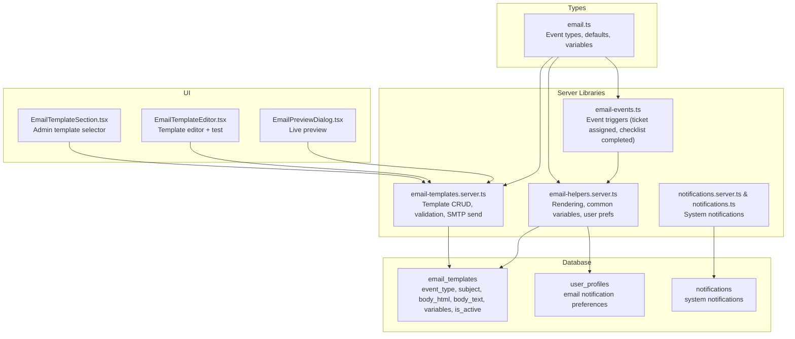
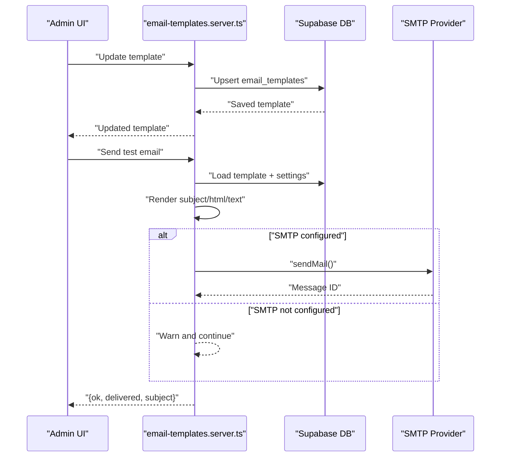
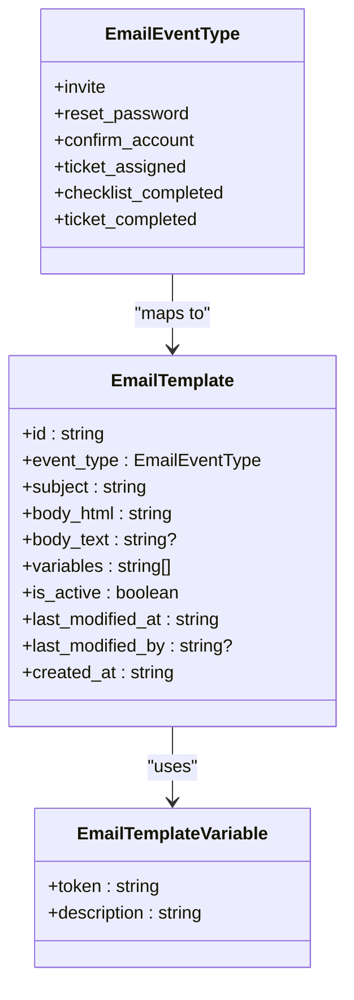
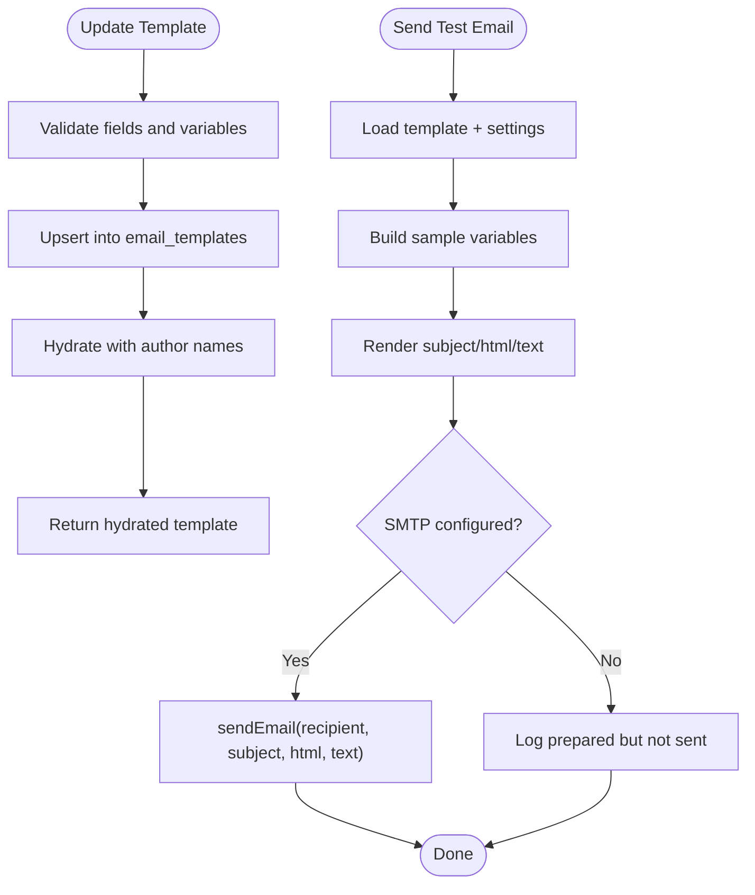
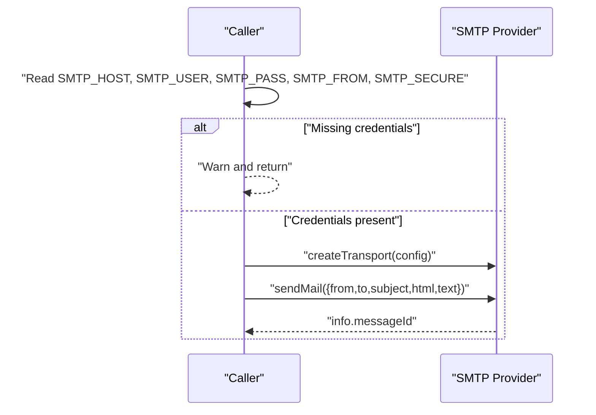
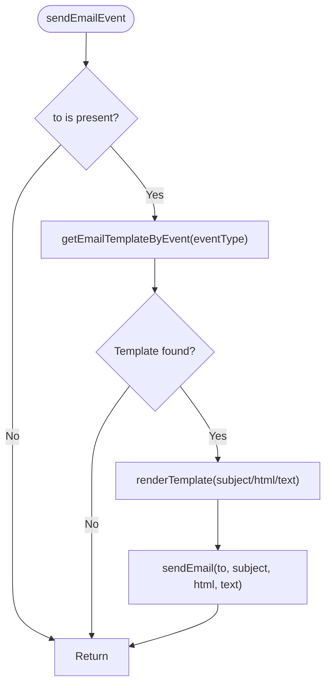
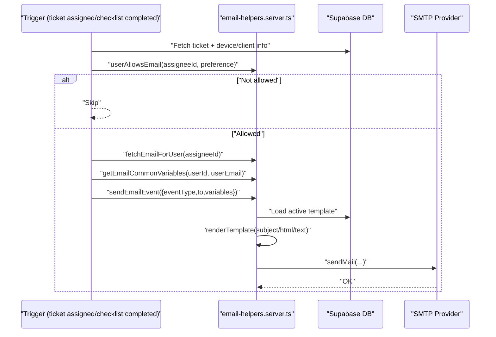
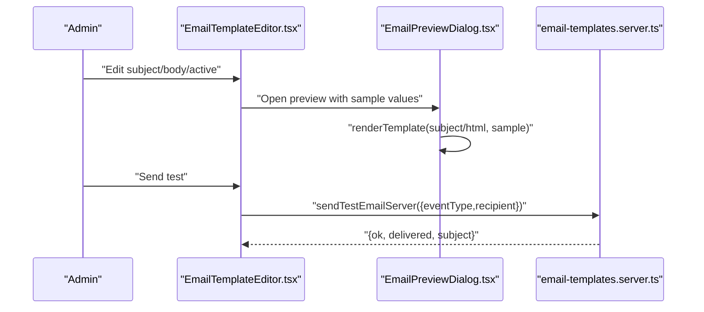
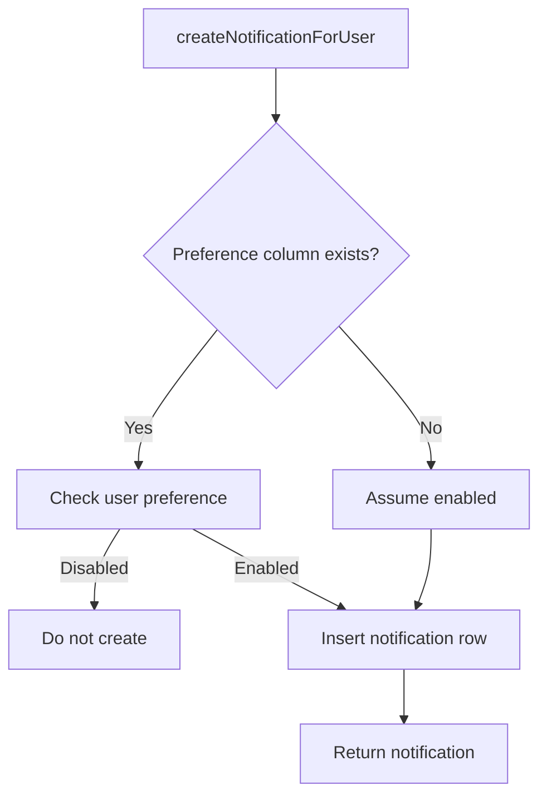
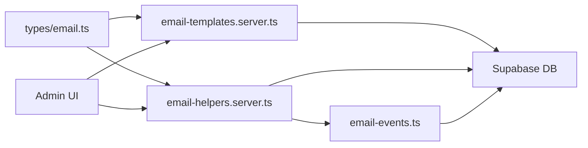

# Email Notifications

<cite>
**Referenced Files in This Document**
- [email-events.ts](file://src/lib/email-events.ts)
- [email-helpers.server.ts](file://src/lib/email-helpers.server.ts)
- [email-templates.server.ts](file://src/lib/email-templates.server.ts)
- [email-templates.ts](file://src/lib/email-templates.ts)
- [email.ts](file://src/types/email.ts)
- [EmailTemplateEditor.tsx](file://src/components/admin/EmailTemplateEditor.tsx)
- [EmailPreviewDialog.tsx](file://src/components/admin/EmailPreviewDialog.tsx)
- [EmailTemplateSection.tsx](file://src/components/admin/EmailTemplateSection.tsx)
- [notifications.server.ts](file://src/lib/notifications.server.ts)
- [notifications.ts](file://src/lib/notifications.ts)
- [20260507_notifications.sql](file://supabase/migrations/20260507130000_notifications.sql)
- [20260512_user_profiles_email_notification_preferences.sql](file://supabase/migrations/20260512152600_user_profiles_email_notification_preferences.sql)
- [20260512_user_profiles_notification_preferences_fix.sql](file://supabase/migrations/20260512155000_user_profiles_notification_preferences_fix.sql)
- [20260511_ticket_completed_status.sql](file://supabase/migrations/20260511190000_ticket_completed_status.sql)
</cite>

## Table of Contents
1. [Introduction](#introduction)
2. [Project Structure](#project-structure)
3. [Core Components](#core-components)
4. [Architecture Overview](#architecture-overview)
5. [Detailed Component Analysis](#detailed-component-analysis)
6. [Dependency Analysis](#dependency-analysis)
7. [Performance Considerations](#performance-considerations)
8. [Troubleshooting Guide](#troubleshooting-guide)
9. [Conclusion](#conclusion)
10. [Appendices](#appendices)

## Introduction
This document explains the email notification system, focusing on:
- Template architecture: definition, dynamic content rendering, and variable substitution
- Event system: ticket-related, user invitation, and system notification emails
- Helper functions for formatting, recipients, and delivery coordination
- Practical examples: creating templates, sending workflows, and error handling
- Queue management, retries, and delivery tracking
- External provider integration and SMTP configuration
- Personalization, unsubscribe mechanisms, and compliance
- Common issues and performance optimization for bulk operations

## Project Structure
The email system spans server-side libraries, UI editors, and Supabase-backed persistence:
- Types define event types, default templates, and allowed variables
- Server functions manage templates, rendering, and SMTP delivery
- UI components allow administrators to edit, preview, and test templates
- Database migrations define storage for templates, preferences, and notifications

**Diagram sources**
- [email.ts:1-130](file://src/types/email.ts#L1-L130)
- [email-templates.server.ts:1-386](file://src/lib/email-templates.server.ts#L1-L386)
- [email-helpers.server.ts:1-125](file://src/lib/email-helpers.server.ts#L1-L125)
- [email-events.ts:1-105](file://src/lib/email-events.ts#L1-L105)
- [EmailTemplateSection.tsx:1-203](file://src/components/admin/EmailTemplateSection.tsx#L1-L203)
- [EmailTemplateEditor.tsx:1-309](file://src/components/admin/EmailTemplateEditor.tsx#L1-L309)
- [EmailPreviewDialog.tsx:1-77](file://src/components/admin/EmailPreviewDialog.tsx#L1-L77)
- [notifications.server.ts:1-140](file://src/lib/notifications.server.ts#L1-L140)
- [notifications.ts:1-140](file://src/lib/notifications.ts#L1-L140)

**Section sources**
- [email.ts:1-130](file://src/types/email.ts#L1-L130)
- [email-templates.server.ts:1-386](file://src/lib/email-templates.server.ts#L1-L386)
- [email-helpers.server.ts:1-125](file://src/lib/email-helpers.server.ts#L1-L125)
- [email-events.ts:1-105](file://src/lib/email-events.ts#L1-L105)
- [EmailTemplateSection.tsx:1-203](file://src/components/admin/EmailTemplateSection.tsx#L1-L203)
- [EmailTemplateEditor.tsx:1-309](file://src/components/admin/EmailTemplateEditor.tsx#L1-L309)
- [EmailPreviewDialog.tsx:1-77](file://src/components/admin/EmailPreviewDialog.tsx#L1-L77)
- [notifications.server.ts:1-140](file://src/lib/notifications.server.ts#L1-L140)
- [notifications.ts:1-140](file://src/lib/notifications.ts#L1-L140)

## Core Components
- Event types and variables: centralized in types to ensure consistency across rendering and validation
- Template server library: loads defaults, validates variables, renders templates, and sends via SMTP
- Helpers: fetches user email/profile, resolves common variables, checks user preferences, and orchestrates send
- Event handlers: trigger emails for ticket assignments and checklist completions
- Admin UI: allows editing, previewing, testing, and resetting templates
- Notifications: separate system notifications stored in DB (complementary to email)

Key responsibilities:
- Template definition and validation
- Dynamic content rendering with variable substitution
- Recipient resolution and preference checks
- Delivery coordination via SMTP transport
- Admin UX for template management

**Section sources**
- [email.ts:1-130](file://src/types/email.ts#L1-L130)
- [email-templates.server.ts:1-386](file://src/lib/email-templates.server.ts#L1-L386)
- [email-helpers.server.ts:1-125](file://src/lib/email-helpers.server.ts#L1-L125)
- [email-events.ts:1-105](file://src/lib/email-events.ts#L1-L105)
- [EmailTemplateSection.tsx:1-203](file://src/components/admin/EmailTemplateSection.tsx#L1-L203)
- [EmailTemplateEditor.tsx:1-309](file://src/components/admin/EmailTemplateEditor.tsx#L1-L309)
- [EmailPreviewDialog.tsx:1-77](file://src/components/admin/EmailPreviewDialog.tsx#L1-L77)
- [notifications.server.ts:1-140](file://src/lib/notifications.server.ts#L1-L140)
- [notifications.ts:1-140](file://src/lib/notifications.ts#L1-L140)

## Architecture Overview
The system separates concerns across layers:
- UI triggers actions (edit, test, reset)
- Server functions validate inputs, resolve templates, render content, and deliver via SMTP
- Helpers encapsulate common logic (preferences, variables, user lookup)
- Database stores templates, user preferences, and system notifications

**Diagram sources**
- [email-templates.server.ts:113-213](file://src/lib/email-templates.server.ts#L113-L213)

**Section sources**
- [email-templates.server.ts:1-386](file://src/lib/email-templates.server.ts#L1-L386)

## Detailed Component Analysis

### Template Definition and Variable Substitution
- Event types enumerate supported email events
- Defaults define subject/body for each event
- Allowed variables per event are enumerated and enforced during updates
- Rendering replaces tokens like {{variable}} with provided values

**Diagram sources**
- [email.ts:1-130](file://src/types/email.ts#L1-L130)

**Section sources**
- [email.ts:1-130](file://src/types/email.ts#L1-L130)

### Template Management (Server)
- CRUD operations for templates
- Validation ensures only allowed variables are used
- Hydration enriches rows with author names
- Default templates are upserted on demand
- Test emails render with sample variables and optionally send via SMTP

**Diagram sources**
- [email-templates.server.ts:147-276](file://src/lib/email-templates.server.ts#L147-L276)
- [email-templates.server.ts:179-213](file://src/lib/email-templates.server.ts#L179-L213)

**Section sources**
- [email-templates.server.ts:1-386](file://src/lib/email-templates.server.ts#L1-L386)

### Email Delivery and SMTP Integration
- SMTP credentials are read from environment variables
- Transport is created dynamically and used to send emails
- Delivery logs message ID for traceability

**Diagram sources**
- [email-templates.server.ts:70-111](file://src/lib/email-templates.server.ts#L70-L111)

**Section sources**
- [email-templates.server.ts:70-111](file://src/lib/email-templates.server.ts#L70-L111)

### Email Helper Functions
- renderTemplate: replaces tokens with provided values
- getEmailTemplateByEvent: fetches active template by event
- fetchEmailForUser: resolves user email from auth
- fetchProfileName: resolves user full name
- userAllowsEmail: checks user preference columns
- getEmailCommonVariables: merges app settings and constructs common variables
- sendEmailEvent: orchestrates template retrieval, rendering, and delivery

**Diagram sources**
- [email-helpers.server.ts:107-124](file://src/lib/email-helpers.server.ts#L107-L124)

**Section sources**
- [email-helpers.server.ts:1-125](file://src/lib/email-helpers.server.ts#L1-L125)

### Event System: Ticket-Related Emails
- Ticket assigned: checks preference, resolves assignee email, builds common variables, and sends
- Checklist completed: resolves assignee, checks preference, builds variables, and sends

**Diagram sources**
- [email-events.ts:14-56](file://src/lib/email-events.ts#L14-L56)
- [email-events.ts:58-104](file://src/lib/email-events.ts#L58-L104)
- [email-helpers.server.ts:107-124](file://src/lib/email-helpers.server.ts#L107-L124)

**Section sources**
- [email-events.ts:1-105](file://src/lib/email-events.ts#L1-L105)
- [email-helpers.server.ts:68-105](file://src/lib/email-helpers.server.ts#L68-L105)

### Admin Template Editor and Preview
- Editor supports HTML and plain text bodies, activation toggle, and test sending
- Preview dialog renders subject and HTML with sample values
- Variables panel lists allowed tokens per event

**Diagram sources**
- [EmailTemplateEditor.tsx:1-309](file://src/components/admin/EmailTemplateEditor.tsx#L1-L309)
- [EmailPreviewDialog.tsx:1-77](file://src/components/admin/EmailPreviewDialog.tsx#L1-L77)
- [email-templates.server.ts:179-213](file://src/lib/email-templates.server.ts#L179-L213)

**Section sources**
- [EmailTemplateEditor.tsx:1-309](file://src/components/admin/EmailTemplateEditor.tsx#L1-L309)
- [EmailPreviewDialog.tsx:1-77](file://src/components/admin/EmailPreviewDialog.tsx#L1-L77)
- [email-templates.ts:1-112](file://src/lib/email-templates.ts#L1-L112)
- [email-templates.server.ts:179-213](file://src/lib/email-templates.server.ts#L179-L213)

### System Notifications (Complementary to Email)
- Separate from transactional email; stored in DB with RLS policies
- Supports multiple notification types and user preference checks
- UI and server functions for listing, marking read, and cleanup

**Diagram sources**
- [notifications.server.ts:27-67](file://src/lib/notifications.server.ts#L27-L67)
- [20260507_notifications.sql:1-77](file://supabase/migrations/20260507130000_notifications.sql#L1-L77)

**Section sources**
- [notifications.server.ts:1-140](file://src/lib/notifications.server.ts#L1-L140)
- [notifications.ts:1-140](file://src/lib/notifications.ts#L1-L140)
- [20260507_notifications.sql:1-77](file://supabase/migrations/20260507130000_notifications.sql#L1-L77)

## Dependency Analysis
- Types drive template behavior and validation
- Server functions depend on Supabase for templates and settings, and on SMTP for delivery
- Helpers mediate between templates, preferences, and delivery
- UI components delegate to server functions for persistence and delivery
- Database migrations define storage and constraints for templates and preferences

**Diagram sources**
- [email.ts:1-130](file://src/types/email.ts#L1-L130)
- [email-helpers.server.ts:1-125](file://src/lib/email-helpers.server.ts#L1-L125)
- [email-templates.server.ts:1-386](file://src/lib/email-templates.server.ts#L1-L386)
- [email-events.ts:1-105](file://src/lib/email-events.ts#L1-L105)

**Section sources**
- [email.ts:1-130](file://src/types/email.ts#L1-L130)
- [email-helpers.server.ts:1-125](file://src/lib/email-helpers.server.ts#L1-L125)
- [email-templates.server.ts:1-386](file://src/lib/email-templates.server.ts#L1-L386)
- [email-events.ts:1-105](file://src/lib/email-events.ts#L1-L105)

## Performance Considerations
- Bulk operations: batch template updates and avoid repeated DB reads by caching common settings
- Rendering: minimize repeated token scans by precomputing replacement maps for large batches
- SMTP throughput: tune concurrency limits and implement exponential backoff on rate limits
- Database: ensure indexes on event_type and is_active for fast template lookups
- UI: debounce test-send operations and cache sample variables

[No sources needed since this section provides general guidance]

## Troubleshooting Guide
Common issues and resolutions:
- SMTP not configured: warnings are logged; tests show preparation without sending
- Missing user email or profile: gracefully skip and return skipped result
- Unknown template variables: validation rejects invalid tokens
- Preference disabled: event handlers short-circuit early
- Database errors: server functions surface errors; UI displays user-friendly messages

Operational checks:
- Verify SMTP environment variables
- Confirm template is active and event type matches
- Validate allowed variables in template bodies
- Ensure user preference columns exist and are populated

**Section sources**
- [email-templates.server.ts:70-111](file://src/lib/email-templates.server.ts#L70-L111)
- [email-templates.server.ts:312-325](file://src/lib/email-templates.server.ts#L312-L325)
- [email-helpers.server.ts:68-88](file://src/lib/email-helpers.server.ts#L68-L88)
- [email-events.ts:20-25](file://src/lib/email-events.ts#L20-L25)
- [EmailTemplateSection.tsx:104-120](file://src/components/admin/EmailTemplateSection.tsx#L104-L120)

## Conclusion
The email notification system combines a flexible template engine, strict variable validation, and robust delivery via SMTP. Administrators can manage templates, preview content, and test deliveries. Event-driven triggers integrate with user preferences and common variables to produce personalized, compliant communications. The architecture cleanly separates UI, server logic, and persistence, enabling maintainability and scalability.

[No sources needed since this section summarizes without analyzing specific files]

## Appendices

### Appendix A: Supported Email Events and Variables
- invite: invitation emails with links
- reset_password: password reset emails with links
- confirm_account: account confirmation emails with links
- ticket_assigned: ticket assignment notifications
- checklist_completed: checklist completion notifications
- ticket_completed: client-facing completion notifications

Allowed variables vary by event; defaults and descriptions are defined centrally.

**Section sources**
- [email.ts:28-129](file://src/types/email.ts#L28-L129)

### Appendix B: Database Schema Notes
- email_templates: stores event-specific templates with variables and activation flag
- user_profiles: stores per-user email notification preferences
- notifications: stores system notifications with RLS and retention policy

**Section sources**
- [20260507_notifications.sql:1-77](file://supabase/migrations/20260507130000_notifications.sql#L1-L77)
- [20260512_user_profiles_email_notification_preferences.sql:1-11](file://supabase/migrations/20260512152600_user_profiles_email_notification_preferences.sql#L1-L11)
- [20260512_user_profiles_notification_preferences_fix.sql:1-26](file://supabase/migrations/20260512155000_user_profiles_notification_preferences_fix.sql#L1-L26)
- [20260511_ticket_completed_status.sql:1-66](file://supabase/migrations/20260511190000_ticket_completed_status.sql#L1-L66)