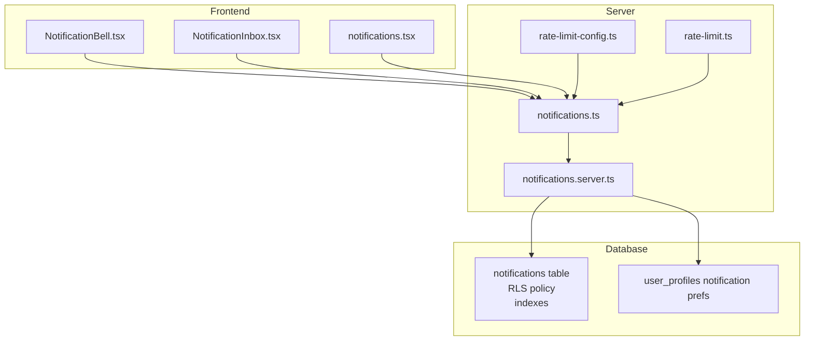
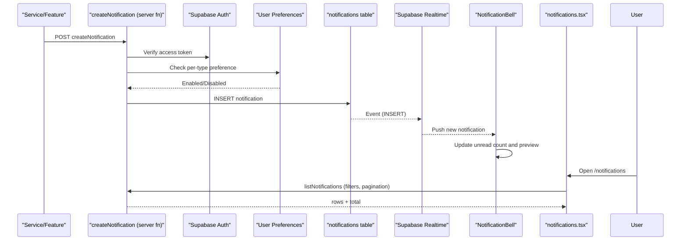
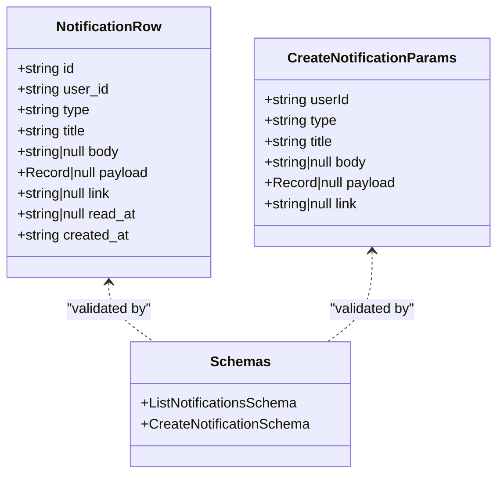
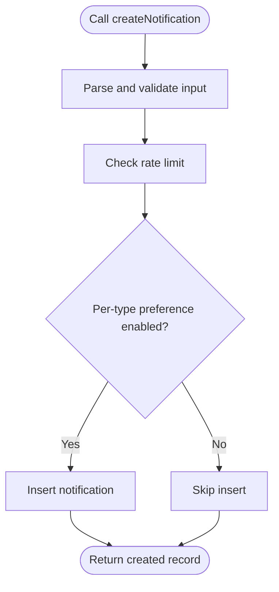
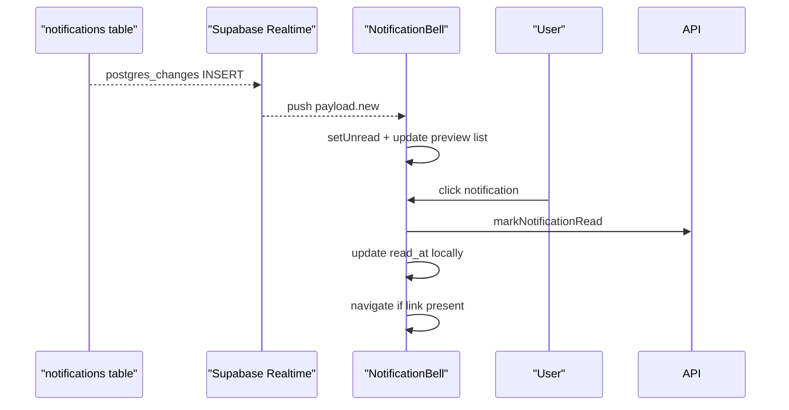
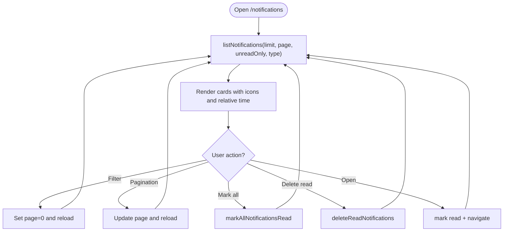
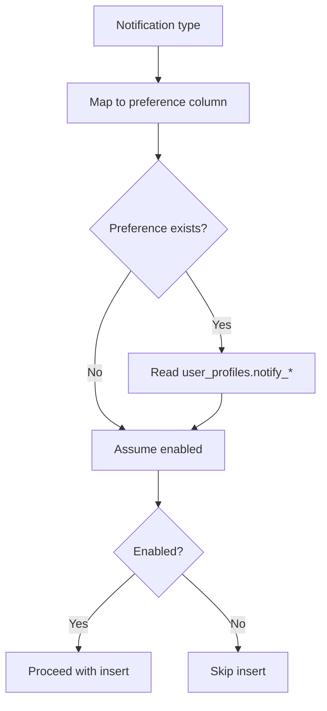
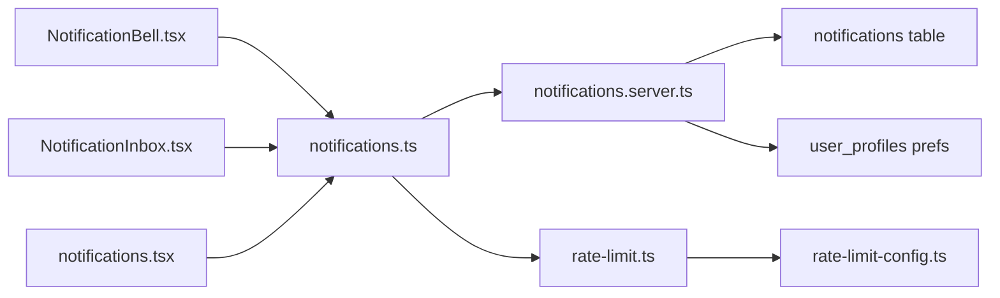

# In-App Notifications

<cite>
**Referenced Files in This Document**
- [notifications.ts](file://src/lib/notifications.ts)
- [notifications.server.ts](file://src/lib/notifications.server.ts)
- [NotificationBell.tsx](file://src/components/layout/NotificationBell.tsx)
- [NotificationInbox.tsx](file://src/components/layout/NotificationInbox.tsx)
- [notifications.tsx](file://src/routes/_app/notifications.tsx)
- [notifications.sql](file://supabase/migrations/20260507130000_notifications.sql)
- [user_profiles_email_notification_preferences.sql](file://supabase/migrations/20260512152600_user_profiles_email_notification_preferences.sql)
- [user_profiles_notification_preferences_fix.sql](file://supabase/migrations/20260512155000_user_profiles_notification_preferences_fix.sql)
- [types.ts](file://src/integrations/supabase/types.ts)
- [rate-limit-config.ts](file://src/lib/rate-limit-config.ts)
- [rate-limit.ts](file://src/lib/rate-limit.ts)
- [notifications.test.ts](file://src/__tests__/notifications.test.ts)
</cite>

## Table of Contents

1. [Introduction](#introduction)
2. [Project Structure](#project-structure)
3. [Core Components](#core-components)
4. [Architecture Overview](#architecture-overview)
5. [Detailed Component Analysis](#detailed-component-analysis)
6. [Dependency Analysis](#dependency-analysis)
7. [Performance Considerations](#performance-considerations)
8. [Troubleshooting Guide](#troubleshooting-guide)
9. [Conclusion](#conclusion)
10. [Appendices](#appendices)

## Introduction

This document describes the in-app notification system, covering the data model, server-side APIs, frontend integration, real-time delivery, filtering and pagination, persistence and cleanup, rate limiting, and user preferences. It targets both developers and product stakeholders to understand how notifications are created, delivered, displayed, and managed.

## Project Structure

The notification system spans three layers:

- Data model and server functions: define types, validation, and CRUD operations
- Frontend components: render the notification bell, inline preview, and full inbox
- Database schema and policies: persist notifications, enforce access control, and enable real-time

**Diagram sources**

- [NotificationBell.tsx:19-141](file://src/components/layout/NotificationBell.tsx#L19-L141)
- [NotificationInbox.tsx:13-107](file://src/components/layout/NotificationInbox.tsx#L13-L107)
- [notifications.tsx:30-258](file://src/routes/_app/notifications.tsx#L30-L258)
- [notifications.ts:58-140](file://src/lib/notifications.ts#L58-L140)
- [notifications.server.ts:10-140](file://src/lib/notifications.server.ts#L10-L140)
- [rate-limit-config.ts:5-31](file://src/lib/rate-limit-config.ts#L5-L31)
- [rate-limit.ts:30-104](file://src/lib/rate-limit.ts#L30-L104)
- [notifications.sql:1-77](file://supabase/migrations/20260507130000_notifications.sql#L1-L77)
- [user_profiles_notification_preferences_fix.sql:1-25](file://supabase/migrations/20260512155000_user_profiles_notification_preferences_fix.sql#L1-L25)

**Section sources**

- [notifications.ts:58-140](file://src/lib/notifications.ts#L58-L140)
- [notifications.server.ts:10-140](file://src/lib/notifications.server.ts#L10-L140)
- [NotificationBell.tsx:19-141](file://src/components/layout/NotificationBell.tsx#L19-L141)
- [NotificationInbox.tsx:13-107](file://src/components/layout/NotificationInbox.tsx#L13-L107)
- [notifications.tsx:30-258](file://src/routes/_app/notifications.tsx#L30-L258)
- [notifications.sql:1-77](file://supabase/migrations/20260507130000_notifications.sql#L1-L77)
- [user_profiles_notification_preferences_fix.sql:1-25](file://supabase/migrations/20260512155000_user_profiles_notification_preferences_fix.sql#L1-L25)

## Core Components

- Notification data model
  - Fields: id, user_id, type, title, body, payload, link, read_at, created_at
  - Types: a fixed set of notification categories
  - Validation: Zod schema enforces length and presence constraints
- Server functions
  - createNotification: validates input, checks user preferences, inserts notification
  - listNotifications: paginated, filtered by type and read status
  - getUnreadNotificationCount: fast unread count for bell badge
  - markNotificationRead: marks a single notification read
  - markAllNotificationsRead: marks all unread for a user
  - deleteReadNotifications: bulk cleanup of read notifications
- Real-time delivery
  - Supabase Realtime subscription per user channel
  - Automatic badge and preview updates on insert
- Persistence and policies
  - Table with RLS “owns” policy
  - Indexes for user+created_at and user+unread
  - Automated cleanup of old read notifications

**Section sources**

- [notifications.ts:20-48](file://src/lib/notifications.ts#L20-L48)
- [notifications.ts:58-140](file://src/lib/notifications.ts#L58-L140)
- [notifications.server.ts:16-25](file://src/lib/notifications.server.ts#L16-L25)
- [notifications.sql:1-37](file://supabase/migrations/20260507130000_notifications.sql#L1-L37)
- [notifications.sql:24-29](file://supabase/migrations/20260507130000_notifications.sql#L24-L29)
- [notifications.sql:55-77](file://supabase/migrations/20260507130000_notifications.sql#L55-L77)

## Architecture Overview

End-to-end flow from creation to real-time display and management.

**Diagram sources**

- [notifications.ts:58-66](file://src/lib/notifications.ts#L58-L66)
- [notifications.server.ts:10-14](file://src/lib/notifications.server.ts#L10-L14)
- [notifications.server.ts:27-67](file://src/lib/notifications.server.ts#L27-L67)
- [NotificationBell.tsx:48-75](file://src/components/layout/NotificationBell.tsx#L48-L75)
- [notifications.tsx:59-81](file://src/routes/_app/notifications.tsx#L59-L81)

## Detailed Component Analysis

### Data Model and Validation

- NotificationRow: shape of persisted records
- CreateNotificationParams: parameters accepted by creation
- Zod schemas: enforce constraints on title/body/link/payload and type enumeration
- Notification types: enumerated set used across UI and server logic

**Diagram sources**

- [notifications.ts:20-48](file://src/lib/notifications.ts#L20-L48)

**Section sources**

- [notifications.ts:20-48](file://src/lib/notifications.ts#L20-L48)
- [types.ts:524-559](file://src/integrations/supabase/types.ts#L524-L559)

### Server Functions: Creation, Listing, and Management

- createNotification
  - Authenticates via access token
  - Enforces rate limit for creation
  - Respects per-type user preferences
  - Inserts notification and returns record
- listNotifications
  - Validates input (limit, page, filters)
  - Applies user scope, ordering, optional filters
  - Returns rows and total for pagination
- getUnreadNotificationCount
  - Fast count of unread notifications
- markNotificationRead and markAllNotificationsRead
  - Idempotent updates using read_at
- deleteReadNotifications
  - Bulk deletion of read notifications

**Diagram sources**

- [notifications.ts:58-66](file://src/lib/notifications.ts#L58-L66)
- [notifications.server.ts:27-67](file://src/lib/notifications.server.ts#L27-L67)
- [rate-limit-config.ts:14](file://src/lib/rate-limit-config.ts#L14)
- [rate-limit.ts:92-103](file://src/lib/rate-limit.ts#L92-L103)

**Section sources**

- [notifications.ts:58-140](file://src/lib/notifications.ts#L58-L140)
- [notifications.server.ts:10-140](file://src/lib/notifications.server.ts#L10-L140)
- [rate-limit-config.ts:5-31](file://src/lib/rate-limit-config.ts#L5-L31)
- [rate-limit.ts:30-104](file://src/lib/rate-limit.ts#L30-L104)

### Real-Time Delivery and Bell Integration

- Supabase Realtime subscription scoped to user channel
- On insert, bell updates unread count and previews up to a small window
- Clicking a notification marks it read and navigates if a link exists
- Mark all as read updates both backend and frontend state

**Diagram sources**

- [NotificationBell.tsx:48-112](file://src/components/layout/NotificationBell.tsx#L48-L112)
- [notifications.sql:41-53](file://supabase/migrations/20260507130000_notifications.sql#L41-L53)

**Section sources**

- [NotificationBell.tsx:19-141](file://src/components/layout/NotificationBell.tsx#L19-L141)
- [NotificationInbox.tsx:13-107](file://src/components/layout/NotificationInbox.tsx#L13-L107)
- [notifications.sql:41-53](file://supabase/migrations/20260507130000_notifications.sql#L41-L53)

### Notification Inbox Interface

- Filtering
  - View: all vs unread
  - Type: all or specific type
- Sorting
  - Defaults to newest first
- Pagination
  - Fixed page size; computes total and pageCount
- Actions
  - Mark all as read
  - Delete read notifications
  - Navigate to linked resource on open

**Diagram sources**

- [notifications.tsx:42-81](file://src/routes/_app/notifications.tsx#L42-L81)
- [notifications.tsx:128-244](file://src/routes/_app/notifications.tsx#L128-L244)

**Section sources**

- [notifications.tsx:30-258](file://src/routes/_app/notifications.tsx#L30-L258)

### User Preference Integration

- Per-type preference columns in user_profiles
- Preference mapping for each notification type
- If preference is disabled, creation is skipped
- Migration ensures defaults and compatibility

**Diagram sources**

- [notifications.server.ts:16-25](file://src/lib/notifications.server.ts#L16-L25)
- [notifications.server.ts:31-46](file://src/lib/notifications.server.ts#L31-L46)
- [user_profiles_notification_preferences_fix.sql:1-25](file://supabase/migrations/20260512155000_user_profiles_notification_preferences_fix.sql#L1-L25)

**Section sources**

- [notifications.server.ts:16-46](file://src/lib/notifications.server.ts#L16-L46)
- [user_profiles_notification_preferences_fix.sql:1-25](file://supabase/migrations/20260512155000_user_profiles_notification_preferences_fix.sql#L1-L25)
- [types.ts:1093-1152](file://src/integrations/supabase/types.ts#L1093-L1152)

## Dependency Analysis

- Frontend depends on server functions for all operations
- Server functions depend on Supabase client for auth and DB
- Realtime relies on Supabase publication and per-user channel
- Database depends on RLS and indexes for performance and security

**Diagram sources**

- [NotificationBell.tsx:19-141](file://src/components/layout/NotificationBell.tsx#L19-L141)
- [NotificationInbox.tsx:13-107](file://src/components/layout/NotificationInbox.tsx#L13-L107)
- [notifications.tsx:30-258](file://src/routes/_app/notifications.tsx#L30-L258)
- [notifications.ts:58-140](file://src/lib/notifications.ts#L58-L140)
- [notifications.server.ts:10-140](file://src/lib/notifications.server.ts#L10-L140)
- [rate-limit.ts:30-104](file://src/lib/rate-limit.ts#L30-L104)
- [rate-limit-config.ts:5-31](file://src/lib/rate-limit-config.ts#L5-L31)

**Section sources**

- [notifications.ts:58-140](file://src/lib/notifications.ts#L58-L140)
- [notifications.server.ts:10-140](file://src/lib/notifications.server.ts#L10-L140)
- [rate-limit.ts:30-104](file://src/lib/rate-limit.ts#L30-L104)
- [rate-limit-config.ts:5-31](file://src/lib/rate-limit-config.ts#L5-L31)

## Performance Considerations

- Pagination
  - Fixed page size and range queries prevent large scans
  - Total count included for accurate pagination UI
- Indexes
  - Composite index on user_id + created_at desc supports ordering and scoping
  - Separate index on user_id + created_at desc where read_at is null optimizes unread queries
- Real-time
  - Subscriptions scoped per user reduce fan-out
  - Preview list capped to recent items
- Rate limiting
  - Sliding window in-memory limiter reduces burst creation
- Cleanup
  - Scheduled job deletes old read notifications to bound table growth

**Section sources**

- [notifications.ts:74-93](file://src/lib/notifications.ts#L74-L93)
- [notifications.sql:24-29](file://supabase/migrations/20260507130000_notifications.sql#L24-L29)
- [notifications.sql:63-77](file://supabase/migrations/20260507130000_notifications.sql#L63-L77)
- [rate-limit.ts:30-72](file://src/lib/rate-limit.ts#L30-L72)

## Troubleshooting Guide

- Authentication failures
  - Access token invalid or missing leads to unauthorized response during user resolution
- Rate limit exceeded
  - Creation requests may be rejected with 429; client should honor Retry-After and X-RateLimit-\* headers
- Preference mismatch
  - If a preference column is missing, a warning is logged and creation proceeds with default enabled
- Real-time not updating
  - Ensure Supabase Realtime publication includes the notifications table and user channel is subscribed
- Large lists
  - Use pagination and unread-only filters to reduce payload sizes
- Cleanup expectations
  - Read notifications older than configured retention are removed by scheduled job

**Section sources**

- [notifications.server.ts:10-14](file://src/lib/notifications.server.ts#L10-L14)
- [rate-limit.ts:74-103](file://src/lib/rate-limit.ts#L74-L103)
- [notifications.server.ts:37-46](file://src/lib/notifications.server.ts#L37-L46)
- [notifications.sql:41-53](file://supabase/migrations/20260507130000_notifications.sql#L41-L53)
- [notifications.sql:63-77](file://supabase/migrations/20260507130000_notifications.sql#L63-L77)

## Conclusion

The in-app notification system combines a strict data model, robust server functions, efficient pagination, real-time updates, and user-controlled preferences. Together, these components deliver a responsive, scalable, and user-friendly notification experience with strong access control and automated maintenance.

## Appendices

### API Definitions

- createNotification
  - Method: POST
  - Input: accessToken, notification (userId, type, title, optional body/payload/link)
  - Response: created NotificationRow
  - Rate-limited by preset key
- listNotifications
  - Method: POST
  - Input: accessToken, limit (1–100), page (0-based), unreadOnly (boolean), type (nullable)
  - Response: { rows: NotificationRow[], total: number }
- getUnreadNotificationCount
  - Method: GET
  - Input: accessToken
  - Response: { unread: number }
- markNotificationRead
  - Method: POST
  - Input: accessToken, notificationId
  - Response: { success: true }
- markAllNotificationsRead
  - Method: POST
  - Input: accessToken
  - Response: { success: true }
- deleteReadNotifications
  - Method: POST
  - Input: accessToken
  - Response: { success: true }

**Section sources**

- [notifications.ts:58-140](file://src/lib/notifications.ts#L58-L140)

### Example Workflows

- Creating a notification for a user
  - Validate parameters and access token
  - Check per-type preference
  - Insert notification and return
  - Real-time event triggers bell update
  - Reference: [notifications.ts:58-66](file://src/lib/notifications.ts#L58-L66), [notifications.server.ts:27-67](file://src/lib/notifications.server.ts#L27-L67)

- Listing notifications with filters and pagination
  - Apply user scope, order by created_at desc
  - Optional unread-only and type filters
  - Range query for pagination
  - Reference: [notifications.ts:68-93](file://src/lib/notifications.ts#L68-L93)

- Marking all notifications as read
  - Update read_at for all unread items
  - Update UI state accordingly
  - Reference: [notifications.ts:118-125](file://src/lib/notifications.ts#L118-L125), [NotificationBell.tsx:77-91](file://src/components/layout/NotificationBell.tsx#L77-L91)

- Deleting read notifications
  - Bulk delete read items for the user
  - Reference: [notifications.ts:127-140](file://src/lib/notifications.ts#L127-L140)

- Real-time notification display
  - Subscribe to user-specific channel
  - Update unread count and preview on insert
  - Reference: [NotificationBell.tsx:48-75](file://src/components/layout/NotificationBell.tsx#L48-L75), [notifications.sql:41-53](file://supabase/migrations/20260507130000_notifications.sql#L41-L53)

### Database Schema Notes

- Table: notifications
  - Columns: id, user_id, type, title, body, payload, link, read_at, created_at
  - Constraints: type enum set, UUID primary key, foreign key to auth.users
  - Policies: RLS “notifications_own” for user isolation
  - Indexes: user_id+created_at desc, user_id+created_at desc where read_at is null
  - Publication: supabase_realtime includes notifications for real-time
  - Cron job: daily cleanup of read notifications older than retention period

**Section sources**

- [notifications.sql:1-77](file://supabase/migrations/20260507130000_notifications.sql#L1-L77)
- [types.ts:524-559](file://src/integrations/supabase/types.ts#L524-L559)

### Tests Highlights

- Authentication guard returns user or throws unauthorized
- Creation respects per-type preferences and inserts when enabled
- Admin broadcast creates multiple notifications
- Read marking updates read_at consistently

**Section sources**

- [notifications.test.ts:101-112](file://src/__tests__/notifications.test.ts#L101-L112)
- [notifications.test.ts:114-132](file://src/__tests__/notifications.test.ts#L114-L132)
- [notifications.test.ts:134-150](file://src/__tests__/notifications.test.ts#L134-L150)
- [notifications.test.ts:165-175](file://src/__tests__/notifications.test.ts#L165-L175)
- [notifications.test.ts:188-202](file://src/__tests__/notifications.test.ts#L188-L202)
