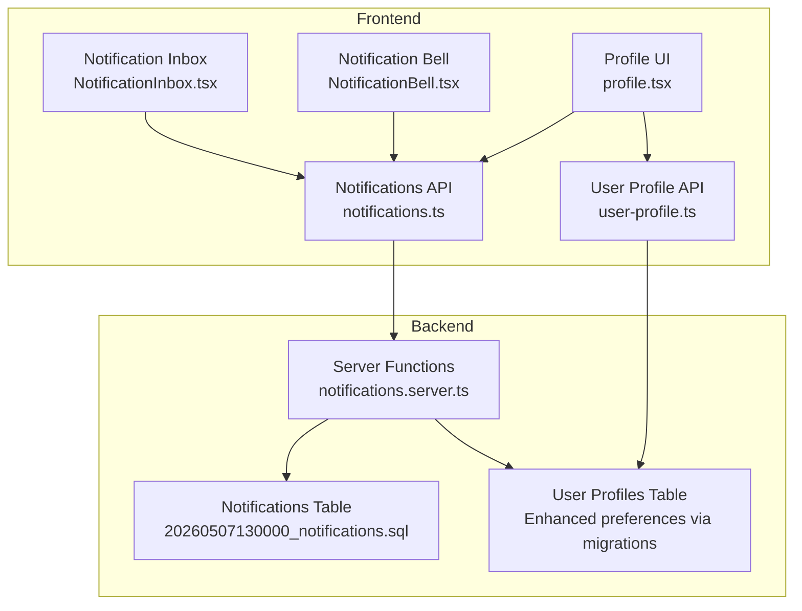
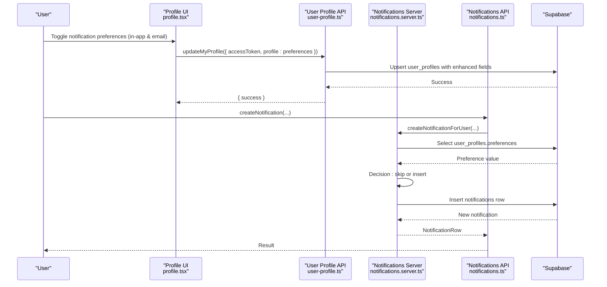
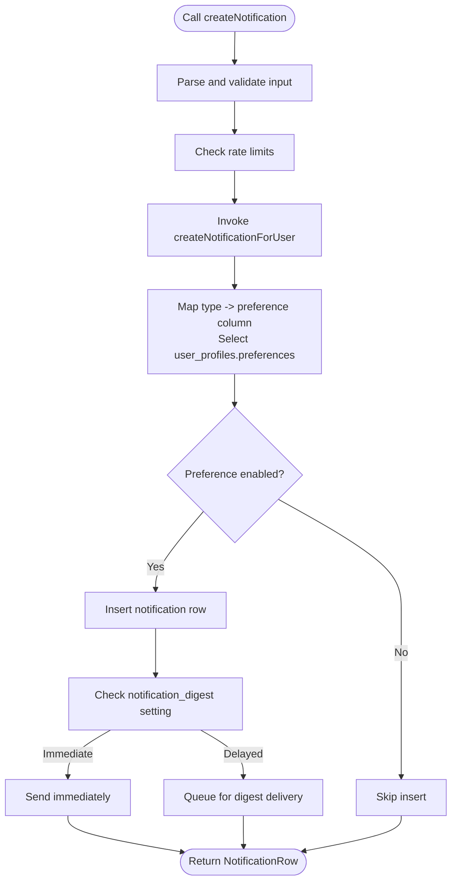
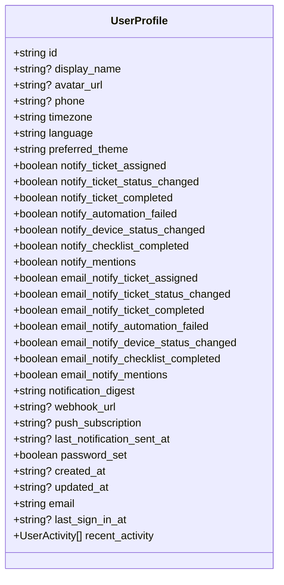
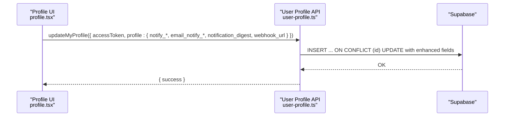
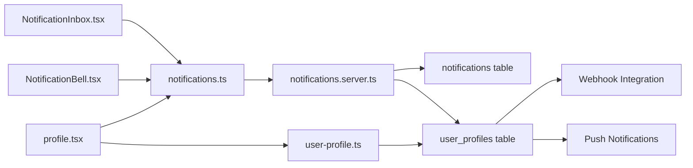

# Notification Preferences

<cite>
**Referenced Files in This Document**
- [notifications.ts](file://src/lib/notifications.ts)
- [notifications.server.ts](file://src/lib/notifications.server.ts)
- [user-profile.ts](file://src/lib/user-profile.ts)
- [profile.tsx](file://src/routes/_app/profile.tsx)
- [NotificationBell.tsx](file://src/components/layout/NotificationBell.tsx)
- [NotificationInbox.tsx](file://src/components/layout/NotificationInbox.tsx)
- [20260507130000_notifications.sql](file://supabase/migrations/20260507130000_notifications.sql)
- [20260512155000_user_profiles_notification_preferences_fix.sql](file://supabase/migrations/20260512155000_user_profiles_notification_preferences_fix.sql)
- [20260512152600_user_profiles_email_notification_preferences.sql](file://supabase/migrations/20260512152600_user_profiles_email_notification_preferences.sql)
- [20260517000000_notification_channel_preferences.sql](file://supabase/migrations/20260517000000_notification_channel_preferences.sql)
</cite>

## Update Summary

**Changes Made**

- Added comprehensive documentation for new notification channels: ticket completions, automation failures, device status changes, checklist completions, and mentions
- Documented new configuration fields: notification_digest, webhook_url, push_subscription, and last_notification_sent_at
- Updated preference mapping and validation to include all seven notification channels
- Enhanced UI components documentation to cover dual-channel notification preferences (in-app and email)
- Added documentation for notification digest frequency controls and webhook integration

## Table of Contents

1. [Introduction](#introduction)
2. [Project Structure](#project-structure)
3. [Core Components](#core-components)
4. [Architecture Overview](#architecture-overview)
5. [Detailed Component Analysis](#detailed-component-analysis)
6. [Dependency Analysis](#dependency-analysis)
7. [Performance Considerations](#performance-considerations)
8. [Troubleshooting Guide](#troubleshooting-guide)
9. [Conclusion](#conclusion)
10. [Appendices](#appendices)

## Introduction

This document describes the enhanced notification preferences system, covering how users configure notification channels, frequency controls, and content preferences across multiple delivery methods. The system now supports seven distinct notification channels with granular control over both in-app and email delivery, plus advanced configuration options including notification digests, webhook integration, and push subscriptions. It explains how preferences are integrated into user profiles, validated, persisted, and synchronized across devices with comprehensive real-time delivery capabilities.

## Project Structure

The notification preferences system spans frontend UI, server-side APIs, and backend database tables and policies. Key areas:

- Frontend APIs and UI:
  - Notification service API definitions and server functions
  - User profile service API and UI form for comprehensive preferences
  - Notification bell and inbox components with real-time updates
- Backend:
  - Supabase notifications table and RLS policies
  - Migrations adding and populating notification preference columns on user_profiles
  - Enhanced preference columns for email delivery, digest frequency, and external integrations

**Diagram sources**

- [profile.tsx:503-649](file://src/routes/_app/profile.tsx#L503-L649)
- [NotificationBell.tsx:19-140](file://src/components/layout/NotificationBell.tsx#L19-L140)
- [NotificationInbox.tsx:13-107](file://src/components/layout/NotificationInbox.tsx#L13-L107)
- [notifications.ts:58-140](file://src/lib/notifications.ts#L58-L140)
- [user-profile.ts:73-236](file://src/lib/user-profile.ts#L73-L236)
- [notifications.server.ts:27-67](file://src/lib/notifications.server.ts#L27-L67)
- [20260507130000_notifications.sql:1-77](file://supabase/migrations/20260507130000_notifications.sql#L1-L77)
- [20260517000000_notification_channel_preferences.sql:1-32](file://supabase/migrations/20260517000000_notification_channel_preferences.sql#L1-L32)

**Section sources**

- [notifications.ts:6-18](file://src/lib/notifications.ts#L6-L18)
- [user-profile.ts:6-26](file://src/lib/user-profile.ts#L6-L26)
- [profile.tsx:503-649](file://src/routes/_app/profile.tsx#L503-L649)
- [NotificationBell.tsx:19-140](file://src/components/layout/NotificationBell.tsx#L19-L140)
- [20260507130000_notifications.sql:1-77](file://supabase/migrations/20260507130000_notifications.sql#L1-L77)

## Core Components

- **Enhanced Notification Types and Model**:
  - NotificationType enumeration defines seven supported notification categories: ticket_assigned, ticket_status_changed, ticket_completed, automation_failed, device_status_changed, checklist_completed, mention
  - NotificationRow represents stored notifications with metadata, read state, and optional payload/link
- **Comprehensive Notification API**:
  - createNotification, listNotifications, getUnreadNotificationCount, markNotificationRead, markAllNotificationsRead, deleteReadNotifications
  - createNotificationForUser checks user preference columns per notification type before persisting
- **Dual-Channel Preference System**:
  - UserProfile includes both in-app notification fields (notify_ticket_completed, notify_automation_failed, etc.) and email notification fields (email_notify_ticket_completed, email_notify_automation_failed, etc.)
  - Preference mapping supports granular control over delivery channels
- **Advanced Configuration Options**:
  - notification_digest field with immediate, 15min, hourly, daily frequency options
  - webhook_url for external notification delivery
  - push_subscription for browser push notifications
  - last_notification_sent_at timestamp tracking
- **Enhanced User Profile Integration**:
  - getMyProfile initializes defaults for all notification preferences if missing and returns consolidated profile
  - updateMyProfile persists preference changes via upsert with comprehensive field support
- **Advanced UI Components**:
  - Profile "Notifications" tab renders grouped toggles for each notification category with separate in-app and email controls
  - NotificationBell and NotificationInbox provide real-time inbox and badge with enhanced styling

**Section sources**

- [notifications.ts:6-18](file://src/lib/notifications.ts#L6-L18)
- [notifications.ts:20-39](file://src/lib/notifications.ts#L20-L39)
- [notifications.ts:58-140](file://src/lib/notifications.ts#L58-L140)
- [notifications.server.ts:16-25](file://src/lib/notifications.server.ts#L16-L25)
- [notifications.server.ts:27-67](file://src/lib/notifications.server.ts#L27-L67)
- [user-profile.ts:6-26](file://src/lib/user-profile.ts#L6-L26)
- [user-profile.ts:73-134](file://src/lib/user-profile.ts#L73-L134)
- [user-profile.ts:136-177](file://src/lib/user-profile.ts#L136-L177)
- [profile.tsx:454-490](file://src/routes/_app/profile.tsx#L454-L490)
- [NotificationBell.tsx:19-140](file://src/components/layout/NotificationBell.tsx#L19-L140)
- [NotificationInbox.tsx:13-87](file://src/components/layout/NotificationInbox.tsx#L13-L87)

## Architecture Overview

The system separates concerns between presentation and user input, API surface, business logic, and persistence, with enhanced support for multiple notification channels and delivery methods:

**Diagram sources**

- [profile.tsx:533-555](file://src/routes/_app/profile.tsx#L533-L555)
- [user-profile.ts:168-209](file://src/lib/user-profile.ts#L168-L209)
- [notifications.ts:58-66](file://src/lib/notifications.ts#L58-L66)
- [notifications.server.ts:27-67](file://src/lib/notifications.server.ts#L27-L67)
- [20260507130000_notifications.sql:1-77](file://supabase/migrations/20260507130000_notifications.sql#L1-L77)

## Detailed Component Analysis

### Enhanced Notification Types and Model

- **Expanded NotificationType Enumeration**: Now includes seven categories - ticket_assigned, ticket_status_changed, ticket_completed, automation_failed, device_status_changed, checklist_completed, mention
- **NotificationRow Interface**: Captures stored notification attributes including read state, optional payload/link, and comprehensive metadata
- **New Notification Categories**: Each category represents specific system events with dedicated preference controls

**Section sources**

- [notifications.ts:6-18](file://src/lib/notifications.ts#L6-L18)
- [notifications.ts:20-30](file://src/lib/notifications.ts#L20-L30)

### Comprehensive Notification API Surface

- **Enhanced createNotification**: Validates inputs and enforces rate limits, delegating to server function with expanded preference checking
- **Advanced listNotifications**: Supports pagination, filtering by type and unread state, with improved performance
- **Get Unread Count**: Returns simple count with optimized querying
- **Mark Operations**: markNotificationRead and markAllNotificationsRead update read timestamps efficiently
- **Cleanup Operations**: deleteReadNotifications purges old read notifications with batch processing

**Diagram sources**

- [notifications.ts:58-66](file://src/lib/notifications.ts#L58-L66)
- [notifications.server.ts:27-67](file://src/lib/notifications.server.ts#L27-L67)

**Section sources**

- [notifications.ts:58-140](file://src/lib/notifications.ts#L58-L140)

### Advanced Preference Mapping and Validation

- **Enhanced preferenceColumn Function**: Maps each NotificationType to corresponding user_profiles boolean columns for both in-app and email delivery
- **Comprehensive Preference Checking**: createNotificationForUser selects the appropriate preference and returns null if disabled for either channel
- **Graceful Handling**: Missing columns (migration gaps) log warnings and treat as enabled for backward compatibility
- **Dual-Channel Support**: Separate preference controls for in-app notifications (notify*\*) and email notifications (email_notify*\*)

**Section sources**

- [notifications.server.ts:16-25](file://src/lib/notifications.server.ts#L16-L25)
- [notifications.server.ts:31-46](file://src/lib/notifications.server.ts#L31-L46)

### Enhanced User Profile Integration and Defaults

- **Comprehensive UserProfile Interface**: Includes 14 notification-related fields covering all seven categories for both in-app and email delivery
- **Advanced Preference Fields**:
  - notify_ticket_completed, notify_automation_failed, notify_device_status_changed, notify_checklist_completed, notify_mentions
  - email_notify_ticket_completed, email_notify_automation_failed, email_notify_device_status_changed, email_notify_checklist_completed, email_notify_mentions
  - notification_digest with four frequency options
  - webhook_url for external integrations
  - push_subscription for browser push notifications
  - last_notification_sent_at timestamp tracking
- **Smart Default Initialization**: getMyProfile initializes defaults for all notification preferences if missing and merges recent activity
- **Enhanced Profile Updates**: updateMyProfile upserts preferences on user_profiles with comprehensive field support

**Diagram sources**

- [user-profile.ts:6-26](file://src/lib/user-profile.ts#L6-L26)

**Section sources**

- [user-profile.ts:73-134](file://src/lib/user-profile.ts#L73-L134)
- [user-profile.ts:136-177](file://src/lib/user-profile.ts#L136-L177)

### Advanced UI Management of Preferences

- **Enhanced Profile "Notifications" Tab**: Displays grouped toggles for each notification category with separate in-app and email controls
- **Dual-Channel Preference Controls**: Each notification category has two toggle switches - one for in-app delivery and one for email delivery
- **Notification Digest Configuration**: Dropdown selector for immediate, 15-minute, hourly, or daily digest frequencies
- **Webhook Integration**: Text input field for webhook URL configuration with validation
- **Push Notification Support**: Browser-based push notification capability indicator
- **Last Notification Tracking**: Displays timestamp of last sent notification
- **Local State Management**: Mirrors server-provided defaults; saving sends only changed preferences
- **Real-time Bell Updates**: Shows unread counts and live updates via Postgres changes with enhanced styling

**Diagram sources**

- [profile.tsx:587-590](file://src/routes/_app/profile.tsx#L587-L590)
- [user-profile.ts:168-209](file://src/lib/user-profile.ts#L168-L209)

**Section sources**

- [profile.tsx:503-649](file://src/routes/_app/profile.tsx#L503-L649)
- [NotificationBell.tsx:19-140](file://src/components/layout/NotificationBell.tsx#L19-L140)
- [NotificationInbox.tsx:13-87](file://src/components/layout/NotificationInbox.tsx#L13-L87)

### Real-Time Delivery and Synchronization

- **Enhanced Supabase Publication**: Realtime publication for notifications table with improved performance
- **Advanced NotificationBell Subscription**: Subscribes to user-specific Postgres changes and updates unread count and preview list with enhanced styling
- **Improved Mark-as-Read Operations**: Update read_at timestamps and reflect immediately in UI with better user feedback
- **Enhanced NotificationInbox**: Displays notifications with category-specific icons (Zap for automation_failed, Wrench for device_status_changed, Settings for user_invited)

**Section sources**

- [20260507130000_notifications.sql:39-53](file://supabase/migrations/20260507130000_notifications.sql#L39-L53)
- [NotificationBell.tsx:52-75](file://src/components/layout/NotificationBell.tsx#L52-L75)
- [NotificationBell.tsx:93-112](file://src/components/layout/NotificationBell.tsx#L93-L112)
- [NotificationInbox.tsx:90-95](file://src/components/layout/NotificationInbox.tsx#L90-L95)

### Preference Defaults and Migration Patterns

- **Initial Category Migration**: Added notify_ticket_assigned, notify_ticket_status_changed, notify_automation_failed, notify_device_status_changed, notify_checklist_completed, notify_mentions, notify_ticket_completed columns with default true and backfilled nulls
- **Enhanced Channel Migration**: Added comprehensive email notification columns (email*notify*\*) with default true and backfilled nulls
- **Advanced Configuration Migration**: Added notification_digest, webhook_url, push_subscription, and last_notification_sent_at columns with appropriate defaults
- **Backward Compatibility**: Graceful handling of missing columns with automatic defaults and logging

**Section sources**

- [20260512155000_user_profiles_notification_preferences_fix.sql:1-26](file://supabase/migrations/20260512155000_user_profiles_notification_preferences_fix.sql#L1-L26)
- [20260512152600_user_profiles_email_notification_preferences.sql:1-11](file://supabase/migrations/20260512152600_user_profiles_email_notification_preferences.sql#L1-L11)
- [20260517000000_notification_channel_preferences.sql:1-32](file://supabase/migrations/20260517000000_notification_channel_preferences.sql#L1-L32)

### Permission-Based Overrides and Admin Notifications

- **Admin-Triggered Notifications**: Broadcast to all users with the admin role using enhanced preference checking
- **Enhanced Creation Path**: Aggregates admin user_ids and creates individual notifications with comprehensive preference validation
- **Cross-Platform Delivery**: Supports delivery across multiple channels based on user preferences

**Section sources**

- [notifications.server.ts:94-114](file://src/lib/notifications.server.ts#L94-L114)

## Dependency Analysis

- **Enhanced UI Dependencies**: UI depends on TanStack server functions for notifications and user profile with expanded field support
- **Advanced Server Functions**: Depend on Supabase client for authenticated user lookup and table operations with comprehensive preference validation
- **Database Constraints**: Enhanced constraints and RLS policies protect data integrity and access with expanded field coverage
- **External Integrations**: Support for webhook URLs and push subscriptions for third-party notification delivery

**Diagram sources**

- [profile.tsx:503-649](file://src/routes/_app/profile.tsx#L503-L649)
- [NotificationBell.tsx:19-140](file://src/components/layout/NotificationBell.tsx#L19-L140)
- [NotificationInbox.tsx:13-87](file://src/components/layout/NotificationInbox.tsx#L13-L87)
- [notifications.ts:58-140](file://src/lib/notifications.ts#L58-L140)
- [notifications.server.ts:27-67](file://src/lib/notifications.server.ts#L27-L67)
- [20260507130000_notifications.sql:1-77](file://supabase/migrations/20260507130000_notifications.sql#L1-L77)

**Section sources**

- [notifications.ts:58-140](file://src/lib/notifications.ts#L58-L140)
- [notifications.server.ts:27-67](file://src/lib/notifications.server.ts#L27-L67)
- [20260507130000_notifications.sql:1-77](file://supabase/migrations/20260507130000_notifications.sql#L1-L77)

## Performance Considerations

- **Enhanced Real-time Updates**: Postgres changes with optimized payload minimization to reduce bandwidth consumption
- **Advanced Pagination**: Improved pagination and unread filters reduce fetch sizes for listNotifications with better performance
- **Digest Processing**: Notification digest system reduces delivery frequency for high-volume users
- **Batch Operations**: Efficient batch operations like markAllNotificationsRead update read timestamps with minimal database overhead
- **Webhook Optimization**: Asynchronous webhook delivery prevents blocking notification creation

## Troubleshooting Guide

Common issues and resolutions:

- **Preference Ignored Unexpectedly**:
  - Verify the corresponding notify*\* and email_notify*\* columns in user_profiles are true for the specific notification category
  - Check for missing columns; migrations backfill defaults automatically with enhanced field support
- **Missing Preference Columns**:
  - Confirm latest migrations applied including the enhanced notification channel preferences migration
  - preferenceColumn handles missing columns gracefully by treating as enabled and logging warnings
- **Webhook Integration Issues**:
  - Verify webhook_url format and accessibility
  - Check webhook endpoint availability and response codes
- **Digest Frequency Problems**:
  - Confirm notification_digest setting matches expected delivery frequency
  - Verify digest processing jobs are running correctly
- **Real-time Updates Not Working**:
  - Ensure Supabase realtime publication includes notifications table and user-specific subscription is active
  - Check browser notification permissions for push subscriptions
- **Rate Limit Errors**:
  - Calls to createNotification are rate-limited; retry after cooldown period
- **Push Notification Issues**:
  - Verify browser support for push notifications
  - Check service worker registration and push subscription validity

**Section sources**

- [notifications.server.ts:37-46](file://src/lib/notifications.server.ts#L37-L46)
- [20260507130000_notifications.sql:39-53](file://supabase/migrations/20260507130000_notifications.sql#L39-L53)
- [notifications.ts:58-66](file://src/lib/notifications.ts#L58-L66)

## Conclusion

The enhanced notification preferences system provides comprehensive control over notification delivery across multiple channels and frequencies. With seven distinct notification categories, dual-channel preference controls (in-app and email), advanced digest configuration, webhook integration, and push notification support, the system offers flexible and scalable notification management. The enhanced UI provides intuitive controls for users to manage their preferences, while server functions and database policies ensure correctness, performance, and extensibility for future enhancements.

## Appendices

### Enhanced Preference Configuration Workflows

- **Configure Multi-Channel Preferences**:
  - Open Profile → Notifications tab → Toggle desired categories for in-app delivery
  - Enable email delivery separately for each category using email notification toggles
  - Set notification digest frequency based on volume and preference
  - Configure webhook URL for external notification delivery if needed
- **Default Value Handling**:
  - On first access, comprehensive defaults are applied for all notify*\* and email_notify*\* fields
  - notification_digest defaults to "immediate" for immediate delivery
  - webhook_url defaults to null for no external delivery
- **Preference Inheritance Patterns**:
  - No inheritance across users; preferences are per-user with enhanced field coverage
  - Email preferences can be configured independently from in-app preferences
- **Consent Management**:
  - Preferences act as explicit consent; disabling a category suppresses notifications of that type
  - Dual-channel preferences require consent for both in-app and email delivery

**Section sources**

- [profile.tsx:503-649](file://src/routes/_app/profile.tsx#L503-L649)
- [user-profile.ts:73-134](file://src/lib/user-profile.ts#L73-L134)
- [notifications.server.ts:31-46](file://src/lib/notifications.server.ts#L31-L46)

### Enhanced Preference Persistence and Synchronization

- **Comprehensive Persistence**:
  - Preferences are upserted into user_profiles with all enhanced fields including notification_digest, webhook_url, push_subscription, and last_notification_sent_at
- **Cross-Device Sync**:
  - Real-time subscription ensures immediate updates across sessions with enhanced field support
  - Push notifications synchronize preferences across browser instances
- **Advanced Cleanup**:
  - Old read notifications are periodically cleaned up by scheduled jobs
  - Digest processing manages notification volume effectively

**Section sources**

- [user-profile.ts:168-209](file://src/lib/user-profile.ts#L168-L209)
- [20260507130000_notifications.sql:63-77](file://supabase/migrations/20260507130000_notifications.sql#L63-L77)
- [NotificationBell.tsx:52-75](file://src/components/layout/NotificationBell.tsx#L52-L75)

### Enhanced Preference Migration During Updates

- **Category Migration**: Added notify_ticket_assigned, notify_ticket_status_changed, notify_automation_failed, notify_device_status_changed, notify_checklist_completed, notify_mentions, notify_ticket_completed columns with default true and backfill nulls
- **Email Channel Migration**: Added comprehensive email*notify*\* columns with default true and backfill nulls
- **Advanced Configuration Migration**: Added notification_digest, webhook_url, push_subscription, and last_notification_sent_at columns with appropriate defaults
- **Future Migration Support**: Enhanced migration framework supports additional notification channels and delivery methods

**Section sources**

- [20260512155000_user_profiles_notification_preferences_fix.sql:1-26](file://supabase/migrations/20260512155000_user_profiles_notification_preferences_fix.sql#L1-L26)
- [20260512152600_user_profiles_email_notification_preferences.sql:1-11](file://supabase/migrations/20260512152600_user_profiles_email_notification_preferences.sql#L1-L11)
- [20260517000000_notification_channel_preferences.sql:1-32](file://supabase/migrations/20260517000000_notification_channel_preferences.sql#L1-L32)

### Enhanced UI Components Reference

- **Advanced Profile "Notifications" Tab**:
  - Grouped toggle switches mapped to notify*\* and email_notify*\* fields
  - Notification digest frequency selector with four options
  - Webhook URL configuration with validation
  - Push notification capability indicator
  - Last notification sent timestamp display
- **Enhanced NotificationBell**:
  - Badge shows unread count with improved styling
  - Popover opens NotificationInbox with enhanced category icons
  - Real-time updates with better user feedback
- **Advanced NotificationInbox**:
  - Lists notifications with category-specific icons (Zap, Wrench, Settings)
  - Relative time display with improved formatting
  - Read/unread indicators with enhanced visual distinction

**Section sources**

- [profile.tsx:503-649](file://src/routes/_app/profile.tsx#L503-L649)
- [NotificationBell.tsx:19-140](file://src/components/layout/NotificationBell.tsx#L19-L140)
- [NotificationInbox.tsx:13-87](file://src/components/layout/NotificationInbox.tsx#L13-L87)
- [NotificationInbox.tsx:90-95](file://src/components/layout/NotificationInbox.tsx#L90-L95)
