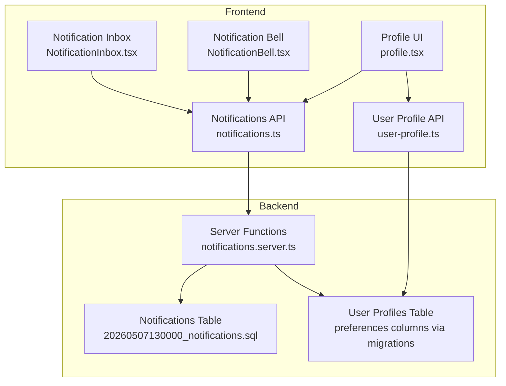
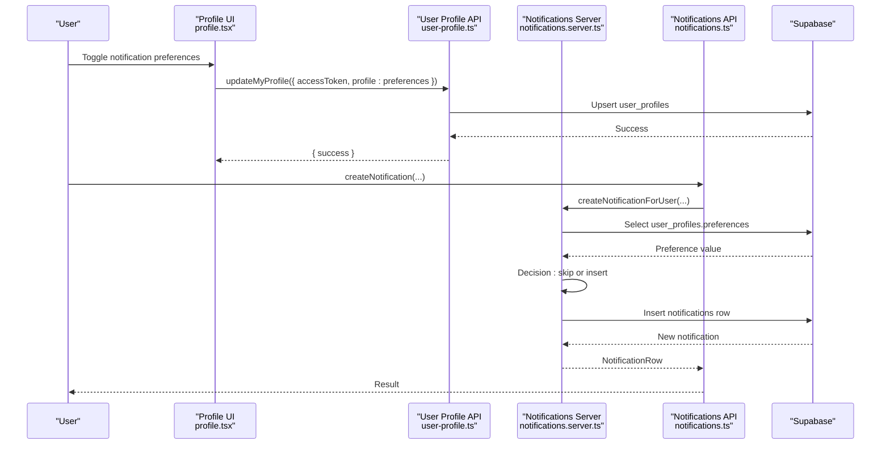
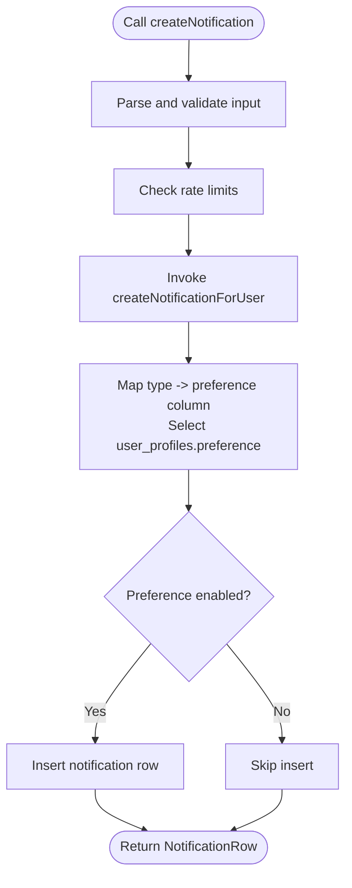
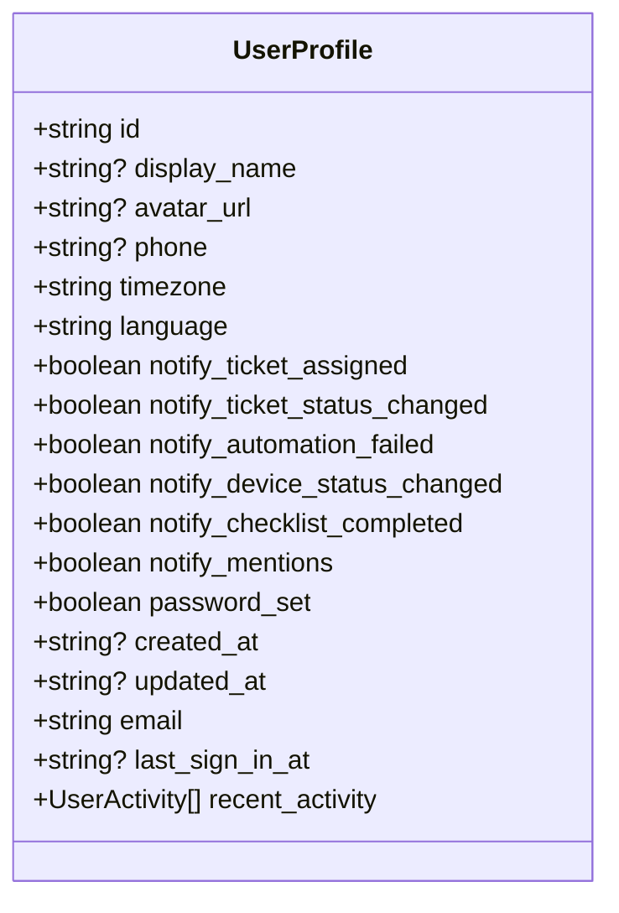
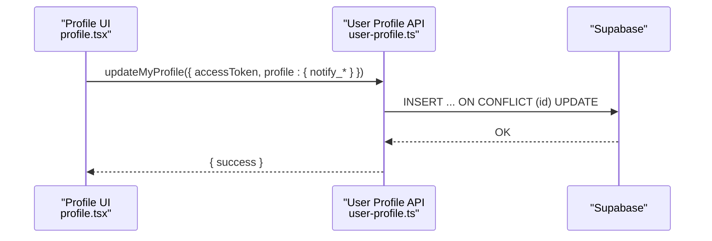
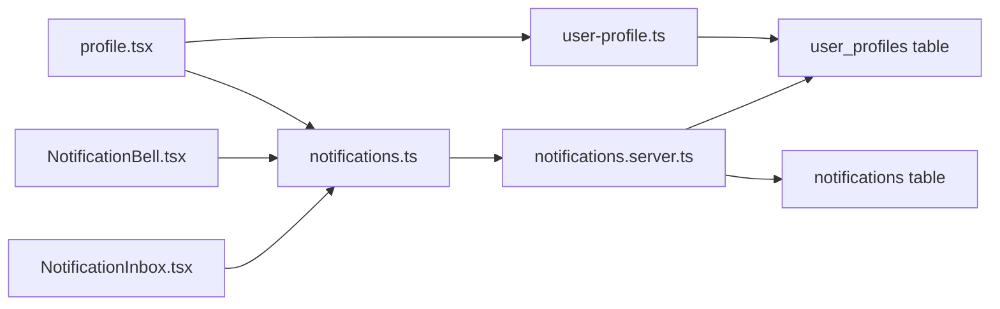

# Notification Preferences

<cite>
**Referenced Files in This Document**
- [notifications.ts](file://src/lib/notifications.ts)
- [notifications.server.ts](file://src/lib/notifications.server.ts)
- [user-profile.ts](file://src/lib/user-profile.ts)
- [profile.tsx](file://src/routes/_app/profile.tsx)
- [NotificationBell.tsx](file://src/components/layout/NotificationBell.tsx)
- [NotificationInbox.tsx](file://src/components/layout/NotificationInbox.tsx)
- [20260507130000_notifications.sql](file://supabase/migrations/20260507130000_notifications.sql)
- [20260512155000_user_profiles_notification_preferences_fix.sql](file://supabase/migrations/20260512155000_user_profiles_notification_preferences_fix.sql)
- [20260512152600_user_profiles_email_notification_preferences.sql](file://supabase/migrations/20260512152600_user_profiles_email_notification_preferences.sql)
</cite>

## Table of Contents
1. [Introduction](#introduction)
2. [Project Structure](#project-structure)
3. [Core Components](#core-components)
4. [Architecture Overview](#architecture-overview)
5. [Detailed Component Analysis](#detailed-component-analysis)
6. [Dependency Analysis](#dependency-analysis)
7. [Performance Considerations](#performance-considerations)
8. [Troubleshooting Guide](#troubleshooting-guide)
9. [Conclusion](#conclusion)
10. [Appendices](#appendices)

## Introduction
This document describes the notification preferences system, covering how users configure notification channels, frequency controls, and content preferences. It explains how preferences are integrated into user profiles, validated, persisted, and synchronized across devices. It also documents the UI components for managing preferences, preference defaults and migrations, and how the system handles permission-based overrides and real-time delivery.

## Project Structure
The notification preferences system spans frontend UI, server-side APIs, and backend database tables and policies. Key areas:
- Frontend APIs and UI:
  - Notification service API definitions and server functions
  - User profile service API and UI form for preferences
  - Notification bell and inbox components
- Backend:
  - Supabase notifications table and RLS policies
  - Migrations adding and populating notification preference columns on user_profiles

**Diagram sources**
- [profile.tsx:454-490](file://src/routes/_app/profile.tsx#L454-L490)
- [NotificationBell.tsx:19-140](file://src/components/layout/NotificationBell.tsx#L19-L140)
- [NotificationInbox.tsx:13-87](file://src/components/layout/NotificationInbox.tsx#L13-L87)
- [notifications.ts:58-140](file://src/lib/notifications.ts#L58-L140)
- [user-profile.ts:73-177](file://src/lib/user-profile.ts#L73-L177)
- [notifications.server.ts:27-67](file://src/lib/notifications.server.ts#L27-L67)
- [20260507130000_notifications.sql:1-77](file://supabase/migrations/20260507130000_notifications.sql#L1-L77)
- [20260512155000_user_profiles_notification_preferences_fix.sql:1-26](file://supabase/migrations/20260512155000_user_profiles_notification_preferences_fix.sql#L1-L26)

**Section sources**
- [notifications.ts:6-18](file://src/lib/notifications.ts#L6-L18)
- [user-profile.ts:6-26](file://src/lib/user-profile.ts#L6-L26)
- [profile.tsx:454-490](file://src/routes/_app/profile.tsx#L454-L490)
- [NotificationBell.tsx:19-140](file://src/components/layout/NotificationBell.tsx#L19-L140)
- [20260507130000_notifications.sql:1-77](file://supabase/migrations/20260507130000_notifications.sql#L1-L77)

## Core Components
- Notification types and model:
  - NotificationType enumeration defines supported notification categories.
  - NotificationRow represents stored notifications with metadata and read state.
- Notification API:
  - createNotification, listNotifications, getUnreadNotificationCount, markNotificationRead, markAllNotificationsRead, deleteReadNotifications.
- Preference-backed creation:
  - createNotificationForUser checks user preference columns per notification type before persisting.
- User profile integration:
  - UserProfile includes boolean preference fields for each notification category.
  - getMyProfile initializes defaults for preferences if missing and returns consolidated profile.
  - updateMyProfile persists preference changes via upsert.
- UI components:
  - Profile “Notifications” tab renders toggles for each preference.
  - NotificationBell and NotificationInbox provide real-time inbox and badge.

**Section sources**
- [notifications.ts:6-18](file://src/lib/notifications.ts#L6-L18)
- [notifications.ts:20-39](file://src/lib/notifications.ts#L20-L39)
- [notifications.ts:58-140](file://src/lib/notifications.ts#L58-L140)
- [notifications.server.ts:16-25](file://src/lib/notifications.server.ts#L16-L25)
- [notifications.server.ts:27-67](file://src/lib/notifications.server.ts#L27-L67)
- [user-profile.ts:6-26](file://src/lib/user-profile.ts#L6-L26)
- [user-profile.ts:73-134](file://src/lib/user-profile.ts#L73-L134)
- [user-profile.ts:136-177](file://src/lib/user-profile.ts#L136-L177)
- [profile.tsx:454-490](file://src/routes/_app/profile.tsx#L454-L490)
- [NotificationBell.tsx:19-140](file://src/components/layout/NotificationBell.tsx#L19-L140)
- [NotificationInbox.tsx:13-87](file://src/components/layout/NotificationInbox.tsx#L13-L87)

## Architecture Overview
The system separates concerns between:
- Presentation and user input: Profile UI and NotificationBell/Inbox.
- API surface: TanStack server functions for notifications and user profile.
- Business logic: Server functions enforce preference checks and CRUD operations.
- Persistence: Supabase tables with RLS and realtime publication.

**Diagram sources**
- [profile.tsx:232-248](file://src/routes/_app/profile.tsx#L232-L248)
- [user-profile.ts:136-177](file://src/lib/user-profile.ts#L136-L177)
- [notifications.ts:58-66](file://src/lib/notifications.ts#L58-L66)
- [notifications.server.ts:27-67](file://src/lib/notifications.server.ts#L27-L67)
- [20260507130000_notifications.sql:1-77](file://supabase/migrations/20260507130000_notifications.sql#L1-L77)

## Detailed Component Analysis

### Notification Types and Model
- NotificationType enumerates categories used to map to user preference columns.
- NotificationRow captures stored notification attributes including read state and optional payload/link.

**Section sources**
- [notifications.ts:6-18](file://src/lib/notifications.ts#L6-L18)
- [notifications.ts:20-30](file://src/lib/notifications.ts#L20-L30)

### Notification API Surface
- createNotification validates inputs and enforces rate limits, delegating to server function.
- listNotifications supports pagination, filtering by type and unread state.
- getUnreadNotificationCount returns a simple count.
- markNotificationRead and markAllNotificationsRead update read timestamps.
- deleteReadNotifications purges old read notifications.

**Diagram sources**
- [notifications.ts:58-66](file://src/lib/notifications.ts#L58-L66)
- [notifications.server.ts:27-67](file://src/lib/notifications.server.ts#L27-L67)

**Section sources**
- [notifications.ts:58-140](file://src/lib/notifications.ts#L58-L140)

### Preference Mapping and Validation
- preferenceColumn maps each NotificationType to a user_profiles boolean column.
- createNotificationForUser selects the preference and returns null if disabled.
- Graceful handling for missing columns (migration gaps) logs a warning and treats as enabled.

**Section sources**
- [notifications.server.ts:16-25](file://src/lib/notifications.server.ts#L16-L25)
- [notifications.server.ts:31-46](file://src/lib/notifications.server.ts#L31-L46)

### User Profile Integration and Defaults
- UserProfile includes notify_* fields for each category.
- getMyProfile initializes defaults for preferences if missing and merges recent activity.
- updateMyProfile upserts preferences on user_profiles.

**Diagram sources**
- [user-profile.ts:6-26](file://src/lib/user-profile.ts#L6-L26)

**Section sources**
- [user-profile.ts:73-134](file://src/lib/user-profile.ts#L73-L134)
- [user-profile.ts:136-177](file://src/lib/user-profile.ts#L136-L177)

### UI Management of Preferences
- Profile “Notifications” tab displays toggles for each notify_* field.
- Local state mirrors server-provided defaults; saving sends only changed preferences.
- Real-time bell shows unread counts and live updates via Postgres changes.

**Diagram sources**
- [profile.tsx:232-248](file://src/routes/_app/profile.tsx#L232-L248)
- [user-profile.ts:136-177](file://src/lib/user-profile.ts#L136-L177)

**Section sources**
- [profile.tsx:454-490](file://src/routes/_app/profile.tsx#L454-L490)
- [NotificationBell.tsx:19-140](file://src/components/layout/NotificationBell.tsx#L19-L140)
- [NotificationInbox.tsx:13-87](file://src/components/layout/NotificationInbox.tsx#L13-L87)

### Real-Time Delivery and Synchronization
- Supabase publication for notifications table enables realtime.
- NotificationBell subscribes to user-specific Postgres changes and updates unread count and preview list.
- Mark-as-read actions update read_at and reflect immediately in UI.

**Section sources**
- [20260507130000_notifications.sql:39-53](file://supabase/migrations/20260507130000_notifications.sql#L39-L53)
- [NotificationBell.tsx:52-75](file://src/components/layout/NotificationBell.tsx#L52-L75)
- [NotificationBell.tsx:93-112](file://src/components/layout/NotificationBell.tsx#L93-L112)

### Preference Defaults and Migration Patterns
- Initial migrations added notify_* columns with default true and backfilled nulls.
- A later migration added missing columns and backfilled defaults to ensure consistency.

**Section sources**
- [20260512155000_user_profiles_notification_preferences_fix.sql:1-26](file://supabase/migrations/20260512155000_user_profiles_notification_preferences_fix.sql#L1-L26)
- [20260512152600_user_profiles_email_notification_preferences.sql:1-11](file://supabase/migrations/20260512152600_user_profiles_email_notification_preferences.sql#L1-L11)

### Permission-Based Overrides and Admin Notifications
- Admin-triggered notifications are broadcast to all users with the admin role.
- Creation path aggregates admin user_ids and creates individual notifications.

**Section sources**
- [notifications.server.ts:94-114](file://src/lib/notifications.server.ts#L94-L114)

## Dependency Analysis
- UI depends on TanStack server functions for notifications and user profile.
- Server functions depend on Supabase client for authenticated user lookup and table operations.
- Database constraints and RLS policies protect data integrity and access.

**Diagram sources**
- [profile.tsx:454-490](file://src/routes/_app/profile.tsx#L454-L490)
- [NotificationBell.tsx:19-140](file://src/components/layout/NotificationBell.tsx#L19-L140)
- [NotificationInbox.tsx:13-87](file://src/components/layout/NotificationInbox.tsx#L13-L87)
- [notifications.ts:58-140](file://src/lib/notifications.ts#L58-L140)
- [notifications.server.ts:27-67](file://src/lib/notifications.server.ts#L27-L67)
- [20260507130000_notifications.sql:1-77](file://supabase/migrations/20260507130000_notifications.sql#L1-L77)

**Section sources**
- [notifications.ts:58-140](file://src/lib/notifications.ts#L58-L140)
- [notifications.server.ts:27-67](file://src/lib/notifications.server.ts#L27-L67)
- [20260507130000_notifications.sql:1-77](file://supabase/migrations/20260507130000_notifications.sql#L1-L77)

## Performance Considerations
- Real-time updates use Postgres changes; keep payload minimal to reduce bandwidth.
- Pagination and unread filters reduce fetch sizes for listNotifications.
- Batch operations like markAllNotificationsRead update read timestamps efficiently.

## Troubleshooting Guide
Common issues and resolutions:
- Preference ignored unexpectedly:
  - Verify the corresponding notify_* column in user_profiles is true.
  - Check for missing columns; migrations backfill defaults automatically.
- Missing preference columns:
  - Confirm latest migrations applied; preferenceColumn handles missing columns gracefully by treating as enabled and logging a warning.
- Real-time not updating:
  - Ensure Supabase realtime publication includes notifications table and user-specific subscription is active.
- Rate limit errors:
  - Calls to createNotification are rate-limited; retry after cooldown.

**Section sources**
- [notifications.server.ts:37-46](file://src/lib/notifications.server.ts#L37-L46)
- [20260507130000_notifications.sql:39-53](file://supabase/migrations/20260507130000_notifications.sql#L39-L53)
- [notifications.ts:58-66](file://src/lib/notifications.ts#L58-L66)

## Conclusion
The notification preferences system integrates cleanly with user profiles, enforcing per-type preferences at creation time, persisting defaults via migrations, and synchronizing state in real time. The UI provides straightforward controls for users to manage their preferences, while server functions and database policies ensure correctness and performance.

## Appendices

### Preference Configuration Workflows
- Configure preferences:
  - Open Profile → Notifications tab → Toggle desired categories → Save.
- Default value handling:
  - On first access, defaults are applied for notify_* fields.
- Preference inheritance patterns:
  - No inheritance across users; preferences are per-user.
- Consent management:
  - Preferences act as explicit consent; disabling a category suppresses notifications of that type.

**Section sources**
- [profile.tsx:454-490](file://src/routes/_app/profile.tsx#L454-L490)
- [user-profile.ts:73-134](file://src/lib/user-profile.ts#L73-L134)
- [notifications.server.ts:31-46](file://src/lib/notifications.server.ts#L31-L46)

### Preference Persistence and Synchronization
- Persistence:
  - Preferences are upserted into user_profiles.
- Cross-device sync:
  - Real-time subscription ensures immediate updates across sessions.
- Cleanup:
  - Old read notifications are periodically cleaned up by a scheduled job.

**Section sources**
- [user-profile.ts:136-177](file://src/lib/user-profile.ts#L136-L177)
- [20260507130000_notifications.sql:63-77](file://supabase/migrations/20260507130000_notifications.sql#L63-L77)
- [NotificationBell.tsx:52-75](file://src/components/layout/NotificationBell.tsx#L52-L75)

### Preference Migration During Updates
- Migrations add notify_* columns with default true and backfill nulls.
- Future migrations ensure all categories are present and consistently defaulted.

**Section sources**
- [20260512155000_user_profiles_notification_preferences_fix.sql:1-26](file://supabase/migrations/20260512155000_user_profiles_notification_preferences_fix.sql#L1-L26)
- [20260512152600_user_profiles_email_notification_preferences.sql:1-11](file://supabase/migrations/20260512152600_user_profiles_email_notification_preferences.sql#L1-L11)

### UI Components Reference
- Profile “Notifications” tab:
  - Toggle switches mapped to notify_* fields.
- NotificationBell:
  - Badge shows unread count; popover opens NotificationInbox.
- NotificationInbox:
  - Lists notifications with icons, relative time, and read indicators.

**Section sources**
- [profile.tsx:454-490](file://src/routes/_app/profile.tsx#L454-L490)
- [NotificationBell.tsx:19-140](file://src/components/layout/NotificationBell.tsx#L19-L140)
- [NotificationInbox.tsx:13-87](file://src/components/layout/NotificationInbox.tsx#L13-L87)