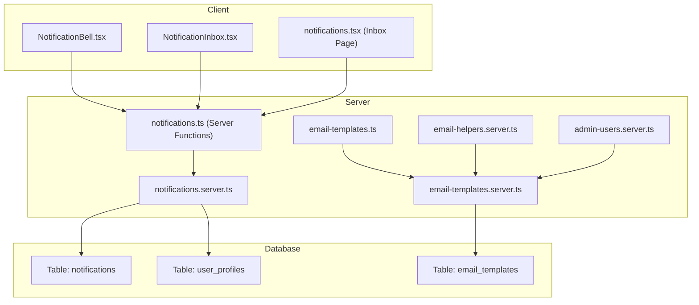
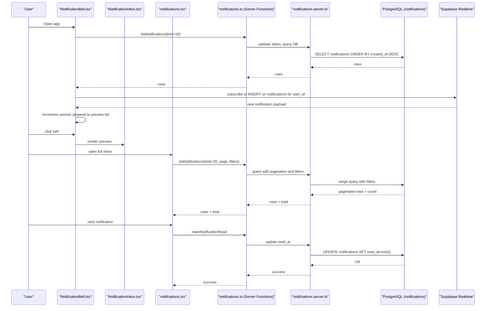
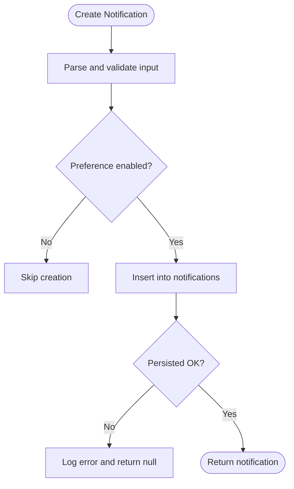
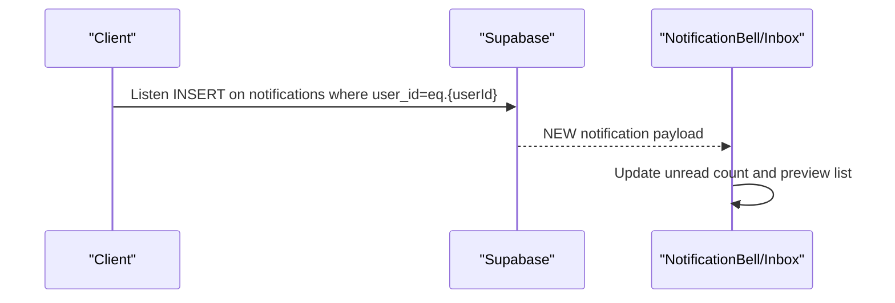
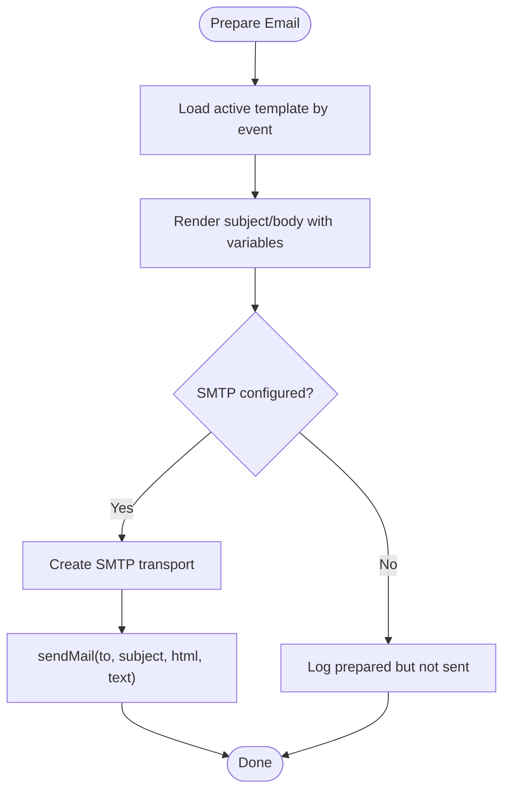
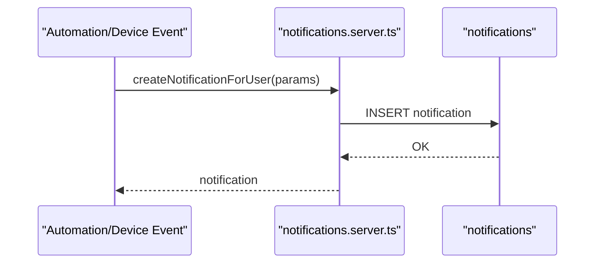
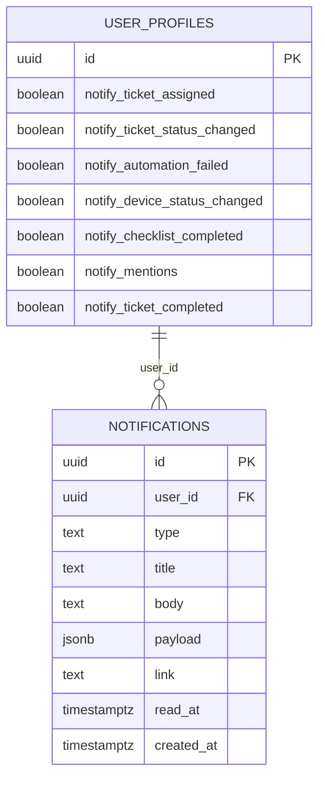
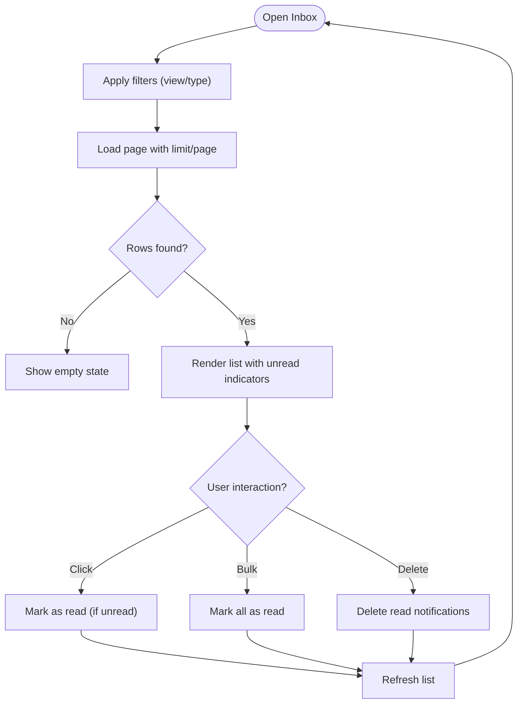
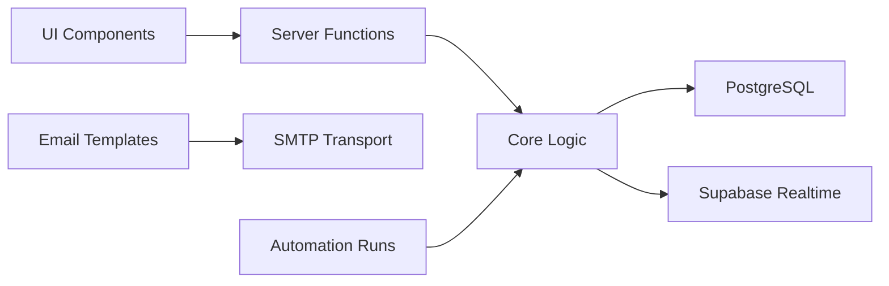

# Notification System

<cite>
**Referenced Files in This Document**
- [notifications.ts](file://src/lib/notifications.ts)
- [notifications.server.ts](file://src/lib/notifications.server.ts)
- [notifications.tsx](file://src/routes/_app/notifications.tsx)
- [NotificationBell.tsx](file://src/components/layout/NotificationBell.tsx)
- [NotificationInbox.tsx](file://src/components/layout/NotificationInbox.tsx)
- [email-templates.ts](file://src/lib/email-templates.ts)
- [email-templates.server.ts](file://src/lib/email-templates.server.ts)
- [email-helpers.server.ts](file://src/lib/email-helpers.server.ts)
- [admin-users.server.ts](file://src/lib/admin-users.server.ts)
- [notifications.sql](file://supabase/migrations/20260507130000_notifications.sql)
- [user_profiles_notification_preferences_fix.sql](file://supabase/migrations/20260512155000_user_profiles_notification_preferences_fix.sql)
- [user_profiles_email_notification_preferences.sql](file://supabase/migrations/20260512152600_user_profiles_email_notification_preferences.sql)
- [automation-runs.server.ts](file://src/lib/automation-runs.server.ts)
- [profile.tsx](file://src/routes/_app/profile.tsx)
</cite>

## Table of Contents
1. [Introduction](#introduction)
2. [Project Structure](#project-structure)
3. [Core Components](#core-components)
4. [Architecture Overview](#architecture-overview)
5. [Detailed Component Analysis](#detailed-component-analysis)
6. [Dependency Analysis](#dependency-analysis)
7. [Performance Considerations](#performance-considerations)
8. [Troubleshooting Guide](#troubleshooting-guide)
9. [Conclusion](#conclusion)
10. [Appendices](#appendices)

## Introduction
This document describes the comprehensive notification system, covering in-app notifications, email alerts, and real-time status updates. It explains how notifications are triggered for ticket status changes, device assignments, and system events; how users configure delivery preferences; how templates are rendered and delivered; and how the notification inbox works. It also documents persistence, read/unread tracking, and administrative controls.

## Project Structure
The notification system spans client-side UI components, server functions, Supabase database tables, and email template infrastructure:
- In-app notifications: TypeScript modules define types, server functions, and UI components.
- Real-time delivery: Supabase Realtime publishes inserts to the notifications table.
- Email delivery: Template engine renders dynamic content and sends via SMTP.
- Persistence: PostgreSQL tables store notifications and user preferences.

**Diagram sources**
- [NotificationBell.tsx:1-141](file://src/components/layout/NotificationBell.tsx#L1-L141)
- [NotificationInbox.tsx:1-107](file://src/components/layout/NotificationInbox.tsx#L1-L107)
- [notifications.tsx:1-258](file://src/routes/_app/notifications.tsx#L1-L258)
- [notifications.ts:1-140](file://src/lib/notifications.ts#L1-L140)
- [notifications.server.ts:1-140](file://src/lib/notifications.server.ts#L1-L140)
- [email-templates.ts:1-112](file://src/lib/email-templates.ts#L1-L112)
- [email-templates.server.ts:1-386](file://src/lib/email-templates.server.ts#L1-L386)
- [email-helpers.server.ts:1-125](file://src/lib/email-helpers.server.ts#L1-L125)
- [admin-users.server.ts:1-18](file://src/lib/admin-users.server.ts#L1-L18)
- [notifications.sql:1-77](file://supabase/migrations/20260507130000_notifications.sql#L1-L77)
- [user_profiles_notification_preferences_fix.sql:1-26](file://supabase/migrations/20260512155000_user_profiles_notification_preferences_fix.sql#L1-L26)
- [user_profiles_email_notification_preferences.sql:1-11](file://supabase/migrations/20260512152600_user_profiles_email_notification_preferences.sql#L1-L11)

**Section sources**
- [notifications.ts:1-140](file://src/lib/notifications.ts#L1-L140)
- [notifications.server.ts:1-140](file://src/lib/notifications.server.ts#L1-L140)
- [notifications.tsx:1-258](file://src/routes/_app/notifications.tsx#L1-L258)
- [NotificationBell.tsx:1-141](file://src/components/layout/NotificationBell.tsx#L1-L141)
- [NotificationInbox.tsx:1-107](file://src/components/layout/NotificationInbox.tsx#L1-L107)
- [email-templates.ts:1-112](file://src/lib/email-templates.ts#L1-L112)
- [email-templates.server.ts:1-386](file://src/lib/email-templates.server.ts#L1-L386)
- [email-helpers.server.ts:1-125](file://src/lib/email-helpers.server.ts#L1-L125)
- [admin-users.server.ts:1-18](file://src/lib/admin-users.server.ts#L1-L18)
- [notifications.sql:1-77](file://supabase/migrations/20260507130000_notifications.sql#L1-L77)
- [user_profiles_notification_preferences_fix.sql:1-26](file://supabase/migrations/20260512155000_user_profiles_notification_preferences_fix.sql#L1-L26)
- [user_profiles_email_notification_preferences.sql:1-11](file://supabase/migrations/20260512152600_user_profiles_email_notification_preferences.sql#L1-L11)

## Core Components
- Notification types and schema: Defines supported notification categories and validation rules for creation and listing.
- Server functions: Expose CRUD and bulk operations for notifications via TanStack start server functions.
- Real-time subscription: Uses Supabase Realtime to push new notifications to the user’s bell/inbox.
- Preference enforcement: Checks user preference columns before persisting notifications.
- Email templates: Manages transactional email templates and dynamic content rendering.
- User preferences: Per-user toggles for in-app notification delivery.

Key responsibilities:
- Enforce RLS policies so users can only access their own notifications.
- Persist read/unread timestamps for accurate UI state.
- Provide filtering and pagination for the inbox.
- Support marking as read, marking all as read, and deleting old read notifications.

**Section sources**
- [notifications.ts:6-16](file://src/lib/notifications.ts#L6-L16)
- [notifications.ts:32-48](file://src/lib/notifications.ts#L32-L48)
- [notifications.ts:58-140](file://src/lib/notifications.ts#L58-L140)
- [notifications.server.ts:16-25](file://src/lib/notifications.server.ts#L16-L25)
- [notifications.server.ts:27-67](file://src/lib/notifications.server.ts#L27-L67)
- [notifications.sql:1-38](file://supabase/migrations/20260507130000_notifications.sql#L1-L38)

## Architecture Overview
The system integrates three channels:
- In-app: Server functions create notifications stored in the database; Supabase Realtime pushes new rows to subscribed clients; UI components show a bell, preview, and full inbox.
- Email: Templates are stored in the database; administrators can edit and test; helpers resolve user emails and preferences; SMTP transport sends messages.
- Triggers: Automation actions and device status changes call notification creation functions.

**Diagram sources**
- [NotificationBell.tsx:30-75](file://src/components/layout/NotificationBell.tsx#L30-L75)
- [NotificationInbox.tsx:13-88](file://src/components/layout/NotificationInbox.tsx#L13-L88)
- [notifications.tsx:59-85](file://src/routes/_app/notifications.tsx#L59-L85)
- [notifications.ts:68-93](file://src/lib/notifications.ts#L68-L93)
- [notifications.server.ts:116-137](file://src/lib/notifications.server.ts#L116-L137)
- [notifications.sql:41-53](file://supabase/migrations/20260507130000_notifications.sql#L41-L53)

## Detailed Component Analysis

### In-App Notification Engine
- Types and validation: Enumerated notification types and Zod schemas ensure consistent payloads.
- Creation pipeline: Validates input, checks user preferences, persists to DB, and returns the created record.
- Listing and filtering: Supports pagination, unread-only, and type filters.
- Read/unread management: Single and bulk marking operations update timestamps.

**Diagram sources**
- [notifications.server.ts:27-67](file://src/lib/notifications.server.ts#L27-L67)
- [notifications.ts:41-48](file://src/lib/notifications.ts#L41-L48)

**Section sources**
- [notifications.ts:6-16](file://src/lib/notifications.ts#L6-L16)
- [notifications.ts:41-48](file://src/lib/notifications.ts#L41-L48)
- [notifications.ts:58-140](file://src/lib/notifications.ts#L58-L140)
- [notifications.server.ts:16-25](file://src/lib/notifications.server.ts#L16-L25)
- [notifications.server.ts:27-67](file://src/lib/notifications.server.ts#L27-L67)
- [notifications.server.ts:116-137](file://src/lib/notifications.server.ts#L116-L137)

### Real-Time Delivery and UI
- Subscription: Creates a Postgres changes subscription scoped to the authenticated user.
- Preview and bell badge: Maintains unread count and previews up to ten latest notifications.
- Full inbox: Implements pagination, filtering by type and unread state, and bulk actions.

**Diagram sources**
- [NotificationBell.tsx:54-75](file://src/components/layout/NotificationBell.tsx#L54-L75)
- [notifications.sql:41-53](file://supabase/migrations/20260507130000_notifications.sql#L41-L53)

**Section sources**
- [NotificationBell.tsx:19-141](file://src/components/layout/NotificationBell.tsx#L19-L141)
- [NotificationInbox.tsx:13-107](file://src/components/layout/NotificationInbox.tsx#L13-L107)
- [notifications.tsx:44-258](file://src/routes/_app/notifications.tsx#L44-L258)

### Email Template System and Delivery
- Templates: Stored in the database with subject, HTML body, optional text body, activation flag, and allowed variables.
- Rendering: Replaces placeholders with provided values; validates allowed tokens.
- Delivery: Sends via SMTP transport using environment variables; logs activity.
- Helpers: Resolve user email, profile name, and per-event preferences; assemble common variables.

**Diagram sources**
- [email-templates.server.ts:70-111](file://src/lib/email-templates.server.ts#L70-L111)
- [email-templates.server.ts:147-177](file://src/lib/email-templates.server.ts#L147-L177)
- [email-helpers.server.ts:107-125](file://src/lib/email-helpers.server.ts#L107-L125)

**Section sources**
- [email-templates.ts:1-112](file://src/lib/email-templates.ts#L1-L112)
- [email-templates.server.ts:1-386](file://src/lib/email-templates.server.ts#L1-L386)
- [email-helpers.server.ts:1-125](file://src/lib/email-helpers.server.ts#L1-L125)

### Notification Triggers and Workflows
- Automation actions: Can create in-app notifications with configurable user targets and payload augmentation.
- Device status changes: Generates admin-wide notifications with contextual payload and link.
- Ticket events: Triggered elsewhere in the system; notification creation is delegated to the notification core.

**Diagram sources**
- [automation-runs.server.ts:716-747](file://src/lib/automation-runs.server.ts#L716-L747)
- [notifications.server.ts:69-92](file://src/lib/notifications.server.ts#L69-L92)
- [notifications.server.ts:27-67](file://src/lib/notifications.server.ts#L27-L67)

**Section sources**
- [automation-runs.server.ts:716-747](file://src/lib/automation-runs.server.ts#L716-L747)
- [notifications.server.ts:69-92](file://src/lib/notifications.server.ts#L69-L92)
- [notifications.server.ts:27-67](file://src/lib/notifications.server.ts#L27-L67)

### Notification Preferences and Persistence
- User preferences: Per-type boolean columns on user_profiles control whether notifications are persisted.
- Preference enforcement: Mapping from notification type to preference column ensures correct filtering.
- Persistence: Notifications table stores title, body, payload, link, read_at, and created_at with RLS.

**Diagram sources**
- [user_profiles_notification_preferences_fix.sql:1-26](file://supabase/migrations/20260512155000_user_profiles_notification_preferences_fix.sql#L1-L26)
- [notifications.sql:1-20](file://supabase/migrations/20260507130000_notifications.sql#L1-L20)

**Section sources**
- [notifications.server.ts:16-25](file://src/lib/notifications.server.ts#L16-L25)
- [user_profiles_notification_preferences_fix.sql:1-26](file://supabase/migrations/20260512155000_user_profiles_notification_preferences_fix.sql#L1-L26)
- [notifications.sql:1-38](file://supabase/migrations/20260507130000_notifications.sql#L1-L38)

### Notification Inbox Interface and User Interaction
- Filtering: Unread-only vs. all; filter by type.
- Pagination: Fixed page size with next/previous navigation.
- Bulk actions: Mark all as read; delete read notifications.
- Click handling: Auto-mark as read and navigate to link if present.

**Diagram sources**
- [notifications.tsx:59-126](file://src/routes/_app/notifications.tsx#L59-L126)

**Section sources**
- [notifications.tsx:44-258](file://src/routes/_app/notifications.tsx#L44-L258)

## Dependency Analysis
- Client-to-server: TanStack server functions encapsulate network calls and input validation.
- Server-to-database: Supabase client handles RLS, queries, and subscriptions.
- Email subsystem: Admin-only operations enforce role checks; helpers resolve user data and preferences.
- Automation integration: Actions call notification creation with resolved user IDs and enriched payloads.

**Diagram sources**
- [notifications.ts:58-140](file://src/lib/notifications.ts#L58-L140)
- [notifications.server.ts:1-140](file://src/lib/notifications.server.ts#L1-140)
- [email-templates.server.ts:70-111](file://src/lib/email-templates.server.ts#L70-L111)
- [automation-runs.server.ts:716-747](file://src/lib/automation-runs.server.ts#L716-L747)

**Section sources**
- [notifications.ts:58-140](file://src/lib/notifications.ts#L58-L140)
- [notifications.server.ts:1-140](file://src/lib/notifications.server.ts#L1-140)
- [email-templates.server.ts:113-177](file://src/lib/email-templates.server.ts#L113-L177)
- [admin-users.server.ts:3-17](file://src/lib/admin-users.server.ts#L3-L17)

## Performance Considerations
- Indexing: Composite indexes on user_id with created_at and unread-only views improve query performance.
- Realtime: Subscribing to user-scoped inserts minimizes unnecessary updates.
- Pagination: Limit page sizes and avoid deep pagination for large histories.
- Cleanup: Automated job deletes old read notifications after retention period.
- Email: Validate templates and variables to prevent expensive re-renders; cache common variables.

[No sources needed since this section provides general guidance]

## Troubleshooting Guide
Common issues and resolutions:
- Notification delivery failures
  - Verify Supabase Realtime publication and channel subscription.
  - Confirm user-specific channel filters and RLS policies.
  - Check server function error handling and logging.
  - Reference: [NotificationBell.tsx:54-75](file://src/components/layout/NotificationBell.tsx#L54-L75), [notifications.sql:41-53](file://supabase/migrations/20260507130000_notifications.sql#L41-L53)

- Template rendering problems
  - Ensure allowed variables match template definitions.
  - Validate placeholders are correctly formatted and present in values.
  - Reference: [email-templates.server.ts:312-325](file://src/lib/email-templates.server.ts#L312-L325), [email-templates.ts:87-111](file://src/lib/email-templates.ts#L87-L111)

- Email delivery failures
  - Confirm SMTP environment variables are set.
  - Use test email endpoint to validate configuration and template rendering.
  - Reference: [email-templates.server.ts:179-213](file://src/lib/email-templates.server.ts#L179-L213), [email-helpers.server.ts:107-125](file://src/lib/email-helpers.server.ts#L107-L125)

- User preference management
  - Ensure preference columns exist and default to true; verify per-event toggles.
  - Reference: [user_profiles_notification_preferences_fix.sql:1-26](file://supabase/migrations/20260512155000_user_profiles_notification_preferences_fix.sql#L1-L26)

- Notification persistence and cleanup
  - Confirm RLS policies and indexes; review automated cleanup job.
  - Reference: [notifications.sql:31-77](file://supabase/migrations/20260507130000_notifications.sql#L31-L77)

**Section sources**
- [NotificationBell.tsx:54-75](file://src/components/layout/NotificationBell.tsx#L54-L75)
- [notifications.sql:41-77](file://supabase/migrations/20260507130000_notifications.sql#L41-L77)
- [email-templates.server.ts:179-213](file://src/lib/email-templates.server.ts#L179-L213)
- [email-templates.server.ts:312-325](file://src/lib/email-templates.server.ts#L312-L325)
- [email-helpers.server.ts:107-125](file://src/lib/email-helpers.server.ts#L107-L125)
- [user_profiles_notification_preferences_fix.sql:1-26](file://supabase/migrations/20260512155000_user_profiles_notification_preferences_fix.sql#L1-L26)

## Conclusion
The notification system combines robust in-app persistence with real-time delivery, flexible user preferences, and a powerful email template engine. Its modular design allows administrators to manage templates while users control their in-app notification experience. Proper indexing, RLS, and automated cleanup ensure scalability and reliability.

[No sources needed since this section summarizes without analyzing specific files]

## Appendices

### Notification Types and Payload Fields
- Types: ticket_assigned, ticket_status_changed, ticket_comment, automation_failed, device_status_changed, checklist_completed, user_invited, mention
- Payload fields: title, body, payload (arbitrary JSON), link, type, user_id

**Section sources**
- [notifications.ts:6-16](file://src/lib/notifications.ts#L6-L16)
- [notifications.ts:32-39](file://src/lib/notifications.ts#L32-L39)
- [notifications.sql:4-19](file://supabase/migrations/20260507130000_notifications.sql#L4-L19)

### User Preference Columns
- notify_ticket_assigned, notify_ticket_status_changed, notify_automation_failed, notify_device_status_changed, notify_checklist_completed, notify_mentions, notify_ticket_completed

**Section sources**
- [user_profiles_notification_preferences_fix.sql:1-8](file://supabase/migrations/20260512155000_user_profiles_notification_preferences_fix.sql#L1-L8)

### Administrative Controls
- Manage email templates: list, get, update, create default, reset, send test.
- Require admin role for template operations.

**Section sources**
- [email-templates.ts:45-85](file://src/lib/email-templates.ts#L45-L85)
- [email-templates.server.ts:113-177](file://src/lib/email-templates.server.ts#L113-L177)
- [admin-users.server.ts:3-17](file://src/lib/admin-users.server.ts#L3-L17)

### User Profile Notification Preferences UI
- Editable switches for in-app notification preferences.
- Save operation updates user preferences.

**Section sources**
- [profile.tsx:454-490](file://src/routes/_app/profile.tsx#L454-L490)