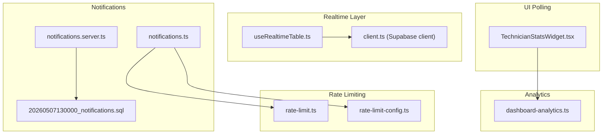
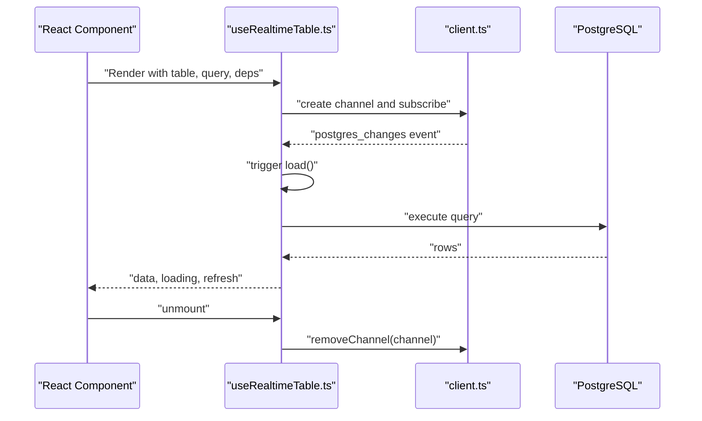
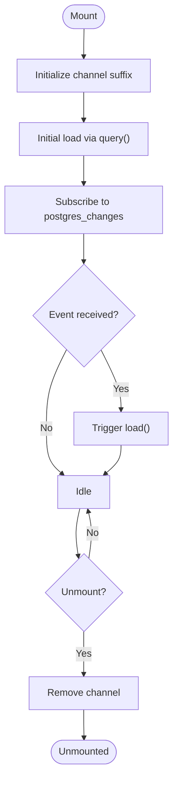
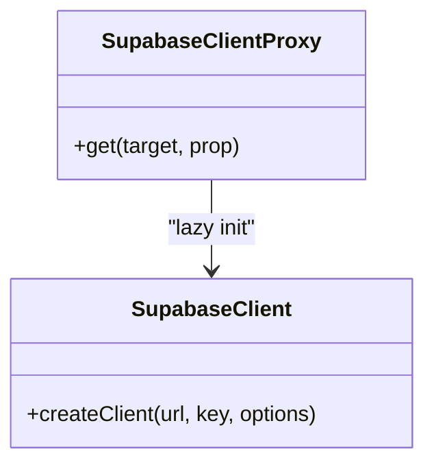
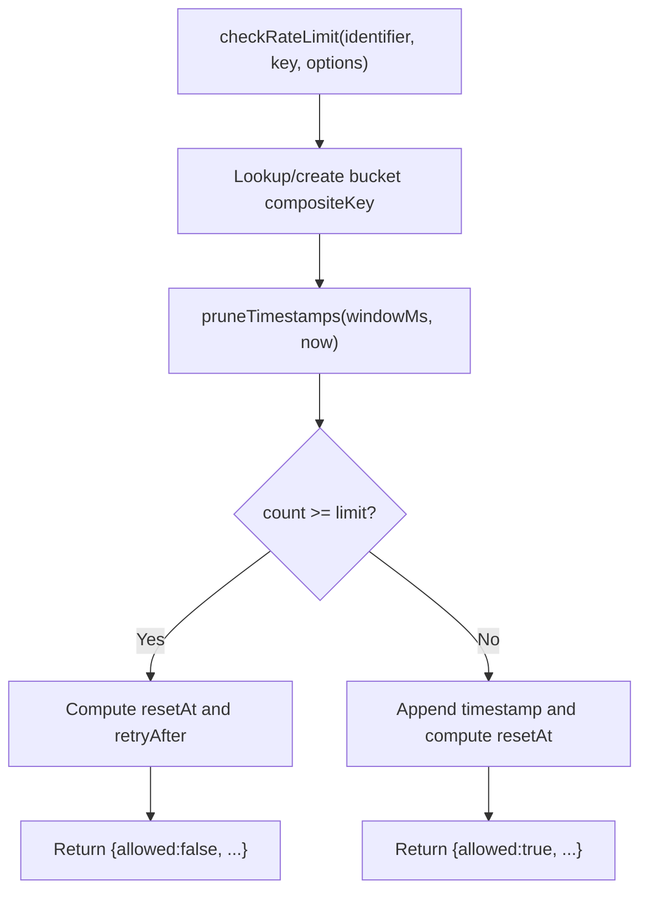
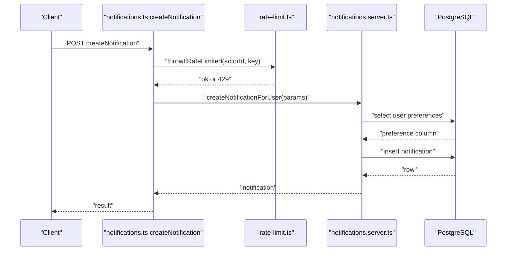
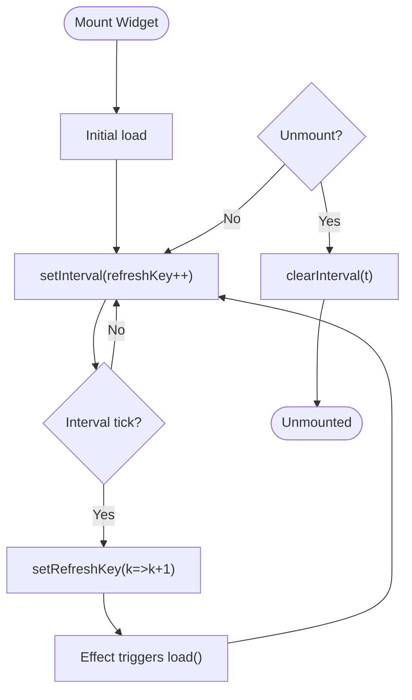
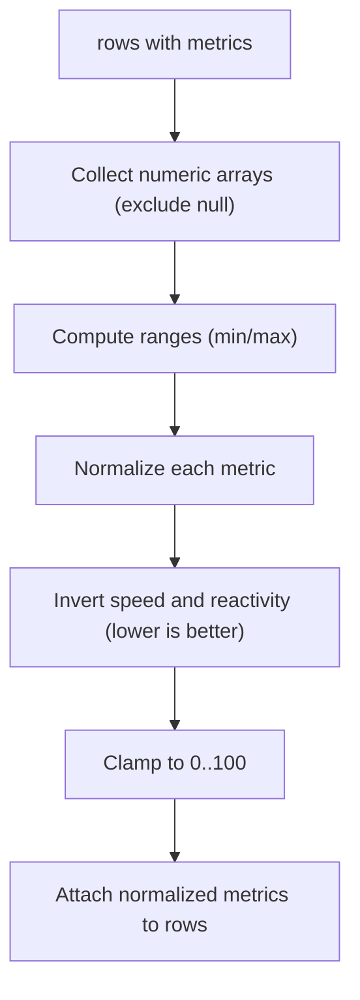
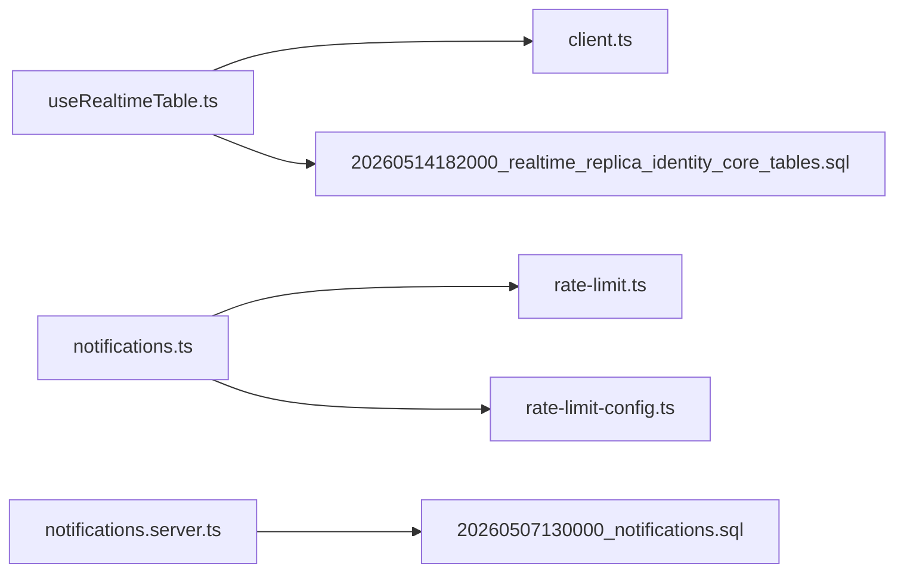

# Performance Optimization

<cite>
**Referenced Files in This Document**
- [useRealtimeTable.ts](file://src/hooks/useRealtimeTable.ts)
- [client.ts](file://src/integrations/supabase/client.ts)
- [rate-limit.ts](file://src/lib/rate-limit.ts)
- [rate-limit-config.ts](file://src/lib/rate-limit-config.ts)
- [notifications.ts](file://src/lib/notifications.ts)
- [notifications.server.ts](file://src/lib/notifications.server.ts)
- [20260514182000_realtime_replica_identity_core_tables.sql](file://supabase/migrations/20260514182000_realtime_replica_identity_core_tables.sql)
- [20260507130000_notifications.sql](file://supabase/migrations/20260507130000_notifications.sql)
- [TechnicianStatsWidget.tsx](file://src/components/dashboard/TechnicianStatsWidget.tsx)
- [dashboard-analytics.ts](file://src/lib/dashboard-analytics.ts)
</cite>

## Table of Contents
1. [Introduction](#introduction)
2. [Project Structure](#project-structure)
3. [Core Components](#core-components)
4. [Architecture Overview](#architecture-overview)
5. [Detailed Component Analysis](#detailed-component-analysis)
6. [Dependency Analysis](#dependency-analysis)
7. [Performance Considerations](#performance-considerations)
8. [Troubleshooting Guide](#troubleshooting-guide)
9. [Conclusion](#conclusion)
10. [Appendices](#appendices)

## Introduction
This document provides comprehensive guidance for optimizing real-time performance in the application. It focuses on subscription optimization, memory management, network efficiency, monitoring and profiling, rate limiting and notification throttling, caching and offline synchronization patterns, performance metrics collection, and best practices for lifecycle management and cleanup. The content is grounded in the repository’s real-time subscriptions, rate limiting, Supabase configuration, and UI polling patterns.

## Project Structure
The performance-critical parts of the system revolve around:
- Real-time subscriptions via a React hook that listens to Supabase Realtime channels
- Supabase client initialization and configuration
- Rate limiting utilities and presets
- Notification creation and cleanup policies
- UI polling strategies for periodic refresh
- Dashboard analytics normalization and normalization ranges

**Diagram sources**
- [useRealtimeTable.ts:1-50](file://src/hooks/useRealtimeTable.ts#L1-L50)
- [client.ts:1-41](file://src/integrations/supabase/client.ts#L1-L41)
- [rate-limit.ts:1-104](file://src/lib/rate-limit.ts#L1-L104)
- [rate-limit-config.ts:1-31](file://src/lib/rate-limit-config.ts#L1-L31)
- [notifications.ts:1-140](file://src/lib/notifications.ts#L1-L140)
- [notifications.server.ts:1-140](file://src/lib/notifications.server.ts#L1-L140)
- [20260507130000_notifications.sql:1-77](file://supabase/migrations/20260507130000_notifications.sql#L1-L77)
- [TechnicianStatsWidget.tsx:36-62](file://src/components/dashboard/TechnicianStatsWidget.tsx#L36-L62)
- [dashboard-analytics.ts:507-558](file://src/lib/dashboard-analytics.ts#L507-L558)

**Section sources**
- [useRealtimeTable.ts:1-50](file://src/hooks/useRealtimeTable.ts#L1-L50)
- [client.ts:1-41](file://src/integrations/supabase/client.ts#L1-L41)
- [rate-limit.ts:1-104](file://src/lib/rate-limit.ts#L1-L104)
- [rate-limit-config.ts:1-31](file://src/lib/rate-limit-config.ts#L1-L31)
- [notifications.ts:1-140](file://src/lib/notifications.ts#L1-L140)
- [notifications.server.ts:1-140](file://src/lib/notifications.server.ts#L1-L140)
- [20260507130000_notifications.sql:1-77](file://supabase/migrations/20260507130000_notifications.sql#L1-L77)
- [TechnicianStatsWidget.tsx:36-62](file://src/components/dashboard/TechnicianStatsWidget.tsx#L36-L62)
- [dashboard-analytics.ts:507-558](file://src/lib/dashboard-analytics.ts#L507-L558)

## Core Components
- Real-time subscription hook: Provides reactive data synchronization with Supabase Realtime and automatic cleanup.
- Supabase client: Centralized client initialization with environment-driven configuration and lazy proxy pattern.
- Rate limiting: In-memory sliding-window limiter with preset configurations and HTTP response builders.
- Notifications: Server functions for creating and listing notifications with rate limiting and database-backed cleanup.
- UI polling: Periodic refresh intervals for dashboard widgets.
- Analytics normalization: Normalization of metrics to 0–100 scale with range-aware calculations.

**Section sources**
- [useRealtimeTable.ts:10-49](file://src/hooks/useRealtimeTable.ts#L10-L49)
- [client.ts:5-41](file://src/integrations/supabase/client.ts#L5-L41)
- [rate-limit.ts:30-103](file://src/lib/rate-limit.ts#L30-L103)
- [rate-limit-config.ts:5-31](file://src/lib/rate-limit-config.ts#L5-L31)
- [notifications.ts:58-140](file://src/lib/notifications.ts#L58-L140)
- [notifications.server.ts:27-140](file://src/lib/notifications.server.ts#L27-L140)
- [TechnicianStatsWidget.tsx:36-44](file://src/components/dashboard/TechnicianStatsWidget.tsx#L36-L44)
- [dashboard-analytics.ts:507-558](file://src/lib/dashboard-analytics.ts#L507-L558)

## Architecture Overview
The real-time architecture integrates React hooks, Supabase Realtime, and server-side logic. Subscriptions are scoped per table and cleaned up on unmount. Rate limiting protects server functions, and database policies ensure timely cleanup of notifications.

**Diagram sources**
- [useRealtimeTable.ts:33-46](file://src/hooks/useRealtimeTable.ts#L33-L46)
- [client.ts:35-41](file://src/integrations/supabase/client.ts#L35-L41)

## Detailed Component Analysis

### Real-time Subscription Hook
- Purpose: Load initial dataset and keep it synchronized with Supabase Realtime changes for a given table.
- Lifecycle: Creates a unique channel suffix, subscribes to changes, triggers reloads, and removes the channel on unmount.
- Cleanup: Ensures channels are removed to prevent leaks.

**Diagram sources**
- [useRealtimeTable.ts:33-46](file://src/hooks/useRealtimeTable.ts#L33-L46)

**Section sources**
- [useRealtimeTable.ts:10-49](file://src/hooks/useRealtimeTable.ts#L10-L49)

### Supabase Client Initialization
- Environment-driven configuration with fallbacks for client and SSR contexts.
- Lazy proxy ensures single client instance and avoids repeated initialization overhead.

**Diagram sources**
- [client.ts:35-41](file://src/integrations/supabase/client.ts#L35-L41)

**Section sources**
- [client.ts:5-41](file://src/integrations/supabase/client.ts#L5-L41)

### Rate Limiting Implementation
- Sliding-window in-memory limiter keyed by identifier and limiter key.
- Automatic pruning of old timestamps and bucket eviction when limits are reached.
- HTTP response builder sets standard rate limit headers and a structured JSON body.

**Diagram sources**
- [rate-limit.ts:30-72](file://src/lib/rate-limit.ts#L30-L72)

**Section sources**
- [rate-limit.ts:1-104](file://src/lib/rate-limit.ts#L1-L104)
- [rate-limit-config.ts:5-31](file://src/lib/rate-limit-config.ts#L5-L31)

### Notifications: Creation, Throttling, and Cleanup
- Server function validates input, authenticates the actor, enforces rate limits, and inserts notifications.
- Preference checks allow disabling specific notification types per user.
- Database migration schedules cleanup of old notifications to manage storage growth.

**Diagram sources**
- [notifications.ts:58-66](file://src/lib/notifications.ts#L58-L66)
- [rate-limit.ts:92-103](file://src/lib/rate-limit.ts#L92-L103)
- [notifications.server.ts:27-67](file://src/lib/notifications.server.ts#L27-L67)
- [20260507130000_notifications.sql:55-76](file://supabase/migrations/20260507130000_notifications.sql#L55-L76)

**Section sources**
- [notifications.ts:58-140](file://src/lib/notifications.ts#L58-L140)
- [notifications.server.ts:27-140](file://src/lib/notifications.server.ts#L27-L140)
- [20260507130000_notifications.sql:1-77](file://supabase/migrations/20260507130000_notifications.sql#L1-L77)

### UI Polling Strategies
- Dashboard widgets use periodic intervals to refresh data, balancing freshness and cost.
- Interval is cleared on unmount to prevent leaks.

**Diagram sources**
- [TechnicianStatsWidget.tsx:36-44](file://src/components/dashboard/TechnicianStatsWidget.tsx#L36-L44)

**Section sources**
- [TechnicianStatsWidget.tsx:36-62](file://src/components/dashboard/TechnicianStatsWidget.tsx#L36-L62)

### Analytics Normalization
- Metrics are normalized to 0–100 using min/max ranges computed from non-null values.
- Special handling inverts “speed” and “reactivity” so lower values yield higher scores.

**Diagram sources**
- [dashboard-analytics.ts:507-558](file://src/lib/dashboard-analytics.ts#L507-L558)

**Section sources**
- [dashboard-analytics.ts:507-558](file://src/lib/dashboard-analytics.ts#L507-L558)

## Dependency Analysis
- Real-time hook depends on the Supabase client and uses a unique channel suffix per subscription.
- Notifications rely on rate limiting presets and server-side logic to enforce constraints.
- Database migrations enable Realtime publication for core tables and schedule cleanup jobs for notifications.

**Diagram sources**
- [useRealtimeTable.ts:3-4](file://src/hooks/useRealtimeTable.ts#L3-L4)
- [client.ts:22-28](file://src/integrations/supabase/client.ts#L22-L28)
- [notifications.ts:3-4](file://src/lib/notifications.ts#L3-L4)
- [rate-limit.ts:1-2](file://src/lib/rate-limit.ts#L1-L2)
- [rate-limit-config.ts:1-3](file://src/lib/rate-limit-config.ts#L1-L3)
- [notifications.server.ts:1](file://src/lib/notifications.server.ts#L1)
- [20260507130000_notifications.sql:39-53](file://supabase/migrations/20260507130000_notifications.sql#L39-L53)
- [20260514182000_realtime_replica_identity_core_tables.sql:9-30](file://supabase/migrations/20260514182000_realtime_replica_identity_core_tables.sql#L9-L30)

**Section sources**
- [useRealtimeTable.ts:3-4](file://src/hooks/useRealtimeTable.ts#L3-L4)
- [client.ts:22-28](file://src/integrations/supabase/client.ts#L22-L28)
- [notifications.ts:3-4](file://src/lib/notifications.ts#L3-L4)
- [rate-limit.ts:1-2](file://src/lib/rate-limit.ts#L1-L2)
- [rate-limit-config.ts:1-3](file://src/lib/rate-limit-config.ts#L1-L3)
- [notifications.server.ts:1](file://src/lib/notifications.server.ts#L1)
- [20260507130000_notifications.sql:39-53](file://supabase/migrations/20260507130000_notifications.sql#L39-L53)
- [20260514182000_realtime_replica_identity_core_tables.sql:9-30](file://supabase/migrations/20260514182000_realtime_replica_identity_core_tables.sql#L9-L30)

## Performance Considerations
- Subscription optimization
  - Selective listening: Subscribe only to tables and events needed for the current view. The hook supports wildcard events; narrow to specific events when possible to reduce unnecessary reloads.
  - Batch updates: Coalesce frequent updates by debouncing or grouping UI updates after multiple Realtime events.
  - Efficient polling: Prefer Realtime subscriptions over polling where feasible; if polling is necessary, increase intervals and avoid overlapping requests.

- Memory management
  - Always clean up Realtime channels on component unmount to prevent memory leaks.
  - Avoid retaining large datasets unnecessarily; prefer paginated queries and incremental updates.

- Network optimization
  - Connection pooling: Reuse a single Supabase client instance via the provided proxy pattern to minimize connection churn.
  - Bandwidth management: Narrow queries to required columns, filter early, and avoid large payloads in Realtime events by using replica identity and targeted selects.

- Monitoring and profiling
  - Measure render times and update frequency for components using Realtime subscriptions.
  - Track rate limit hits and retries to identify hotspots.
  - Monitor database query durations and Realtime event throughput.

- Rate limiting and notification throttling
  - Enforce rate limits on high-frequency operations (e.g., creating notifications).
  - Use presets aligned with security and performance goals; consider offloading to distributed stores for multi-instance deployments.

- Caching and offline synchronization
  - Cache recent snapshots of frequently accessed views; invalidate on Realtime events.
  - For offline scenarios, queue local writes and reconcile with the server upon reconnection.

- Metrics collection
  - Normalize and cache derived metrics for dashboards to reduce computation on each render.
  - Track normalization ranges to avoid recomputing min/max unnecessarily.

**Section sources**
- [useRealtimeTable.ts:36-46](file://src/hooks/useRealtimeTable.ts#L36-L46)
- [client.ts:35-41](file://src/integrations/supabase/client.ts#L35-L41)
- [rate-limit.ts:24-29](file://src/lib/rate-limit.ts#L24-L29)
- [notifications.ts:58-66](file://src/lib/notifications.ts#L58-L66)
- [dashboard-analytics.ts:507-558](file://src/lib/dashboard-analytics.ts#L507-L558)

## Troubleshooting Guide
- Realtime subscriptions not updating
  - Verify the channel suffix uniqueness and that the subscription is active.
  - Confirm database publication for the target table is enabled.

- Excessive reloads
  - Reduce wildcard event scope to specific events.
  - Debounce UI updates after Realtime events.

- Memory leaks
  - Ensure unmount handlers remove channels.
  - Avoid storing large intermediate datasets; prefer streaming or paginated results.

- Rate limit errors
  - Inspect Retry-After and X-RateLimit-* headers.
  - Adjust presets or distribute counters for multi-instance setups.

- Notifications not appearing
  - Check user preferences and database cleanup policies.
  - Validate server function inputs and authentication tokens.

**Section sources**
- [useRealtimeTable.ts:43-45](file://src/hooks/useRealtimeTable.ts#L43-L45)
- [20260514182000_realtime_replica_identity_core_tables.sql:13-30](file://supabase/migrations/20260514182000_realtime_replica_identity_core_tables.sql#L13-L30)
- [rate-limit.ts:74-90](file://src/lib/rate-limit.ts#L74-L90)
- [notifications.server.ts:27-67](file://src/lib/notifications.server.ts#L27-L67)
- [20260507130000_notifications.sql:55-76](file://supabase/migrations/20260507130000_notifications.sql#L55-L76)

## Conclusion
By combining targeted Realtime subscriptions, disciplined lifecycle management, rate limiting, and thoughtful UI polling, the application achieves responsive, scalable real-time experiences. Complementary database-level cleanup and normalization strategies further improve performance and maintainability.

## Appendices
- Best practices summary
  - Keep subscriptions minimal and scoped.
  - Clean up resources on unmount.
  - Use rate limiting for high-frequency operations.
  - Normalize metrics once and reuse.
  - Reuse a single Supabase client instance.
  - Prefer Realtime over polling; if polling is used, tune intervals and avoid overlap.