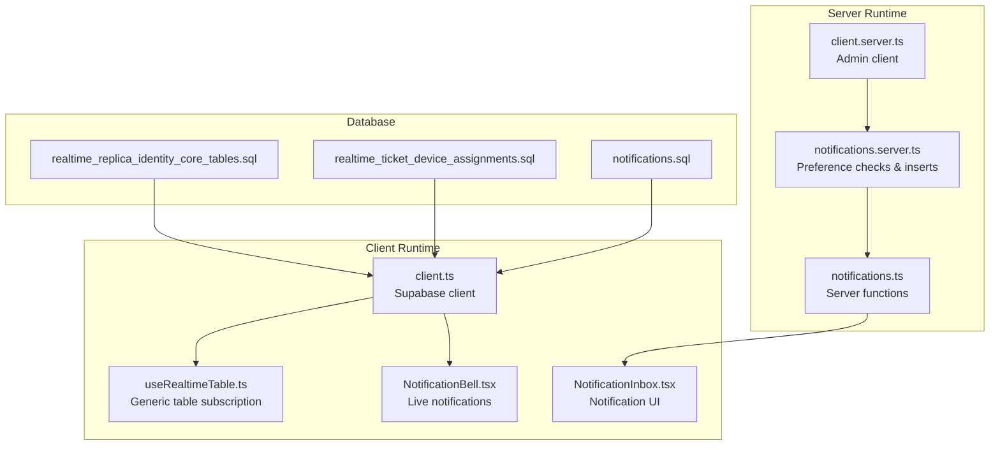
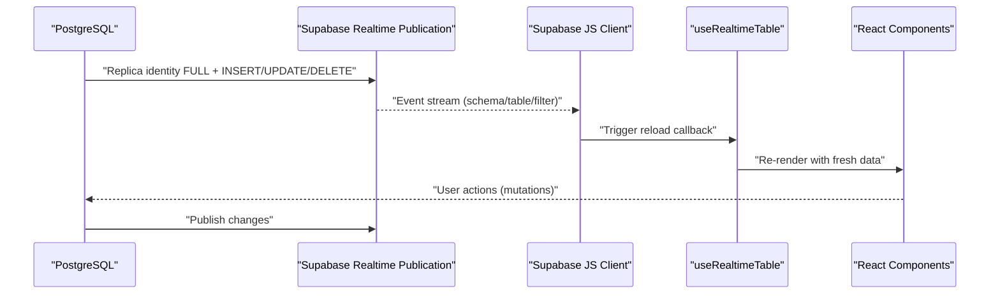
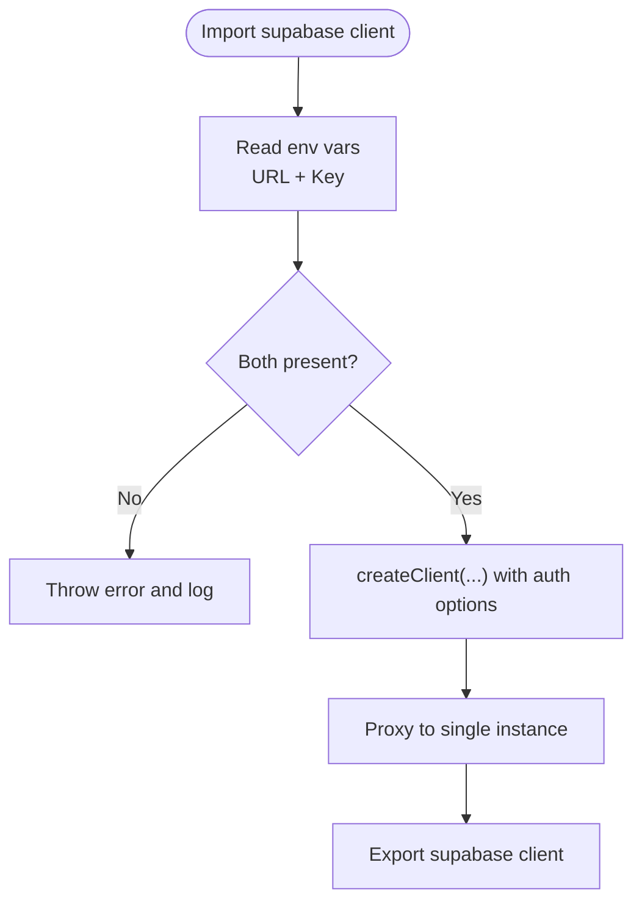
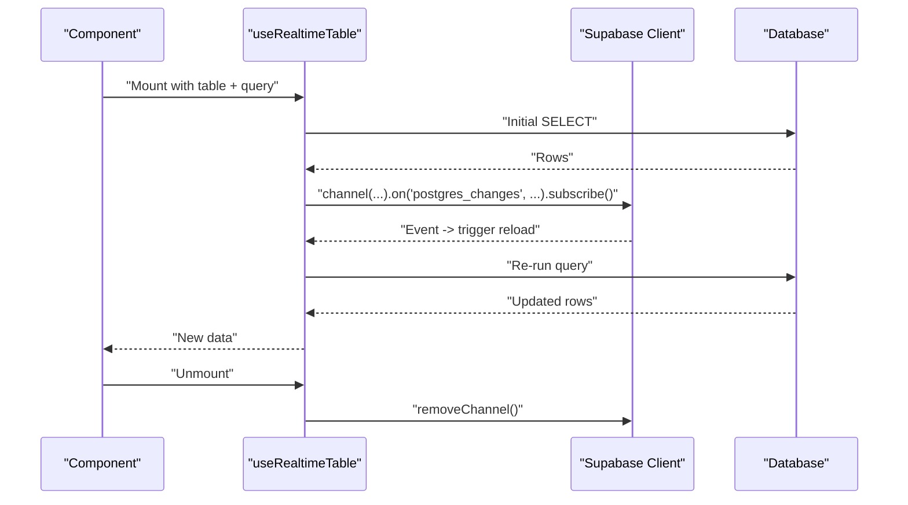
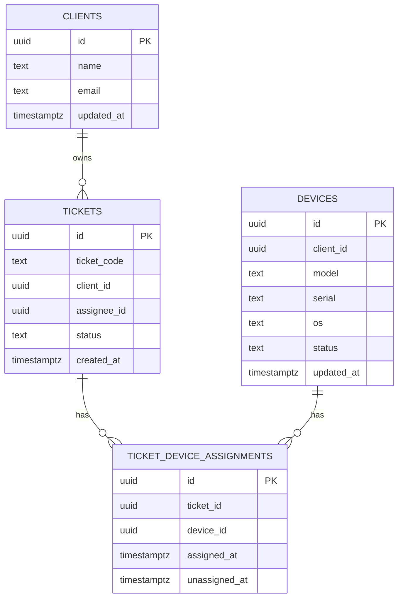
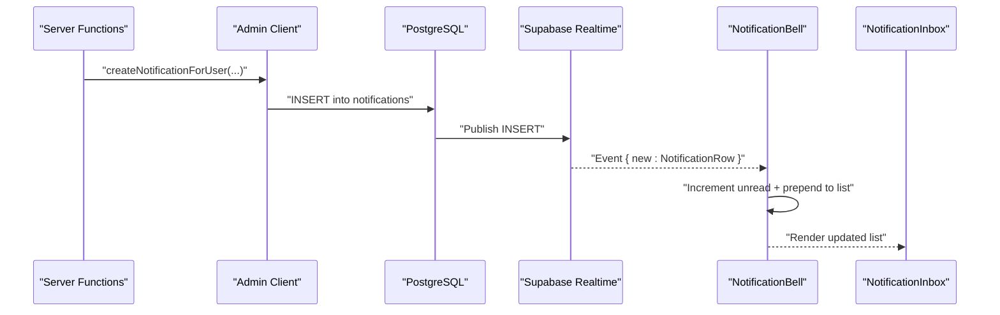
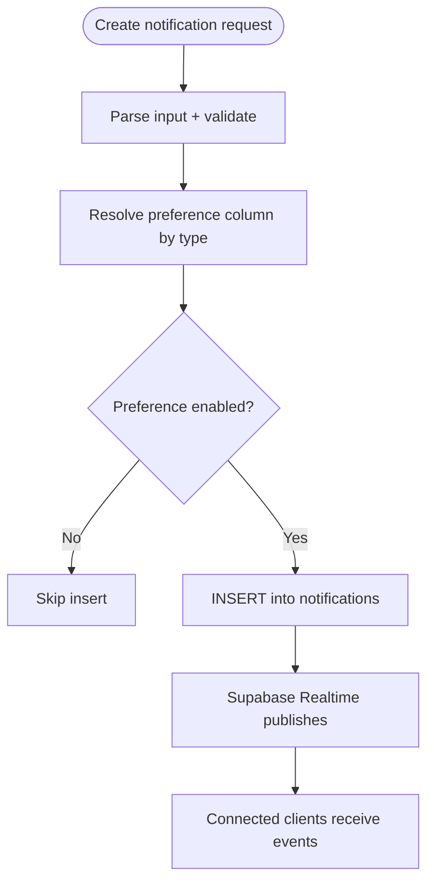
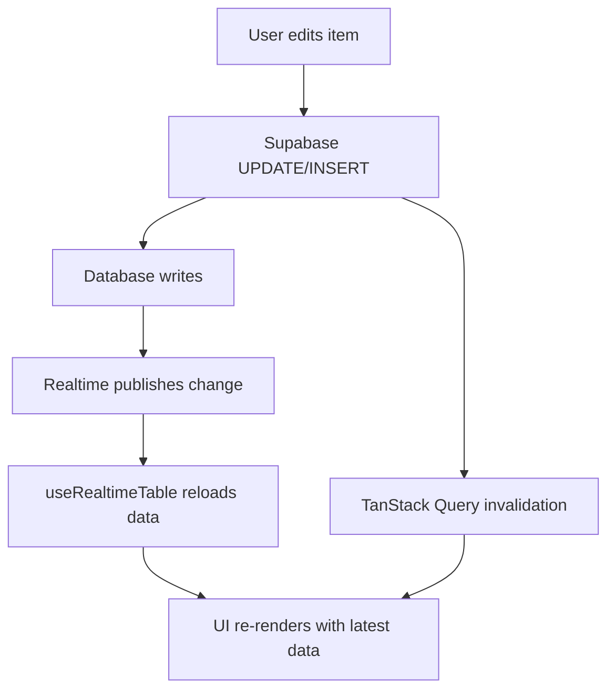
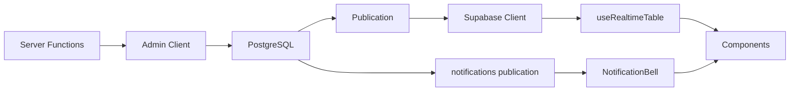

# Real-time Features

<cite>
**Referenced Files in This Document**
- [client.ts](file://src/integrations/supabase/client.ts)
- [client.server.ts](file://src/integrations/supabase/client.server.ts)
- [useRealtimeTable.ts](file://src/hooks/useRealtimeTable.ts)
- [notifications.ts](file://src/lib/notifications.ts)
- [notifications.server.ts](file://src/lib/notifications.server.ts)
- [NotificationBell.tsx](file://src/components/layout/NotificationBell.tsx)
- [NotificationInbox.tsx](file://src/components/layout/NotificationInbox.tsx)
- [tickets.ts](file://src/lib/queries/tickets.ts)
- [clients.ts](file://src/lib/queries/clients.ts)
- [realtime_replica_identity_core_tables.sql](file://supabase/migrations/20260514182000_realtime_replica_identity_core_tables.sql)
- [realtime_ticket_device_assignments.sql](file://supabase/migrations/20260515120000_realtime_ticket_device_assignments.sql)
- [notifications.sql](file://supabase/migrations/20260507130000_notifications.sql)
</cite>

## Table of Contents
1. [Introduction](#introduction)
2. [Project Structure](#project-structure)
3. [Core Components](#core-components)
4. [Architecture Overview](#architecture-overview)
5. [Detailed Component Analysis](#detailed-component-analysis)
6. [Dependency Analysis](#dependency-analysis)
7. [Performance Considerations](#performance-considerations)
8. [Troubleshooting Guide](#troubleshooting-guide)
9. [Conclusion](#conclusion)

## Introduction
This document explains the real-time features implemented in the project, focusing on live data updates across tickets, devices, and inventory, the in-app notification system, and the underlying Supabase Realtime infrastructure. It covers how real-time subscriptions are established, how database triggers and publications support live updates, and how the client handles optimistic updates and conflict resolution. It also documents notification preferences, delivery mechanisms, and operational guidance for reliability and performance.

## Project Structure
The real-time system spans three layers:
- Supabase Realtime configuration in database migrations
- Supabase client initialization and server-side admin client
- React hooks and UI components that subscribe to live events and render updates

**Diagram sources**
- [client.ts:1-41](file://src/integrations/supabase/client.ts#L1-L41)
- [client.server.ts:1-42](file://src/integrations/supabase/client.server.ts#L1-L42)
- [useRealtimeTable.ts:1-50](file://src/hooks/useRealtimeTable.ts#L1-L50)
- [NotificationBell.tsx:30-75](file://src/components/layout/NotificationBell.tsx#L30-L75)
- [NotificationInbox.tsx:1-107](file://src/components/layout/NotificationInbox.tsx#L1-L107)
- [notifications.ts:1-140](file://src/lib/notifications.ts#L1-L140)
- [notifications.server.ts:1-139](file://src/lib/notifications.server.ts#L1-L139)
- [realtime_replica_identity_core_tables.sql:1-30](file://supabase/migrations/20260514182000_realtime_replica_identity_core_tables.sql#L1-L30)
- [realtime_ticket_device_assignments.sql:1-21](file://supabase/migrations/20260515120000_realtime_ticket_device_assignments.sql#L1-L21)
- [notifications.sql:1-53](file://supabase/migrations/20260507130000_notifications.sql#L1-L53)

**Section sources**
- [client.ts:1-41](file://src/integrations/supabase/client.ts#L1-L41)
- [client.server.ts:1-42](file://src/integrations/supabase/client.server.ts#L1-L42)
- [useRealtimeTable.ts:1-50](file://src/hooks/useRealtimeTable.ts#L1-L50)
- [NotificationBell.tsx:30-75](file://src/components/layout/NotificationBell.tsx#L30-L75)
- [NotificationInbox.tsx:1-107](file://src/components/layout/NotificationInbox.tsx#L1-L107)
- [notifications.ts:1-140](file://src/lib/notifications.ts#L1-L140)
- [notifications.server.ts:1-139](file://src/lib/notifications.server.ts#L1-L139)
- [realtime_replica_identity_core_tables.sql:1-30](file://supabase/migrations/20260514182000_realtime_replica_identity_core_tables.sql#L1-L30)
- [realtime_ticket_device_assignments.sql:1-21](file://supabase/migrations/20260515120000_realtime_ticket_device_assignments.sql#L1-L21)
- [notifications.sql:1-53](file://supabase/migrations/20260507130000_notifications.sql#L1-L53)

## Core Components
- Supabase client initialization with environment-driven configuration and automatic lazy creation
- Generic real-time subscription hook for any table
- Notification system with server-side preference enforcement and in-app real-time updates
- Database migrations enabling Supabase Realtime publication for core tables and notifications

Key capabilities:
- Live updates for tickets, devices, clients, activity log, and ticket-device assignments
- In-app notification bell with unread counters and real-time insertion handling
- Preference-aware notification creation via server functions

**Section sources**
- [client.ts:1-41](file://src/integrations/supabase/client.ts#L1-L41)
- [useRealtimeTable.ts:1-50](file://src/hooks/useRealtimeTable.ts#L1-L50)
- [notifications.ts:1-140](file://src/lib/notifications.ts#L1-L140)
- [notifications.server.ts:1-139](file://src/lib/notifications.server.ts#L1-L139)
- [notifications.sql:1-53](file://supabase/migrations/20260507130000_notifications.sql#L1-L53)

## Architecture Overview
The real-time architecture combines database-level publication, client-side subscriptions, and UI-driven optimistic updates.

**Diagram sources**
- [realtime_replica_identity_core_tables.sql:1-30](file://supabase/migrations/20260514182000_realtime_replica_identity_core_tables.sql#L1-L30)
- [useRealtimeTable.ts:10-49](file://src/hooks/useRealtimeTable.ts#L10-L49)
- [client.ts:1-41](file://src/integrations/supabase/client.ts#L1-L41)

## Detailed Component Analysis

### Supabase Realtime Client Initialization
- Client-side client reads environment variables and lazily creates a singleton client
- Server-side admin client uses the service role key for privileged operations
- Both clients are proxied to avoid re-initialization and ensure consistent behavior

**Diagram sources**
- [client.ts:5-41](file://src/integrations/supabase/client.ts#L5-L41)
- [client.server.ts:8-42](file://src/integrations/supabase/client.server.ts#L8-L42)

**Section sources**
- [client.ts:1-41](file://src/integrations/supabase/client.ts#L1-L41)
- [client.server.ts:1-42](file://src/integrations/supabase/client.server.ts#L1-L42)

### Generic Real-time Subscription Hook
- Loads initial data via a provided query function
- Subscribes to Supabase Realtime events for a given table
- Re-fetches data on any change and cleans up the channel on unmount
- Uses a randomized suffix to avoid channel collisions

**Diagram sources**
- [useRealtimeTable.ts:10-49](file://src/hooks/useRealtimeTable.ts#L10-L49)

**Section sources**
- [useRealtimeTable.ts:1-50](file://src/hooks/useRealtimeTable.ts#L1-L50)

### Live Data Updates for Tickets, Devices, and Inventory
- Database migrations set replica identity to FULL for core tables and add them to the realtime publication
- Ticket-device assignment history table is similarly configured for dashboard KPI refresh scenarios
- Components can leverage the generic hook to subscribe to changes on these tables

**Diagram sources**
- [realtime_replica_identity_core_tables.sql:4-7](file://supabase/migrations/20260514182000_realtime_replica_identity_core_tables.sql#L4-L7)
- [realtime_ticket_device_assignments.sql:2](file://supabase/migrations/20260515120000_realtime_ticket_device_assignments.sql#L2)

**Section sources**
- [realtime_replica_identity_core_tables.sql:1-30](file://supabase/migrations/20260514182000_realtime_replica_identity_core_tables.sql#L1-L30)
- [realtime_ticket_device_assignments.sql:1-21](file://supabase/migrations/20260515120000_realtime_ticket_device_assignments.sql#L1-L21)
- [tickets.ts:148-172](file://src/lib/queries/tickets.ts#L148-L172)
- [clients.ts:232-249](file://src/lib/queries/clients.ts#L232-L249)

### Notification System: In-app Real-time Updates
- Notification creation respects per-user preferences stored in user profiles
- Real-time subscription listens for INSERT events on the notifications table filtered by user_id
- The bell component updates unread counts and previews the latest notifications

**Diagram sources**
- [notifications.ts:58-66](file://src/lib/notifications.ts#L58-L66)
- [notifications.server.ts:27-66](file://src/lib/notifications.server.ts#L27-L66)
- [notifications.sql:39-52](file://supabase/migrations/20260507130000_notifications.sql#L39-L52)
- [NotificationBell.tsx:54-75](file://src/components/layout/NotificationBell.tsx#L54-L75)
- [NotificationInbox.tsx:13-88](file://src/components/layout/NotificationInbox.tsx#L13-L88)

**Section sources**
- [notifications.ts:1-140](file://src/lib/notifications.ts#L1-L140)
- [notifications.server.ts:1-139](file://src/lib/notifications.server.ts#L1-L139)
- [NotificationBell.tsx:30-75](file://src/components/layout/NotificationBell.tsx#L30-L75)
- [NotificationInbox.tsx:1-107](file://src/components/layout/NotificationInbox.tsx#L1-L107)
- [notifications.sql:1-53](file://supabase/migrations/20260507130000_notifications.sql#L1-L53)

### Notification Preferences and Delivery Mechanisms
- Per-type preference columns are mapped from notification types to user profile columns
- Server-side preference checks skip creation when a preference is disabled
- Delivery is immediate via Supabase Realtime for in-app notifications; email alerts are not shown in the referenced code paths

**Diagram sources**
- [notifications.server.ts:16-25](file://src/lib/notifications.server.ts#L16-L25)
- [notifications.server.ts:27-66](file://src/lib/notifications.server.ts#L27-L66)
- [notifications.sql:39-52](file://supabase/migrations/20260507130000_notifications.sql#L39-L52)

**Section sources**
- [notifications.server.ts:1-139](file://src/lib/notifications.server.ts#L1-L139)
- [notifications.ts:1-140](file://src/lib/notifications.ts#L1-L140)
- [notifications.sql:1-53](file://supabase/migrations/20260507130000_notifications.sql#L1-L53)

### Conflict Resolution and Optimistic Updates
- The generic hook performs full re-fetches on any change, ensuring eventual consistency
- For mutations, components invalidate TanStack Query caches to align UI state with the database
- No explicit client-side conflict resolution is implemented; optimistic UI updates should be paired with cache invalidation

**Diagram sources**
- [useRealtimeTable.ts:20-49](file://src/hooks/useRealtimeTable.ts#L20-L49)
- [tickets.ts:215-242](file://src/lib/queries/tickets.ts#L215-L242)

**Section sources**
- [useRealtimeTable.ts:1-50](file://src/hooks/useRealtimeTable.ts#L1-L50)
- [tickets.ts:215-242](file://src/lib/queries/tickets.ts#L215-L242)

## Dependency Analysis
- Real-time subscriptions depend on:
  - Database replica identity FULL and publication presence
  - Supabase client initialization and channel lifecycle
  - UI components subscribing to channel events
- Notification delivery depends on:
  - Preference checks in server functions
  - Supabase Realtime publication for the notifications table

**Diagram sources**
- [realtime_replica_identity_core_tables.sql:9-30](file://supabase/migrations/20260514182000_realtime_replica_identity_core_tables.sql#L9-L30)
- [notifications.sql:39-52](file://supabase/migrations/20260507130000_notifications.sql#L39-L52)
- [useRealtimeTable.ts:36-46](file://src/hooks/useRealtimeTable.ts#L36-L46)
- [NotificationBell.tsx:54-75](file://src/components/layout/NotificationBell.tsx#L54-L75)

**Section sources**
- [realtime_replica_identity_core_tables.sql:1-30](file://supabase/migrations/20260514182000_realtime_replica_identity_core_tables.sql#L1-L30)
- [notifications.sql:1-53](file://supabase/migrations/20260507130000_notifications.sql#L1-L53)
- [useRealtimeTable.ts:1-50](file://src/hooks/useRealtimeTable.ts#L1-L50)
- [NotificationBell.tsx:30-75](file://src/components/layout/NotificationBell.tsx#L30-L75)

## Performance Considerations
- Keep subscriptions scoped:
  - Filter by user_id or entity identifiers to minimize event volume
  - Use pagination and targeted queries to reduce payload sizes
- Avoid unnecessary channels:
  - Reuse the generic hook and avoid creating multiple channels for the same table
- Optimize queries:
  - Select only required columns
  - Apply appropriate ORDER and LIMIT clauses
- Minimize UI thrash:
  - Debounce frequent updates if building custom handlers around raw events
  - Prefer cache invalidation over manual reconciliation for complex lists

## Troubleshooting Guide
Common issues and resolutions:
- Connection drops or reconnection
  - Ensure the Supabase client is initialized with environment variables
  - Verify the realtime publication exists and includes target tables
  - Confirm the channel is subscribed and not removed prematurely
- Notification delivery failures
  - Check preference columns in user profiles; missing columns fall back to enabled
  - Validate that the notifications table is part of the realtime publication
- Performance degradation
  - Reduce subscription scope (filter by user/entity)
  - Limit list sizes and use pagination
  - Avoid overly broad table-wide subscriptions

Operational checks:
- Environment variables for client and admin clients
- Publication presence for target tables
- Channel lifecycle in components (subscribe/unsubscribe)
- Cache invalidation after mutations

**Section sources**
- [client.ts:12-20](file://src/integrations/supabase/client.ts#L12-L20)
- [client.server.ts:12-20](file://src/integrations/supabase/client.server.ts#L12-L20)
- [notifications.server.ts:31-46](file://src/lib/notifications.server.ts#L31-L46)
- [notifications.sql:39-52](file://supabase/migrations/20260507130000_notifications.sql#L39-L52)
- [NotificationBell.tsx:54-75](file://src/components/layout/NotificationBell.tsx#L54-L75)

## Conclusion
The real-time system leverages Supabase Realtime with FULL replica identity and targeted publications to deliver live updates across tickets, devices, clients, and notifications. The generic subscription hook ensures consistent, low-friction real-time behavior, while server-side preference enforcement guarantees that users only receive notifications they opted-in to. By scoping subscriptions, optimizing queries, and relying on cache invalidation, teams can maintain responsive, reliable real-time experiences.