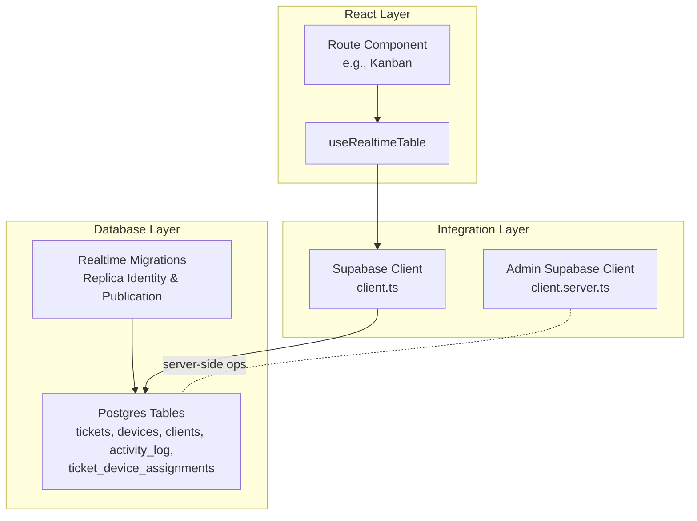
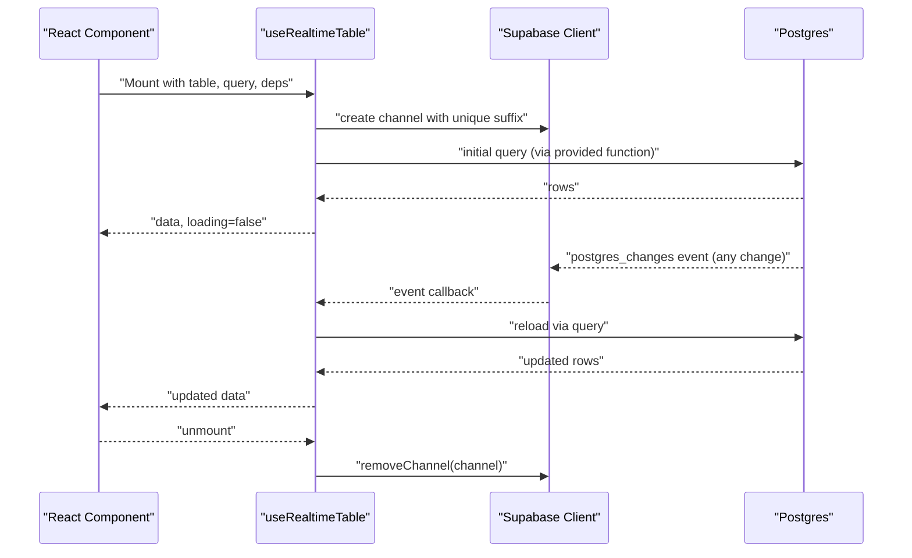
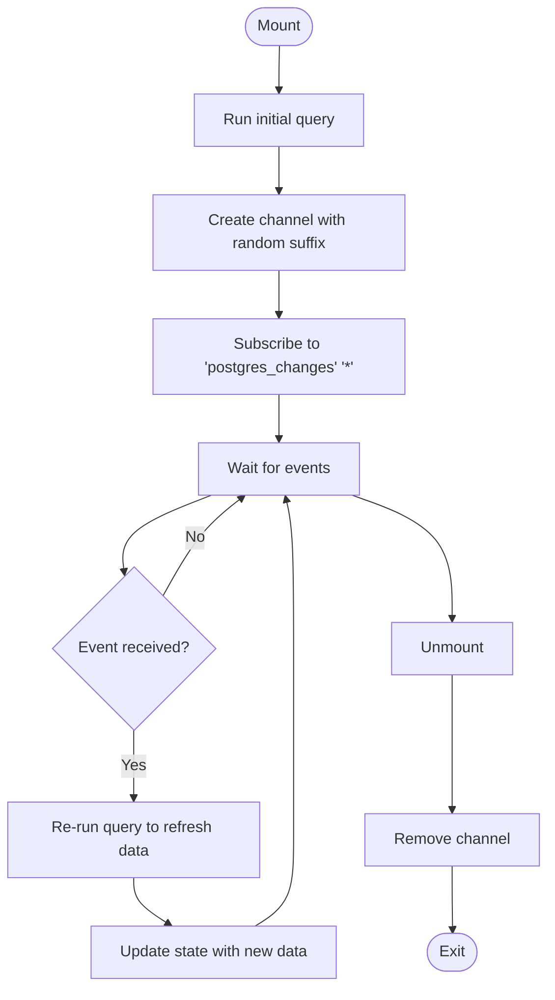
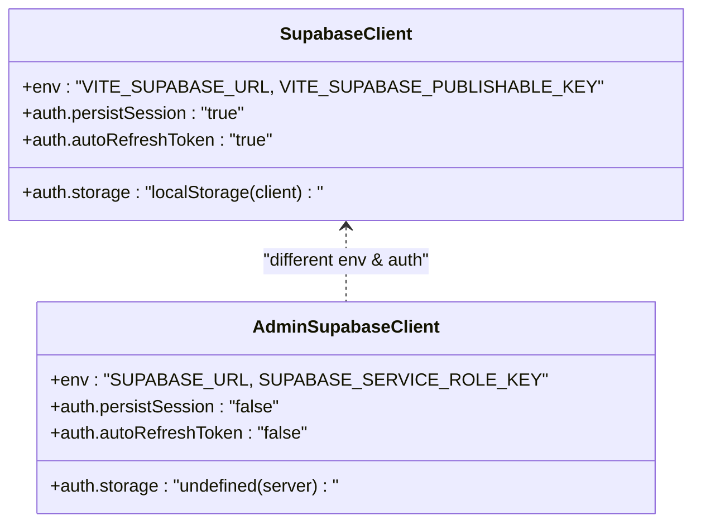
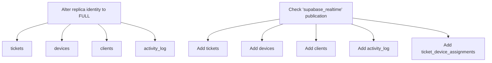
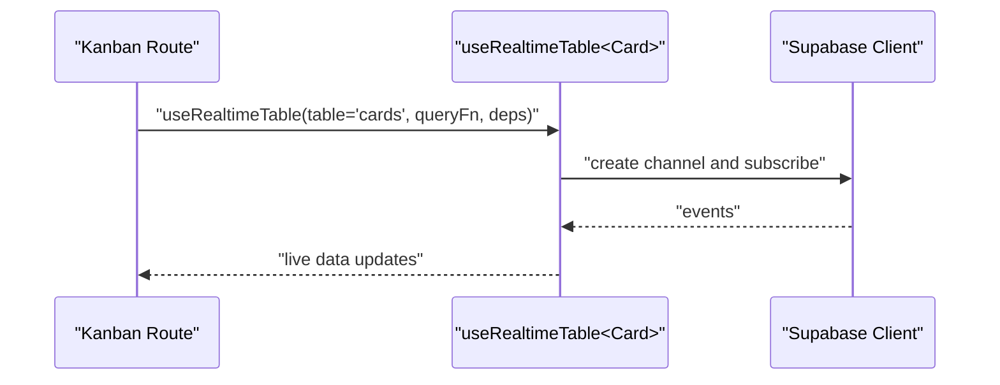
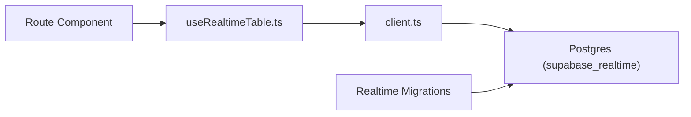

# Real-time Subscriptions

<cite>
**Referenced Files in This Document**
- [useRealtimeTable.ts](file://src/hooks/useRealtimeTable.ts)
- [client.ts](file://src/integrations/supabase/client.ts)
- [client.server.ts](file://src/integrations/supabase/client.server.ts)
- [20260514182000_realtime_replica_identity_core_tables.sql](file://supabase/migrations/20260514182000_realtime_replica_identity_core_tables.sql)
- [20260515120000_realtime_ticket_device_assignments.sql](file://supabase/migrations/20260515120000_realtime_ticket_device_assignments.sql)
- [kanban.tsx](file://src/routes/_app/kanban.tsx)
- [tickets.ts](file://src/lib/tickets.ts)
- [device-status.ts](file://src/lib/device-status.ts)
</cite>

## Table of Contents
1. [Introduction](#introduction)
2. [Project Structure](#project-structure)
3. [Core Components](#core-components)
4. [Architecture Overview](#architecture-overview)
5. [Detailed Component Analysis](#detailed-component-analysis)
6. [Dependency Analysis](#dependency-analysis)
7. [Performance Considerations](#performance-considerations)
8. [Troubleshooting Guide](#troubleshooting-guide)
9. [Conclusion](#conclusion)
10. [Appendices](#appendices)

## Introduction
This document explains the real-time subscription system built on Supabase’s Postgres change notifications. It focuses on the useRealtimeTable hook pattern that provides live synchronization of data for tickets, devices, and inventory-related entities. The guide covers subscription lifecycle management, connection handling, automatic reconnection strategies, configuration options, integration with React components, optimistic update patterns, and performance considerations. It also includes troubleshooting guidance for common real-time connectivity issues.

## Project Structure
The real-time system is composed of:
- A reusable React hook that manages a Supabase Realtime channel per table
- Supabase client initialization with environment-driven configuration
- Database migrations enabling rich replication payloads and publication of target tables
- Example usage in a Kanban route to keep lists synchronized in real time

**Diagram sources**
- [useRealtimeTable.ts:10-49](file://src/hooks/useRealtimeTable.ts#L10-L49)
- [client.ts:5-40](file://src/integrations/supabase/client.ts#L5-L40)
- [client.server.ts:8-41](file://src/integrations/supabase/client.server.ts#L8-L41)
- [20260514182000_realtime_replica_identity_core_tables.sql:1-31](file://supabase/migrations/20260514182000_realtime_replica_identity_core_tables.sql#L1-L31)
- [20260515120000_realtime_ticket_device_assignments.sql:1-21](file://supabase/migrations/20260515120000_realtime_ticket_device_assignments.sql#L1-L21)

**Section sources**
- [useRealtimeTable.ts:1-50](file://src/hooks/useRealtimeTable.ts#L1-L50)
- [client.ts:1-41](file://src/integrations/supabase/client.ts#L1-L41)
- [client.server.ts:1-42](file://src/integrations/supabase/client.server.ts#L1-L42)
- [20260514182000_realtime_replica_identity_core_tables.sql:1-31](file://supabase/migrations/20260514182000_realtime_replica_identity_core_tables.sql#L1-L31)
- [20260515120000_realtime_ticket_device_assignments.sql:1-21](file://supabase/migrations/20260515120000_realtime_ticket_device_assignments.sql#L1-L21)

## Core Components
- useRealtimeTable<T>: A React hook that:
  - Fetches initial data via a caller-provided async query
  - Subscribes to Supabase Realtime channel events for a given table
  - Refreshes local state on any matching change
  - Automatically cleans up channels on unmount
- Supabase Client Initialization:
  - Client-side: environment-driven creation with local token persistence
  - Server-side: admin client with service role key for privileged operations
- Database Migrations:
  - Configure replica identity and publication for tables to support rich change payloads and visibility in Supabase Realtime

Key behaviors:
- Channel naming includes a random suffix to avoid collisions
- Subscriptions listen for all events (“*”) on the specified table under the “public” schema
- On any change, the hook triggers a reload of the dataset via the provided query

**Section sources**
- [useRealtimeTable.ts:10-49](file://src/hooks/useRealtimeTable.ts#L10-L49)
- [client.ts:5-40](file://src/integrations/supabase/client.ts#L5-L40)
- [client.server.ts:8-41](file://src/integrations/supabase/client.server.ts#L8-L41)
- [20260514182000_realtime_replica_identity_core_tables.sql:4-7](file://supabase/migrations/20260514182000_realtime_replica_identity_core_tables.sql#L4-L7)
- [20260514182000_realtime_replica_identity_core_tables.sql:13-29](file://supabase/migrations/20260514182000_realtime_replica_identity_core_tables.sql#L13-L29)
- [20260515120000_realtime_ticket_device_assignments.sql:2](file://supabase/migrations/20260515120000_realtime_ticket_device_assignments.sql#L2)

## Architecture Overview
The real-time pipeline connects React components to Postgres via Supabase Realtime. The diagram below maps the actual code paths and data flow.

**Diagram sources**
- [useRealtimeTable.ts:33-46](file://src/hooks/useRealtimeTable.ts#L33-L46)
- [useRealtimeTable.ts:20-29](file://src/hooks/useRealtimeTable.ts#L20-L29)
- [client.ts:35-40](file://src/integrations/supabase/client.ts#L35-L40)

## Detailed Component Analysis

### useRealtimeTable Hook Pattern
- Purpose: Provide live, reactive data for any table by combining an initial query with Supabase Realtime event listening
- Lifecycle:
  - Mount: runs initial load, creates a channel, subscribes to “postgres_changes”
  - Unmount: removes the channel to prevent leaks
- Event handling:
  - Listens for all events (“*”) on the specified table in schema “public”
  - Triggers a refresh by re-executing the provided query
- Dependencies:
  - Accepts a dependency list so callers can control when the subscription reloads
- Channel naming:
  - Uses a random suffix to ensure uniqueness and avoid conflicts

**Diagram sources**
- [useRealtimeTable.ts:33-46](file://src/hooks/useRealtimeTable.ts#L33-L46)
- [useRealtimeTable.ts:20-29](file://src/hooks/useRealtimeTable.ts#L20-L29)

**Section sources**
- [useRealtimeTable.ts:10-49](file://src/hooks/useRealtimeTable.ts#L10-L49)

### Supabase Client Configuration
- Client-side:
  - Reads Vite-compatible environment variables for Supabase URL and publishable key
  - Initializes a singleton proxy client with local token persistence and auto-refresh
- Server-side:
  - Uses a dedicated admin client with service role key for privileged operations
  - Disables token persistence and auto-refresh for server contexts

**Diagram sources**
- [client.ts:5-29](file://src/integrations/supabase/client.ts#L5-L29)
- [client.server.ts:8-29](file://src/integrations/supabase/client.server.ts#L8-L29)

**Section sources**
- [client.ts:5-40](file://src/integrations/supabase/client.ts#L5-L40)
- [client.server.ts:8-41](file://src/integrations/supabase/client.server.ts#L8-L41)

### Database Realtime Setup
- Replica identity:
  - Ensures full row images are available for change events, especially important under RLS policies
- Publication:
  - Adds target tables to the “supabase_realtime” publication so they are streamed to clients
- Scope:
  - Core tables: tickets, devices, clients, activity_log
  - Additional table: ticket_device_assignments for assignment-related KPIs

**Diagram sources**
- [20260514182000_realtime_replica_identity_core_tables.sql:4-7](file://supabase/migrations/20260514182000_realtime_replica_identity_core_tables.sql#L4-L7)
- [20260514182000_realtime_replica_identity_core_tables.sql:13-29](file://supabase/migrations/20260514182000_realtime_replica_identity_core_tables.sql#L13-L29)
- [20260515120000_realtime_ticket_device_assignments.sql:4-19](file://supabase/migrations/20260515120000_realtime_ticket_device_assignments.sql#L4-L19)

**Section sources**
- [20260514182000_realtime_replica_identity_core_tables.sql:1-31](file://supabase/migrations/20260514182000_realtime_replica_identity_core_tables.sql#L1-L31)
- [20260515120000_realtime_ticket_device_assignments.sql:1-21](file://supabase/migrations/20260515120000_realtime_ticket_device_assignments.sql#L1-L21)

### Example Usage: Kanban Live Tickets
- The Kanban route imports useRealtimeTable and subscribes to a table to keep the board synchronized
- Typical usage involves passing a query function that resolves to the current list of items and a dependency list to control refresh behavior

**Diagram sources**
- [kanban.tsx:4](file://src/routes/_app/kanban.tsx#L4)
- [kanban.tsx:87](file://src/routes/_app/kanban.tsx#L87)
- [useRealtimeTable.ts:36-41](file://src/hooks/useRealtimeTable.ts#L36-L41)

**Section sources**
- [kanban.tsx:4](file://src/routes/_app/kanban.tsx#L4)
- [kanban.tsx:87](file://src/routes/_app/kanban.tsx#L87)
- [useRealtimeTable.ts:33-46](file://src/hooks/useRealtimeTable.ts#L33-L46)

### Optimistic Updates and Local State Synchronization
- Current implementation:
  - The hook performs a full reload on each event, replacing local state with fresh data from the provided query
- Recommended pattern for optimistic updates:
  - Apply immediate local mutations to the returned data array
  - Use a cache update strategy (e.g., React Query invalidation) to reconcile with server state
  - Optionally debounce frequent updates to reduce network churn
- Integration tips:
  - Keep the provided query function pure and idempotent
  - Use dependency arrays to limit unnecessary reloads
  - For high-frequency updates, consider narrowing the event scope or debouncing

Note: The current hook does not implement optimistic writes; it refreshes data after each event. Adopt the recommended pattern above to minimize perceived latency and improve user experience.

**Section sources**
- [useRealtimeTable.ts:20-29](file://src/hooks/useRealtimeTable.ts#L20-L29)
- [useRealtimeTable.ts:38-40](file://src/hooks/useRealtimeTable.ts#L38-L40)

### Subscription Configuration Options
- Table filtering:
  - The hook listens to a single table; filtering should be handled inside the provided query function
- Column selection:
  - Columns are determined by the query function; only requested columns are present in the returned dataset
- Event types:
  - The current implementation listens for “*” (all events)
  - To restrict to INSERT/UPDATE/DELETE, modify the event filter accordingly

Example adjustments:
- Change event filter to specific types if needed
- Narrow the query to include only required columns
- Use a dependency list to control when reloads occur

**Section sources**
- [useRealtimeTable.ts:38](file://src/hooks/useRealtimeTable.ts#L38)
- [useRealtimeTable.ts:20-29](file://src/hooks/useRealtimeTable.ts#L20-L29)

## Dependency Analysis
- Hook-to-Supabase:
  - The hook depends on the client module for channel creation and event delivery
- Supabase-to-Database:
  - Channels connect to Postgres via the “supabase_realtime” publication configured by migrations
- Component-to-Hook:
  - Route components pass a table name, a query function, and optional dependencies

**Diagram sources**
- [useRealtimeTable.ts:3](file://src/hooks/useRealtimeTable.ts#L3)
- [client.ts:35-40](file://src/integrations/supabase/client.ts#L35-L40)
- [20260514182000_realtime_replica_identity_core_tables.sql:13-29](file://supabase/migrations/20260514182000_realtime_replica_identity_core_tables.sql#L13-L29)

**Section sources**
- [useRealtimeTable.ts:3](file://src/hooks/useRealtimeTable.ts#L3)
- [client.ts:35-40](file://src/integrations/supabase/client.ts#L35-L40)
- [20260514182000_realtime_replica_identity_core_tables.sql:13-29](file://supabase/migrations/20260514182000_realtime_replica_identity_core_tables.sql#L13-L29)

## Performance Considerations
- Subscription limits:
  - Each hook instance creates a channel; avoid creating many subscriptions for the same table unnecessarily
- Bandwidth optimization:
  - Keep queries minimal; request only required columns
  - Debounce or batch frequent updates if appropriate
- Memory management:
  - Ensure unmount handlers remove channels to prevent memory leaks
  - Avoid retaining large datasets; paginate or filter aggressively
- Replication payload size:
  - Full replica identity ensures richer change payloads but increases event size; balance with application needs

[No sources needed since this section provides general guidance]

## Troubleshooting Guide
Common issues and resolutions:
- Missing environment variables:
  - Symptom: Client initialization throws an error
  - Resolution: Ensure VITE_SUPABASE_URL and VITE_SUPABASE_PUBLISHABLE_KEY are set
- Server-side admin client:
  - Symptom: Missing SUPABASE_SERVICE_ROLE_KEY leads to initialization failure
  - Resolution: Set the service role key for server-side operations
- Realtime not firing:
  - Verify replica identity and publication for the target table
  - Confirm the channel suffix is unique and the table name matches schema “public”
- Connection drops:
  - The hook removes channels on unmount; re-mounting recreates the channel
  - For persistent connections, ensure the component remains mounted during the session
- Debugging techniques:
  - Log channel creation and removal
  - Inspect event payloads and confirm event types
  - Validate query correctness and dependency lists

**Section sources**
- [client.ts:12-20](file://src/integrations/supabase/client.ts#L12-L20)
- [client.server.ts:12-20](file://src/integrations/supabase/client.server.ts#L12-L20)
- [20260514182000_realtime_replica_identity_core_tables.sql:4-7](file://supabase/migrations/20260514182000_realtime_replica_identity_core_tables.sql#L4-L7)
- [20260514182000_realtime_replica_identity_core_tables.sql:13-29](file://supabase/migrations/20260514182000_realtime_replica_identity_core_tables.sql#L13-L29)
- [useRealtimeTable.ts:31-46](file://src/hooks/useRealtimeTable.ts#L31-L46)

## Conclusion
The useRealtimeTable hook provides a straightforward, composable way to keep React components synchronized with Postgres changes. By leveraging Supabase Realtime and carefully configured database publications, teams can deliver responsive, real-time experiences. For production-grade reliability, pair the hook with careful query design, dependency management, and optional optimistic update strategies. Monitor environment configuration and database replication settings to ensure smooth operation.

[No sources needed since this section summarizes without analyzing specific files]

## Appendices

### Practical Examples and Best Practices
- Subscribing to tickets:
  - Pass the tickets table name and a query function returning filtered rows
  - Use a dependency list to refresh only when filters change
- Subscribing to devices:
  - Similar pattern; ensure the query selects only needed columns
- Subscribing to inventory-related entities:
  - Apply the same pattern; consider pagination and debounced updates for large datasets
- Server-side operations:
  - Use the admin client for privileged tasks that bypass RLS

**Section sources**
- [kanban.tsx:4](file://src/routes/_app/kanban.tsx#L4)
- [kanban.tsx:87](file://src/routes/_app/kanban.tsx#L87)
- [client.server.ts:8-29](file://src/integrations/supabase/client.server.ts#L8-L29)
- [tickets.ts:32-47](file://src/lib/tickets.ts#L32-L47)
- [device-status.ts:15-55](file://src/lib/device-status.ts#L15-L55)