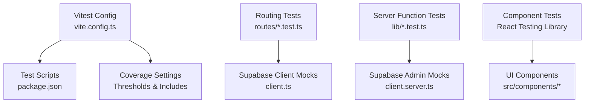
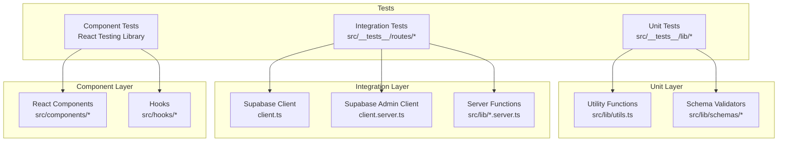
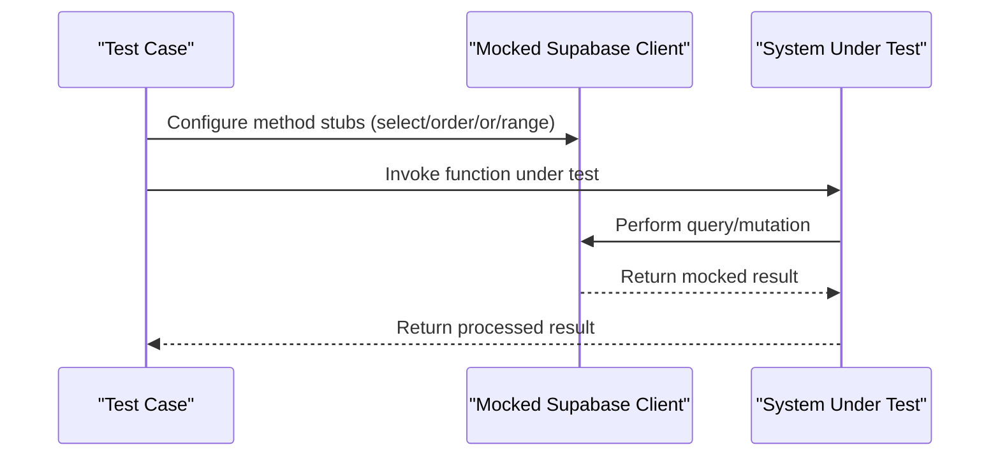
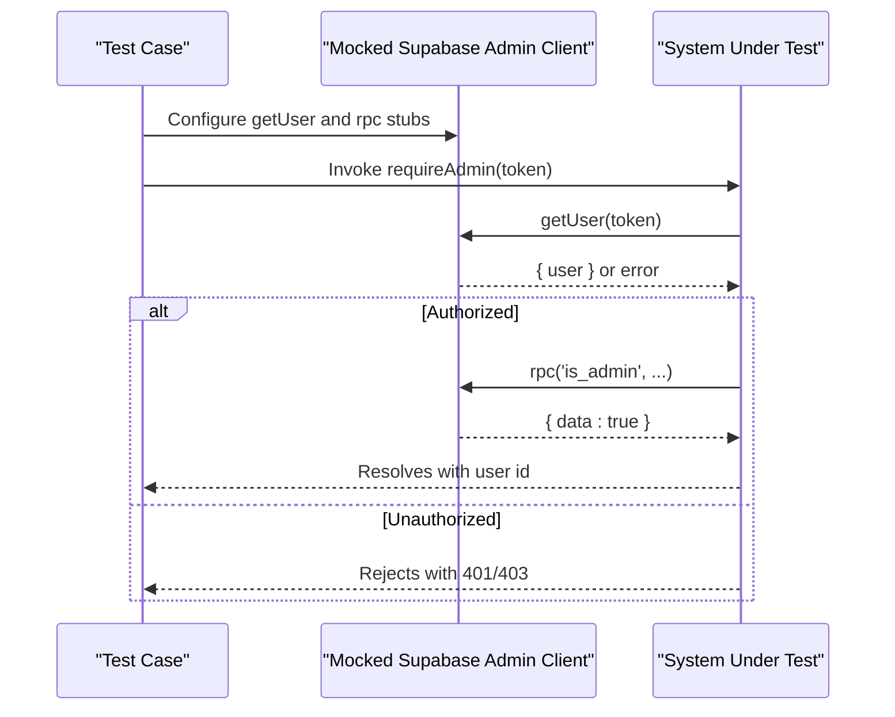
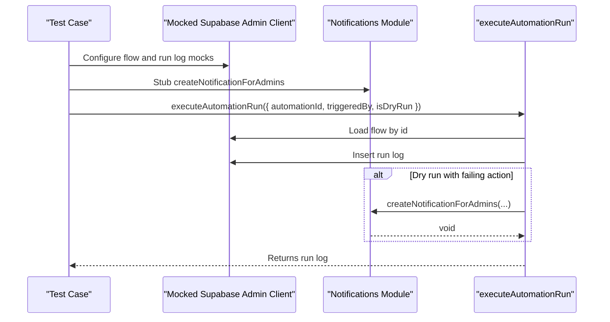
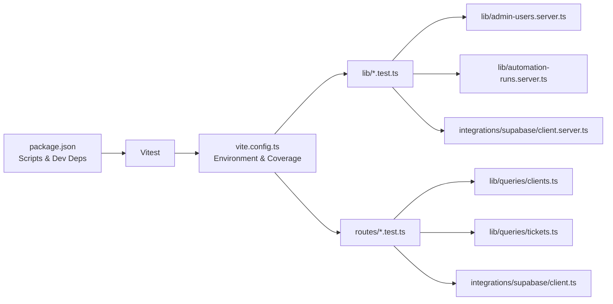

# Testing Strategy

<cite>
**Referenced Files in This Document**
- [vite.config.ts](file://vite.config.ts)
- [package.json](file://package.json)
- [src/__tests__/lib/admin-users.test.ts](file://src/__tests__/lib/admin-users.test.ts)
- [src/__tests__/lib/automation-runs.test.ts](file://src/__tests__/lib/automation-runs.test.ts)
- [src/__tests__/routes/clients.test.ts](file://src/__tests__/routes/clients.test.ts)
- [src/__tests__/routes/tickets.test.ts](file://src/__tests__/routes/tickets.test.ts)
- [src/integrations/supabase/client.server.ts](file://src/integrations/supabase/client.server.ts)
- [src/integrations/supabase/client.ts](file://src/integrations/supabase/client.ts)
- [src/lib/admin-users.server.ts](file://src/lib/admin-users.server.ts)
- [src/lib/automation-runs.server.ts](file://src/lib/automation-runs.server.ts)
- [src/lib/notifications.server.ts](file://src/lib/notifications.server.ts)
- [src/lib/queries/clients.ts](file://src/lib/queries/clients.ts)
- [src/lib/queries/tickets.ts](file://src/lib/queries/tickets.ts)
- [.github/workflows/test.yml](file://.github/workflows/test.yml)
</cite>

## Table of Contents
1. [Introduction](#introduction)
2. [Project Structure](#project-structure)
3. [Core Components](#core-components)
4. [Architecture Overview](#architecture-overview)
5. [Detailed Component Analysis](#detailed-component-analysis)
6. [Dependency Analysis](#dependency-analysis)
7. [Performance Considerations](#performance-considerations)
8. [Troubleshooting Guide](#troubleshooting-guide)
9. [Conclusion](#conclusion)
10. [Appendices](#appendices)

## Introduction
This document describes PCReady’s quality assurance approach with a focus on unit and integration testing using Vitest. It covers mocking strategies for Supabase client/server functions and React components, integration testing patterns for database operations and server functions, component testing with React Testing Library, and test organization across file-based routing tests, server function tests, and utility function tests. It also outlines best practices for asynchronous operations, database transactions, real-time data synchronization, environment setup, test data management, CI/CD integration, performance testing, and coverage requirements.

## Project Structure
The testing setup is centered around Vitest configured in the project’s Vite configuration. Tests are organized under a dedicated test directory and grouped by functional areas:
- Routing and query tests under routes
- Server-side logic tests under lib
- Utilities and helper functions under lib

Key configuration highlights:
- Test environment: Node
- Global test APIs enabled
- Coverage provider: v8
- Coverage thresholds: lines 60, functions 60, branches 50
- Coverage includes selected modules and excludes type declarations and test files

**Diagram sources**
- [vite.config.ts:39-55](file://vite.config.ts#L39-L55)
- [package.json:17-18](file://package.json#L17-L18)

**Section sources**
- [vite.config.ts:39-55](file://vite.config.ts#L39-L55)
- [package.json:17-18](file://package.json#L17-L18)

## Core Components
This section outlines the primary testing components and how they are exercised in unit and integration tests.

- Supabase client mocks
  - Client for public queries: mocked to return controlled results for tables such as client_contacts and generic table builders supporting select, order, or, and range.
  - Admin client for server-side operations: mocked to simulate authentication checks and RPC calls, enabling tests for authorization and administrative functions.

- Server function tests
  - Administrative authorization enforcement: verifies rejection for invalid tokens and insufficient privileges, and acceptance for valid admin sessions.
  - Automation run execution: validates health computation, dry-run failure notifications, and database mutations for run logs and flow updates.

- Routing/query tests
  - Clients list pagination: verifies returned rows and counts for paginated queries.
  - Tickets retrieval: ensures correct handling of missing records and successful payloads.

- Notifications integration
  - Server-side notifications invoked during automation dry runs to notify administrators of failures.

**Section sources**
- [src/__tests__/lib/admin-users.test.ts:1-56](file://src/__tests__/lib/admin-users.test.ts#L1-L56)
- [src/__tests__/lib/automation-runs.test.ts:1-156](file://src/__tests__/lib/automation-runs.test.ts#L1-L156)
- [src/__tests__/routes/clients.test.ts:1-52](file://src/__tests__/routes/clients.test.ts#L1-L52)
- [src/__tests__/routes/tickets.test.ts:1-36](file://src/__tests__/routes/tickets.test.ts#L1-L36)
- [src/integrations/supabase/client.ts:1-32](file://src/integrations/supabase/client.ts#L1-L32)
- [src/integrations/supabase/client.server.ts:1-62](file://src/integrations/supabase/client.server.ts#L1-L62)
- [src/lib/admin-users.server.ts:1-200](file://src/lib/admin-users.server.ts#L1-L200)
- [src/lib/automation-runs.server.ts:1-300](file://src/lib/automation-runs.server.ts#L1-L300)
- [src/lib/notifications.server.ts:1-200](file://src/lib/notifications.server.ts#L1-L200)
- [src/lib/queries/clients.ts:1-200](file://src/lib/queries/clients.ts#L1-L200)
- [src/lib/queries/tickets.ts:1-200](file://src/lib/queries/tickets.ts#L1-L200)

## Architecture Overview
The testing architecture separates concerns across:
- Unit tests for pure functions and small units
- Integration tests for Supabase interactions and server functions
- Component tests for UI behavior using React Testing Library

[No sources needed since this diagram shows conceptual workflow, not actual code structure]

## Detailed Component Analysis

### Supabase Client Mocking Patterns
This pattern centralizes mocking of Supabase clients to isolate tests from external dependencies. It enables deterministic outcomes for database queries and mutations.

**Diagram sources**
- [src/__tests__/routes/clients.test.ts:5-32](file://src/__tests__/routes/clients.test.ts#L5-L32)
- [src/__tests__/routes/tickets.test.ts:5-13](file://src/__tests__/routes/tickets.test.ts#L5-L13)

Key patterns:
- Select chain mocking: methods like select, order, or, and range are chained to return consistent builders.
- Table-specific mocks: different tables return tailored builders to simulate realistic query patterns.
- Single-row retrieval: maybeSingle and single methods are stubbed to return controlled payloads.

**Section sources**
- [src/__tests__/routes/clients.test.ts:5-32](file://src/__tests__/routes/clients.test.ts#L5-L32)
- [src/__tests__/routes/tickets.test.ts:5-13](file://src/__tests__/routes/tickets.test.ts#L5-L13)

### Supabase Admin Client Mocking Patterns
Admin client mocking supports server-side authorization and administrative RPC calls.

**Diagram sources**
- [src/__tests__/lib/admin-users.test.ts:3-14](file://src/__tests__/lib/admin-users.test.ts#L3-L14)
- [src/__tests__/lib/admin-users.test.ts:16-55](file://src/__tests__/lib/admin-users.test.ts#L16-L55)
- [src/integrations/supabase/client.server.ts:1-62](file://src/integrations/supabase/client.server.ts#L1-L62)
- [src/lib/admin-users.server.ts:1-200](file://src/lib/admin-users.server.ts#L1-L200)

Key patterns:
- Hoisted mocks: vi.hoisted ensures stable mock instances across module loads.
- Conditional RPC behavior: rpc returns success or failure based on test scenarios.
- Token validation: getUser simulates valid/invalid user extraction.

**Section sources**
- [src/__tests__/lib/admin-users.test.ts:3-14](file://src/__tests__/lib/admin-users.test.ts#L3-L14)
- [src/__tests__/lib/admin-users.test.ts:16-55](file://src/__tests__/lib/admin-users.test.ts#L16-L55)

### Automation Runs Integration Tests
These tests validate the end-to-end behavior of automation execution, including health computation, dry-run failure simulation, and database mutations.

**Diagram sources**
- [src/__tests__/lib/automation-runs.test.ts:35-62](file://src/__tests__/lib/automation-runs.test.ts#L35-L62)
- [src/__tests__/lib/automation-runs.test.ts:121-154](file://src/__tests__/lib/automation-runs.test.ts#L121-L154)
- [src/lib/automation-runs.server.ts:1-300](file://src/lib/automation-runs.server.ts#L1-L300)
- [src/lib/notifications.server.ts:1-200](file://src/lib/notifications.server.ts#L1-L200)

Key patterns:
- Health computation assertions for empty logs and recent statuses.
- Dry-run failure triggers admin notifications.
- Database mutations verified via insert/select chains.

**Section sources**
- [src/__tests__/lib/automation-runs.test.ts:64-156](file://src/__tests__/lib/automation-runs.test.ts#L64-L156)

### Routing and Query Tests
These tests exercise data access functions that rely on Supabase client mocks to validate pagination and record retrieval.

**Diagram sources**
- [src/__tests__/routes/clients.test.ts:34-51](file://src/__tests__/routes/clients.test.ts#L34-L51)
- [src/__tests__/routes/tickets.test.ts:15-35](file://src/__tests__/routes/tickets.test.ts#L15-L35)

Key patterns:
- Pagination: range-based queries return counts and rows.
- Absence handling: maybeSingle returns null payloads for missing records.

**Section sources**
- [src/__tests__/routes/clients.test.ts:34-51](file://src/__tests__/routes/clients.test.ts#L34-L51)
- [src/__tests__/routes/tickets.test.ts:15-35](file://src/__tests__/routes/tickets.test.ts#L15-L35)

### Component Testing with React Testing Library
Component tests validate UI behavior, event handling, and rendering under various conditions. While specific component test files are not included here, the recommended approach is:
- Render components using React Testing Library
- Interact via user events
- Assert DOM changes and accessibility attributes
- Mock external dependencies (e.g., hooks, API clients) at the boundary

[No sources needed since this section doesn't analyze specific source files]

## Dependency Analysis
This section maps test dependencies and their roles in the testing ecosystem.

**Diagram sources**
- [package.json:17-18](file://package.json#L17-L18)
- [vite.config.ts:39-55](file://vite.config.ts#L39-L55)
- [src/__tests__/lib/admin-users.test.ts:1-56](file://src/__tests__/lib/admin-users.test.ts#L1-L56)
- [src/__tests__/lib/automation-runs.test.ts:1-156](file://src/__tests__/lib/automation-runs.test.ts#L1-L156)
- [src/__tests__/routes/clients.test.ts:1-52](file://src/__tests__/routes/clients.test.ts#L1-L52)
- [src/__tests__/routes/tickets.test.ts:1-36](file://src/__tests__/routes/tickets.test.ts#L1-L36)
- [src/integrations/supabase/client.server.ts:1-62](file://src/integrations/supabase/client.server.ts#L1-L62)
- [src/integrations/supabase/client.ts:1-32](file://src/integrations/supabase/client.ts#L1-L32)
- [src/lib/admin-users.server.ts:1-200](file://src/lib/admin-users.server.ts#L1-L200)
- [src/lib/automation-runs.server.ts:1-300](file://src/lib/automation-runs.server.ts#L1-L300)
- [src/lib/queries/clients.ts:1-200](file://src/lib/queries/clients.ts#L1-L200)
- [src/lib/queries/tickets.ts:1-200](file://src/lib/queries/tickets.ts#L1-L200)

**Section sources**
- [package.json:17-18](file://package.json#L17-L18)
- [vite.config.ts:39-55](file://vite.config.ts#L39-L55)

## Performance Considerations
- Favor mocking over real database connections to keep tests fast and deterministic.
- Keep test suites focused and isolated; avoid cross-test state sharing.
- Use hoisted mocks for stable behavior across module loads.
- Limit coverage to modules with meaningful testable logic to maintain high-quality metrics.
- Prefer targeted assertions to reduce flakiness and improve readability.

[No sources needed since this section provides general guidance]

## Troubleshooting Guide
Common issues and resolutions:
- Mock not applied
  - Ensure mocks are hoisted and imported before the module under test.
  - Verify mock paths match the actual import paths used by the code.
- Asynchronous test failures
  - Use async/await consistently and resolve/reject promises deterministically.
  - Clear mocks between tests to prevent state leakage.
- Coverage thresholds not met
  - Add tests for untested branches and functions.
  - Exclude non-executable server functions from coverage if necessary.
- CI/CD integration
  - Run tests with coverage in CI using the configured script.
  - Ensure environment variables and secrets are properly injected.

**Section sources**
- [src/__tests__/lib/admin-users.test.ts:3-14](file://src/__tests__/lib/admin-users.test.ts#L3-L14)
- [src/__tests__/lib/automation-runs.test.ts:64-156](file://src/__tests__/lib/automation-runs.test.ts#L64-L156)
- [vite.config.ts:43-54](file://vite.config.ts#L43-L54)
- [package.json:17](file://package.json#L17)

## Conclusion
PCReady’s testing strategy leverages Vitest to deliver reliable unit and integration tests. By mocking Supabase clients and server functions, the team achieves deterministic behavior for database operations and authorization checks. Component tests using React Testing Library ensure UI correctness. The configured coverage thresholds and selective inclusion promote maintainable and meaningful test suites. Following the outlined patterns and best practices will help sustain high-quality software delivery.

[No sources needed since this section summarizes without analyzing specific files]

## Appendices

### Test Organization and File Layout
- Routing and query tests
  - Located under routes with descriptive names reflecting the tested functions.
  - Examples: clients and tickets tests demonstrate pagination and record retrieval.
- Server function tests
  - Located under lib with clear naming for server-side logic.
  - Examples: admin authorization and automation run execution.
- Utility and helper tests
  - Located under lib alongside related utilities.
  - Coverage configured for selected modules.

**Section sources**
- [src/__tests__/routes/clients.test.ts:1-52](file://src/__tests__/routes/clients.test.ts#L1-L52)
- [src/__tests__/routes/tickets.test.ts:1-36](file://src/__tests__/routes/tickets.test.ts#L1-L36)
- [src/__tests__/lib/admin-users.test.ts:1-56](file://src/__tests__/lib/admin-users.test.ts#L1-L56)
- [src/__tests__/lib/automation-runs.test.ts:1-156](file://src/__tests__/lib/automation-runs.test.ts#L1-L156)
- [vite.config.ts:43-54](file://vite.config.ts#L43-L54)

### CI/CD Integration
- GitHub Actions workflow executes tests and coverage reporting.
- The test script invokes Vitest with coverage enabled.

**Section sources**
- [.github/workflows/test.yml:1-200](file://.github/workflows/test.yml#L1-L200)
- [package.json:17](file://package.json#L17)