# Testing Strategy

<cite>
**Referenced Files in This Document**
- [vite.config.ts](file://vite.config.ts)
- [package.json](file://package.json)
- [src/__tests__/lib/admin-users.test.ts](file://src/__tests__/lib/admin-users.test.ts)
- [src/__tests__/lib/automation-runs.test.ts](file://src/__tests__/lib/automation-runs.test.ts)
- [src/__tests__/routes/clients.test.ts](file://src/__tests__/routes/clients.test.ts)
- [src/__tests__/routes/tickets.test.ts](file://src/__tests__/routes/tickets.test.ts)
- [src/__tests__/ticketAttachments.test.ts](file://src/__tests__/ticketAttachments.test.ts)
- [src/__tests__/queries.mutations.test.ts](file://src/__tests__/queries.mutations.test.ts)
- [src/__tests__/webhook-ssrf.test.ts](file://src/__tests__/webhook-ssrf.test.ts)
- [src/__tests__/CreateTicketModal.test.tsx](file://src/__tests__/CreateTicketModal.test.tsx)
- [src/integrations/supabase/client.server.ts](file://src/integrations/supabase/client.server.ts)
- [src/integrations/supabase/client.ts](file://src/integrations/supabase/client.ts)
- [src/lib/admin-users.server.ts](file://src/lib/admin-users.server.ts)
- [src/lib/automation-runs.server.ts](file://src/lib/automation-runs.server.ts)
- [src/lib/notifications.server.ts](file://src/lib/notifications.server.ts)
- [src/lib/queries/clients.ts](file://src/lib/queries/clients.ts)
- [src/lib/queries/tickets.ts](file://src/lib/queries/tickets.ts)
- [src/lib/queries/ticketAttachments.ts](file://src/lib/queries/ticketAttachments.ts)
- [.github/workflows/test.yml](file://.github/workflows/test.yml)
</cite>

## Update Summary

**Changes Made**

- Enhanced file attachment validation testing documentation with improved mock setup patterns
- Added documentation for hoisted mocks migration from inline mocks for better test isolation
- Updated test suite modernization section covering helper functions for creating test files
- Expanded component testing patterns with React Testing Library examples
- Added security testing documentation for SSRF protection validation

## Table of Contents

1. [Introduction](#introduction)
2. [Project Structure](#project-structure)
3. [Core Components](#core-components)
4. [Architecture Overview](#architecture-overview)
5. [Detailed Component Analysis](#detailed-component-analysis)
6. [Enhanced Testing Framework](#enhanced-testing-framework)
7. [Dependency Analysis](#dependency-analysis)
8. [Performance Considerations](#performance-considerations)
9. [Troubleshooting Guide](#troubleshooting-guide)
10. [Conclusion](#conclusion)
11. [Appendices](#appendices)

## Introduction

This document describes PCReady's quality assurance approach with a focus on unit and integration testing using Vitest. It covers mocking strategies for Supabase client/server functions and React components, integration testing patterns for database operations and server functions, component testing with React Testing Library, and test organization across file-based routing tests, server function tests, and utility function tests. The framework has been enhanced with improved file attachment validation testing, hoisted mock patterns for better isolation, and modernized test suite helper functions. It also outlines best practices for asynchronous operations, database transactions, real-time data synchronization, environment setup, test data management, CI/CD integration, performance testing, and coverage requirements.

## Project Structure

The testing setup is centered around Vitest configured in the project's Vite configuration. Tests are organized under a dedicated test directory and grouped by functional areas:

- Routing and query tests under routes
- Server-side logic tests under lib
- Utilities and helper functions under lib
- Security and validation tests for file attachments and SSRF protection
- Component tests using React Testing Library

Key configuration highlights:

- Test environment: Node
- Global test APIs enabled
- Coverage provider: v8
- Coverage thresholds: lines 60, functions 60, branches 50
- Coverage includes selected modules and excludes type declarations and test files

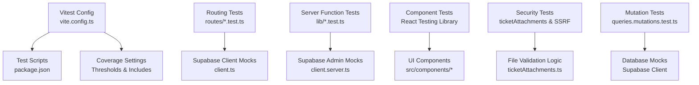

**Diagram sources**

- [vite.config.ts:39-55](file://vite.config.ts#L39-L55)
- [package.json:17-18](file://package.json#L17-L18)
- [src/**tests**/ticketAttachments.test.ts:1-47](file://src/__tests__/ticketAttachments.test.ts#L1-L47)
- [src/**tests**/queries.mutations.test.ts:1-64](file://src/__tests__/queries.mutations.test.ts#L1-L64)

**Section sources**

- [vite.config.ts:39-55](file://vite.config.ts#L39-L55)
- [package.json:17-18](file://package.json#L17-L18)

## Core Components

This section outlines the primary testing components and how they are exercised in unit and integration tests.

- Supabase client mocks
  - Client for public queries: mocked to return controlled results for tables such as client_contacts and generic table builders supporting select, order, or, and range.
  - Admin client for server-side operations: mocked to simulate authentication checks and RPC calls, enabling tests for authorization and administrative functions.

- Server function tests
  - Administrative authorization enforcement: verifies rejection for invalid tokens and insufficient privileges, and acceptance for valid admin sessions.
  - Automation run execution: validates health computation, dry-run failure notifications, and database mutations for run logs and flow updates.

- Routing/query tests
  - Clients list pagination: verifies returned rows and counts for paginated queries.
  - Tickets retrieval: ensures correct handling of missing records and successful payloads.

- File attachment validation tests
  - Enhanced validation logic: comprehensive MIME type detection from file headers, extension validation, and security checks for potentially malicious file types.
  - Helper functions: standardized test file creation utilities for consistent test data generation.

- Security testing
  - SSRF protection: DNS resolution mocking and fetch interception for validating secure webhook endpoints.
  - File type validation: comprehensive checking of file headers against extensions to prevent type confusion attacks.

- Notifications integration
  - Server-side notifications invoked during automation dry runs to notify administrators of failures.

**Section sources**

- [src/**tests**/lib/admin-users.test.ts:1-56](file://src/__tests__/lib/admin-users.test.ts#L1-L56)
- [src/**tests**/lib/automation-runs.test.ts:1-156](file://src/__tests__/lib/automation-runs.test.ts#L1-L156)
- [src/**tests**/routes/clients.test.ts:1-52](file://src/__tests__/routes/clients.test.ts#L1-L52)
- [src/**tests**/routes/tickets.test.ts:1-36](file://src/__tests__/routes/tickets.test.ts#L1-L36)
- [src/**tests**/ticketAttachments.test.ts:1-47](file://src/__tests__/ticketAttachments.test.ts#L1-L47)
- [src/**tests**/webhook-ssrf.test.ts:1-51](file://src/__tests__/webhook-ssrf.test.ts#L1-L51)
- [src/**tests**/queries.mutations.test.ts:1-64](file://src/__tests__/queries.mutations.test.ts#L1-L64)
- [src/integrations/supabase/client.ts:1-32](file://src/integrations/supabase/client.ts#L1-L32)
- [src/integrations/supabase/client.server.ts:1-62](file://src/integrations/supabase/client.server.ts#L1-L62)
- [src/lib/admin-users.server.ts:1-200](file://src/lib/admin-users.server.ts#L1-L200)
- [src/lib/automation-runs.server.ts:1-300](file://src/lib/automation-runs.server.ts#L1-L300)
- [src/lib/notifications.server.ts:1-200](file://src/lib/notifications.server.ts#L1-L200)
- [src/lib/queries/clients.ts:1-200](file://src/lib/queries/clients.ts#L1-L200)
- [src/lib/queries/tickets.ts:1-200](file://src/lib/queries/tickets.ts#L1-L200)
- [src/lib/queries/ticketAttachments.ts:1-242](file://src/lib/queries/ticketAttachments.ts#L1-L242)

## Architecture Overview

The testing architecture separates concerns across:

- Unit tests for pure functions and small units
- Integration tests for Supabase interactions and server functions
- Component tests for UI behavior using React Testing Library
- Security tests for file validation and SSRF protection
- Mutation tests for database operation validation

```mermaid
graph TB
subgraph "Unit Layer"
U1["Utility Functions<br/>src/lib/utils.ts"]
U2["Schema Validators<br/>src/lib/schemas/*"]
U3["File Validation Logic<br/>ticketAttachments.ts"]
end
subgraph "Integration Layer"
I1["Supabase Client<br/>client.ts"]
I2["Supabase Admin Client<br/>client.server.ts"]
I3["Server Functions<br/>src/lib/*.server.ts"]
I4["Database Mocks<br/>queries.mutations.test.ts"]
end
subgraph "Component Layer"
C1["React Components<br/>src/components/*"]
C2["Hooks<br/>src/hooks/*"]
C3["Form State Management<br/>createTicketFormState.ts"]
end
subgraph "Security Layer"
S1["File Attachment Validation<br/>ticketAttachments.test.ts"]
S2["SSRF Protection<br/>webhook-ssrf.test.ts"]
end
subgraph "Tests"
T1["Unit Tests<br/>src/__tests__/lib/*"]
T2["Integration Tests<br/>src/__tests__/routes/*"]
T3["Component Tests<br/>React Testing Library"]
T4["Security Tests<br/>File & Network"]
T5["Mutation Tests<br/>Database Operations"]
end
T1 --> U1
T1 --> U2
T1 --> U3
T2 --> I1
T2 --> I2
T2 --> I3
T3 --> C1
T3 --> C2
T3 --> C3
T4 --> S1
T4 --> S2
T5 --> I4
```

## Detailed Component Analysis

### Supabase Client Mocking Patterns

This pattern centralizes mocking of Supabase clients to isolate tests from external dependencies. It enables deterministic outcomes for database queries and mutations.

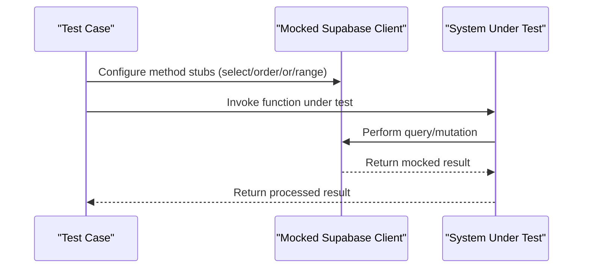

**Diagram sources**

- [src/**tests**/routes/clients.test.ts:5-32](file://src/__tests__/routes/clients.test.ts#L5-L32)
- [src/**tests**/routes/tickets.test.ts:5-13](file://src/__tests__/routes/tickets.test.ts#L5-L13)

Key patterns:

- Select chain mocking: methods like select, order, or, and range are chained to return consistent builders.
- Table-specific mocks: different tables return tailored builders to simulate realistic query patterns.
- Single-row retrieval: maybeSingle and single methods are stubbed to return controlled payloads.

**Section sources**

- [src/**tests**/routes/clients.test.ts:5-32](file://src/__tests__/routes/clients.test.ts#L5-L32)
- [src/**tests**/routes/tickets.test.ts:5-13](file://src/__tests__/routes/tickets.test.ts#L5-L13)

### Enhanced File Attachment Validation Testing

The file attachment validation system has been significantly enhanced with comprehensive MIME type detection and security validation.

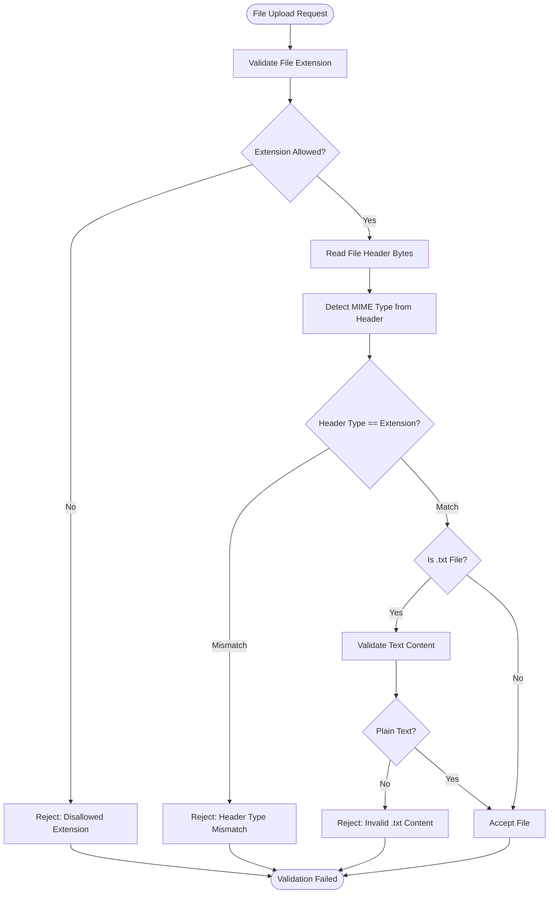

**Diagram sources**

- [src/**tests**/ticketAttachments.test.ts:12-46](file://src/__tests__/ticketAttachments.test.ts#L12-L46)
- [src/lib/queries/ticketAttachments.ts:57-81](file://src/lib/queries/ticketAttachments.ts#L57-L81)

Key enhancements:

- Comprehensive MIME type detection from file headers (PNG, JPEG, GIF, WebP, PDF)
- Extension-based type validation with fallback to header-based detection
- Special handling for .txt files with content validation
- Security-focused validation preventing type confusion attacks

**Section sources**

- [src/**tests**/ticketAttachments.test.ts:1-47](file://src/__tests__/ticketAttachments.test.ts#L1-L47)
- [src/lib/queries/ticketAttachments.ts:1-242](file://src/lib/queries/ticketAttachments.ts#L1-L242)

### Hoisted Mocks Migration Pattern

The testing framework has migrated from inline mocks to hoisted mocks for improved test isolation and stability.

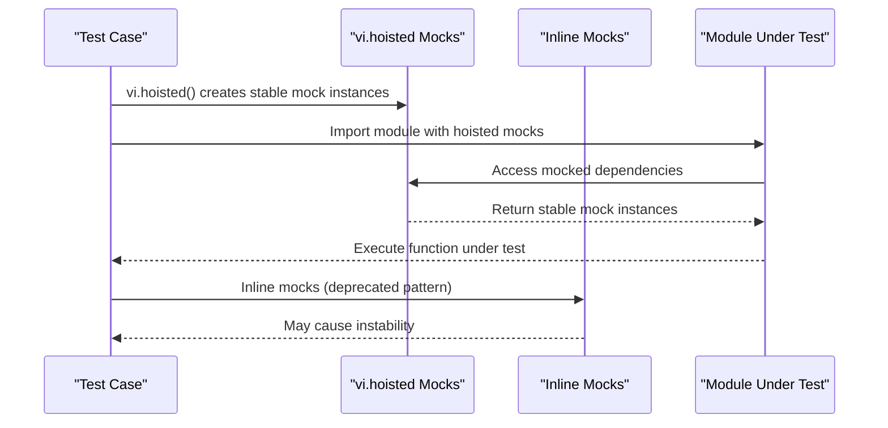

**Diagram sources**

- [src/**tests**/queries.mutations.test.ts:3-23](file://src/__tests__/queries.mutations.test.ts#L3-L23)
- [src/**tests**/webhook-ssrf.test.ts:3-11](file://src/__tests__/webhook-ssrf.test.ts#L3-L11)

Benefits of hoisted mocks:

- Stable mock instances across module loads
- Better test isolation and reduced state leakage
- Improved reliability in complex test suites
- Consistent behavior across test runs

**Section sources**

- [src/**tests**/queries.mutations.test.ts:1-64](file://src/__tests__/queries.mutations.test.ts#L1-L64)
- [src/**tests**/webhook-ssrf.test.ts:1-51](file://src/__tests__/webhook-ssrf.test.ts#L1-L51)

### SSRF Protection Testing

Security testing validates protection against Server-Side Request Forgery attacks in webhook automation.

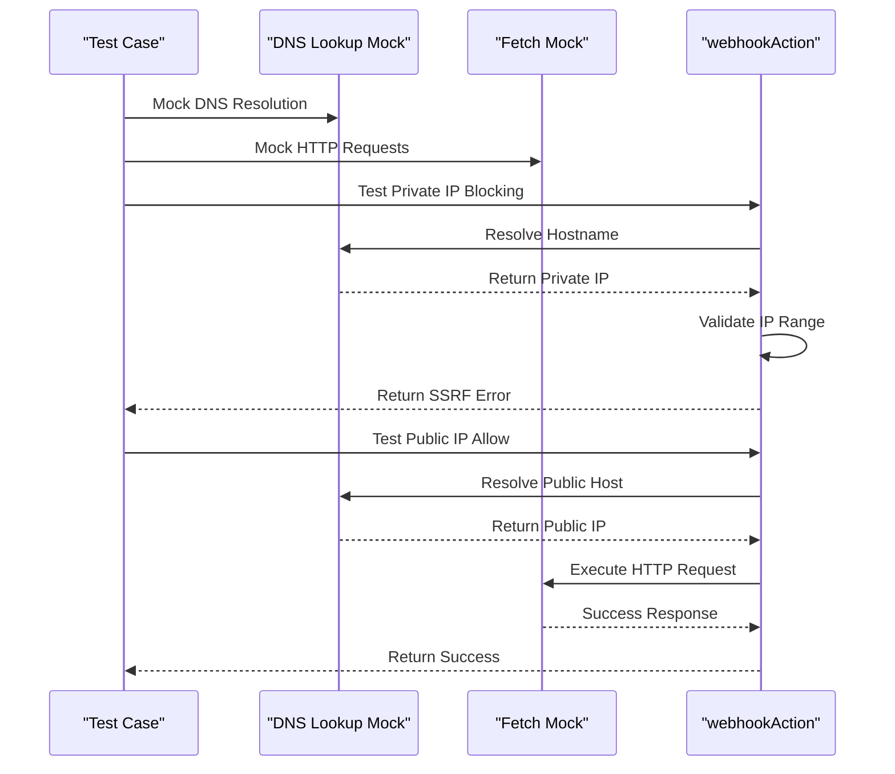

**Diagram sources**

- [src/**tests**/webhook-ssrf.test.ts:15-50](file://src/__tests__/webhook-ssrf.test.ts#L15-L50)

Key security validations:

- Private IP address blocking (127.0.0.1, 10.x.x.x, 172.16.x.x-172.31.x.x, 192.168.x.x)
- Public IP address allowance
- DNS resolution mocking for predictable testing
- Fetch interception for network request validation

**Section sources**

- [src/**tests**/webhook-ssrf.test.ts:1-51](file://src/__tests__/webhook-ssrf.test.ts#L1-L51)

### Component Testing with React Testing Library

Component tests validate UI behavior, event handling, and rendering under various conditions. The testing framework includes comprehensive component validation patterns.

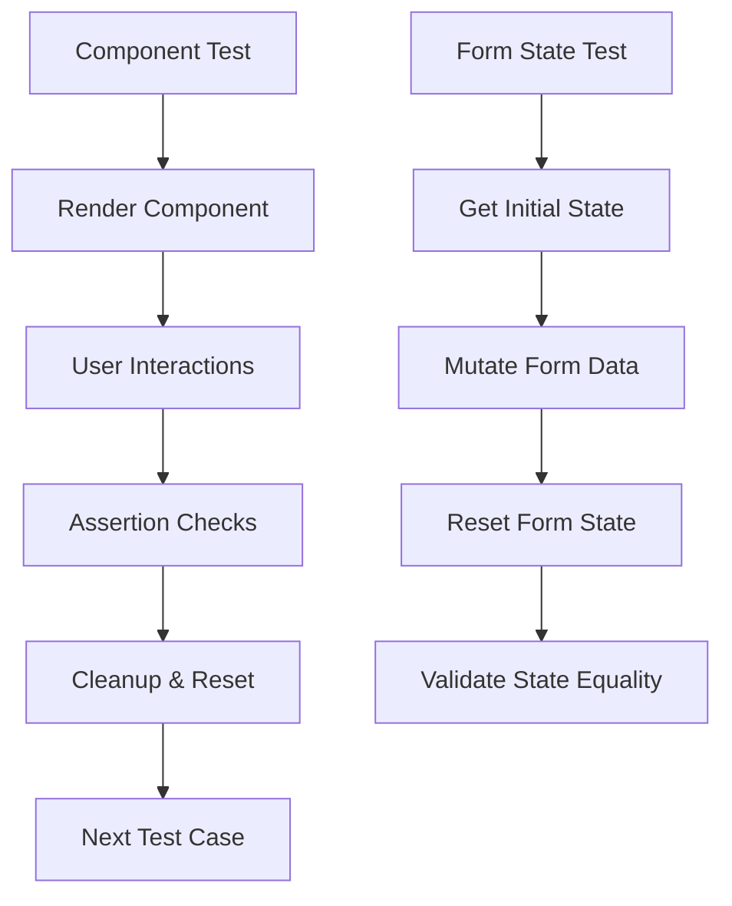

**Diagram sources**

- [src/**tests**/CreateTicketModal.test.tsx:4-27](file://src/__tests__/CreateTicketModal.test.tsx#L4-L27)

Recommended patterns:

- Render components using React Testing Library
- Interact via user events (click, type, select)
- Assert DOM changes and accessibility attributes
- Mock external dependencies (hooks, API clients) at boundaries
- Test form state management and validation

**Section sources**

- [src/**tests**/CreateTicketModal.test.tsx:1-28](file://src/__tests__/CreateTicketModal.test.tsx#L1-L28)

### Supabase Admin Client Mocking Patterns

Admin client mocking supports server-side authorization and administrative RPC calls.

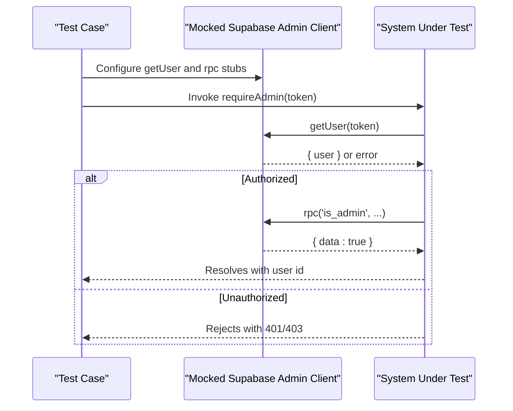

**Diagram sources**

- [src/**tests**/lib/admin-users.test.ts:3-14](file://src/__tests__/lib/admin-users.test.ts#L3-L14)
- [src/**tests**/lib/admin-users.test.ts:16-55](file://src/__tests__/lib/admin-users.test.ts#L16-L55)
- [src/integrations/supabase/client.server.ts:1-62](file://src/integrations/supabase/client.server.ts#L1-L62)
- [src/lib/admin-users.server.ts:1-200](file://src/lib/admin-users.server.ts#L1-L200)

Key patterns:

- Hoisted mocks: vi.hoisted ensures stable mock instances across module loads.
- Conditional RPC behavior: rpc returns success or failure based on test scenarios.
- Token validation: getUser simulates valid/invalid user extraction.

**Section sources**

- [src/**tests**/lib/admin-users.test.ts:3-14](file://src/__tests__/lib/admin-users.test.ts#L3-L14)
- [src/**tests**/lib/admin-users.test.ts:16-55](file://src/__tests__/lib/admin-users.test.ts#L16-L55)

### Automation Runs Integration Tests

These tests validate the end-to-end behavior of automation execution, including health computation, dry-run failure simulation, and database mutations.

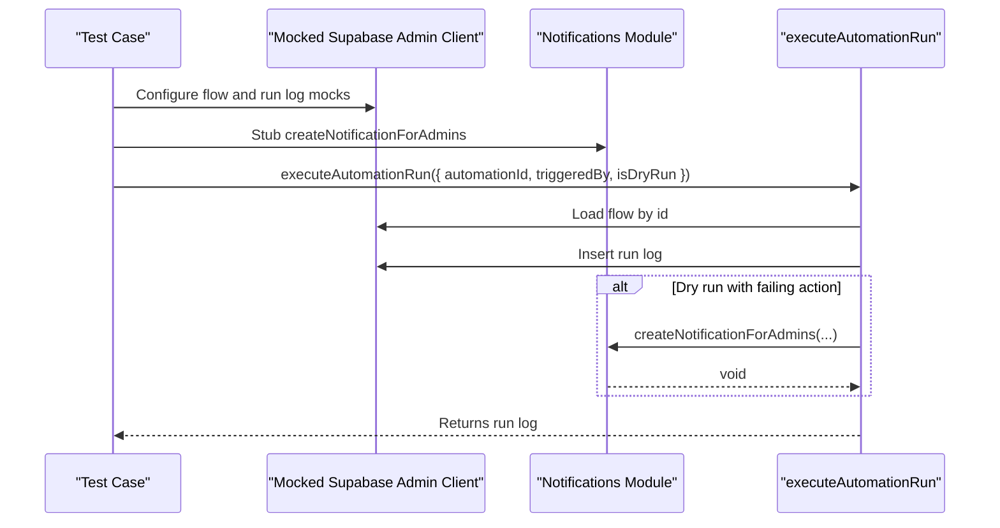

**Diagram sources**

- [src/**tests**/lib/automation-runs.test.ts:35-62](file://src/__tests__/lib/automation-runs.test.ts#L35-L62)
- [src/**tests**/lib/automation-runs.test.ts:121-154](file://src/__tests__/lib/automation-runs.test.ts#L121-L154)
- [src/lib/automation-runs.server.ts:1-300](file://src/lib/automation-runs.server.ts#L1-L300)
- [src/lib/notifications.server.ts:1-200](file://src/lib/notifications.server.ts#L1-L200)

Key patterns:

- Health computation assertions for empty logs and recent statuses.
- Dry-run failure triggers admin notifications.
- Database mutations verified via insert/select chains.

**Section sources**

- [src/**tests**/lib/automation-runs.test.ts:64-156](file://src/__tests__/lib/automation-runs.test.ts#L64-L156)

### Routing and Query Tests

These tests exercise data access functions that rely on Supabase client mocks to validate pagination and record retrieval.

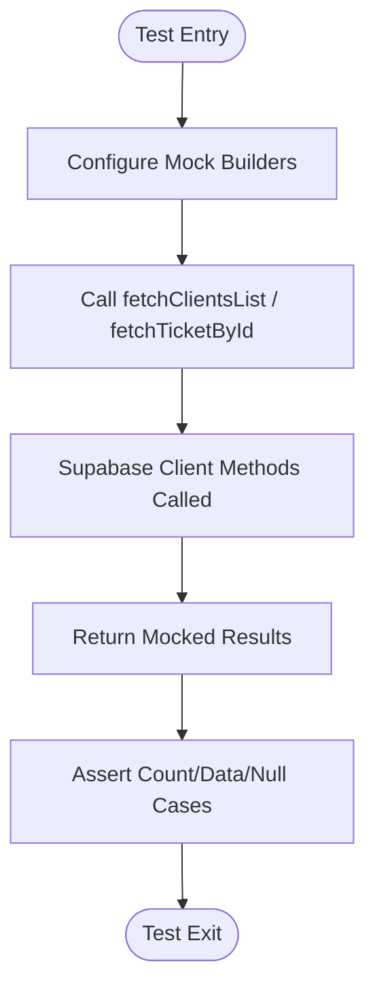

**Diagram sources**

- [src/**tests**/routes/clients.test.ts:34-51](file://src/__tests__/routes/clients.test.ts#L34-L51)
- [src/**tests**/routes/tickets.test.ts:15-35](file://src/__tests__/routes/tickets.test.ts#L15-L35)

Key patterns:

- Pagination: range-based queries return counts and rows.
- Absence handling: maybeSingle returns null payloads for missing records.

**Section sources**

- [src/**tests**/routes/clients.test.ts:34-51](file://src/__tests__/routes/clients.test.ts#L34-L51)
- [src/**tests**/routes/tickets.test.ts:15-35](file://src/__tests__/routes/tickets.test.ts#L15-L35)

## Enhanced Testing Framework

### Modernized Test Suite Architecture

The testing framework has been modernized with several key improvements:

**Hoisted Mock Implementation**

- vi.hoisted() for stable mock instances across module loads
- Elimination of inline mock instability issues
- Improved test isolation and reliability

**Helper Functions for Test Data Creation**

- Standardized file creation utilities for consistent test data
- Enhanced test file generation with proper ArrayBuffer handling
- Reusable helper functions reducing code duplication

**Comprehensive Security Testing**

- File attachment validation with MIME type detection
- SSRF protection validation for webhook endpoints
- DNS resolution mocking for network security tests

**Section sources**

- [src/**tests**/queries.mutations.test.ts:3-23](file://src/__tests__/queries.mutations.test.ts#L3-L23)
- [src/**tests**/ticketAttachments.test.ts:4-10](file://src/__tests__/ticketAttachments.test.ts#L4-L10)
- [src/**tests**/webhook-ssrf.test.ts:3-11](file://src/__tests__/webhook-ssrf.test.ts#L3-L11)

### Test Organization and File Layout

- Routing and query tests
  - Located under routes with descriptive names reflecting the tested functions.
  - Examples: clients and tickets tests demonstrate pagination and record retrieval.
- Server function tests
  - Located under lib with clear naming for server-side logic.
  - Examples: admin authorization and automation run execution.
- Utility and helper tests
  - Located under lib alongside related utilities.
  - Coverage configured for selected modules.
- Security and validation tests
  - Dedicated tests for file attachment validation and SSRF protection.
  - Comprehensive coverage of security-critical functionality.
- Component tests
  - React Testing Library integration for UI component validation.
  - Form state management and interaction testing.

**Section sources**

- [src/**tests**/routes/clients.test.ts:1-52](file://src/__tests__/routes/clients.test.ts#L1-L52)
- [src/**tests**/routes/tickets.test.ts:1-36](file://src/__tests__/routes/tickets.test.ts#L1-L36)
- [src/**tests**/lib/admin-users.test.ts:1-56](file://src/__tests__/lib/admin-users.test.ts#L1-L56)
- [src/**tests**/lib/automation-runs.test.ts:1-156](file://src/__tests__/lib/automation-runs.test.ts#L1-L156)
- [src/**tests**/ticketAttachments.test.ts:1-47](file://src/__tests__/ticketAttachments.test.ts#L1-L47)
- [src/**tests**/webhook-ssrf.test.ts:1-51](file://src/__tests__/webhook-ssrf.test.ts#L1-L51)
- [src/**tests**/CreateTicketModal.test.tsx:1-28](file://src/__tests__/CreateTicketModal.test.tsx#L1-L28)
- [vite.config.ts:43-54](file://vite.config.ts#L43-L54)

## Dependency Analysis

This section maps test dependencies and their roles in the testing ecosystem.

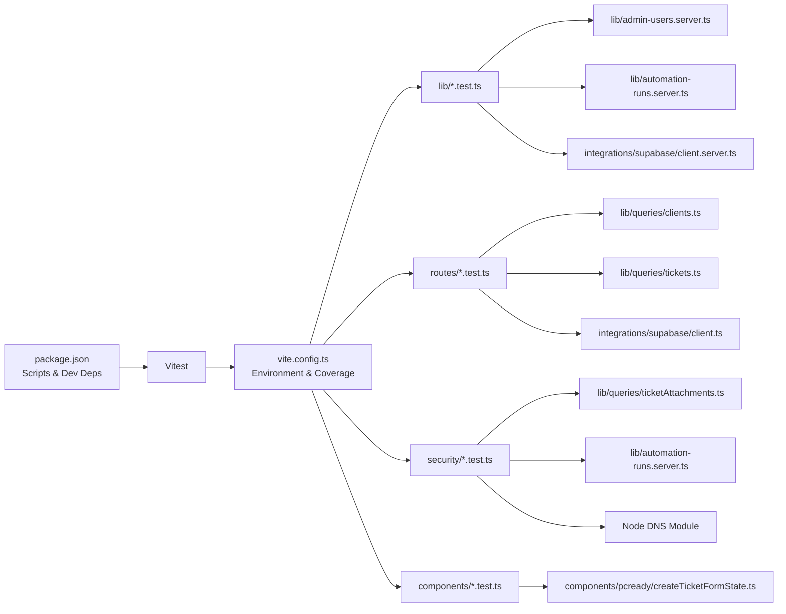

**Diagram sources**

- [package.json:17-18](file://package.json#L17-L18)
- [vite.config.ts:39-55](file://vite.config.ts#L39-L55)
- [src/**tests**/lib/admin-users.test.ts:1-56](file://src/__tests__/lib/admin-users.test.ts#L1-L56)
- [src/**tests**/lib/automation-runs.test.ts:1-156](file://src/__tests__/lib/automation-runs.test.ts#L1-L156)
- [src/**tests**/routes/clients.test.ts:1-52](file://src/__tests__/routes/clients.test.ts#L1-L52)
- [src/**tests**/routes/tickets.test.ts:1-36](file://src/__tests__/routes/tickets.test.ts#L1-L36)
- [src/**tests**/ticketAttachments.test.ts:1-47](file://src/__tests__/ticketAttachments.test.ts#L1-L47)
- [src/**tests**/webhook-ssrf.test.ts:1-51](file://src/__tests__/webhook-ssrf.test.ts#L1-L51)
- [src/**tests**/CreateTicketModal.test.tsx:1-28](file://src/__tests__/CreateTicketModal.test.tsx#L1-L28)
- [src/integrations/supabase/client.server.ts:1-62](file://src/integrations/supabase/client.server.ts#L1-L62)
- [src/integrations/supabase/client.ts:1-32](file://src/integrations/supabase/client.ts#L1-L32)
- [src/lib/admin-users.server.ts:1-200](file://src/lib/admin-users.server.ts#L1-L200)
- [src/lib/automation-runs.server.ts:1-300](file://src/lib/automation-runs.server.ts#L1-L300)
- [src/lib/queries/clients.ts:1-200](file://src/lib/queries/clients.ts#L1-L200)
- [src/lib/queries/tickets.ts:1-200](file://src/lib/queries/tickets.ts#L1-L200)
- [src/lib/queries/ticketAttachments.ts:1-242](file://src/lib/queries/ticketAttachments.ts#L1-L242)

**Section sources**

- [package.json:17-18](file://package.json#L17-L18)
- [vite.config.ts:39-55](file://vite.config.ts#L39-L55)

## Performance Considerations

- Favor mocking over real database connections to keep tests fast and deterministic.
- Keep test suites focused and isolated; avoid cross-test state sharing.
- Use hoisted mocks for stable behavior across module loads.
- Implement comprehensive file validation early to fail fast on invalid inputs.
- Leverage security testing to prevent expensive runtime errors in production.
- Limit coverage to modules with meaningful testable logic to maintain high-quality metrics.
- Prefer targeted assertions to reduce flakiness and improve readability.

## Troubleshooting Guide

Common issues and resolutions:

- Mock not applied
  - Ensure mocks are hoisted and imported before the module under test.
  - Verify mock paths match the actual import paths used by the code.
- Asynchronous test failures
  - Use async/await consistently and resolve/reject promises deterministically.
  - Clear mocks between tests to prevent state leakage.
- File validation failures
  - Verify test file creation utilities generate proper ArrayBuffer instances.
  - Check MIME type detection logic matches expected file formats.
- SSRF protection issues
  - Ensure DNS mock returns expected IP address formats.
  - Verify fetch mock intercepts requests correctly.
- Coverage thresholds not met
  - Add tests for untested branches and functions.
  - Exclude non-executable server functions from coverage if necessary.
- CI/CD integration
  - Run tests with coverage in CI using the configured script.
  - Ensure environment variables and secrets are properly injected.

**Section sources**

- [src/**tests**/lib/admin-users.test.ts:3-14](file://src/__tests__/lib/admin-users.test.ts#L3-L14)
- [src/**tests**/lib/automation-runs.test.ts:64-156](file://src/__tests__/lib/automation-runs.test.ts#L64-L156)
- [src/**tests**/ticketAttachments.test.ts:4-10](file://src/__tests__/ticketAttachments.test.ts#L4-L10)
- [src/**tests**/webhook-ssrf.test.ts:19-28](file://src/__tests__/webhook-ssrf.test.ts#L19-L28)
- [vite.config.ts:43-54](file://vite.config.ts#L43-L54)
- [package.json:17](file://package.json#L17)

## Conclusion

PCReady's enhanced testing strategy leverages Vitest to deliver comprehensive unit, integration, and security tests. The migration to hoisted mocks improves test stability and isolation, while enhanced file attachment validation provides robust security against malicious file uploads. The modernized test suite with helper functions reduces code duplication and improves maintainability. Component tests using React Testing Library ensure UI correctness, and security tests validate critical protections like SSRF prevention. The configured coverage thresholds and selective inclusion promote maintainable and meaningful test suites. Following the outlined patterns and best practices will help sustain high-quality software delivery with strong security guarantees.

## Appendices

### CI/CD Integration

- GitHub Actions workflow executes tests and coverage reporting.
- The test script invokes Vitest with coverage enabled.
- Security tests and mutation tests are included in the comprehensive test suite.

**Section sources**

- [.github/workflows/test.yml:1-200](file://.github/workflows/test.yml#L1-L200)
- [package.json:17](file://package.json#L17)

### Testing Best Practices

- **Mock Management**: Use vi.hoisted() for stable mock instances across tests
- **File Validation**: Implement comprehensive MIME type detection and extension validation
- **Security Testing**: Include SSRF protection validation for network-dependent functionality
- **Component Testing**: Utilize React Testing Library for UI component validation
- **Database Testing**: Mock Supabase client for deterministic database operation tests
- **Test Data**: Create reusable helper functions for consistent test file generation
- **Coverage**: Maintain balanced coverage thresholds while focusing on critical functionality

### Test Coverage Requirements

- **Lines**: 60% minimum coverage threshold
- **Functions**: 60% minimum coverage threshold
- **Branches**: 50% minimum coverage threshold
- **Modules**: Selective inclusion focusing on testable logic
- **Exclusions**: Type declarations and non-executable server functions excluded from coverage calculations
