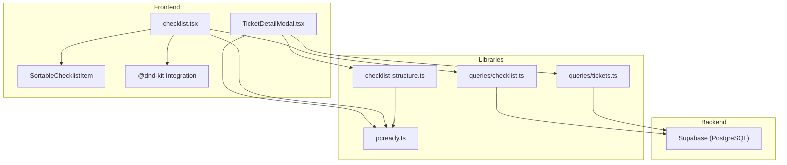
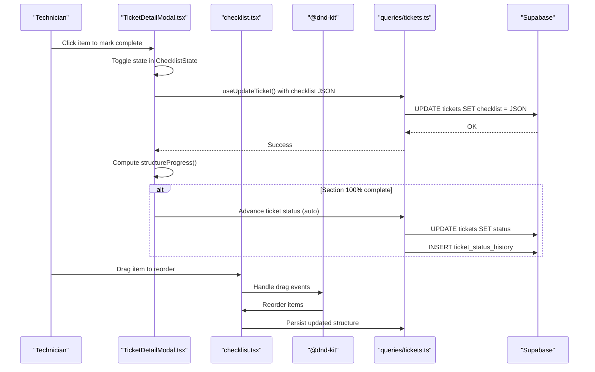
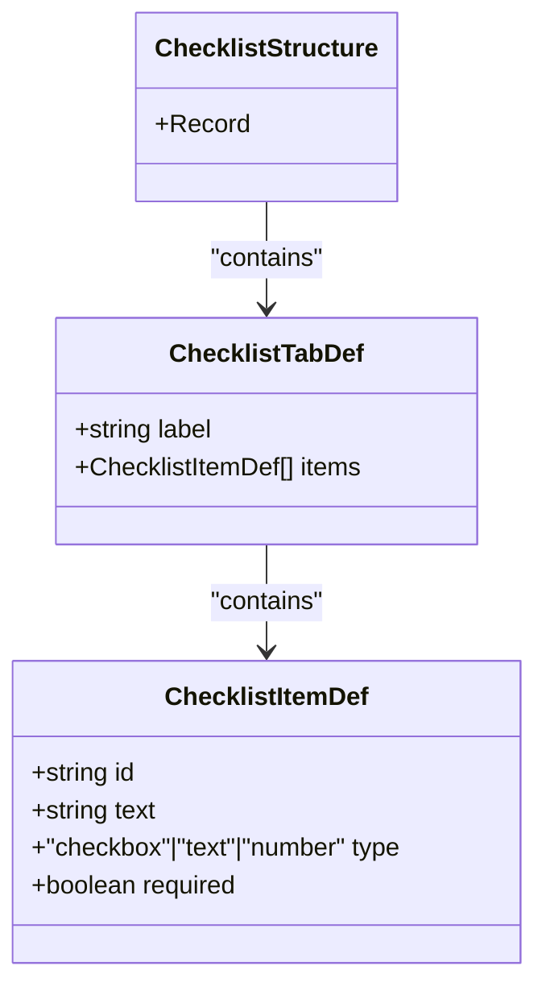
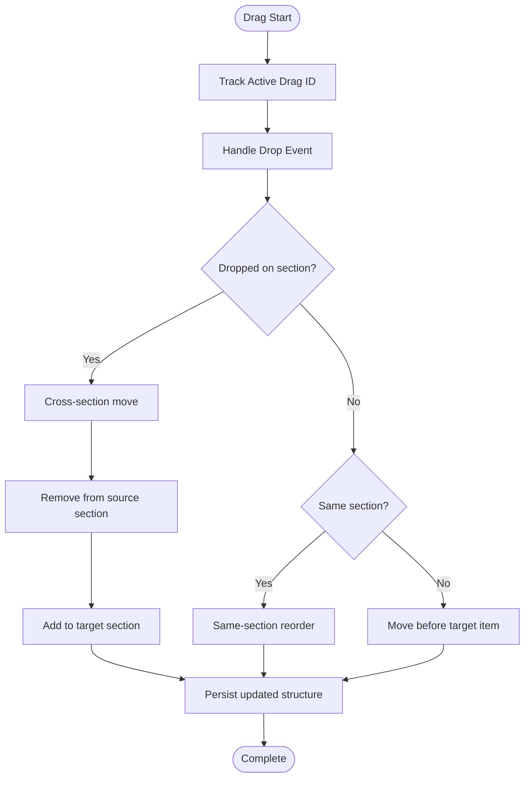
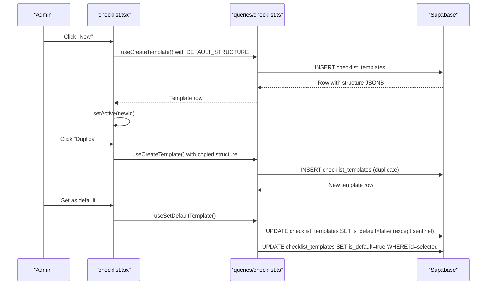
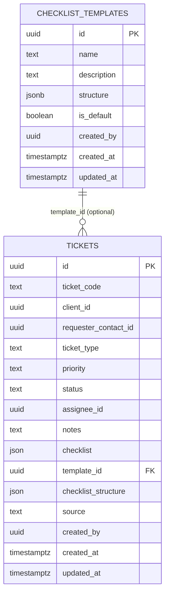
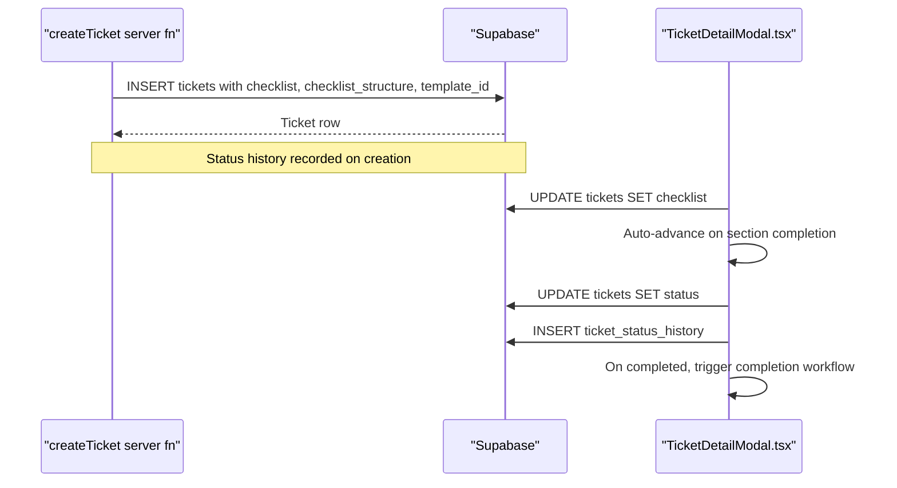
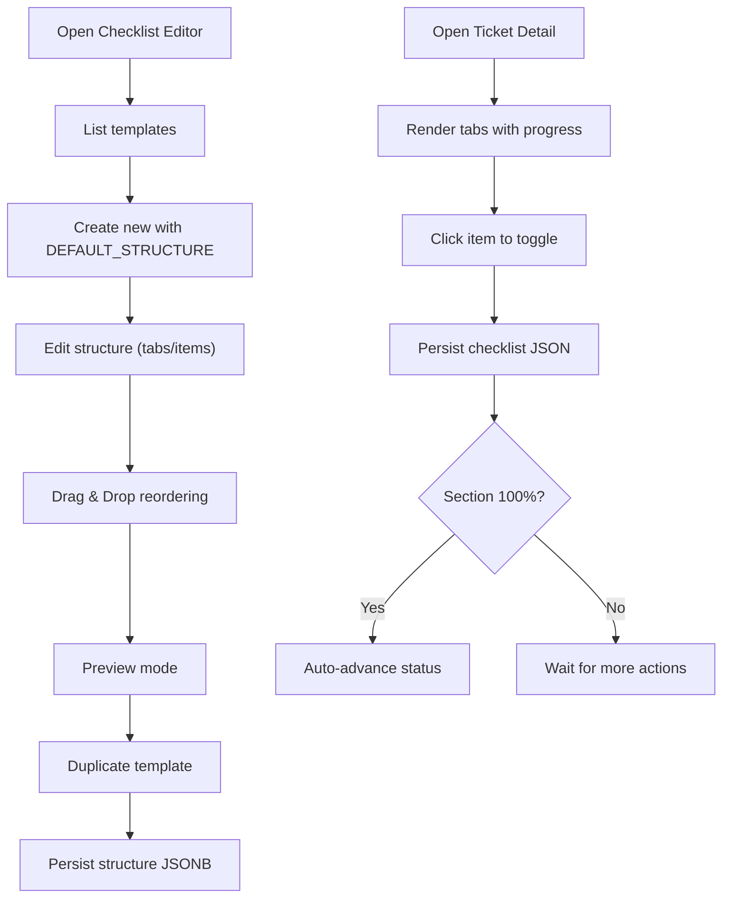
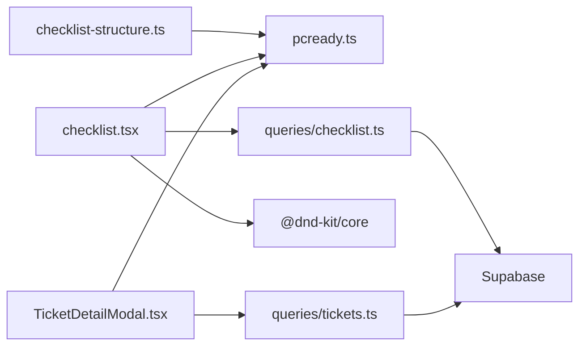

# Checklist System

<cite>
**Referenced Files in This Document**
- [checklist-structure.ts](file://src/types/checklist-structure.ts)
- [pcready.ts](file://src/lib/pcready.ts)
- [checklist.tsx](file://src/routes/_app/checklist.tsx)
- [checklist.ts](file://src/lib/queries/checklist.ts)
- [TicketDetailModal.tsx](file://src/components/pcready/TicketDetailModal.tsx)
- [tickets.ts](file://src/lib/tickets.ts)
- [tickets.ts](file://src/lib/queries/tickets.ts)
- [20260430122321_995fb77a-a5a2-416b-9987-e00e5e34060b.sql](file://supabase/migrations/20260430122321_995fb77a-a5a2-416b-9987-e00e5e34060b.sql)
- [20260511190100_add_completed_enum.sql](file://supabase/migrations/20260511190100_add_completed_enum.sql)
- [20260511194000_add_archived_enum.sql](file://supabase/migrations/20260511194000_add_archived_enum.sql)
</cite>

## Update Summary
**Changes Made**
- Added comprehensive drag-and-drop reordering system for checklist items and sections
- Enhanced checklist item types with checkbox, text, and number options
- Introduced preview mode for template viewing without editing capabilities
- Added duplicate template functionality for template copying
- Updated UI components with improved item rendering and type indicators
- Enhanced validation rules to support new item types and required fields

## Table of Contents
1. [Introduction](#introduction)
2. [Project Structure](#project-structure)
3. [Core Components](#core-components)
4. [Architecture Overview](#architecture-overview)
5. [Detailed Component Analysis](#detailed-component-analysis)
6. [Dependency Analysis](#dependency-analysis)
7. [Performance Considerations](#performance-considerations)
8. [Troubleshooting Guide](#troubleshooting-guide)
9. [Conclusion](#conclusion)
10. [Appendices](#appendices)

## Introduction
This document explains the checklist system used for PC preparation tickets. It covers the checklist structure definition, the template system with configurable structures and defaults, completion tracking with per-item status and overall progress, persistence using JSON fields in the tickets table, and integration with ticket creation and status transitions. The system now features a comprehensive drag-and-drop reordering system, enhanced checklist item types (checkbox/text/number), preview mode, duplicate template functionality, and improved UI components for managing customizable checklists.

## Project Structure
The checklist system spans frontend UI, backend queries, typed schemas, and database migrations:
- Types define the structure and validation rules for checklist templates, including new item types.
- The pcready library defines default structures, progress computation, and state shape with enhanced item type support.
- The checklist route and editor manage template creation, updates, default assignment, and drag-and-drop reordering.
- Queries handle CRUD operations against the checklist_templates table and ticket updates.
- The TicketDetailModal integrates checklist completion with ticket status transitions.
- Migrations define the database schema for templates and ticket JSON fields.

**Diagram sources**
- [TicketDetailModal.tsx:67-113](file://src/components/pcready/TicketDetailModal.tsx#L67-L113)
- [checklist.tsx:44-92](file://src/routes/_app/checklist.tsx#L44-L92)
- [checklist.ts:23-38](file://src/lib/queries/checklist.ts#L23-L38)
- [tickets.ts:191-228](file://src/lib/queries/tickets.ts#L191-L228)
- [checklist-structure.ts:5-29](file://src/types/checklist-structure.ts#L5-L29)
- [pcready.ts:68-127](file://src/lib/pcready.ts#L68-L127)
- [20260430122321_995fb77a-a5a2-416b-9987-e00e5e34060b.sql:1-39](file://supabase/migrations/20260430122321_995fb77a-a5a2-416b-9987-e00e5e34060b.sql#L1-L39)

**Section sources**
- [checklist-structure.ts:1-30](file://src/types/checklist-structure.ts#L1-L30)
- [pcready.ts:68-127](file://src/lib/pcready.ts#L68-L127)
- [checklist.tsx:44-92](file://src/routes/_app/checklist.tsx#L44-L92)
- [checklist.ts:23-38](file://src/lib/queries/checklist.ts#L23-L38)
- [TicketDetailModal.tsx:67-113](file://src/components/pcready/TicketDetailModal.tsx#L67-L113)
- [tickets.ts:191-228](file://src/lib/queries/tickets.ts#L191-L228)
- [20260430122321_995fb77a-a5a2-416b-9987-e00e5e34060b.sql:1-39](file://supabase/migrations/20260430122321_995fb77a-a5a2-416b-9987-e00e5e34060b.sql#L1-L39)

## Core Components
- Checklist structure definition:
  - Item: id, text, type (checkbox/text/number), and required flag.
  - Tab: label and array of items.
  - Structure: record keyed by dynamic tab keys with label and items.
- Default structure and template:
  - Default structure is derived from predefined template sections.
  - The default template defines OS, Software, Security, and Network sections with standard items.
- Progress calculation:
  - Per-tab progress counts completed items vs total items.
  - Overall progress aggregates across all tabs.
- State shape:
  - ChecklistState is a nested map keyed by tab and item ids.
- Drag-and-drop system:
  - Comprehensive reordering within sections and moving between sections.
  - Visual feedback during drag operations with overlay support.

**Section sources**
- [checklist-structure.ts:5-29](file://src/types/checklist-structure.ts#L5-L29)
- [pcready.ts:68-127](file://src/lib/pcready.ts#L68-L127)
- [pcready.ts:128-144](file://src/lib/pcready.ts#L128-L144)
- [pcready.ts:188-190](file://src/lib/pcready.ts#L188-L190)
- [checklist.tsx:404-478](file://src/routes/_app/checklist.tsx#L404-L478)

## Architecture Overview
The system separates concerns across types, UI, and persistence with enhanced drag-and-drop capabilities:
- Types enforce structure and validation for checklist templates, including new item types.
- The editor UI builds and persists templates to the checklist_templates table with drag-and-drop support.
- The ticket detail UI loads either a persisted template or the default structure, tracks per-item completion, and advances ticket status automatically upon section completion.
- Progress is computed client-side and persisted as JSON in the tickets table.
- Drag-and-drop reordering provides intuitive item management with visual feedback.

**Diagram sources**
- [TicketDetailModal.tsx:115-149](file://src/components/pcready/TicketDetailModal.tsx#L115-L149)
- [checklist.tsx:404-478](file://src/routes/_app/checklist.tsx#L404-L478)
- [tickets.ts:215-228](file://src/lib/queries/tickets.ts#L215-L228)
- [20260430122321_995fb77a-a5a2-416b-9987-e00e5e34060b.sql:36-39](file://supabase/migrations/20260430122321_995fb77a-a5a2-416b-9987-e00e5e34060b.sql#L36-L39)

## Detailed Component Analysis

### Enhanced Checklist Structure Definition and Validation
- Item and Tab schemas ensure each item has an id, text, type (checkbox/text/number), and optional required flag.
- The structure schema is a record keyed by tab id with values conforming to the tab definition.
- A parser validates raw JSON and falls back to the default structure if invalid.
- New item types support different input mechanisms: checkbox for simple yes/no tasks, text for free-form responses, and number for numeric inputs.

**Diagram sources**
- [checklist-structure.ts:5-21](file://src/types/checklist-structure.ts#L5-L21)
- [pcready.ts:111-119](file://src/lib/pcready.ts#L111-L119)

**Section sources**
- [checklist-structure.ts:5-29](file://src/types/checklist-structure.ts#L5-L29)
- [pcready.ts:111-119](file://src/lib/pcready.ts#L111-L119)

### Comprehensive Drag-and-Drop Reordering System
- Implements @dnd-kit for both intra-section reordering and inter-section moving.
- Supports visual drag handles with grab cursor and overlay feedback.
- Handles cross-section moves by removing from source and inserting at target position.
- Provides smooth animations and visual cues during drag operations.
- Integrates seamlessly with the existing template editing workflow.

**Diagram sources**
- [checklist.tsx:404-478](file://src/routes/_app/checklist.tsx#L404-L478)

**Section sources**
- [checklist.tsx:404-478](file://src/routes/_app/checklist.tsx#L404-L478)
- [checklist.tsx:660-705](file://src/routes/_app/checklist.tsx#L660-L705)

### Enhanced Checklist Template System
- Templates are stored in the checklist_templates table with a JSONB structure field supporting new item types.
- The editor allows creating, updating, deleting, setting default, and duplicating templates.
- Creating a template inserts with the default structure and records a version.
- Updating templates writes the structure as JSONB with enhanced validation.
- Setting default template clears is_default on all rows and sets it for the chosen template.
- Duplicate functionality creates a copy of existing templates with updated naming.

**Diagram sources**
- [checklist.tsx:74-109](file://src/routes/_app/checklist.tsx#L74-L109)
- [checklist.tsx:130-149](file://src/routes/_app/checklist.tsx#L130-L149)
- [checklist.ts:40-49](file://src/lib/queries/checklist.ts#L40-L49)
- [checklist.ts:66-77](file://src/lib/queries/checklist.ts#L66-L77)

**Section sources**
- [checklist.tsx:74-109](file://src/routes/_app/checklist.tsx#L74-L109)
- [checklist.tsx:130-149](file://src/routes/_app/checklist.tsx#L130-L149)
- [checklist.ts:23-38](file://src/lib/queries/checklist.ts#L23-L38)
- [checklist.ts:40-49](file://src/lib/queries/checklist.ts#L40-L49)
- [checklist.ts:66-77](file://src/lib/queries/checklist.ts#L66-L77)
- [20260430122321_995fb77a-a5a2-416b-9987-e00e5e34060b.sql:1-12](file://supabase/migrations/20260430122321_995fb77a-a5a2-416b-9987-e00e5e34060b.sql#L1-L12)

### Enhanced Checklist Completion Tracking and Progress Calculation
- ChecklistState is a nested map keyed by tab and item ids.
- Per-tab progress counts completed items and computes percentage.
- Overall progress aggregates across all tabs.
- The UI displays per-tab progress and item lists, allowing toggling completion.
- New item types support different completion behaviors: checkboxes toggle boolean state, text items show empty input, numbers show numeric input.

**Diagram sources**
- [TicketDetailModal.tsx:115-149](file://src/components/pcready/TicketDetailModal.tsx#L115-L149)
- [pcready.ts:128-144](file://src/lib/pcready.ts#L128-L144)

**Section sources**
- [TicketDetailModal.tsx:115-149](file://src/components/pcready/TicketDetailModal.tsx#L115-L149)
- [pcready.ts:128-144](file://src/lib/pcready.ts#L128-L144)
- [pcready.ts:188-190](file://src/lib/pcready.ts#L188-L190)

### Enhanced Data Persistence and Validation
- Templates:
  - Stored in checklist_templates with JSONB structure and is_default flag.
  - Fetched and parsed with validation; invalid JSON falls back to default structure.
  - Enhanced validation supports new item types and required field validation.
- Tickets:
  - checklist is a JSON object keyed by tab and item ids.
  - checklist_structure is optional JSON defining the active structure for a ticket.
  - Creation endpoint accepts optional checklist_structure and template_id.
  - Enhanced validation ensures backward compatibility with existing templates.

**Diagram sources**
- [20260430122321_995fb77a-a5a2-416b-9987-e00e5e34060b.sql:1-39](file://supabase/migrations/20260430122321_995fb77a-a5a2-416b-9987-e00e5e34060b.sql#L1-L39)
- [tickets.ts:8-30](file://src/lib/tickets.ts#L8-L30)

**Section sources**
- [checklist.ts:23-38](file://src/lib/queries/checklist.ts#L23-L38)
- [checklist.ts:30-33](file://src/lib/queries/checklist.ts#L30-L33)
- [TicketDetailModal.tsx:93-98](file://src/components/pcready/TicketDetailModal.tsx#L93-L98)
- [TicketDetailModal.tsx:101-113](file://src/components/pcready/TicketDetailModal.tsx#L101-L113)
- [tickets.ts:8-30](file://src/lib/tickets.ts#L8-L30)
- [20260430122321_995fb77a-a5a2-416b-9987-e00e5e34060b.sql:36-39](file://supabase/migrations/20260430122321_995fb77a-a5a2-416b-9987-e00e5e34060b.sql#L36-L39)

### Enhanced Integration with Ticket Creation and Status Transitions
- Ticket creation supports optional checklist_structure and template_id.
- The ticket detail UI:
  - Loads either the ticket's checklist_structure or the default structure.
  - Toggles item completion and persists JSON.
  - Automatically advances status when a section completes:
    - OS section completion advances from pending to in-progress.
    - Software section completion advances from in-progress to testing.
  - On final status change to completed, triggers completion workflow.
- Enhanced item type support allows different input mechanisms for various task types.

**Diagram sources**
- [tickets.ts:50-110](file://src/lib/tickets.ts#L50-L110)
- [TicketDetailModal.tsx:145-147](file://src/components/pcready/TicketDetailModal.tsx#L145-L147)
- [TicketDetailModal.tsx:151-199](file://src/components/pcready/TicketDetailModal.tsx#L151-L199)
- [20260511190100_add_completed_enum.sql:1-18](file://supabase/migrations/20260511190100_add_completed_enum.sql#L1-L18)
- [20260511194000_add_archived_enum.sql:1-18](file://supabase/migrations/20260511194000_add_archived_enum.sql#L1-L18)

**Section sources**
- [tickets.ts:50-110](file://src/lib/tickets.ts#L50-L110)
- [TicketDetailModal.tsx:145-147](file://src/components/pcready/TicketDetailModal.tsx#L145-L147)
- [TicketDetailModal.tsx:151-199](file://src/components/pcready/TicketDetailModal.tsx#L151-L199)
- [20260511190100_add_completed_enum.sql:1-18](file://supabase/migrations/20260511190100_add_completed_enum.sql#L1-L18)
- [20260511194000_add_archived_enum.sql:1-18](file://supabase/migrations/20260511194000_add_archived_enum.sql#L1-L18)

### Enhanced Checklist UI Components and User Interaction Patterns
- Template editor:
  - Lists templates, supports adding/removing tabs and items, renaming tabs, and setting default.
  - Enhanced with drag-and-drop reordering, preview mode, and duplicate functionality.
  - Persists structure as JSONB and records versions.
  - Supports multiple item types with appropriate input controls.
- Ticket detail:
  - Renders tabs with per-tab progress.
  - Allows clicking items to toggle completion.
  - Auto-advances status on section completion and notifies assignee.
  - Enhanced item rendering with type-specific icons and input controls.

**Diagram sources**
- [checklist.tsx:225-240](file://src/routes/_app/checklist.tsx#L225-L240)
- [checklist.tsx:267-556](file://src/routes/_app/checklist.tsx#L267-L556)
- [TicketDetailModal.tsx:302-361](file://src/components/pcready/TicketDetailModal.tsx#L302-L361)

**Section sources**
- [checklist.tsx:225-240](file://src/routes/_app/checklist.tsx#L225-L240)
- [checklist.tsx:267-556](file://src/routes/_app/checklist.tsx#L267-L556)
- [TicketDetailModal.tsx:302-361](file://src/components/pcready/TicketDetailModal.tsx#L302-L361)

## Dependency Analysis
- Types depend on Zod for validation and on pcready's default structure with enhanced item type support.
- Editor depends on queries for checklist templates, @dnd-kit for drag-and-drop functionality, and on pcready for default structure.
- Ticket detail depends on pcready for structure resolution and progress, on queries for ticket updates, and on database for status history.
- Database migrations define the schema for templates and ticket JSON fields.

**Diagram sources**
- [checklist-structure.ts:1-30](file://src/types/checklist-structure.ts#L1-L30)
- [pcready.ts:68-127](file://src/lib/pcready.ts#L68-L127)
- [checklist.tsx:44-92](file://src/routes/_app/checklist.tsx#L44-L92)
- [checklist.ts:23-38](file://src/lib/queries/checklist.ts#L23-L38)
- [TicketDetailModal.tsx:67-113](file://src/components/pcready/TicketDetailModal.tsx#L67-L113)
- [tickets.ts:191-228](file://src/lib/queries/tickets.ts#L191-L228)

**Section sources**
- [checklist-structure.ts:1-30](file://src/types/checklist-structure.ts#L1-L30)
- [pcready.ts:68-127](file://src/lib/pcready.ts#L68-L127)
- [checklist.tsx:44-92](file://src/routes/_app/checklist.tsx#L44-L92)
- [checklist.ts:23-38](file://src/lib/queries/checklist.ts#L23-L38)
- [TicketDetailModal.tsx:67-113](file://src/components/pcready/TicketDetailModal.tsx#L67-L113)
- [tickets.ts:191-228](file://src/lib/queries/tickets.ts#L191-L228)

## Performance Considerations
- JSON parsing and validation occur on the client for templates and on fetch for tickets; ensure structures remain reasonably sized.
- Progress calculations are O(n) per tab and O(n) overall; keep tab/item counts reasonable for responsive UI.
- Drag-and-drop operations use efficient array manipulation with @dnd-kit for smooth performance.
- Use optimistic updates for item toggles and invalidate queries afterward to maintain consistency.

## Troubleshooting Guide
- Template validation errors:
  - Symptom: Templates revert to default after save.
  - Cause: The structure JSON failed validation.
  - Resolution: Ensure structure matches the expected schema (record of tabs with label and items). The parser falls back to the default structure on failure.
  - Section sources
    - [checklist-structure.ts:25-29](file://src/types/checklist-structure.ts#L25-L29)
    - [checklist.ts:30-33](file://src/lib/queries/checklist.ts#L30-L33)
- Incomplete checklists blocking status changes:
  - Symptom: Ticket does not auto-advance when completing a section.
  - Cause: The item completion state is not persisted or progress computation is incorrect.
  - Resolution: Verify checklist JSON is updated and progress equals 100% for the section.
  - Section sources
    - [TicketDetailModal.tsx:115-149](file://src/components/pcready/TicketDetailModal.tsx#L115-L149)
    - [pcready.ts:128-144](file://src/lib/pcready.ts#L128-L144)
- Data serialization problems:
  - Symptom: Errors when inserting/updating tickets with checklist JSON.
  - Cause: Incorrect JSON shape or unsupported types.
  - Resolution: Ensure checklist is a record keyed by tab and item ids; checklist_structure is valid JSON when provided.
  - Section sources
    - [TicketDetailModal.tsx:101-113](file://src/components/pcready/TicketDetailModal.tsx#L101-L113)
    - [tickets.ts:84-86](file://src/lib/tickets.ts#L84-L86)
- Enum status issues:
  - Symptom: Status transitions fail or are missing.
  - Cause: Enum values not present in the database.
  - Resolution: Apply migrations to add completed and archived enum values if missing.
  - Section sources
    - [20260511190100_add_completed_enum.sql:1-18](file://supabase/migrations/20260511190100_add_completed_enum.sql#L1-L18)
    - [20260511194000_add_archived_enum.sql:1-18](file://supabase/migrations/20260511194000_add_archived_enum.sql#L1-L18)
- Drag-and-drop issues:
  - Symptom: Items don't reorder or move between sections.
  - Cause: DnD context not properly configured or drag events not handled.
  - Resolution: Ensure DndContext is properly set up with sensors and SortableContext wraps the item list.
  - Section sources
    - [checklist.tsx:404-478](file://src/routes/_app/checklist.tsx#L404-L478)
    - [checklist.tsx:660-705](file://src/routes/_app/checklist.tsx#L660-L705)
- New item type validation:
  - Symptom: Text or number items not displaying correctly.
  - Cause: Missing type property or invalid type value.
  - Resolution: Ensure item.type is one of "checkbox", "text", or "number"; default to "checkbox" if undefined.
  - Section sources
    - [checklist-structure.ts:9](file://src/types/checklist-structure.ts#L9)
    - [pcready.ts:114](file://src/lib/pcready.ts#L114)

## Conclusion
The checklist system has been significantly enhanced with comprehensive drag-and-drop reordering, multiple item types, preview mode, and duplicate functionality. The system combines a flexible template engine with robust progress tracking and seamless integration into the ticket lifecycle. Templates are validated and persisted as JSONB, while tickets store both the current completion state and an optional structure override. The enhanced UI enables easy authoring and completion with intuitive drag-and-drop operations, automatic status advancement, and notifications. Adhering to the defined schemas and migrations ensures reliable operation across environments.

## Appendices
- Example references to code locations:
  - Template creation and default assignment: [checklist.tsx:74-109](file://src/routes/_app/checklist.tsx#L74-L109)
  - Template duplication: [checklist.tsx:130-149](file://src/routes/_app/checklist.tsx#L130-L149)
  - Template persistence and fallback parsing: [checklist.ts:23-38](file://src/lib/queries/checklist.ts#L23-L38), [checklist-structure.ts:25-29](file://src/types/checklist-structure.ts#L25-L29)
  - Drag-and-drop reordering: [checklist.tsx:404-478](file://src/routes/_app/checklist.tsx#L404-L478)
  - Enhanced item type support: [checklist-structure.ts:9](file://src/types/checklist-structure.ts#L9), [pcready.ts:114](file://src/lib/pcready.ts#L114)
  - Ticket creation with optional structure: [tickets.ts:50-110](file://src/lib/tickets.ts#L50-L110)
  - Ticket detail completion and auto-advance: [TicketDetailModal.tsx:115-149](file://src/components/pcready/TicketDetailModal.tsx#L115-L149), [TicketDetailModal.tsx:151-199](file://src/components/pcready/TicketDetailModal.tsx#L151-L199)
  - Progress computation: [pcready.ts:128-144](file://src/lib/pcready.ts#L128-L144)
  - Database schema: [20260430122321_995fb77a-a5a2-416b-9987-e00e5e34060b.sql:1-39](file://supabase/migrations/20260430122321_995fb77a-a5a2-416b-9987-e00e5e34060b.sql#L1-L39)