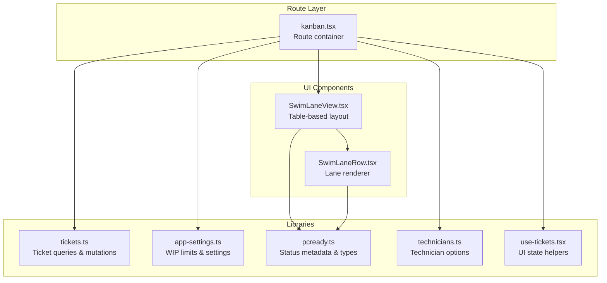
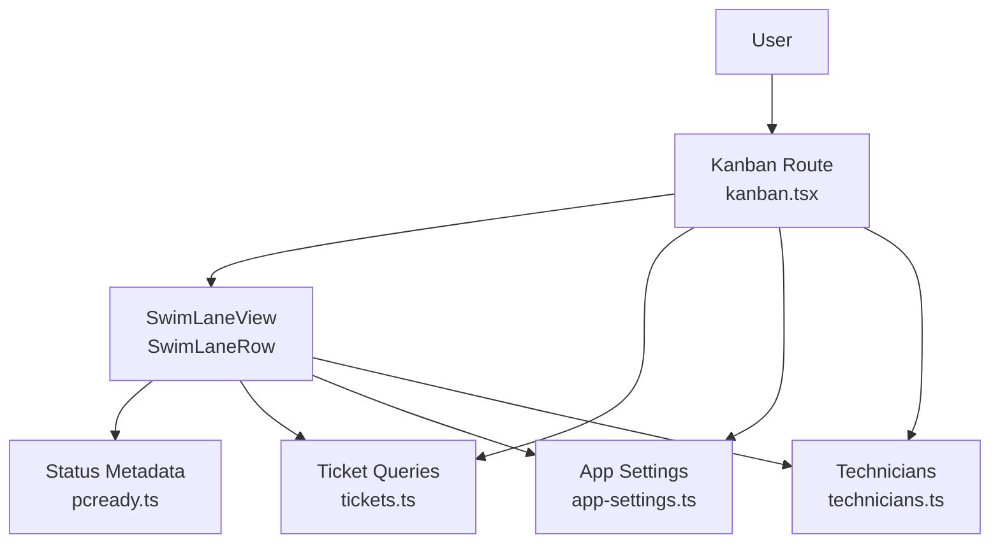
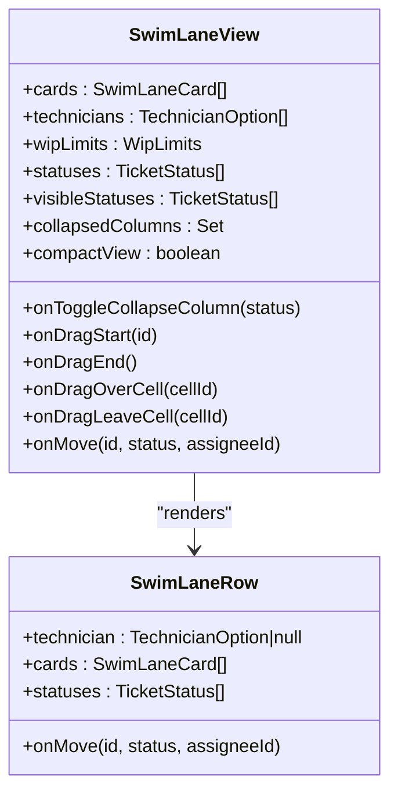
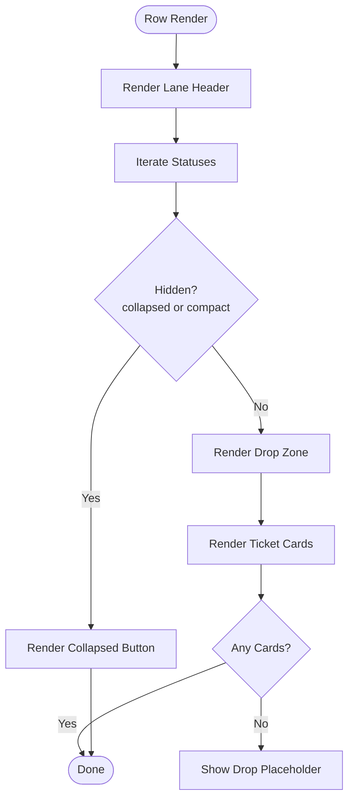
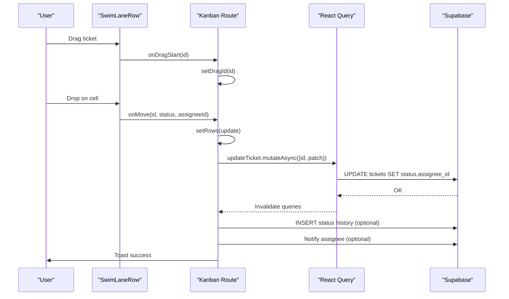
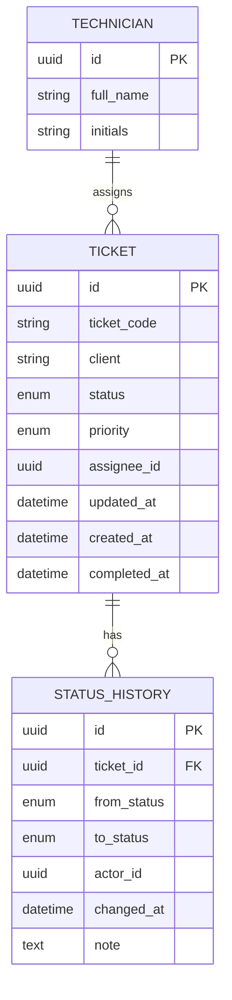
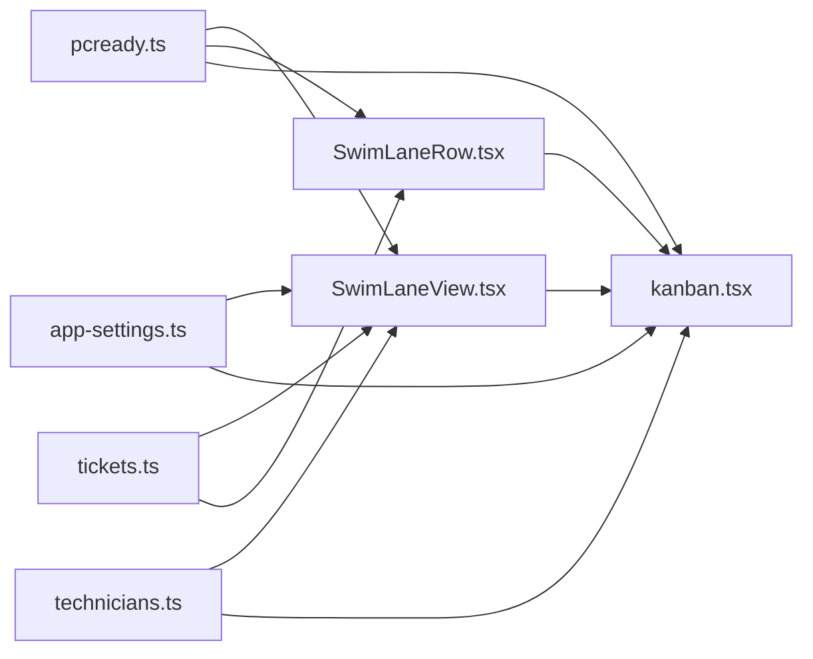

# Kanban Board System

<cite>
**Referenced Files in This Document**
- [SwimLaneView.tsx](file://src/components/kanban/SwimLaneView.tsx)
- [SwimLaneRow.tsx](file://src/components/kanban/SwimLaneRow.tsx)
- [kanban.tsx](file://src/routes/_app/kanban.tsx)
- [tickets.ts](file://src/lib/queries/tickets.ts)
- [app-settings.ts](file://src/lib/app-settings.ts)
- [pcready.ts](file://src/lib/pcready.ts)
- [technicians.ts](file://src/lib/technicians.ts)
- [use-tickets.tsx](file://src/lib/use-tickets.tsx)
</cite>

## Table of Contents

1. [Introduction](#introduction)
2. [Project Structure](#project-structure)
3. [Core Components](#core-components)
4. [Architecture Overview](#architecture-overview)
5. [Detailed Component Analysis](#detailed-component-analysis)
6. [Dependency Analysis](#dependency-analysis)
7. [Performance Considerations](#performance-considerations)
8. [Troubleshooting Guide](#troubleshooting-guide)
9. [Conclusion](#conclusion)

## Introduction

This document describes the Kanban Board System implemented in the project, focusing on the swim lane view for ticket management. The system provides a drag-and-drop interface for moving tickets across workflow stages, with real-time synchronization, WIP (Work-In-Progress) limits, and technician assignment tracking. It integrates with Supabase for data persistence and uses React Query for caching and real-time updates.

## Project Structure

The Kanban functionality is organized around three primary areas:

- Route-level container that orchestrates data fetching, filtering, and state
- Swim lane rendering components for displaying and interacting with tickets
- Supporting libraries for tickets, application settings, status metadata, and technician listings

**Diagram sources**

- [kanban.tsx:59-496](file://src/routes/_app/kanban.tsx#L59-L496)
- [SwimLaneView.tsx:52-198](file://src/components/kanban/SwimLaneView.tsx#L52-L198)
- [SwimLaneRow.tsx:28-139](file://src/components/kanban/SwimLaneRow.tsx#L28-L139)
- [tickets.ts:163-212](file://src/lib/queries/tickets.ts#L163-L212)
- [app-settings.ts:180-202](file://src/lib/app-settings.ts#L180-L202)
- [pcready.ts:20-35](file://src/lib/pcready.ts#L20-L35)
- [technicians.ts:10-33](file://src/lib/technicians.ts#L10-L33)
- [use-tickets.tsx:52-55](file://src/lib/use-tickets.tsx#L52-L55)

**Section sources**

- [kanban.tsx:59-496](file://src/routes/_app/kanban.tsx#L59-L496)
- [SwimLaneView.tsx:52-198](file://src/components/kanban/SwimLaneView.tsx#L52-L198)
- [SwimLaneRow.tsx:28-139](file://src/components/kanban/SwimLaneRow.tsx#L28-L139)

## Core Components

- SwimLaneView: Renders the Kanban table with columns for statuses and rows for technicians (including unassigned). Handles WIP indicators, collapse toggles, and drag-and-drop targets.
- SwimLaneRow: Renders a single lane (technician or unassigned) with per-status cells and individual ticket cards.
- Route Container (kanban.tsx): Manages filters, view modes, WIP limits, real-time tickets, drag-and-drop state, and update operations.
- Supporting Libraries:
  - tickets.ts: Provides ticket listing, updates, and status history insertion.
  - app-settings.ts: Supplies WIP limits and archive thresholds for Kanban.
  - pcready.ts: Defines ticket statuses, priorities, and metadata used for rendering.
  - technicians.ts: Lists assignable technicians for lane grouping.
  - use-tickets.tsx: Provides lightweight UI state helpers for tickets.

**Section sources**

- [SwimLaneView.tsx:21-50](file://src/components/kanban/SwimLaneView.tsx#L21-L50)
- [SwimLaneRow.tsx:9-26](file://src/components/kanban/SwimLaneRow.tsx#L9-L26)
- [kanban.tsx:42-56](file://src/routes/_app/kanban.tsx#L42-L56)
- [tickets.ts:260-273](file://src/lib/queries/tickets.ts#L260-L273)
- [app-settings.ts:7-16](file://src/lib/app-settings.ts#L7-L16)
- [pcready.ts:1-8](file://src/lib/pcready.ts#L1-L8)
- [technicians.ts:4-8](file://src/lib/technicians.ts#L4-L8)
- [use-tickets.tsx:3-17](file://src/lib/use-tickets.tsx#L3-L17)

## Architecture Overview

The Kanban board follows a layered architecture:

- Route layer: Orchestrates data fetching, state, and user interactions.
- UI layer: Renders swim lanes and cards with drag-and-drop handlers.
- Data layer: Uses Supabase-backed queries/mutations and React Query for caching and real-time updates.
- Settings layer: Loads WIP limits and other Kanban-specific preferences.

**Diagram sources**

- [kanban.tsx:59-496](file://src/routes/_app/kanban.tsx#L59-L496)
- [SwimLaneView.tsx:52-198](file://src/components/kanban/SwimLaneView.tsx#L52-L198)
- [SwimLaneRow.tsx:28-139](file://src/components/kanban/SwimLaneRow.tsx#L28-L139)
- [tickets.ts:163-212](file://src/lib/queries/tickets.ts#L163-L212)
- [app-settings.ts:180-202](file://src/lib/app-settings.ts#L180-L202)
- [technicians.ts:10-33](file://src/lib/technicians.ts#L10-L33)
- [pcready.ts:20-35](file://src/lib/pcready.ts#L20-L35)

## Detailed Component Analysis

### SwimLaneView Component

Responsibilities:

- Builds lanes from technicians and unassigned tickets.
- Renders status columns with WIP counters and progress bars.
- Controls column collapse/expand and compact view visibility.
- Exposes drag-and-drop callbacks to parent container.

Key behaviors:

- Lane creation groups cards by assignee ID (including null for unassigned).
- WIP percentage computed from counts vs. configured limits.
- Column visibility toggled by collapsed state and compact mode.

**Diagram sources**

- [SwimLaneView.tsx:33-50](file://src/components/kanban/SwimLaneView.tsx#L33-L50)
- [SwimLaneRow.tsx:9-26](file://src/components/kanban/SwimLaneRow.tsx#L9-L26)

**Section sources**

- [SwimLaneView.tsx:52-198](file://src/components/kanban/SwimLaneView.tsx#L52-L198)

### SwimLaneRow Component

Responsibilities:

- Renders a single lane header with technician info or unassigned indicator.
- Renders per-status cells with drop zones and drag feedback.
- Displays ticket cards with priority, device, client, assignee, and time-in-column.

Key behaviors:

- Drop zone detection uses cell IDs combining lane and status.
- Drag feedback highlights target cell and adjusts card opacity/scale.
- Empty cells show a placeholder indicating drop area.

**Diagram sources**

- [SwimLaneRow.tsx:28-139](file://src/components/kanban/SwimLaneRow.tsx#L28-L139)

**Section sources**

- [SwimLaneRow.tsx:28-139](file://src/components/kanban/SwimLaneRow.tsx#L28-L139)

### Route Container (kanban.tsx)

Responsibilities:

- Fetches live tickets via real-time hook and local list.
- Loads WIP limits and technician options.
- Applies filters for assignee and priority.
- Manages drag-and-drop state and move operations.
- Updates tickets, inserts status history, triggers notifications, and logs activities.

Key behaviors:

- Filters rows based on selected assignee (all/me/unassigned) and priority.
- Calculates visible statuses considering compact mode and collapsed columns.
- Move operation updates local state immediately, persists via mutation, and handles side effects (completion workflow, notifications, activity logging).

**Diagram sources**

- [kanban.tsx:133-225](file://src/routes/_app/kanban.tsx#L133-L225)
- [tickets.ts:260-273](file://src/lib/queries/tickets.ts#L260-L273)

**Section sources**

- [kanban.tsx:59-496](file://src/routes/_app/kanban.tsx#L59-L496)

### Data Model and Types

Ticket and status definitions:

- TicketStatus: pending, in-progress, testing, ready, completed, archived
- TicketPriority: high, med, low
- TicketType: device, support, maintenance, other
- WipLimits: per-status integer limits (0 means no limit)
- TechnicianOption: id, full_name, initials

**Diagram sources**

- [pcready.ts:1-8](file://src/lib/pcready.ts#L1-L8)
- [tickets.ts:101-112](file://src/lib/queries/tickets.ts#L101-L112)
- [tickets.ts:289-294](file://src/lib/queries/tickets.ts#L289-L294)

**Section sources**

- [pcready.ts:1-8](file://src/lib/pcready.ts#L1-L8)
- [tickets.ts:101-112](file://src/lib/queries/tickets.ts#L101-L112)
- [tickets.ts:289-294](file://src/lib/queries/tickets.ts#L289-L294)

## Dependency Analysis

- SwimLaneView depends on:
  - pcready.ts for status metadata and types
  - app-settings.ts for WIP limits
  - technicians.ts for lane grouping
  - tickets.ts for data fetching and updates
- SwimLaneRow depends on:
  - pcready.ts for status metadata
  - tickets.ts for data fetching and updates
- Route container depends on:
  - React Query for caching and invalidation
  - Supabase client for mutations
  - Local storage for view preferences

**Diagram sources**

- [pcready.ts:20-35](file://src/lib/pcready.ts#L20-L35)
- [app-settings.ts:180-202](file://src/lib/app-settings.ts#L180-L202)
- [technicians.ts:10-33](file://src/lib/technicians.ts#L10-L33)
- [tickets.ts:163-212](file://src/lib/queries/tickets.ts#L163-L212)
- [SwimLaneView.tsx:52-198](file://src/components/kanban/SwimLaneView.tsx#L52-L198)
- [SwimLaneRow.tsx:28-139](file://src/components/kanban/SwimLaneRow.tsx#L28-L139)
- [kanban.tsx:59-496](file://src/routes/_app/kanban.tsx#L59-L496)

**Section sources**

- [kanban.tsx:108-131](file://src/routes/_app/kanban.tsx#L108-L131)
- [SwimLaneView.tsx:70-89](file://src/components/kanban/SwimLaneView.tsx#L70-L89)
- [SwimLaneRow.tsx:46-47](file://src/components/kanban/SwimLaneRow.tsx#L46-L47)

## Performance Considerations

- Real-time synchronization: The route uses a real-time table hook to keep the ticket list fresh, reducing stale data and manual polling overhead.
- Local state updates: Immediate UI updates during drag-and-drop improve responsiveness; mutations handle server synchronization and cache invalidation.
- Filtering and visibility: Compact view and collapsed columns reduce DOM size and rendering work by hiding empty or unused columns.
- WIP computation: Efficient per-status counting avoids expensive re-renders by leveraging memoized filtered datasets.
- Drag feedback: Minimal style changes and opacity transforms ensure smooth animations without heavy computations.

## Troubleshooting Guide

Common issues and resolutions:

- Drag-and-drop not working:
  - Verify edit permissions and that cards are draggable.
  - Ensure onDragStart/onMove callbacks are passed down correctly.
- WIP limit warnings incorrect:
  - Confirm WIP limits are loaded from settings and applied per status.
  - Check that counts reflect filtered rows in compact mode.
- Notifications or emails not sent:
  - Confirm session access token availability and that notification/send functions are invoked after successful updates.
- Status history not recorded:
  - Ensure status transitions trigger history insertions and that mutations invalidate related queries.

**Section sources**

- [kanban.tsx:133-225](file://src/routes/_app/kanban.tsx#L133-L225)
- [tickets.ts:260-273](file://src/lib/queries/tickets.ts#L260-L273)

## Conclusion

The Kanban Board System delivers a responsive, real-time interface for managing tickets across workflow stages. Its modular design separates concerns between UI rendering, data orchestration, and settings management, enabling maintainability and extensibility. The integration with Supabase and React Query ensures reliable data synchronization, while WIP limits and compact views help teams manage throughput effectively.
