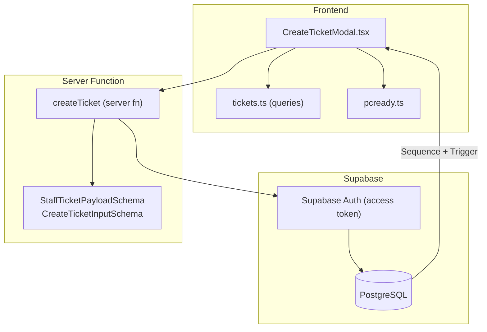
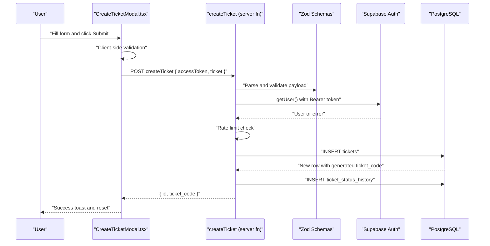
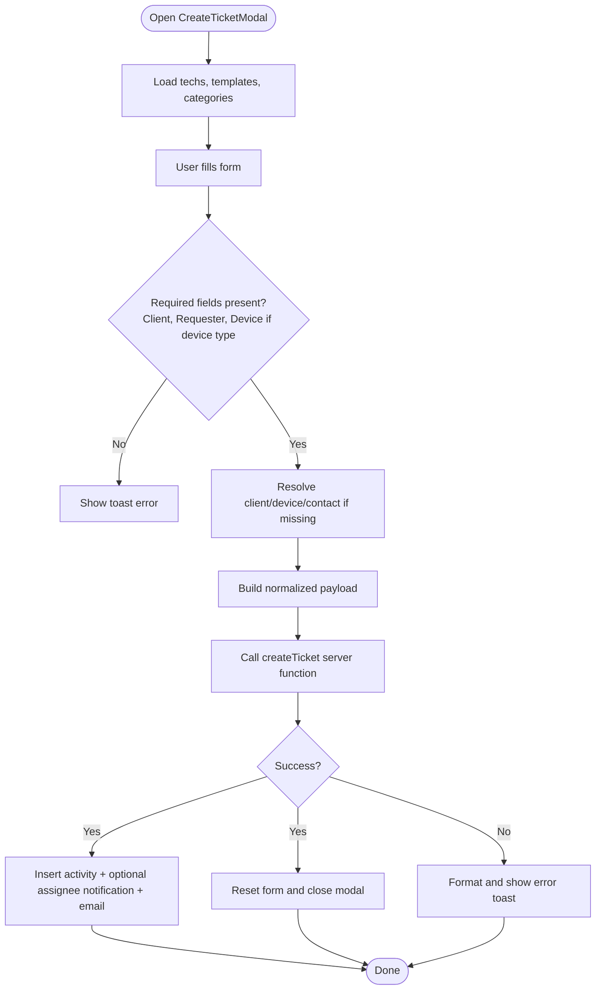
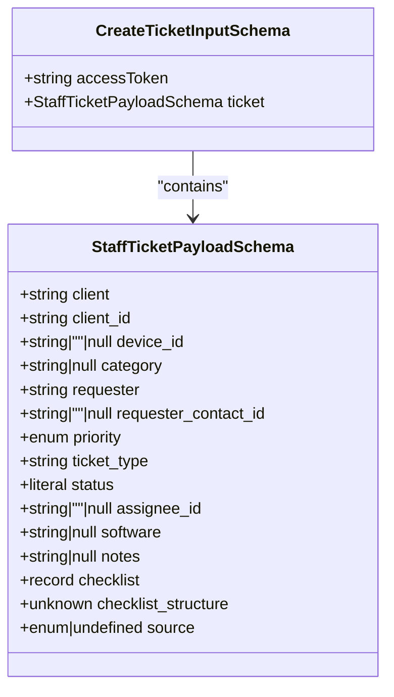
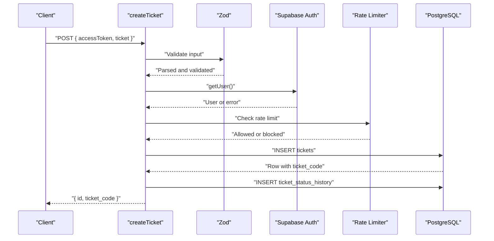
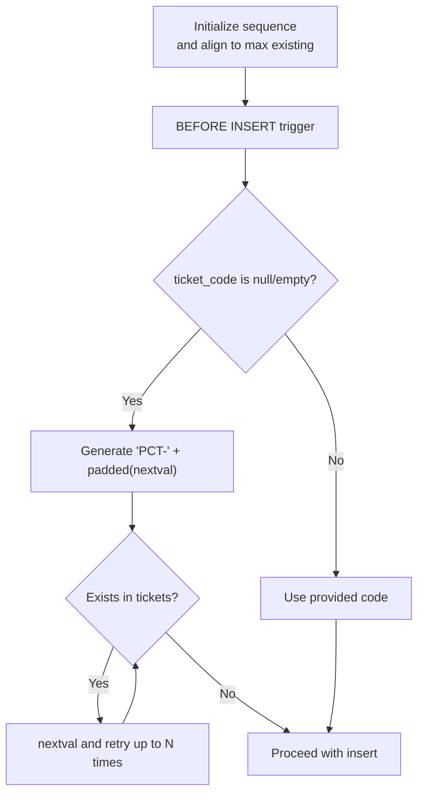
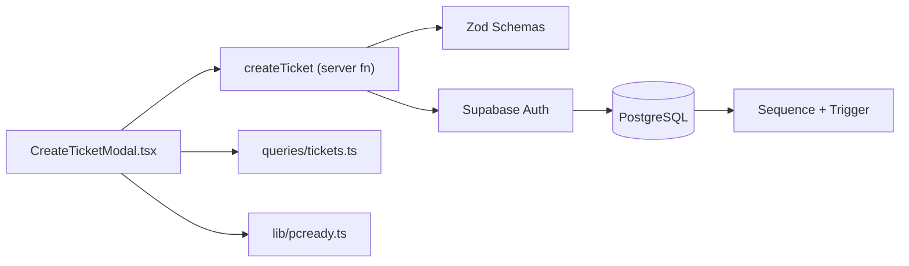

# Ticket Creation Workflow

<cite>
**Referenced Files in This Document**
- [CreateTicketModal.tsx](file://src/components/pcready/CreateTicketModal.tsx)
- [tickets.ts](file://src/lib/tickets.ts)
- [tickets.tsx](file://src/routes/_app/tickets.tsx)
- [tickets.ts](file://src/lib/queries/tickets.ts)
- [pcready.ts](file://src/lib/pcready.ts)
- [types.ts](file://src/integrations/supabase/types.ts)
- [20260430154500_ticket_code_sequence_trigger.sql](file://supabase/migrations/20260430154500_ticket_code_sequence_trigger.sql)
- [20260516200000_ticket_code_unique_allocation.sql](file://supabase/migrations/20260516200000_ticket_code_unique_allocation.sql)
</cite>

## Table of Contents
1. [Introduction](#introduction)
2. [Project Structure](#project-structure)
3. [Core Components](#core-components)
4. [Architecture Overview](#architecture-overview)
5. [Detailed Component Analysis](#detailed-component-analysis)
6. [Dependency Analysis](#dependency-analysis)
7. [Performance Considerations](#performance-considerations)
8. [Troubleshooting Guide](#troubleshooting-guide)
9. [Conclusion](#conclusion)

## Introduction
This document explains the end-to-end ticket creation workflow, focusing on the CreateTicketModal UI and the server-side createTicket function. It covers form fields, validation rules, Supabase authentication and rate limiting, payload transformation, and the PostgreSQL sequence-trigger mechanism that generates unique ticket codes under concurrency. It also provides troubleshooting guidance for common issues such as invalid submissions, rate limit violations, and database constraint errors.

## Project Structure
The ticket creation workflow spans UI, server functions, and database layers:
- UI: CreateTicketModal renders the form and orchestrates submission.
- Server: createTicket validates inputs, authenticates via Supabase access token, enforces rate limits, and inserts the ticket.
- Database: PostgreSQL sequence and trigger generate unique ticket codes and handle uniqueness checks.

**Diagram sources**
- [CreateTicketModal.tsx:138-506](file://src/components/pcready/CreateTicketModal.tsx#L138-L506)
- [tickets.ts:50-111](file://src/lib/tickets.ts#L50-L111)
- [tickets.ts:8-30](file://src/lib/tickets.ts#L8-L30)
- [tickets.ts:1-284](file://src/lib/queries/tickets.ts#L1-L284)
- [pcready.ts:1-241](file://src/lib/pcready.ts#L1-L241)
- [20260430154500_ticket_code_sequence_trigger.sql:1-42](file://supabase/migrations/20260430154500_ticket_code_sequence_trigger.sql#L1-L42)
- [20260516200000_ticket_code_unique_allocation.sql:1-47](file://supabase/migrations/20260516200000_ticket_code_unique_allocation.sql#L1-L47)

**Section sources**
- [CreateTicketModal.tsx:138-506](file://src/components/pcready/CreateTicketModal.tsx#L138-L506)
- [tickets.ts:50-111](file://src/lib/tickets.ts#L50-L111)
- [tickets.ts:8-30](file://src/lib/tickets.ts#L8-L30)
- [tickets.ts:1-284](file://src/lib/queries/tickets.ts#L1-L284)
- [pcready.ts:1-241](file://src/lib/pcready.ts#L1-L241)
- [20260430154500_ticket_code_sequence_trigger.sql:1-42](file://supabase/migrations/20260430154500_ticket_code_sequence_trigger.sql#L1-L42)
- [20260516200000_ticket_code_unique_allocation.sql:1-47](file://supabase/migrations/20260516200000_ticket_code_unique_allocation.sql#L1-L47)

## Core Components
- CreateTicketModal: Renders the form, manages state, performs client-side validation, and submits to the server function.
- createTicket server function: Validates payload, authenticates via access token, enforces rate limits, transforms payload, inserts into tickets, and records status history.
- Database sequence and trigger: Generates unique ticket_code values to avoid collisions during concurrent inserts.

**Section sources**
- [CreateTicketModal.tsx:138-506](file://src/components/pcready/CreateTicketModal.tsx#L138-L506)
- [tickets.ts:50-111](file://src/lib/tickets.ts#L50-L111)
- [20260430154500_ticket_code_sequence_trigger.sql:1-42](file://supabase/migrations/20260430154500_ticket_code_sequence_trigger.sql#L1-L42)
- [20260516200000_ticket_code_unique_allocation.sql:1-47](file://supabase/migrations/20260516200000_ticket_code_unique_allocation.sql#L1-L47)

## Architecture Overview
The workflow integrates frontend UI, server-side validation and rate limiting, and backend database generation of ticket codes.

**Diagram sources**
- [CreateTicketModal.tsx:196-300](file://src/components/pcready/CreateTicketModal.tsx#L196-L300)
- [tickets.ts:50-111](file://src/lib/tickets.ts#L50-L111)
- [tickets.ts:8-30](file://src/lib/tickets.ts#L8-L30)
- [20260430154500_ticket_code_sequence_trigger.sql:20-42](file://supabase/migrations/20260430154500_ticket_code_sequence_trigger.sql#L20-L42)
- [20260516200000_ticket_code_unique_allocation.sql:20-47](file://supabase/migrations/20260516200000_ticket_code_unique_allocation.sql#L20-L47)

## Detailed Component Analysis

### CreateTicketModal Implementation
The modal component manages form state, loads lookup lists, and submits the ticket creation request. Key behaviors:
- Form fields and bindings:
  - Client association: Async autocomplete with client options and selection persistence.
  - Category: Select from app settings categories.
  - Ticket type: Enum-based selection affecting device visibility.
  - Device association: Conditional autocomplete for devices under the selected client.
  - Requester: Toggle between a contact-based requester and a free-text fallback.
  - Priority: Enum selection mapped to localized labels.
  - Assignee: Optional technician assignment.
  - Software requirements: Text area for required software list.
  - Checklist template: Select default or custom template; defaults to standard structure when none.
  - Notes/description: Text area with dynamic height based on type.
- Client-side validation:
  - Enforces required fields (client, requester).
  - Requires device selection when ticket type is device.
  - Ensures a valid session access token exists.
- Submission pipeline:
  - Resolves client/device/contact if needed via queries.
  - Builds normalized payload for the server function.
  - Calls createTicket server function with access token.
  - On success, logs activity, optionally notifies assignee, sends email, and resets form.

**Diagram sources**
- [CreateTicketModal.tsx:169-300](file://src/components/pcready/CreateTicketModal.tsx#L169-L300)
- [CreateTicketModal.tsx:76-136](file://src/components/pcready/CreateTicketModal.tsx#L76-L136)
- [CreateTicketModal.tsx:138-506](file://src/components/pcready/CreateTicketModal.tsx#L138-L506)

**Section sources**
- [CreateTicketModal.tsx:138-506](file://src/components/pcready/CreateTicketModal.tsx#L138-L506)
- [CreateTicketModal.tsx:76-136](file://src/components/pcready/CreateTicketModal.tsx#L76-L136)
- [CreateTicketModal.tsx:169-300](file://src/components/pcready/CreateTicketModal.tsx#L169-L300)

### StaffTicketPayloadSchema Validation Rules
The server enforces strict payload validation before insertion:
- Fields and constraints:
  - client: Required non-empty string.
  - client_id: Required UUID.
  - device_id: Optional UUID or empty/null.
  - category: Optional string or null.
  - requester: Required non-empty string.
  - requester_contact_id: Optional UUID or empty/null.
  - priority: Enum ["low","med","high"].
  - ticket_type: Required non-empty string.
  - status: Literal "pending".
  - assignee_id: Optional UUID or empty/null.
  - software: Optional string or null.
  - notes: Optional string or null.
  - checklist: Optional record of unknown type.
  - checklist_structure: Optional JSON.
  - source: Optional enum ["internal","portal"].
- Access token requirement:
  - The server constructs a Supabase client using the provided access token and verifies the user via getUser().
- Rate limiting:
  - Enforced per user ID using a dedicated rate limiter key for staff ticket creation.

**Diagram sources**
- [tickets.ts:8-30](file://src/lib/tickets.ts#L8-L30)

**Section sources**
- [tickets.ts:8-30](file://src/lib/tickets.ts#L8-L30)
- [tickets.ts:50-111](file://src/lib/tickets.ts#L50-L111)

### Server Function: createTicket
Processing logic:
- Authentication:
  - Creates a Supabase client configured with the provided access token.
  - Calls getUser() and throws if unauthorized.
- Rate limiting:
  - Enforces per-user rate limits for the create operation.
- Payload normalization:
  - Converts empty string fields to null for optional UUID/text fields.
  - Normalizes source to "portal" or "internal".
  - Adds created_by from authenticated user.
- Database insertion:
  - Inserts into tickets table; relies on DB-generated ticket_code.
  - Inserts a pending status history record.
- Response:
  - Returns the inserted row’s id and ticket_code.

**Diagram sources**
- [tickets.ts:50-111](file://src/lib/tickets.ts#L50-L111)

**Section sources**
- [tickets.ts:50-111](file://src/lib/tickets.ts#L50-L111)

### Ticket Code Generation with PostgreSQL Sequences and Triggers
The database ensures unique ticket_code values even under concurrent writes:
- Sequence initialization:
  - Creates a sequence starting at 1.
  - Aligns the sequence to the current maximum numeric suffix among existing PCT- codes.
- Trigger-based generation:
  - Before insert, if ticket_code is null/empty, assigns "PCT-" followed by zero-padded sequence value.
- Uniqueness safeguard:
  - If the generated candidate already exists, loops up to a fixed number of attempts to find a free code.
  - Raises an exception if uniqueness cannot be achieved after attempts.

**Diagram sources**
- [20260430154500_ticket_code_sequence_trigger.sql:1-42](file://supabase/migrations/20260430154500_ticket_code_sequence_trigger.sql#L1-L42)
- [20260516200000_ticket_code_unique_allocation.sql:1-47](file://supabase/migrations/20260516200000_ticket_code_unique_allocation.sql#L1-L47)

**Section sources**
- [20260430154500_ticket_code_sequence_trigger.sql:1-42](file://supabase/migrations/20260430154500_ticket_code_sequence_trigger.sql#L1-L42)
- [20260516200000_ticket_code_unique_allocation.sql:1-47](file://supabase/migrations/20260516200000_ticket_code_unique_allocation.sql#L1-L47)

### Integration with Supabase Authentication and Database Operations
- Authentication:
  - The server function builds a Supabase client using the access token header and calls getUser() to authenticate.
- Database operations:
  - Uses typed Supabase client to insert into tickets and ticket_status_history.
  - Relies on database-side generation of ticket_code via sequence and trigger.
- Frontend queries:
  - The modal uses typed queries to load clients, contacts, and devices, and to fetch details when needed.

**Section sources**
- [tickets.ts:32-48](file://src/lib/tickets.ts#L32-L48)
- [tickets.ts:91-107](file://src/lib/tickets.ts#L91-L107)
- [tickets.ts:1-284](file://src/lib/queries/tickets.ts#L1-L284)
- [types.ts:1-800](file://src/integrations/supabase/types.ts#L1-L800)

## Dependency Analysis
- UI depends on:
  - Server function for submission.
  - Queries for autocomplete and detail resolution.
  - Helpers for labels and checklist structures.
- Server function depends on:
  - Zod schemas for validation.
  - Supabase client configured with access token.
  - Rate limiter for enforcement.
- Database depends on:
  - Sequence and trigger for unique code generation.

**Diagram sources**
- [CreateTicketModal.tsx:138-506](file://src/components/pcready/CreateTicketModal.tsx#L138-L506)
- [tickets.ts:50-111](file://src/lib/tickets.ts#L50-L111)
- [tickets.ts:8-30](file://src/lib/tickets.ts#L8-L30)
- [tickets.ts:1-284](file://src/lib/queries/tickets.ts#L1-L284)
- [pcready.ts:1-241](file://src/lib/pcready.ts#L1-L241)
- [20260430154500_ticket_code_sequence_trigger.sql:1-42](file://supabase/migrations/20260430154500_ticket_code_sequence_trigger.sql#L1-L42)

**Section sources**
- [CreateTicketModal.tsx:138-506](file://src/components/pcready/CreateTicketModal.tsx#L138-L506)
- [tickets.ts:50-111](file://src/lib/tickets.ts#L50-L111)
- [tickets.ts:8-30](file://src/lib/tickets.ts#L8-L30)
- [tickets.ts:1-284](file://src/lib/queries/tickets.ts#L1-L284)
- [pcready.ts:1-241](file://src/lib/pcready.ts#L1-L241)
- [20260430154500_ticket_code_sequence_trigger.sql:1-42](file://supabase/migrations/20260430154500_ticket_code_sequence_trigger.sql#L1-L42)

## Performance Considerations
- Client-side filtering and range limits:
  - Autocomplete queries restrict returned rows to reduce payload size.
- Database generation:
  - Sequence and trigger minimize contention by generating codes server-side.
- Rate limiting:
  - Prevents burst submissions and protects downstream processing.

[No sources needed since this section provides general guidance]

## Troubleshooting Guide
Common issues and resolutions:
- Invalid form submission:
  - Missing required fields (client, requester) or device when type is device.
  - Free requester fallback requires a non-empty free requester value.
  - Ensure a valid session access token is present.
- Rate limit violations:
  - Exceeded per-user quota for creating tickets; wait until the window resets or reduce submission frequency.
- Database constraint errors:
  - Unique violation on ticket_code after retries exhausted (extremely rare).
  - UUID field mismatches (client_id, device_id, requester_contact_id, assignee_id).
  - Status or priority enum mismatch.
- Authentication failures:
  - Invalid or expired access token leads to unauthorized response.

Resolution steps:
- Validate form state and required fields before submission.
- Confirm session validity and refresh if needed.
- Inspect server function error messages for schema mismatches.
- Check rate limiter configuration and adjust thresholds if necessary.

**Section sources**
- [CreateTicketModal.tsx:196-300](file://src/components/pcready/CreateTicketModal.tsx#L196-L300)
- [tickets.ts:50-111](file://src/lib/tickets.ts#L50-L111)
- [20260516200000_ticket_code_unique_allocation.sql:34-47](file://supabase/migrations/20260516200000_ticket_code_unique_allocation.sql#L34-L47)

## Conclusion
The ticket creation workflow combines a robust frontend modal with strict server-side validation, Supabase authentication, and a resilient database-level code generation strategy. Together, these components ensure correctness, concurrency safety, and a smooth user experience for technicians and administrators.