# Ticket Management System

<cite>
**Referenced Files in This Document**
- [CreateTicketModal.tsx](file://src/components/pcready/CreateTicketModal.tsx)
- [TicketDetailModal.tsx](file://src/components/pcready/TicketDetailModal.tsx)
- [NewTicketForm.tsx](file://src/components/portal/NewTicketForm.tsx)
- [TicketAttachments.tsx](file://src/components/tickets/TicketAttachments.tsx)
- [TicketRelations.tsx](file://src/components/tickets/TicketRelations.tsx)
- [TicketTimeTracking.tsx](file://src/components/tickets/TicketTimeTracking.tsx)
- [tickets.tsx](file://src/routes/_app/tickets.tsx)
- [20260429202127_cd9e1421-24c9-40f3-9ac6-9e2259cbb2af.sql](file://supabase/migrations/20260429202127_cd9e1421-24c9-40f3-9ac6-9e2259cbb2af.sql)
- [20260430154500_ticket_code_sequence_trigger.sql](file://supabase/migrations/20260430154500_ticket_code_sequence_trigger.sql)
- [20260509134200_add_ticket_type.sql](file://supabase/migrations/20260509134200_add_ticket_type.sql)
- [20260511180000_ticket_status_history.sql](file://supabase/migrations/20260511180000_ticket_status_history.sql)
- [20260511190000_ticket_completed_status.sql](file://supabase/migrations/20260511190000_ticket_completed_status.sql)
- [20260511193000_add_archived_status.sql](file://supabase/migrations/20260511193000_add_archived_status.sql)
- [20260511195000_add_completed_at_column.sql](file://supabase/migrations/20260511195000_add_completed_at_column.sql)
- [20260514170000_add_client_website_url.sql](file://supabase/migrations/20260514170000_add_client_website_url.sql)
- [20260514210000_tickets_tech_delete_policy.sql](file://supabase/migrations/20260514210000_tickets_tech_delete_policy.sql)
- [20260515120000_add_wip_limits_app_setting.sql](file://supabase/migrations/20260515120000_add_wip_limits_app_setting.sql)
- [20260515150000_realtime_ticket_device_assignments.sql](file://supabase/migrations/20260515150000_realtime_ticket_device_assignments.sql)
- [20260516120000_ticket_detail_attachments.sql](file://supabase/migrations/20260516120000_ticket_detail_attachments.sql)
- [20260516130000_ticket_relations_time_tracking.sql](file://supabase/migrations/20260516130000_ticket_relations_time_tracking.sql)
- [20260516200000_ticket_code_unique_allocation.sql](file://supabase/migrations/20260516200000_ticket_code_unique_allocation.sql)
- [20260522120000_ticket_checklist_instances.sql](file://supabase/migrations/20260522120000_ticket_checklist_instances.sql)
- [tickets.ts](file://src/lib/tickets.ts)
- [ticket-completion.ts](file://src/lib/ticket-completion.ts)
- [ticket-completion.server.ts](file://src/lib/ticket-completion.server.ts)
- [use-tickets.tsx](file://src/hooks/use-tickets.tsx)
- [portal-tickets.ts](file://src/lib/portal-tickets.ts)
- [app-settings.ts](file://src/lib/app-settings.ts)
- [notifications.ts](file://src/lib/notifications.ts)
- [email-events.ts](file://src/lib/email-events.ts)
- [ticketAttachments.ts](file://src/lib/queries/ticketAttachments.ts)
- [ticketRelations.ts](file://src/lib/queries/ticketRelations.ts)
- [ticketTimeEntries.ts](file://src/lib/queries/ticketTimeEntries.ts)
- [types.ts](file://src/integrations/supabase/types.ts)
- [StatusBadge.tsx](file://src/components/pcready/StatusBadge.tsx)
- [PriorityLabel.tsx](file://src/components/pcready/PriorityLabel.tsx)
</cite>

## Update Summary

**Changes Made**

- Added comprehensive attachment handling system with upload, preview, download, and deletion capabilities
- Implemented ticket relations management for dependencies, duplicates, and parent-child relationships
- Integrated time tracking with automatic timers, manual entries, and duration calculations
- Enhanced checklist system with instance-based templates and response tracking
- Updated completion workflow to include attachments, relations, and time tracking data
- Added new database tables and policies for attachments, relations, and time entries

## Table of Contents

1. [Introduction](#introduction)
2. [Project Structure](#project-structure)
3. [Core Components](#core-components)
4. [Architecture Overview](#architecture-overview)
5. [Detailed Component Analysis](#detailed-component-analysis)
6. [Enhanced Features](#enhanced-features)
7. [Dependency Analysis](#dependency-analysis)
8. [Performance Considerations](#performance-considerations)
9. [Troubleshooting Guide](#troubleshooting-guide)
10. [Conclusion](#conclusion)
11. [Appendices](#appendices)

## Introduction

This document explains the enhanced ticket management system with comprehensive end-to-end lifecycle management: creation via CreateTicketModal, status progression, assignment and priority controls, checklist templates, code generation, real-time updates, and the newly added attachment handling, relations management, time tracking, and enhanced checklist processing. The system now supports file attachments, ticket dependencies, automated time tracking, and structured checklist instances with response tracking.

## Project Structure

The ticket system spans frontend components, server-side functions, and backend schema/migrations. Key areas include:

- Frontend UI: CreateTicketModal, TicketDetailModal, NewTicketForm, StatusBadge, PriorityLabel, TicketAttachments, TicketRelations, TicketTimeTracking
- Backend logic: createTicket server function, ticket completion workflow, portal ticket creation, attachment management, relation handling, and time tracking
- Database: tickets table, enums, sequences, triggers, history tables, and new attachment, relation, and time tracking tables
- Realtime: Supabase replication and subscriptions for live updates

```mermaid
graph TB
subgraph "Frontend"
CTM["CreateTicketModal.tsx"]
TDM["TicketDetailModal.tsx"]
NTF["NewTicketForm.tsx"]
SB["StatusBadge.tsx"]
PL["PriorityLabel.tsx"]
TA["TicketAttachments.tsx"]
TR["TicketRelations.tsx"]
TT["TicketTimeTracking.tsx"]
end
subgraph "Backend"
STFN["tickets.ts (createTicket)"]
TCS["ticket-completion.ts"]
PTCS["portal-tickets.ts"]
AS["app-settings.ts"]
NOTIF["notifications.ts"]
EMAIL["email-events.ts"]
TAC["ticketAttachments.ts"]
TRL["ticketRelations.ts"]
TTE["ticketTimeEntries.ts"]
end
subgraph "Database"
MIG1["20260429..._cd9e1421..._sql"]
MIG2["20260430..._ticket_code_sequence_trigger_sql"]
MIG3["20260509..._add_ticket_type_sql"]
MIG4["20260511..._ticket_status_history_sql"]
MIG5["20260511..._ticket_completed_status_sql"]
MIG6["20260511..._add_archived_status_sql"]
MIG7["20260511..._add_completed_at_column_sql"]
MIG8["20260515..._realtime_ticket_device_assignments_sql"]
MIG9["20260516..._ticket_detail_attachments_sql"]
MIG10["20260516..._ticket_relations_time_tracking_sql"]
MIG11["20260522..._ticket_checklist_instances_sql"]
end
CTM --> STFN
TDM --> TCS
NTF --> PTCS
CTM --> AS
CTM --> NOTIF
CTM --> EMAIL
STFN --> MIG1
STFN --> MIG2
STFN --> MIG3
TCS --> MIG4
TCS --> MIG5
TCS --> MIG6
TCS --> MIG7
MIG8 --> SB
MIG8 --> TDM
TA --> TAC
TR --> TRL
TT --> TTE
```

**Diagram sources**

- [CreateTicketModal.tsx:138-342](file://src/components/pcready/CreateTicketModal.tsx#L138-L342)
- [TicketDetailModal.tsx:189-399](file://src/components/pcready/TicketDetailModal.tsx#L189-L399)
- [NewTicketForm.tsx:1-28](file://src/components/portal/NewTicketForm.tsx#L1-L28)
- [TicketAttachments.tsx:1-276](file://src/components/tickets/TicketAttachments.tsx#L1-L276)
- [TicketRelations.tsx:1-154](file://src/components/tickets/TicketRelations.tsx#L1-L154)
- [TicketTimeTracking.tsx:1-231](file://src/components/tickets/TicketTimeTracking.tsx#L1-L231)
- [tickets.ts](file://src/lib/tickets.ts)
- [ticket-completion.ts](file://src/lib/ticket-completion.ts)
- [portal-tickets.ts](file://src/lib/portal-tickets.ts)
- [ticketAttachments.ts](file://src/lib/queries/ticketAttachments.ts)
- [ticketRelations.ts](file://src/lib/queries/ticketRelations.ts)
- [ticketTimeEntries.ts](file://src/lib/queries/ticketTimeEntries.ts)
- [20260429202127_cd9e1421-24c9-40f3-9ac6-9e2259cbb2af.sql:158-179](file://supabase/migrations/20260429202127_cd9e1421-24c9-40f3-9ac6-9e2259cbb2af.sql#L158-L179)
- [20260430154500_ticket_code_sequence_trigger.sql](file://supabase/migrations/20260430154500_ticket_code_sequence_trigger.sql)
- [20260509134200_add_ticket_type.sql:1-19](file://supabase/migrations/20260509134200_add_ticket_type.sql#L1-L19)
- [20260511180000_ticket_status_history.sql](file://supabase/migrations/20260511180000_ticket_status_history.sql)
- [20260511190000_ticket_completed_status.sql](file://supabase/migrations/20260511190000_ticket_completed_status.sql)
- [20260511193000_add_archived_status.sql](file://supabase/migrations/20260511193000_add_archived_status.sql)
- [20260511195000_add_completed_at_column.sql](file://supabase/migrations/20260511195000_add_completed_at_column.sql)
- [20260515150000_realtime_ticket_device_assignments.sql](file://supabase/migrations/20260515150000_realtime_ticket_device_assignments.sql)
- [20260516120000_ticket_detail_attachments.sql](file://supabase/migrations/20260516120000_ticket_detail_attachments.sql)
- [20260516130000_ticket_relations_time_tracking.sql](file://supabase/migrations/20260516130000_ticket_relations_time_tracking.sql)
- [20260522120000_ticket_checklist_instances.sql](file://supabase/migrations/20260522120000_ticket_checklist_instances.sql)

**Section sources**

- [CreateTicketModal.tsx:138-342](file://src/components/pcready/CreateTicketModal.tsx#L138-L342)
- [TicketDetailModal.tsx:189-399](file://src/components/pcready/TicketDetailModal.tsx#L189-L399)
- [NewTicketForm.tsx:1-28](file://src/components/portal/NewTicketForm.tsx#L1-L28)
- [TicketAttachments.tsx:1-276](file://src/components/tickets/TicketAttachments.tsx#L1-L276)
- [TicketRelations.tsx:1-154](file://src/components/tickets/TicketRelations.tsx#L1-L154)
- [TicketTimeTracking.tsx:1-231](file://src/components/tickets/TicketTimeTracking.tsx#L1-L231)
- [tickets.ts](file://src/lib/tickets.ts)
- [ticket-completion.ts](file://src/lib/ticket-completion.ts)
- [portal-tickets.ts](file://src/lib/portal-tickets.ts)
- [20260429202127_cd9e1421-24c9-40f3-9ac6-9e2259cbb2af.sql:158-179](file://supabase/migrations/20260429202127_cd9e1421-24c9-40f3-9ac6-9e2259cbb2af.sql#L158-L179)
- [20260430154500_ticket_code_sequence_trigger.sql](file://supabase/migrations/20260430154500_ticket_code_sequence_trigger.sql)
- [20260509134200_add_ticket_type.sql:1-19](file://supabase/migrations/20260509134200_add_ticket_type.sql#L1-L19)
- [20260511180000_ticket_status_history.sql](file://supabase/migrations/20260511180000_ticket_status_history.sql)
- [20260511190000_ticket_completed_status.sql](file://supabase/migrations/20260511190000_ticket_completed_status.sql)
- [20260511193000_add_archived_status.sql](file://supabase/migrations/20260511193000_add_archived_status.sql)
- [20260511195000_add_completed_at_column.sql](file://supabase/migrations/20260511195000_add_completed_at_column.sql)
- [20260515150000_realtime_ticket_device_assignments.sql](file://supabase/migrations/20260515150000_realtime_ticket_device_assignments.sql)

## Core Components

- CreateTicketModal: Guides technicians through requester, priority, assignee, OS/software, checklist templates, and submission. Now includes attachment selection and relation setup.
- TicketDetailModal: Displays ticket details, supports status advancement, and triggers completion workflow upon moving to completed. Enhanced with attachments, relations, and time tracking views.
- NewTicketForm (Portal): Allows portal users to create tickets with category and urgency; delegates to portal-tickets server function.
- Enhanced UI Components: TicketAttachments for file management, TicketRelations for dependency tracking, TicketTimeTracking for work hour logging.
- Server functions: createTicket, portal-tickets, ticket-completion, app-settings, notifications, email-events.
- Database schema: tickets table with enums for status and priority, sequences/triggers for code generation, history tables, and new attachment, relation, and time tracking tables.

**Section sources**

- [CreateTicketModal.tsx:138-342](file://src/components/pcready/CreateTicketModal.tsx#L138-L342)
- [TicketDetailModal.tsx:189-399](file://src/components/pcready/TicketDetailModal.tsx#L189-L399)
- [NewTicketForm.tsx:1-28](file://src/components/portal/NewTicketForm.tsx#L1-L28)
- [TicketAttachments.tsx:1-276](file://src/components/tickets/TicketAttachments.tsx#L1-L276)
- [TicketRelations.tsx:1-154](file://src/components/tickets/TicketRelations.tsx#L1-L154)
- [TicketTimeTracking.tsx:1-231](file://src/components/tickets/TicketTimeTracking.tsx#L1-L231)
- [tickets.ts](file://src/lib/tickets.ts)
- [ticket-completion.ts](file://src/lib/ticket-completion.ts)
- [portal-tickets.ts](file://src/lib/portal-tickets.ts)
- [20260429202127_cd9e1421-24c9-40f3-9ac6-9e2259cbb2af.sql:158-179](file://supabase/migrations/20260429202127_cd9e1421-24c9-40f3-9ac6-9e2259cbb2af.sql#L158-L179)

## Architecture Overview

The system follows a layered architecture with enhanced capabilities:

- UI layer: Modals and forms collect inputs, manage attachments, track relations, and log time.
- Application layer: Server functions orchestrate data validation, persistence, notifications, and enhanced completion workflows.
- Data layer: Supabase schema defines entities, enums, constraints, triggers for code generation, and new tables for attachments, relations, and time tracking.
- Realtime layer: Supabase replication enables live updates for tickets, assignments, attachments, and time entries.

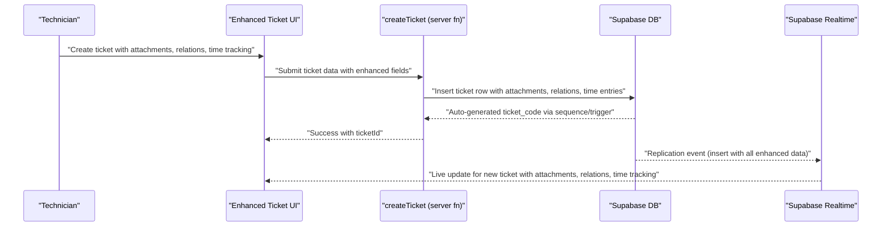

**Diagram sources**

- [CreateTicketModal.tsx:196-231](file://src/components/pcready/CreateTicketModal.tsx#L196-L231)
- [tickets.ts](file://src/lib/tickets.ts)
- [20260430154500_ticket_code_sequence_trigger.sql](file://supabase/migrations/20260430154500_ticket_code_sequence_trigger.sql)
- [20260515150000_realtime_ticket_device_assignments.sql](file://supabase/migrations/20260515150000_realtime_ticket_device_assignments.sql)

## Detailed Component Analysis

### Ticket Creation Workflow (CreateTicketModal)

Key behaviors:

- Field validation: Ensures client, requester, and device selection when applicable.
- Template-driven checklist: Loads selected template structure or defaults.
- Client/device/contact resolution: Fetches and caches selections to avoid redundant network calls.
- Attachment integration: Allows file uploads during ticket creation with drag-and-drop support.
- Relation setup: Enables creating ticket dependencies during initial creation.
- Submission: Calls createTicket server function, handles errors, and notifies users.
- Notifications and emails: Triggers notifications and optional assignee emails after successful creation.

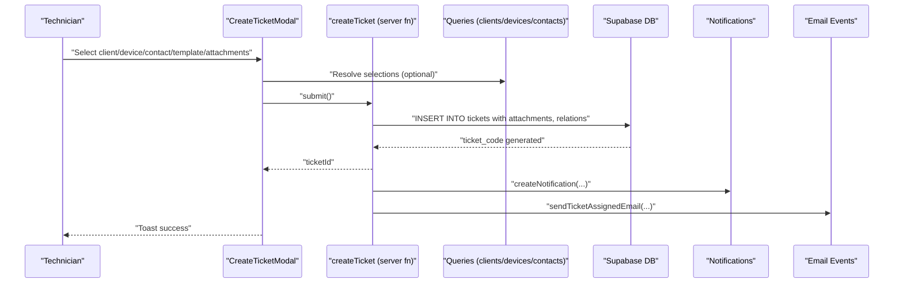

**Diagram sources**

- [CreateTicketModal.tsx:196-231](file://src/components/pcready/CreateTicketModal.tsx#L196-L231)
- [tickets.ts](file://src/lib/tickets.ts)
- [notifications.ts](file://src/lib/notifications.ts)
- [email-events.ts](file://src/lib/email-events.ts)

**Section sources**

- [CreateTicketModal.tsx:138-342](file://src/components/pcready/CreateTicketModal.tsx#L138-L342)
- [tickets.ts](file://src/lib/tickets.ts)

### Ticket Status Management

Status lifecycle:

- Enumerated statuses include pending, in-progress, testing, ready, completed, archived.
- Status transitions are enforced by UI actions and validated against current state metadata.
- Completion triggers a dedicated workflow that finalizes checks and sends notifications.

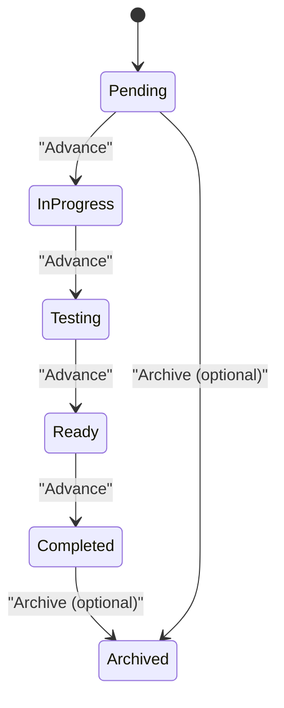

**Diagram sources**

- [20260511190000_ticket_completed_status.sql](file://supabase/migrations/20260511190000_ticket_completed_status.sql)
- [20260511193000_add_archived_status.sql](file://supabase/migrations/20260511193000_add_archived_status.sql)
- [TicketDetailModal.tsx:233-237](file://src/components/pcready/TicketDetailModal.tsx#L233-L237)
- [ticket-completion.ts](file://src/lib/ticket-completion.ts)

**Section sources**

- [TicketDetailModal.tsx:189-399](file://src/components/pcready/TicketDetailModal.tsx#L189-L399)
- [20260511180000_ticket_status_history.sql](file://supabase/migrations/20260511180000_ticket_status_history.sql)
- [20260511190000_ticket_completed_status.sql](file://supabase/migrations/20260511190000_ticket_completed_status.sql)
- [20260511193000_add_archived_status.sql](file://supabase/migrations/20260511193000_add_archived_status.sql)
- [20260511195000_add_completed_at_column.sql](file://supabase/migrations/20260511195000_add_completed_at_column.sql)

### Assignment and Priority Management

- Assignee: Selected via UI and stored as a foreign key to profiles; nullable to allow unassigned states.
- Priority: Enumerated values with labels; used for filtering and sorting.
- Type: ticket_type column supports device/support/maintenance/other categorization.

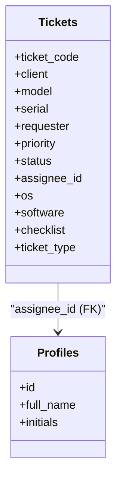

**Diagram sources**

- [20260429202127_cd9e1421-24c9-40f3-9ac6-9e2259cbb2af.sql:158-179](file://supabase/migrations/20260429202127_cd9e1421-24c9-40f3-9ac6-9e2259cbb2af.sql#L158-L179)
- [20260509134200_add_ticket_type.sql:1-19](file://supabase/migrations/20260509134200_add_ticket_type.sql#L1-L19)

**Section sources**

- [20260429202127_cd9e1421-24c9-40f3-9ac6-9e2259cbb2af.sql:158-179](file://supabase/migrations/20260429202127_cd9e1421-24c9-40f3-9ac6-9e2259cbb2af.sql#L158-L179)
- [20260509134200_add_ticket_type.sql:1-19](file://supabase/migrations/20260509134200_add_ticket_type.sql#L1-L19)

### Enhanced Checklist System Implementation

- Structure: checklist is a JSONB field storing template-defined items.
- Templates: Configurable via UI; default structure applied when none selected.
- Instance-based tracking: New ticket_checklist_instances table stores per-ticket checklist snapshots with response tracking.
- Completion tracking: Implemented in the completion workflow; UI surfaces progress and validation.
- Section assignments: Supports per-section assignment tracking and completion confirmation.

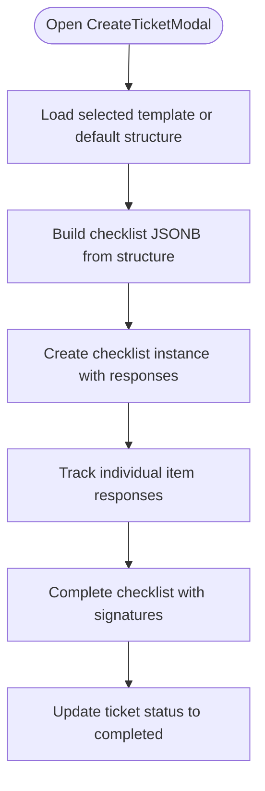

**Diagram sources**

- [CreateTicketModal.tsx:205-206](file://src/components/pcready/CreateTicketModal.tsx#L205-L206)
- [20260429202127_cd9e1421-24c9-40f3-9ac6-9e2259cbb2af.sql:171-171](file://supabase/migrations/20260429202127_cd9e1421-24c9-40f3-9ac6-9e2259cbb2af.sql#L171-L171)
- [20260522120000_ticket_checklist_instances.sql:1-103](file://supabase/migrations/20260522120000_ticket_checklist_instances.sql#L1-L103)

**Section sources**

- [CreateTicketModal.tsx:138-342](file://src/components/pcready/CreateTicketModal.tsx#L138-L342)
- [20260429202127_cd9e1421-24c9-40f3-9ac6-9e2259cbb2af.sql:171-171](file://supabase/migrations/20260429202127_cd9e1421-24c9-40f3-9ac6-9e2259cbb2af.sql#L171-L171)
- [20260522120000_ticket_checklist_instances.sql:1-103](file://supabase/migrations/20260522120000_ticket_checklist_instances.sql#L1-L103)

### Ticket Code Generation (PostgreSQL Sequences and Triggers)

- Unique allocation: A sequence and trigger ensure each inserted ticket gets a unique ticket_code, preventing concurrency collisions.
- Uniqueness constraint: ticket_code is unique at the database level.

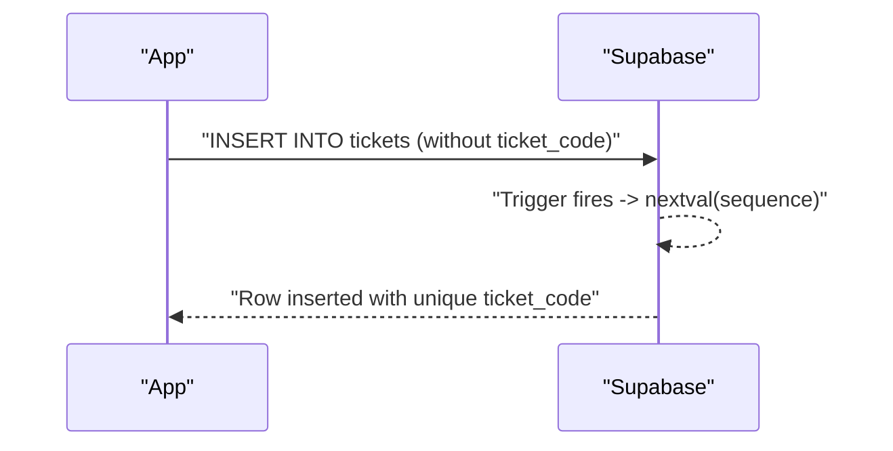

**Diagram sources**

- [20260430154500_ticket_code_sequence_trigger.sql](file://supabase/migrations/20260430154500_ticket_code_sequence_trigger.sql)
- [20260516200000_ticket_code_unique_allocation.sql](file://supabase/migrations/20260516200000_ticket_code_unique_allocation.sql)
- [20260429202127_cd9e1421-24c9-40f3-9ac6-9e2259cbb2af.sql:159-159](file://supabase/migrations/20260429202127_cd9e1421-24c9-40f3-9ac6-9e2259cbb2af.sql#L159-L159)

**Section sources**

- [20260430154500_ticket_code_sequence_trigger.sql](file://supabase/migrations/20260430154500_ticket_code_sequence_trigger.sql)
- [20260516200000_ticket_code_unique_allocation.sql](file://supabase/migrations/20260516200000_ticket_code_unique_allocation.sql)
- [20260429202127_cd9e1421-24c9-40f3-9ac6-9e2259cbb2af.sql:159-159](file://supabase/migrations/20260429202127_cd9e1421-24c9-40f3-9ac6-9e2259cbb2af.sql#L159-L159)

### Portal Ticket Creation (NewTicketForm)

- Purpose: Allow portal users to open tickets with category and urgency.
- Flow: Submits to portal-tickets server function and redirects to the new ticket page.

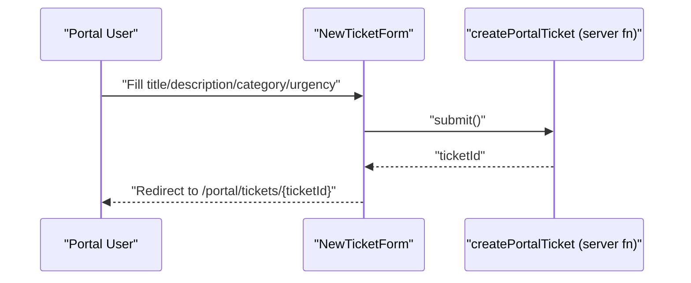

**Diagram sources**

- [NewTicketForm.tsx:16-27](file://src/components/portal/NewTicketForm.tsx#L16-L27)
- [portal-tickets.ts](file://src/lib/portal-tickets.ts)

**Section sources**

- [NewTicketForm.tsx:1-28](file://src/components/portal/NewTicketForm.tsx#L1-L28)
- [portal-tickets.ts](file://src/lib/portal-tickets.ts)

### Relationships with Devices, Clients, and Contacts

- Foreign keys: tickets.client_id references clients; tickets.assignee_id references profiles; device associations maintained separately but linked via device_id.
- Contact fallback: requester can be a free-form string when not selecting a contact.
- Website URL: client website stored for portal context.

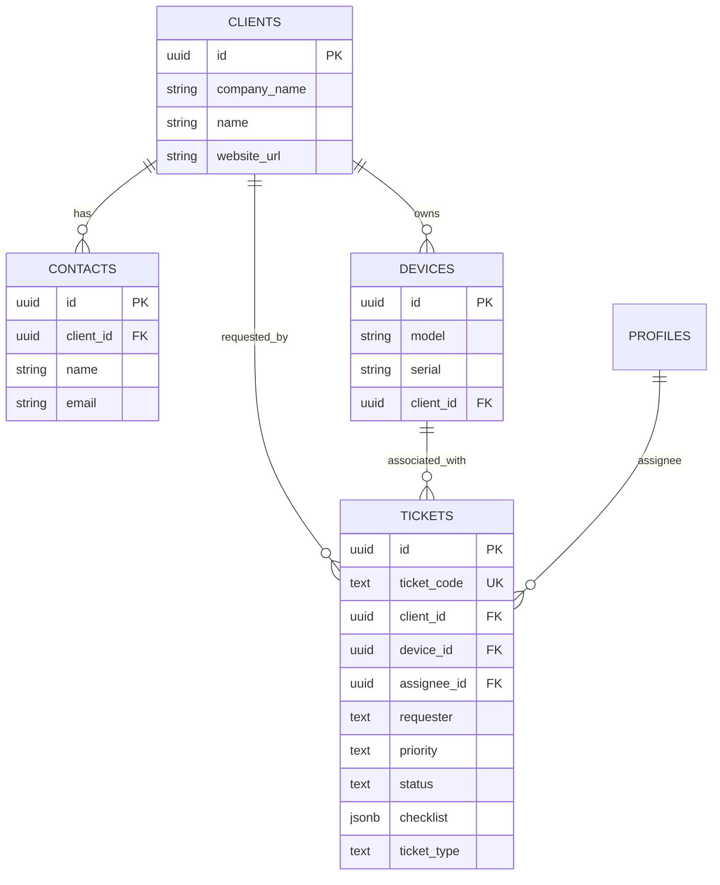

**Diagram sources**

- [20260429202127_cd9e1421-24c9-40f3-9ac6-9e2259cbb2af.sql:158-179](file://supabase/migrations/20260429202127_cd9e1421-24c9-40f3-9ac6-9e2259cbb2af.sql#L158-L179)
- [20260514170000_add_client_website_url.sql](file://supabase/migrations/20260514170000_add_client_website_url.sql)

**Section sources**

- [20260429202127_cd9e1421-24c9-40f3-9ac6-9e2259cbb2af.sql:158-179](file://supabase/migrations/20260429202127_cd9e1421-24c9-40f3-9ac6-9e2259cbb2af.sql#L158-L179)
- [20260514170000_add_client_website_url.sql](file://supabase/migrations/20260514170000_add_client_website_url.sql)

### Configuration Options

- Templates: Selectable checklist templates loaded in CreateTicketModal; default structure applied when none chosen.
- Status transitions: Controlled by UI metadata and enforced by the completion workflow.
- Priority levels: Enumerated with labels; used for filtering and display.
- WIP limits: App settings support work-in-progress limits for technicians.

**Section sources**

- [CreateTicketModal.tsx:138-342](file://src/components/pcready/CreateTicketModal.tsx#L138-L342)
- [20260515120000_add_wip_limits_app_setting.sql](file://supabase/migrations/20260515120000_add_wip_limits_app_setting.sql)
- [app-settings.ts](file://src/lib/app-settings.ts)

## Enhanced Features

### Attachment Handling System

The system now includes comprehensive file attachment management:

- Storage integration: Uses Supabase Storage with ticket-documents bucket for secure file handling.
- Multi-format support: Handles images, PDFs, and various document types with MIME type detection.
- Drag-and-drop upload: Intuitive drag-and-drop interface with file selection support.
- Preview functionality: Generates signed URLs for secure file previews in new tabs.
- Download capability: Provides direct download links with proper file naming.
- Permission control: Enforces role-based access with tech/admin privileges.
- Metadata tracking: Stores file size, MIME type, uploader information, and timestamps.

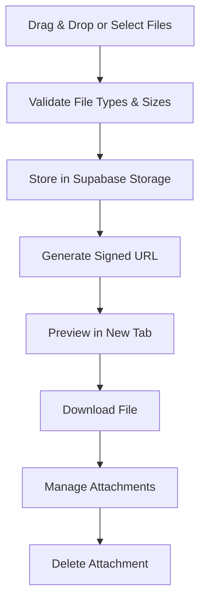

**Diagram sources**

- [TicketAttachments.tsx:80-120](file://src/components/tickets/TicketAttachments.tsx#L80-L120)
- [ticketAttachments.ts:29-118](file://src/lib/queries/ticketAttachments.ts#L29-L118)
- [20260516120000_ticket_detail_attachments.sql:6-18](file://supabase/migrations/20260516120000_ticket_detail_attachments.sql#L6-L18)

**Section sources**

- [TicketAttachments.tsx:1-276](file://src/components/tickets/TicketAttachments.tsx#L1-L276)
- [ticketAttachments.ts:1-160](file://src/lib/queries/ticketAttachments.ts#L1-L160)
- [20260516120000_ticket_detail_attachments.sql:1-34](file://supabase/migrations/20260516120000_ticket_detail_attachments.sql#L1-L34)

### Ticket Relations Management

Supports complex ticket dependency relationships:

- Relation types: blocked_by (dependency), duplicate_of (duplicate detection), child_of (hierarchical relationships).
- Bidirectional linking: Automatic reverse relationship handling for intuitive management.
- Search integration: Real-time ticket search with code, model, and client filtering.
- Status visualization: Shows related ticket status and important details.
- Permission enforcement: Role-based access control for creating and removing relations.
- Duplicate prevention: Unique constraints prevent circular or duplicate relationships.

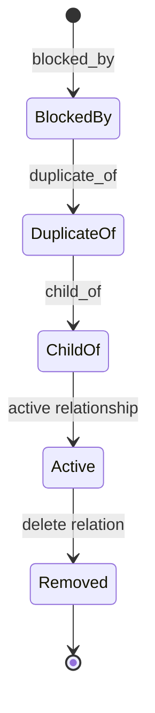

**Diagram sources**

- [TicketRelations.tsx:51-71](file://src/components/tickets/TicketRelations.tsx#L51-L71)
- [ticketRelations.ts:1-200](file://src/lib/queries/ticketRelations.ts#L1-L200)
- [20260516130000_ticket_relations_time_tracking.sql:3-13](file://supabase/migrations/20260516130000_ticket_relations_time_tracking.sql#L3-L13)

**Section sources**

- [TicketRelations.tsx:1-154](file://src/components/tickets/TicketRelations.tsx#L1-L154)
- [ticketRelations.ts:1-200](file://src/lib/queries/ticketRelations.ts#L1-L200)
- [20260516130000_ticket_relations_time_tracking.sql:1-100](file://supabase/migrations/20260516130000_ticket_relations_time_tracking.sql#L1-L100)

### Time Tracking System

Comprehensive work time logging and tracking:

- Automatic timers: One active timer per technician per ticket with auto-stop/start logic.
- Manual entries: Support for historical time entries with custom date ranges.
- Duration calculation: Automatic minute calculation with real-time updates.
- Activity visualization: Shows who worked when with user initials and descriptions.
- Permission control: Only owners or admins can modify time entries.
- Integration: Seamlessly integrates with completion workflow and reporting.

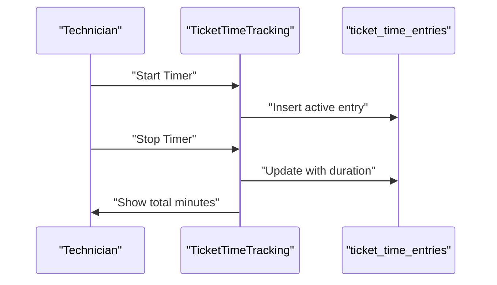

**Diagram sources**

- [TicketTimeTracking.tsx:47-66](file://src/components/tickets/TicketTimeTracking.tsx#L47-L66)
- [ticketTimeEntries.ts:1-200](file://src/lib/queries/ticketTimeEntries.ts#L1-L200)
- [20260516130000_ticket_relations_time_tracking.sql:44-55](file://supabase/migrations/20260516130000_ticket_relations_time_tracking.sql#L44-L55)

**Section sources**

- [TicketTimeTracking.tsx:1-231](file://src/components/tickets/TicketTimeTracking.tsx#L1-L231)
- [ticketTimeEntries.ts:1-200](file://src/lib/queries/ticketTimeEntries.ts#L1-L200)
- [20260516130000_ticket_relations_time_tracking.sql:1-100](file://supabase/migrations/20260516130000_ticket_relations_time_tracking.sql#L1-L100)

### Enhanced Completion Workflow

The completion workflow now includes comprehensive data collection:

- Status history: Tracks all status transitions with timestamps.
- Time entries: Aggregates total work minutes across all time entries.
- Checklist instances: Processes structured checklist data with completion tracking.
- Attachment integration: Includes attachment counts and metadata in completion reports.
- Relation tracking: Documents ticket dependencies and relationships.
- PDF generation: Creates comprehensive completion documents with all enhanced data.

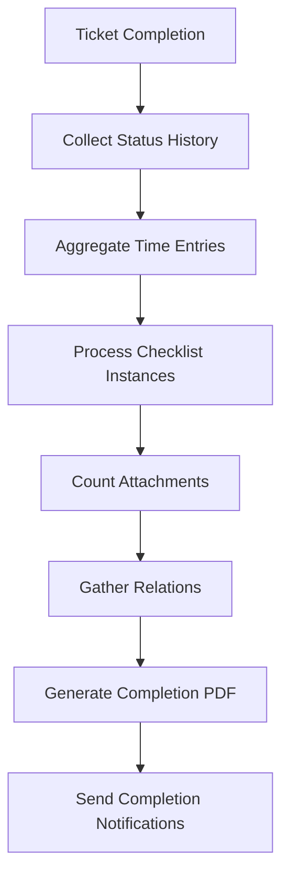

**Diagram sources**

- [ticket-completion.server.ts:136-198](file://src/lib/ticket-completion.server.ts#L136-L198)
- [ticket-completion.server.ts:1167-1214](file://src/lib/ticket-completion.server.ts#L1167-L1214)

**Section sources**

- [ticket-completion.server.ts:136-198](file://src/lib/ticket-completion.server.ts#L136-L198)
- [ticket-completion.server.ts:1167-1214](file://src/lib/ticket-completion.server.ts#L1167-L1214)

## Dependency Analysis

- UI depends on server functions for creation, completion, notifications, emails, attachments, relations, and time tracking.
- Server functions depend on Supabase schema and policies for data integrity.
- Realtime subscriptions enable live updates for tickets, device assignments, attachments, and time entries.

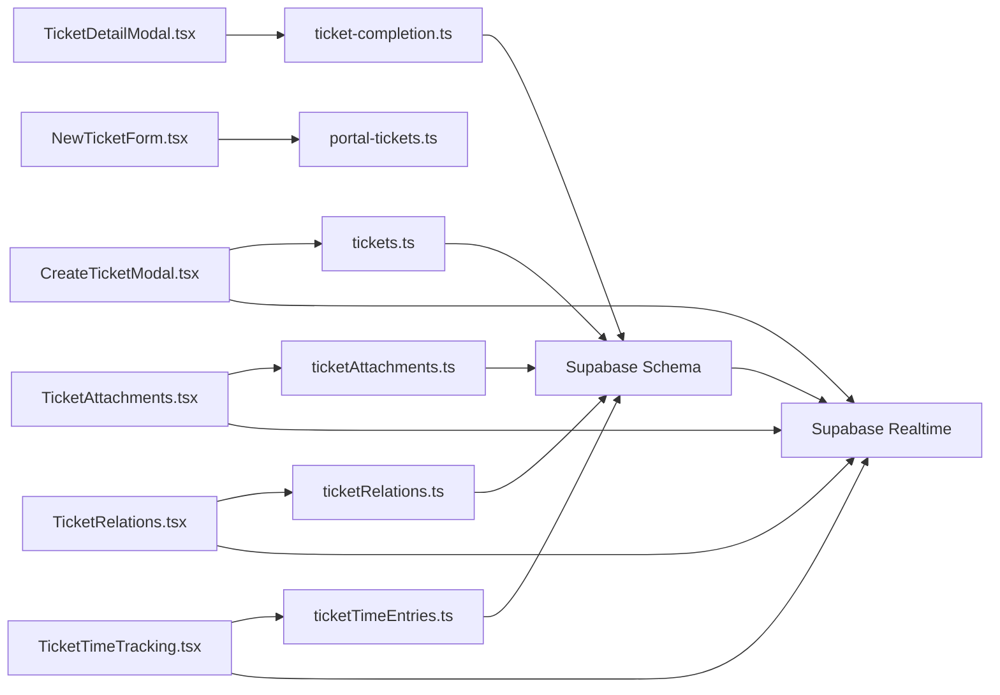

**Diagram sources**

- [CreateTicketModal.tsx:138-342](file://src/components/pcready/CreateTicketModal.tsx#L138-L342)
- [TicketDetailModal.tsx:189-399](file://src/components/pcready/TicketDetailModal.tsx#L189-L399)
- [NewTicketForm.tsx:1-28](file://src/components/portal/NewTicketForm.tsx#L1-L28)
- [TicketAttachments.tsx:1-276](file://src/components/tickets/TicketAttachments.tsx#L1-L276)
- [TicketRelations.tsx:1-154](file://src/components/tickets/TicketRelations.tsx#L1-L154)
- [TicketTimeTracking.tsx:1-231](file://src/components/tickets/TicketTimeTracking.tsx#L1-L231)
- [tickets.ts](file://src/lib/tickets.ts)
- [ticket-completion.ts](file://src/lib/ticket-completion.ts)
- [portal-tickets.ts](file://src/lib/portal-tickets.ts)
- [ticketAttachments.ts](file://src/lib/queries/ticketAttachments.ts)
- [ticketRelations.ts](file://src/lib/queries/ticketRelations.ts)
- [ticketTimeEntries.ts](file://src/lib/queries/ticketTimeEntries.ts)
- [20260515150000_realtime_ticket_device_assignments.sql](file://supabase/migrations/20260515150000_realtime_ticket_device_assignments.sql)

**Section sources**

- [CreateTicketModal.tsx:138-342](file://src/components/pcready/CreateTicketModal.tsx#L138-L342)
- [TicketDetailModal.tsx:189-399](file://src/components/pcready/TicketDetailModal.tsx#L189-L399)
- [NewTicketForm.tsx:1-28](file://src/components/portal/NewTicketForm.tsx#L1-L28)
- [TicketAttachments.tsx:1-276](file://src/components/tickets/TicketAttachments.tsx#L1-L276)
- [TicketRelations.tsx:1-154](file://src/components/tickets/TicketRelations.tsx#L1-L154)
- [TicketTimeTracking.tsx:1-231](file://src/components/tickets/TicketTimeTracking.tsx#L1-L231)
- [tickets.ts](file://src/lib/tickets.ts)
- [ticket-completion.ts](file://src/lib/ticket-completion.ts)
- [portal-tickets.ts](file://src/lib/portal-tickets.ts)
- [ticketAttachments.ts](file://src/lib/queries/ticketAttachments.ts)
- [ticketRelations.ts](file://src/lib/queries/ticketRelations.ts)
- [ticketTimeEntries.ts](file://src/lib/queries/ticketTimeEntries.ts)
- [20260515150000_realtime_ticket_device_assignments.sql](file://supabase/migrations/20260515150000_realtime_ticket_device_assignments.sql)

## Performance Considerations

- Large ticket volumes: Use paginated lists and filters (by status, priority, assignee) to reduce payload sizes.
- Real-time updates: Leverage Supabase realtime to minimize polling and keep UI synchronized for tickets, attachments, relations, and time entries.
- Concurrency: Database-level uniqueness on ticket_code prevents collisions during concurrent inserts.
- Indexing: Ensure appropriate indexes on frequently queried columns (client_id, assignee_id, status, created_at, attachment storage paths).
- Batch operations: For bulk status updates or exports, use server-side batch functions to reduce round trips.
- Storage optimization: Implement proper file cleanup policies and compression for large attachments.
- Query optimization: Use selective loading for attachments, relations, and time entries to avoid heavy payloads.

## Troubleshooting Guide

Common issues and resolutions:

- Concurrent ticket creation: Ticket code generation uses a sequence and trigger with a unique constraint; if duplicates occur, investigate trigger logic and constraints.
- Status transition conflicts: Ensure the current state matches expected transitions; the completion workflow validates state changes.
- Checklist validation: Verify template structure and checklist JSONB format; ensure completion workflow respects item completion.
- Attachment upload failures: Check file size limits, supported formats, and storage permissions; verify signed URL generation.
- Relation conflicts: Ensure unique constraints are respected; check for circular dependencies in ticket relationships.
- Time tracking issues: Verify active timer uniqueness per user per ticket; check timezone handling for manual entries.
- Permissions: Users must have edit permissions; otherwise, submission is blocked.
- Session validity: Ensure a valid access token exists before submitting.

**Section sources**

- [20260430154500_ticket_code_sequence_trigger.sql](file://supabase/migrations/20260430154500_ticket_code_sequence_trigger.sql)
- [20260516200000_ticket_code_unique_allocation.sql](file://supabase/migrations/20260516200000_ticket_code_unique_allocation.sql)
- [TicketDetailModal.tsx:189-198](file://src/components/pcready/TicketDetailModal.tsx#L189-L198)
- [CreateTicketModal.tsx:196-203](file://src/components/pcready/CreateTicketModal.tsx#L196-L203)
- [TicketAttachments.tsx:80-120](file://src/components/tickets/TicketAttachments.tsx#L80-L120)
- [TicketRelations.tsx:51-71](file://src/components/tickets/TicketRelations.tsx#L51-L71)
- [TicketTimeTracking.tsx:47-66](file://src/components/tickets/TicketTimeTracking.tsx#L47-L66)

## Conclusion

The enhanced ticket management system combines robust frontend components with server-side orchestration and database-level guarantees. It now supports comprehensive file attachments, complex ticket relationships, automated time tracking, structured checklist instances, and enhanced completion workflows. The system maintains strong concurrency protection for ticket codes while adding powerful collaboration and tracking capabilities. Administrators can configure templates, priorities, WIP limits, and attachment policies, while technicians benefit from streamlined creation, status management, and comprehensive work tracking workflows.

## Appendices

### Appendix A: Example References

- Ticket creation submission flow: [CreateTicketModal.tsx:196-231](file://src/components/pcready/CreateTicketModal.tsx#L196-L231)
- Status advancement and completion: [TicketDetailModal.tsx:233-237](file://src/components/pcready/TicketDetailModal.tsx#L233-L237)
- Portal ticket creation: [NewTicketForm.tsx:16-27](file://src/components/portal/NewTicketForm.tsx#L16-L27)
- Attachment handling: [TicketAttachments.tsx:1-276](file://src/components/tickets/TicketAttachments.tsx#L1-L276)
- Relation management: [TicketRelations.tsx:1-154](file://src/components/tickets/TicketRelations.tsx#L1-L154)
- Time tracking: [TicketTimeTracking.tsx:1-231](file://src/components/tickets/TicketTimeTracking.tsx#L1-L231)
- Server function for tickets: [tickets.ts](file://src/lib/tickets.ts)
- Server function for portal tickets: [portal-tickets.ts](file://src/lib/portal-tickets.ts)
- Completion workflow: [ticket-completion.ts](file://src/lib/ticket-completion.ts)
- Database schema and constraints: [20260429202127_cd9e1421-24c9-40f3-9ac6-9e2259cbb2af.sql:158-179](file://supabase/migrations/20260429202127_cd9e1421-24c9-40f3-9ac6-9e2259cbb2af.sql#L158-L179)
- Ticket code generation: [20260430154500_ticket_code_sequence_trigger.sql](file://supabase/migrations/20260430154500_ticket_code_sequence_trigger.sql), [20260516200000_ticket_code_unique_allocation.sql](file://supabase/migrations/20260516200000_ticket_code_unique_allocation.sql)
- Status history and completion/archived states: [20260511180000_ticket_status_history.sql](file://supabase/migrations/20260511180000_ticket_status_history.sql), [20260511190000_ticket_completed_status.sql](file://supabase/migrations/20260511190000_ticket_completed_status.sql), [20260511193000_add_archived_status.sql](file://supabase/migrations/20260511193000_add_archived_status.sql), [20260511195000_add_completed_at_column.sql](file://supabase/migrations/20260511195000_add_completed_at_column.sql)
- Attachment storage: [20260516120000_ticket_detail_attachments.sql](file://supabase/migrations/20260516120000_ticket_detail_attachments.sql)
- Relations and time tracking: [20260516130000_ticket_relations_time_tracking.sql](file://supabase/migrations/20260516130000_ticket_relations_time_tracking.sql)
- Checklist instances: [20260522120000_ticket_checklist_instances.sql](file://supabase/migrations/20260522120000_ticket_checklist_instances.sql)
- Realtime updates: [20260515150000_realtime_ticket_device_assignments.sql](file://supabase/migrations/20260515150000_realtime_ticket_device_assignments.sql)
