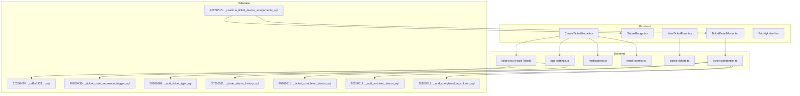
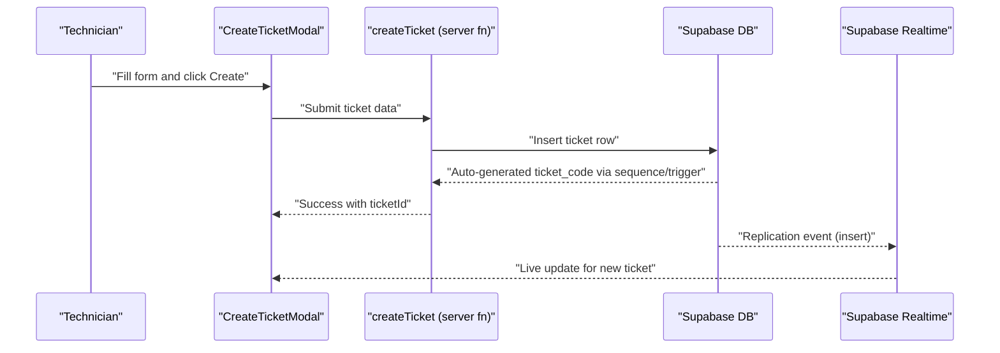
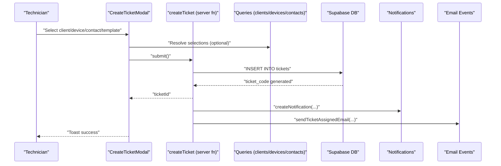
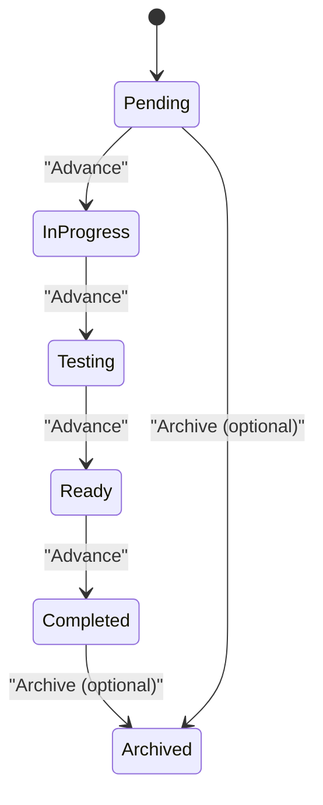
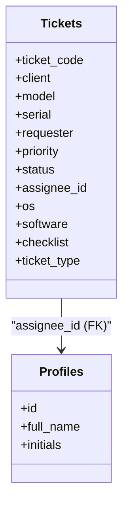
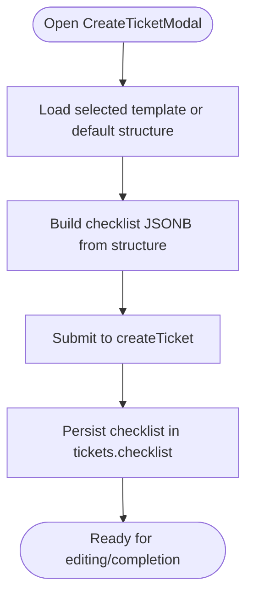
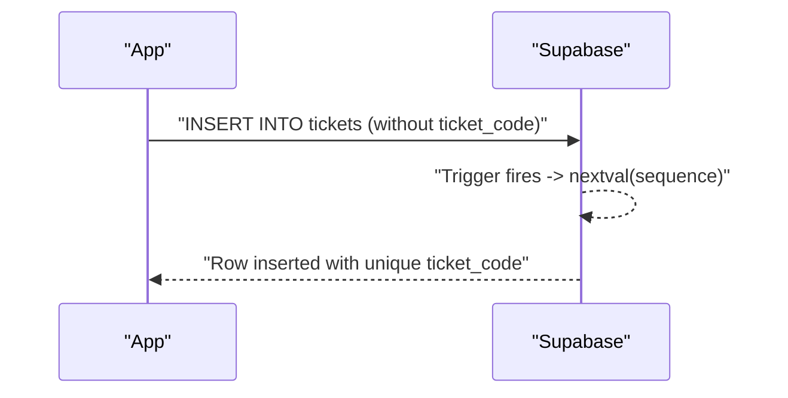
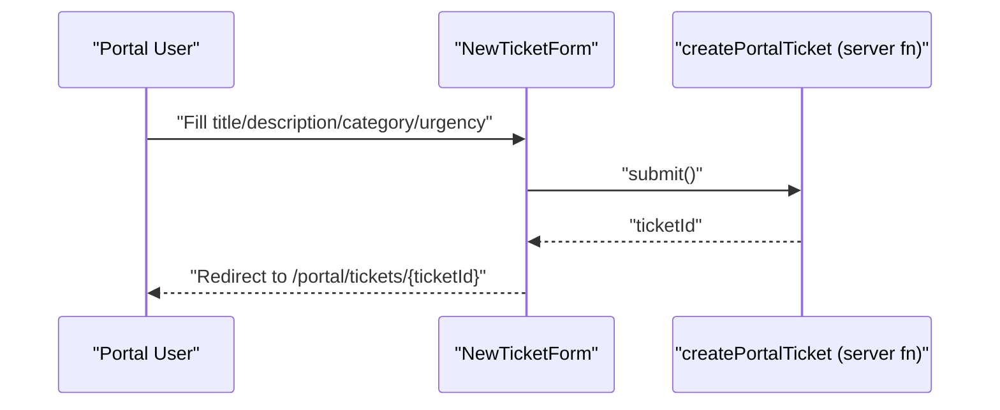
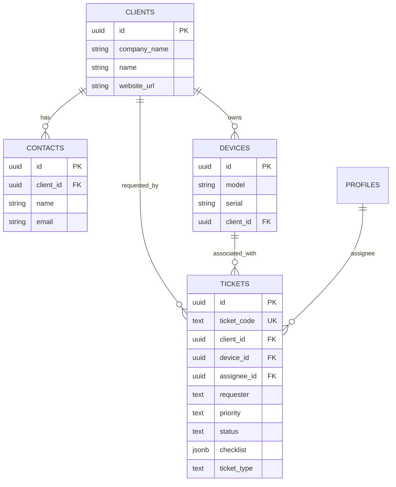
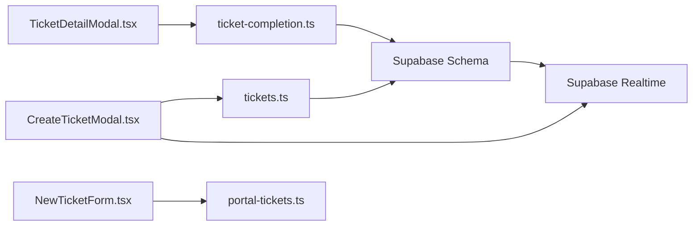

# Ticket Management System

<cite>
**Referenced Files in This Document**
- [CreateTicketModal.tsx](file://src/components/pcready/CreateTicketModal.tsx)
- [TicketDetailModal.tsx](file://src/components/pcready/TicketDetailModal.tsx)
- [NewTicketForm.tsx](file://src/components/portal/NewTicketForm.tsx)
- [tickets.tsx](file://src/routes/_app/tickets.tsx)
- [20260429202127_cd9e1421-24c9-40f3-9ac6-9e2259cbb2af.sql](file://supabase/migrations/20260429202127_cd9e1421-24c9-40f3-9ac6-9e2259cbb2af.sql)
- [20260430154500_ticket_code_sequence_trigger.sql](file://supabase/migrations/20260430154500_ticket_code_sequence_trigger.sql)
- [20260509134200_add_ticket_type.sql](file://supabase/migrations/20260509134200_add_ticket_type.sql)
- [20260511180000_ticket_status_history.sql](file://supabase/migrations/20260511180000_ticket_status_history.sql)
- [20260511190000_ticket_completed_status.sql](file://supabase/migrations/20260511190000_ticket_completed_status.sql)
- [20260511193000_add_archived_status.sql](file://supabase/migrations/20260511193000_add_archived_status.sql)
- [20260511195000_add_completed_at_column.sql](file://supabase/migrations/20260511195000_add_completed_at_column.sql)
- [20260514170000_add_client_website_url.sql](file://supabase/migrations/20260514170000_add_client_website_url.sql)
- [20260514210000_tickets_tech_delete_policy.sql](file://supabase/migrations/20260514210000_tickets_tech_delete_policy.sql)
- [20260515120000_add_wip_limits_app_setting.sql](file://supabase/migrations/20260515120000_add_wip_limits_app_setting.sql)
- [20260515150000_realtime_ticket_device_assignments.sql](file://supabase/migrations/20260515150000_realtime_ticket_device_assignments.sql)
- [20260516200000_ticket_code_unique_allocation.sql](file://supabase/migrations/20260516200000_ticket_code_unique_allocation.sql)
- [tickets.ts](file://src/lib/tickets.ts)
- [ticket-completion.ts](file://src/lib/ticket-completion.ts)
- [use-tickets.tsx](file://src/hooks/use-tickets.tsx)
- [status-history.ts](file://src/lib/ticket-completion.server.ts)
- [portal-tickets.ts](file://src/lib/portal-tickets.ts)
- [app-settings.ts](file://src/lib/app-settings.ts)
- [notifications.ts](file://src/lib/notifications.ts)
- [email-events.ts](file://src/lib/email-events.ts)
- [types.ts](file://src/integrations/supabase/types.ts)
- [StatusBadge.tsx](file://src/components/pcready/StatusBadge.tsx)
- [PriorityLabel.tsx](file://src/components/pcready/PriorityLabel.tsx)
</cite>

## Table of Contents
1. [Introduction](#introduction)
2. [Project Structure](#project-structure)
3. [Core Components](#core-components)
4. [Architecture Overview](#architecture-overview)
5. [Detailed Component Analysis](#detailed-component-analysis)
6. [Dependency Analysis](#dependency-analysis)
7. [Performance Considerations](#performance-considerations)
8. [Troubleshooting Guide](#troubleshooting-guide)
9. [Conclusion](#conclusion)
10. [Appendices](#appendices)

## Introduction
This document explains the ticket management system with a focus on the end-to-end lifecycle: creation via CreateTicketModal, status progression, assignment and priority controls, checklist templates, code generation, and real-time updates. It also covers configuration options for templates, status transitions, and priorities, and clarifies relationships with clients, devices, and contacts through foreign keys. Guidance is provided for both technicians and administrators, including concurrency prevention, checklist validation, and performance considerations for large volumes.

## Project Structure
The ticket system spans frontend components, server-side functions, and backend schema/migrations. Key areas:
- Frontend UI: CreateTicketModal, TicketDetailModal, NewTicketForm, StatusBadge, PriorityLabel
- Backend logic: createTicket server function, ticket completion workflow, portal ticket creation
- Database: tickets table, enums, sequences, triggers, and history tables
- Realtime: Supabase replication and subscriptions for live updates

**Diagram sources**
- [CreateTicketModal.tsx:138-342](file://src/components/pcready/CreateTicketModal.tsx#L138-L342)
- [TicketDetailModal.tsx:189-399](file://src/components/pcready/TicketDetailModal.tsx#L189-L399)
- [NewTicketForm.tsx:1-28](file://src/components/portal/NewTicketForm.tsx#L1-L28)
- [tickets.ts](file://src/lib/tickets.ts)
- [ticket-completion.ts](file://src/lib/ticket-completion.ts)
- [portal-tickets.ts](file://src/lib/portal-tickets.ts)
- [20260429202127_cd9e1421-24c9-40f3-9ac6-9e2259cbb2af.sql:158-179](file://supabase/migrations/20260429202127_cd9e1421-24c9-40f3-9ac6-9e2259cbb2af.sql#L158-L179)
- [20260430154500_ticket_code_sequence_trigger.sql](file://supabase/migrations/20260430154500_ticket_code_sequence_trigger.sql)
- [20260509134200_add_ticket_type.sql:1-19](file://supabase/migrations/20260509134200_add_ticket_type.sql#L1-L19)
- [20260511180000_ticket_status_history.sql](file://supabase/migrations/20260511180000_ticket_status_history.sql)
- [20260511190000_ticket_completed_status.sql](file://supabase/migrations/20260511190000_ticket_completed_status.sql)
- [20260511193000_add_archived_status.sql](file://supabase/migrations/20260511193000_add_archived_status.sql)
- [20260511195000_add_completed_at_column.sql](file://supabase/migrations/20260511195000_add_completed_at_column.sql)
- [20260515150000_realtime_ticket_device_assignments.sql](file://supabase/migrations/20260515150000_realtime_ticket_device_assignments.sql)

**Section sources**
- [CreateTicketModal.tsx:138-342](file://src/components/pcready/CreateTicketModal.tsx#L138-L342)
- [TicketDetailModal.tsx:189-399](file://src/components/pcready/TicketDetailModal.tsx#L189-L399)
- [NewTicketForm.tsx:1-28](file://src/components/portal/NewTicketForm.tsx#L1-L28)
- [tickets.ts](file://src/lib/tickets.ts)
- [ticket-completion.ts](file://src/lib/ticket-completion.ts)
- [portal-tickets.ts](file://src/lib/portal-tickets.ts)
- [20260429202127_cd9e1421-24c9-40f3-9ac6-9e2259cbb2af.sql:158-179](file://supabase/migrations/20260429202127_cd9e1421-24c9-40f3-9ac6-9e2259cbb2af.sql#L158-L179)
- [20260430154500_ticket_code_sequence_trigger.sql](file://supabase/migrations/20260430154500_ticket_code_sequence_trigger.sql)
- [20260509134200_add_ticket_type.sql:1-19](file://supabase/migrations/20260509134200_add_ticket_type.sql#L1-L19)
- [20260511180000_ticket_status_history.sql](file://supabase/migrations/20260511180000_ticket_status_history.sql)
- [20260511190000_ticket_completed_status.sql](file://supabase/migrations/20260511190000_ticket_completed_status.sql)
- [20260511193000_add_archived_status.sql](file://supabase/migrations/20260511193000_add_archived_status.sql)
- [20260511195000_add_completed_at_column.sql](file://supabase/migrations/20260511195000_add_completed_at_column.sql)
- [20260515150000_realtime_ticket_device_assignments.sql](file://supabase/migrations/20260515150000_realtime_ticket_device_assignments.sql)

## Core Components
- CreateTicketModal: Guides technicians through requester, priority, assignee, OS/software, checklist templates, and submission. It validates required fields and integrates with server functions for creation and notifications.
- TicketDetailModal: Displays ticket details, supports status advancement, and triggers completion workflow upon moving to completed.
- NewTicketForm (Portal): Allows portal users to create tickets with category and urgency; delegates to portal-tickets server function.
- Server functions: createTicket, portal-tickets, ticket-completion, app-settings, notifications, email-events.
- Database schema: tickets table with enums for status and priority, sequences/triggers for code generation, and history tables for status tracking.

**Section sources**
- [CreateTicketModal.tsx:138-342](file://src/components/pcready/CreateTicketModal.tsx#L138-L342)
- [TicketDetailModal.tsx:189-399](file://src/components/pcready/TicketDetailModal.tsx#L189-L399)
- [NewTicketForm.tsx:1-28](file://src/components/portal/NewTicketForm.tsx#L1-L28)
- [tickets.ts](file://src/lib/tickets.ts)
- [ticket-completion.ts](file://src/lib/ticket-completion.ts)
- [portal-tickets.ts](file://src/lib/portal-tickets.ts)
- [20260429202127_cd9e1421-24c9-40f3-9ac6-9e2259cbb2af.sql:158-179](file://supabase/migrations/20260429202127_cd9e1421-24c9-40f3-9ac6-9e2259cbb2af.sql#L158-L179)

## Architecture Overview
The system follows a layered architecture:
- UI layer: Modals and forms collect inputs and trigger server functions.
- Application layer: Server functions orchestrate data validation, persistence, and notifications.
- Data layer: Supabase schema defines entities, enums, constraints, and triggers for code generation.
- Realtime layer: Supabase replication enables live updates for tickets and assignments.

**Diagram sources**
- [CreateTicketModal.tsx:196-231](file://src/components/pcready/CreateTicketModal.tsx#L196-L231)
- [tickets.ts](file://src/lib/tickets.ts)
- [20260430154500_ticket_code_sequence_trigger.sql](file://supabase/migrations/20260430154500_ticket_code_sequence_trigger.sql)
- [20260515150000_realtime_ticket_device_assignments.sql](file://supabase/migrations/20260515150000_realtime_ticket_device_assignments.sql)

## Detailed Component Analysis

### Ticket Creation Workflow (CreateTicketModal)
Key behaviors:
- Field validation: Ensures client, requester, and device selection when applicable.
- Template-driven checklist: Loads selected template structure or defaults.
- Client/device/contact resolution: Fetches and caches selections to avoid redundant network calls.
- Submission: Calls createTicket server function, handles errors, and notifies users.
- Notifications and emails: Triggers notifications and optional assignee emails after successful creation.

**Diagram sources**
- [CreateTicketModal.tsx:196-231](file://src/components/pcready/CreateTicketModal.tsx#L196-L231)
- [tickets.ts](file://src/lib/tickets.ts)
- [notifications.ts](file://src/lib/notifications.ts)
- [email-events.ts](file://src/lib/email-events.ts)

**Section sources**
- [CreateTicketModal.tsx:138-342](file://src/components/pcready/CreateTicketModal.tsx#L138-L342)
- [tickets.ts](file://src/lib/tickets.ts)

### Ticket Status Management
Status lifecycle:
- Enumerated statuses include pending, in-progress, testing, ready, completed, archived.
- Status transitions are enforced by UI actions and validated against current state metadata.
- Completion triggers a dedicated workflow that finalizes checks and sends notifications.

**Diagram sources**
- [20260511190000_ticket_completed_status.sql](file://supabase/migrations/20260511190000_ticket_completed_status.sql)
- [20260511193000_add_archived_status.sql](file://supabase/migrations/20260511193000_add_archived_status.sql)
- [TicketDetailModal.tsx:233-237](file://src/components/pcready/TicketDetailModal.tsx#L233-L237)
- [ticket-completion.ts](file://src/lib/ticket-completion.ts)

**Section sources**
- [TicketDetailModal.tsx:189-399](file://src/components/pcready/TicketDetailModal.tsx#L189-L399)
- [20260511180000_ticket_status_history.sql](file://supabase/migrations/20260511180000_ticket_status_history.sql)
- [20260511190000_ticket_completed_status.sql](file://supabase/migrations/20260511190000_ticket_completed_status.sql)
- [20260511193000_add_archived_status.sql](file://supabase/migrations/20260511193000_add_archived_status.sql)
- [20260511195000_add_completed_at_column.sql](file://supabase/migrations/20260511195000_add_completed_at_column.sql)

### Assignment and Priority Management
- Assignee: Selected via UI and stored as a foreign key to profiles; nullable to allow unassigned states.
- Priority: Enumerated values with labels; used for filtering and sorting.
- Type: ticket_type column supports device/support/maintenance/other categorization.

**Diagram sources**
- [20260429202127_cd9e1421-24c9-40f3-9ac6-9e2259cbb2af.sql:158-179](file://supabase/migrations/20260429202127_cd9e1421-24c9-40f3-9ac6-9e2259cbb2af.sql#L158-L179)
- [20260509134200_add_ticket_type.sql:1-19](file://supabase/migrations/20260509134200_add_ticket_type.sql#L1-L19)

**Section sources**
- [20260429202127_cd9e1421-24c9-40f3-9ac6-9e2259cbb2af.sql:158-179](file://supabase/migrations/20260429202127_cd9e1421-24c9-40f3-9ac6-9e2259cbb2af.sql#L158-L179)
- [20260509134200_add_ticket_type.sql:1-19](file://supabase/migrations/20260509134200_add_ticket_type.sql#L1-L19)

### Checklist System Implementation
- Structure: checklist is a JSONB field storing template-defined items.
- Templates: Configurable via UI; default structure applied when none selected.
- Completion tracking: Implemented in the completion workflow; UI surfaces progress and validation.

**Diagram sources**
- [CreateTicketModal.tsx:205-206](file://src/components/pcready/CreateTicketModal.tsx#L205-L206)
- [20260429202127_cd9e1421-24c9-40f3-9ac6-9e2259cbb2af.sql:171-171](file://supabase/migrations/20260429202127_cd9e1421-24c9-40f3-9ac6-9e2259cbb2af.sql#L171-L171)

**Section sources**
- [CreateTicketModal.tsx:138-342](file://src/components/pcready/CreateTicketModal.tsx#L138-L342)
- [20260429202127_cd9e1421-24c9-40f3-9ac6-9e2259cbb2af.sql:171-171](file://supabase/migrations/20260429202127_cd9e1421-24c9-40f3-9ac6-9e2259cbb2af.sql#L171-L171)

### Ticket Code Generation (PostgreSQL Sequences and Triggers)
- Unique allocation: A sequence and trigger ensure each inserted ticket gets a unique ticket_code, preventing concurrency collisions.
- Uniqueness constraint: ticket_code is unique at the database level.

**Diagram sources**
- [20260430154500_ticket_code_sequence_trigger.sql](file://supabase/migrations/20260430154500_ticket_code_sequence_trigger.sql)
- [20260516200000_ticket_code_unique_allocation.sql](file://supabase/migrations/20260516200000_ticket_code_unique_allocation.sql)
- [20260429202127_cd9e1421-24c9-40f3-9ac6-9e2259cbb2af.sql:159-159](file://supabase/migrations/20260429202127_cd9e1421-24c9-40f3-9ac6-9e2259cbb2af.sql#L159-L159)

**Section sources**
- [20260430154500_ticket_code_sequence_trigger.sql](file://supabase/migrations/20260430154500_ticket_code_sequence_trigger.sql)
- [20260516200000_ticket_code_unique_allocation.sql](file://supabase/migrations/20260516200000_ticket_code_unique_allocation.sql)
- [20260429202127_cd9e1421-24c9-40f3-9ac6-9e2259cbb2af.sql:159-159](file://supabase/migrations/20260429202127_cd9e1421-24c9-40f3-9ac6-9e2259cbb2af.sql#L159-L159)

### Portal Ticket Creation (NewTicketForm)
- Purpose: Allow portal users to open tickets with category and urgency.
- Flow: Submits to portal-tickets server function and redirects to the new ticket page.

**Diagram sources**
- [NewTicketForm.tsx:16-27](file://src/components/portal/NewTicketForm.tsx#L16-L27)
- [portal-tickets.ts](file://src/lib/portal-tickets.ts)

**Section sources**
- [NewTicketForm.tsx:1-28](file://src/components/portal/NewTicketForm.tsx#L1-L28)
- [portal-tickets.ts](file://src/lib/portal-tickets.ts)

### Relationships with Devices, Clients, and Contacts
- Foreign keys: tickets.client_id references clients; tickets.assignee_id references profiles; device associations maintained separately but linked via device_id.
- Contact fallback: requester can be a free-form string when not selecting a contact.
- Website URL: client website stored for portal context.

**Diagram sources**
- [20260429202127_cd9e1421-24c9-40f3-9ac6-9e2259cbb2af.sql:158-179](file://supabase/migrations/20260429202127_cd9e1421-24c9-40f3-9ac6-9e2259cbb2af.sql#L158-L179)
- [20260514170000_add_client_website_url.sql](file://supabase/migrations/20260514170000_add_client_website_url.sql)

**Section sources**
- [20260429202127_cd9e1421-24c9-40f3-9ac6-9e2259cbb2af.sql:158-179](file://supabase/migrations/20260429202127_cd9e1421-24c9-40f3-9ac6-9e2259cbb2af.sql#L158-L179)
- [20260514170000_add_client_website_url.sql](file://supabase/migrations/20260514170000_add_client_website_url.sql)

### Configuration Options
- Templates: Selectable checklist templates loaded in CreateTicketModal; default structure applied when none chosen.
- Status transitions: Controlled by UI metadata and enforced by the completion workflow.
- Priority levels: Enumerated with labels; used for filtering and display.
- WIP limits: App settings support work-in-progress limits for technicians.

**Section sources**
- [CreateTicketModal.tsx:138-342](file://src/components/pcready/CreateTicketModal.tsx#L138-L342)
- [20260515120000_add_wip_limits_app_setting.sql](file://supabase/migrations/20260515120000_add_wip_limits_app_setting.sql)
- [app-settings.ts](file://src/lib/app-settings.ts)

## Dependency Analysis
- UI depends on server functions for creation, completion, notifications, and emails.
- Server functions depend on Supabase schema and policies for data integrity.
- Realtime subscriptions enable live updates for tickets and device assignments.

**Diagram sources**
- [CreateTicketModal.tsx:138-342](file://src/components/pcready/CreateTicketModal.tsx#L138-L342)
- [TicketDetailModal.tsx:189-399](file://src/components/pcready/TicketDetailModal.tsx#L189-L399)
- [NewTicketForm.tsx:1-28](file://src/components/portal/NewTicketForm.tsx#L1-L28)
- [tickets.ts](file://src/lib/tickets.ts)
- [ticket-completion.ts](file://src/lib/ticket-completion.ts)
- [portal-tickets.ts](file://src/lib/portal-tickets.ts)
- [20260515150000_realtime_ticket_device_assignments.sql](file://supabase/migrations/20260515150000_realtime_ticket_device_assignments.sql)

**Section sources**
- [CreateTicketModal.tsx:138-342](file://src/components/pcready/CreateTicketModal.tsx#L138-L342)
- [TicketDetailModal.tsx:189-399](file://src/components/pcready/TicketDetailModal.tsx#L189-L399)
- [NewTicketForm.tsx:1-28](file://src/components/portal/NewTicketForm.tsx#L1-L28)
- [tickets.ts](file://src/lib/tickets.ts)
- [ticket-completion.ts](file://src/lib/ticket-completion.ts)
- [portal-tickets.ts](file://src/lib/portal-tickets.ts)
- [20260515150000_realtime_ticket_device_assignments.sql](file://supabase/migrations/20260515150000_realtime_ticket_device_assignments.sql)

## Performance Considerations
- Large ticket volumes: Use paginated lists and filters (by status, priority, assignee) to reduce payload sizes.
- Real-time updates: Leverage Supabase realtime to minimize polling and keep UI synchronized.
- Concurrency: Database-level uniqueness on ticket_code prevents collisions during concurrent inserts.
- Indexing: Ensure appropriate indexes on frequently queried columns (client_id, assignee_id, status, created_at).
- Batch operations: For bulk status updates or exports, use server-side batch functions to reduce round trips.

[No sources needed since this section provides general guidance]

## Troubleshooting Guide
Common issues and resolutions:
- Concurrent ticket creation: Ticket code generation uses a sequence and trigger with a unique constraint; if duplicates occur, investigate trigger logic and constraints.
- Status transition conflicts: Ensure the current state matches expected transitions; the completion workflow validates state changes.
- Checklist validation: Verify template structure and checklist JSONB format; ensure completion workflow respects item completion.
- Permissions: Users must have edit permissions; otherwise, submission is blocked.
- Session validity: Ensure a valid access token exists before submitting.

**Section sources**
- [20260430154500_ticket_code_sequence_trigger.sql](file://supabase/migrations/20260430154500_ticket_code_sequence_trigger.sql)
- [20260516200000_ticket_code_unique_allocation.sql](file://supabase/migrations/20260516200000_ticket_code_unique_allocation.sql)
- [TicketDetailModal.tsx:189-198](file://src/components/pcready/TicketDetailModal.tsx#L189-L198)
- [CreateTicketModal.tsx:196-203](file://src/components/pcready/CreateTicketModal.tsx#L196-L203)

## Conclusion
The ticket management system combines robust frontend components with server-side orchestration and database-level guarantees. It supports flexible templates, controlled status transitions, strong concurrency protection for ticket codes, and real-time synchronization. Administrators can configure templates, priorities, and WIP limits, while technicians benefit from streamlined creation and status management workflows.

[No sources needed since this section summarizes without analyzing specific files]

## Appendices

### Appendix A: Example References
- Ticket creation submission flow: [CreateTicketModal.tsx:196-231](file://src/components/pcready/CreateTicketModal.tsx#L196-L231)
- Status advancement and completion: [TicketDetailModal.tsx:233-237](file://src/components/pcready/TicketDetailModal.tsx#L233-L237)
- Portal ticket creation: [NewTicketForm.tsx:16-27](file://src/components/portal/NewTicketForm.tsx#L16-L27)
- Server function for tickets: [tickets.ts](file://src/lib/tickets.ts)
- Server function for portal tickets: [portal-tickets.ts](file://src/lib/portal-tickets.ts)
- Completion workflow: [ticket-completion.ts](file://src/lib/ticket-completion.ts)
- Database schema and constraints: [20260429202127_cd9e1421-24c9-40f3-9ac6-9e2259cbb2af.sql:158-179](file://supabase/migrations/20260429202127_cd9e1421-24c9-40f3-9ac6-9e2259cbb2af.sql#L158-L179)
- Ticket code generation: [20260430154500_ticket_code_sequence_trigger.sql](file://supabase/migrations/20260430154500_ticket_code_sequence_trigger.sql), [20260516200000_ticket_code_unique_allocation.sql](file://supabase/migrations/20260516200000_ticket_code_unique_allocation.sql)
- Status history and completion/archived states: [20260511180000_ticket_status_history.sql](file://supabase/migrations/20260511180000_ticket_status_history.sql), [20260511190000_ticket_completed_status.sql](file://supabase/migrations/20260511190000_ticket_completed_status.sql), [20260511193000_add_archived_status.sql](file://supabase/migrations/20260511193000_add_archived_status.sql), [20260511195000_add_completed_at_column.sql](file://supabase/migrations/20260511195000_add_completed_at_column.sql)
- Realtime updates: [20260515150000_realtime_ticket_device_assignments.sql](file://supabase/migrations/20260515150000_realtime_ticket_device_assignments.sql)