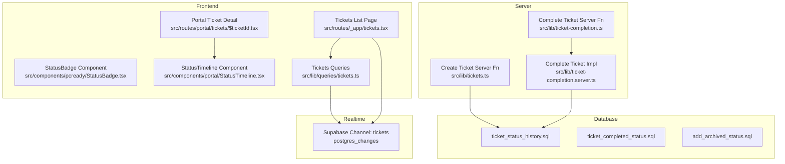
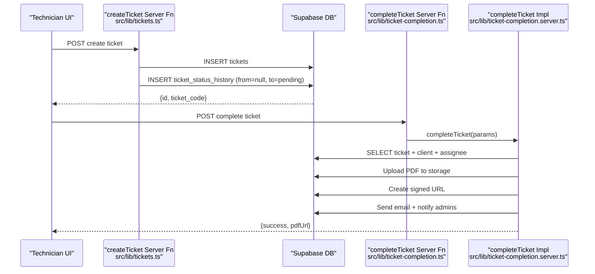
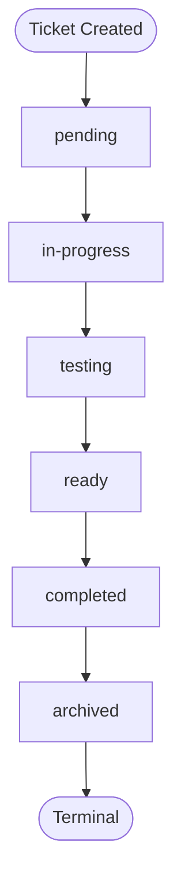
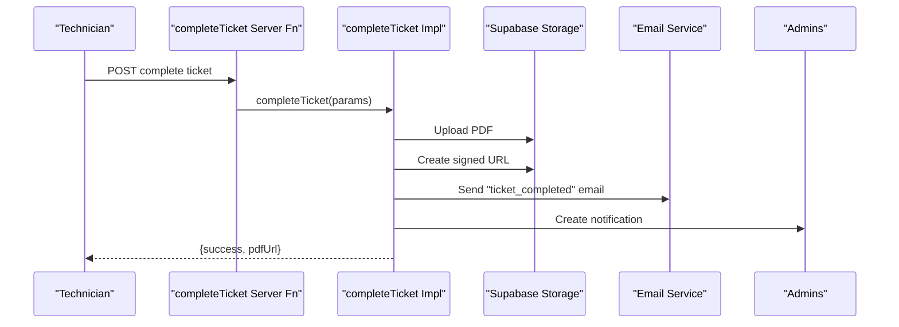
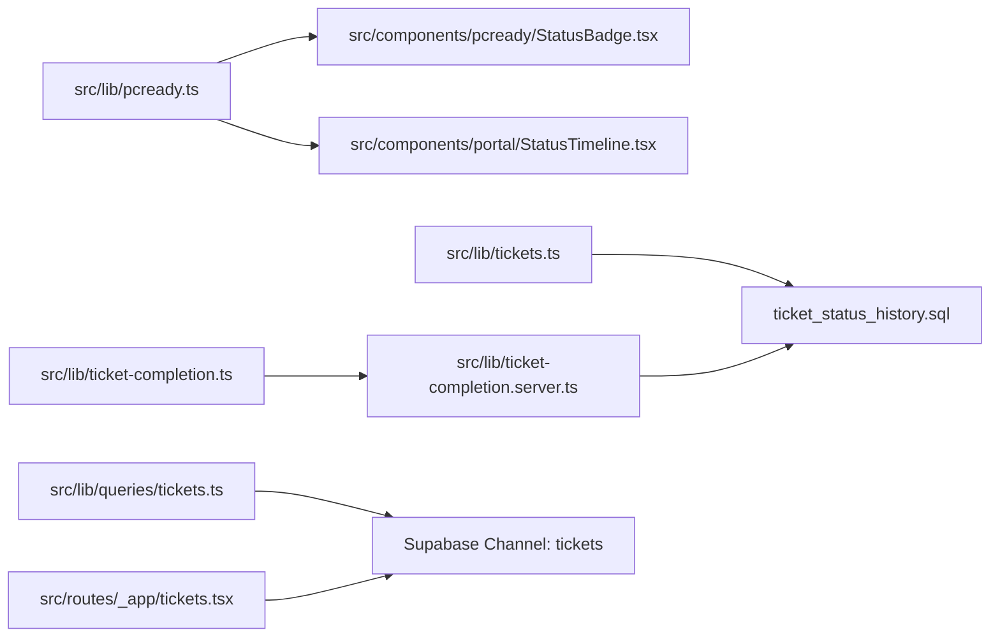

# Ticket Status Management

<cite>
**Referenced Files in This Document**
- [pcready.ts](file://src/lib/pcready.ts)
- [tickets.ts](file://src/lib/tickets.ts)
- [ticket-completion.ts](file://src/lib/ticket-completion.ts)
- [ticket-completion.server.ts](file://src/lib/ticket-completion.server.ts)
- [tickets.tsx](file://src/routes/_app/tickets.tsx)
- [StatusBadge.tsx](file://src/components/pcready/StatusBadge.tsx)
- [StatusTimeline.tsx](file://src/components/portal/StatusTimeline.tsx)
- [$ticketId.tsx](file://src/routes/portal/tickets/$ticketId.tsx)
- [ticket_status_history.sql](file://supabase/migrations/20260511180000_ticket_status_history.sql)
- [ticket_completed_status.sql](file://supabase/migrations/20260511190000_ticket_completed_status.sql)
- [add_archived_status.sql](file://supabase/migrations/20260511193000_add_archived_status.sql)
- [tickets.ts](file://src/lib/queries/tickets.ts)
</cite>

## Table of Contents

1. [Introduction](#introduction)
2. [Project Structure](#project-structure)
3. [Core Components](#core-components)
4. [Architecture Overview](#architecture-overview)
5. [Detailed Component Analysis](#detailed-component-analysis)
6. [Dependency Analysis](#dependency-analysis)
7. [Performance Considerations](#performance-considerations)
8. [Troubleshooting Guide](#troubleshooting-guide)
9. [Conclusion](#conclusion)

## Introduction

This document explains the ticket status management system, covering the full lifecycle from pending through in-progress, testing, ready, completed, and archived states. It documents status transition logic, validation rules, the status history tracking mechanism, UI badge and timeline rendering, and integration with Supabase real-time subscriptions for live updates. It also addresses checklist-related completion tracking, common issues such as invalid transitions and concurrent updates, and operational guidance for administrators.

## Project Structure

The status management spans frontend UI components, server functions, Supabase database migrations, and Supabase Realtime subscriptions:

- Types and status metadata define allowed states and UI rendering.
- Server functions handle creation and completion flows.
- Frontend routes and components render status badges and timelines.
- Supabase migrations define the status enum, history table, and archival job.
- Supabase Realtime channels keep lists and details fresh.

**Diagram sources**

- [tickets.tsx:112-122](file://src/routes/_app/tickets.tsx#L112-L122)
- [StatusBadge.tsx:11-14](file://src/components/pcready/StatusBadge.tsx#L11-L14)
- [StatusTimeline.tsx:19-46](file://src/components/portal/StatusTimeline.tsx#L19-L46)
- [tickets.ts:99-107](file://src/lib/tickets.ts#L99-L107)
- [ticket-completion.ts:10-15](file://src/lib/ticket-completion.ts#L10-L15)
- [ticket-completion.server.ts:49-181](file://src/lib/ticket-completion.server.ts#L49-L181)
- [ticket_status_history.sql:5-13](file://supabase/migrations/20260511180000_ticket_status_history.sql#L5-L13)
- [ticket_completed_status.sql:4-23](file://supabase/migrations/20260511190000_ticket_completed_status.sql#L4-L23)
- [add_archived_status.sql:4-20](file://supabase/migrations/20260511193000_add_archived_status.sql#L4-L20)

**Section sources**

- [pcready.ts:1-26](file://src/lib/pcready.ts#L1-L26)
- [tickets.ts:50-110](file://src/lib/tickets.ts#L50-L110)
- [ticket-completion.ts:10-15](file://src/lib/ticket-completion.ts#L10-L15)
- [ticket-completion.server.ts:49-181](file://src/lib/ticket-completion.server.ts#L49-L181)
- [tickets.tsx:112-122](file://src/routes/_app/tickets.tsx#L112-L122)
- [StatusBadge.tsx:11-14](file://src/components/pcready/StatusBadge.tsx#L11-L14)
- [StatusTimeline.tsx:19-46](file://src/components/portal/StatusTimeline.tsx#L19-L46)
- [ticket_status_history.sql:5-13](file://supabase/migrations/20260511180000_ticket_status_history.sql#L5-L13)
- [ticket_completed_status.sql:4-23](file://supabase/migrations/20260511190000_ticket_completed_status.sql#L4-L23)
- [add_archived_status.sql:4-20](file://supabase/migrations/20260511193000_add_archived_status.sql#L4-L20)

## Core Components

- Status types and metadata: Defines the allowed states, human-readable labels, CSS classes, and the canonical next state for each status.
- Create ticket server function: Inserts a new ticket and logs the initial status history record.
- Complete ticket server function and implementation: Generates a completion report, uploads to storage, emails the client, notifies admins, and marks the ticket as completed.
- UI status badge: Renders a colored badge for the current status.
- Portal status timeline: Renders a chronological timeline of status changes with actors and notes.
- Supabase realtime subscriptions: Keeps the tickets list reactive to changes.

**Section sources**

- [pcready.ts:1-26](file://src/lib/pcready.ts#L1-L26)
- [tickets.ts:50-110](file://src/lib/tickets.ts#L50-L110)
- [ticket-completion.ts:10-15](file://src/lib/ticket-completion.ts#L10-L15)
- [ticket-completion.server.ts:49-181](file://src/lib/ticket-completion.server.ts#L49-L181)
- [StatusBadge.tsx:11-14](file://src/components/pcready/StatusBadge.tsx#L11-L14)
- [StatusTimeline.tsx:19-46](file://src/components/portal/StatusTimeline.tsx#L19-L46)
- [tickets.tsx:112-122](file://src/routes/_app/tickets.tsx#L112-L122)

## Architecture Overview

The system enforces a deterministic status lifecycle and tracks all transitions. Creation inserts a history record with null “from” to indicate the initial state. Completion triggers a server-side workflow that updates the ticket and emits notifications. The UI renders status badges and timelines, and Supabase Realtime keeps views fresh.

**Diagram sources**

- [tickets.ts:50-110](file://src/lib/tickets.ts#L50-L110)
- [ticket_status_history.sql:5-13](file://supabase/migrations/20260511180000_ticket_status_history.sql#L5-L13)
- [ticket-completion.ts:10-15](file://src/lib/ticket-completion.ts#L10-L15)
- [ticket-completion.server.ts:49-181](file://src/lib/ticket-completion.server.ts#L49-L181)

## Detailed Component Analysis

### Status Lifecycle and Validation Rules

Allowed statuses and transitions:

- pending → in-progress
- in-progress → testing
- testing → ready
- ready → completed
- completed → archived
- archived has no next state

Validation rules enforced by the database:

- The tickets.status column uses a CHECK constraint that includes all five statuses plus archived.
- The initial status on creation is enforced as pending by the create ticket server function.

**Diagram sources**

- [pcready.ts:14-26](file://src/lib/pcready.ts#L14-L26)
- [ticket_completed_status.sql:4-23](file://supabase/migrations/20260511190000_ticket_completed_status.sql#L4-L23)
- [add_archived_status.sql:4-20](file://supabase/migrations/20260511193000_add_archived_status.sql#L4-L20)

**Section sources**

- [pcready.ts:1-26](file://src/lib/pcready.ts#L1-L26)
- [tickets.ts:17-17](file://src/lib/tickets.ts#L17-L17)
- [ticket_completed_status.sql:4-23](file://supabase/migrations/20260511190000_ticket_completed_status.sql#L4-L23)
- [add_archived_status.sql:4-20](file://supabase/migrations/20260511193000_add_archived_status.sql#L4-L20)

### Status History Tracking (ticket_status_history)

Purpose:

- Audit trail of all status transitions, including who changed the status and when.
- Immutable records with row-level security policies to restrict visibility.

Schema highlights:

- Primary key id, foreign key ticket_id referencing tickets, nullable from_status (null for initial), non-null to_status, changed_by, changed_at, and optional note.
- Indexes on ticket_id, changed_at, and changed_by for efficient queries.
- RLS policies:
  - Clients can view history only for their own tickets.
  - Authenticated users can view all history (admin).
  - Insert allowed for authenticated users.
  - Updates and deletes are disallowed.

Creation of initial history:

- On ticket creation, a record is inserted with from=null and to=pending.

**Section sources**

- [ticket_status_history.sql:5-13](file://supabase/migrations/20260511180000_ticket_status_history.sql#L5-L13)
- [ticket_status_history.sql:23-59](file://supabase/migrations/20260511180000_ticket_status_history.sql#L23-L59)
- [tickets.ts:99-107](file://src/lib/tickets.ts#L99-L107)

### Status Badge Display and Color Coding

- StatusBadge component reads STATUS_META to map status to label and CSS class.
- Each status has a color used for visual emphasis in timelines and badges.

**Section sources**

- [StatusBadge.tsx:11-14](file://src/components/pcready/StatusBadge.tsx#L11-L14)
- [pcready.ts:11-26](file://src/lib/pcready.ts#L11-L26)

### Portal Status Timeline

- StatusTimeline renders a vertical timeline of transitions, including actor and optional notes.
- Computes reached and completed statuses to visualize progress across pending → in-progress → testing → ready.
- Uses STATUS_META for labels and colors.

**Section sources**

- [StatusTimeline.tsx:19-158](file://src/components/portal/StatusTimeline.tsx#L19-L158)
- [pcready.ts:11-26](file://src/lib/pcready.ts#L11-L26)

### Real-Time Updates via Supabase Subscriptions

- The tickets list page subscribes to postgres_changes on the tickets table and displays a refresh prompt when changes occur.
- This enables live monitoring of status changes without manual refresh.

**Section sources**

- [tickets.tsx:112-122](file://src/routes/_app/tickets.tsx#L112-L122)

### Relationship Between Status Changes and Checklist Completion

- The system defines a structured checklist with categories and items.
- Progress computation functions calculate completion percentages per tab and overall.
- While explicit server-side enforcement of checklist completion before transitioning to ready is not shown in the referenced files, the presence of checklist structure and progress helpers indicates a foundation for integrating checklist completion with status transitions.

**Section sources**

- [pcready.ts:68-144](file://src/lib/pcready.ts#L68-L144)

### Completion Workflow and Notifications

- The completeTicket server function delegates to the implementation module.
- The implementation:
  - Builds a completion report (PDF) and uploads it to Supabase Storage.
  - Creates a signed URL for the PDF.
  - Sends an email to the client using a predefined template.
  - Notifies administrators.
  - Returns success and the PDF URL.

**Diagram sources**

- [ticket-completion.ts:10-15](file://src/lib/ticket-completion.ts#L10-L15)
- [ticket-completion.server.ts:49-181](file://src/lib/ticket-completion.server.ts#L49-L181)

**Section sources**

- [ticket-completion.ts:10-15](file://src/lib/ticket-completion.ts#L10-L15)
- [ticket-completion.server.ts:49-181](file://src/lib/ticket-completion.server.ts#L49-L181)

### Portal Ticket Detail and History Rendering

- The portal ticket detail page loads ticket and history data and renders a StatusTimeline.
- The timeline shows the chronological progression and current status.

**Section sources**

- [$ticketId.tsx:15-106](file://src/routes/portal/tickets/$ticketId.tsx#L15-L106)
- [StatusTimeline.tsx:19-158](file://src/components/portal/StatusTimeline.tsx#L19-L158)

## Dependency Analysis

- UI depends on STATUS_META for labels, colors, and next-state mapping.
- Server functions depend on Supabase client libraries and RLS policies.
- Database migrations define the status enum and history table with RLS and indexes.
- Realtime subscriptions depend on Supabase channel configuration.

**Diagram sources**

- [pcready.ts:1-26](file://src/lib/pcready.ts#L1-L26)
- [StatusBadge.tsx:11-14](file://src/components/pcready/StatusBadge.tsx#L11-L14)
- [StatusTimeline.tsx:19-46](file://src/components/portal/StatusTimeline.tsx#L19-L46)
- [tickets.ts:99-107](file://src/lib/tickets.ts#L99-L107)
- [ticket-completion.ts:10-15](file://src/lib/ticket-completion.ts#L10-L15)
- [ticket-completion.server.ts:49-181](file://src/lib/ticket-completion.server.ts#L49-L181)
- [tickets.tsx:112-122](file://src/routes/_app/tickets.tsx#L112-L122)
- [ticket_status_history.sql:5-13](file://supabase/migrations/20260511180000_ticket_status_history.sql#L5-L13)

**Section sources**

- [pcready.ts:1-26](file://src/lib/pcready.ts#L1-L26)
- [tickets.ts:99-107](file://src/lib/tickets.ts#L99-L107)
- [ticket-completion.ts:10-15](file://src/lib/ticket-completion.ts#L10-L15)
- [ticket-completion.server.ts:49-181](file://src/lib/ticket-completion.server.ts#L49-L181)
- [tickets.tsx:112-122](file://src/routes/_app/tickets.tsx#L112-L122)
- [ticket_status_history.sql:5-13](file://supabase/migrations/20260511180000_ticket_status_history.sql#L5-L13)

## Performance Considerations

- Database indexes on ticket_status_history(ticket_id), changed_at, and changed_by improve query performance for history retrieval and sorting.
- The tickets.status index supports filtering and reporting.
- Using Supabase Realtime reduces polling overhead and improves perceived responsiveness for status updates.

[No sources needed since this section provides general guidance]

## Troubleshooting Guide

Common issues and resolutions:

- Invalid status transitions
  - Cause: Attempting to set a status outside the allowed enum.
  - Resolution: Ensure the status value is one of pending, in-progress, testing, ready, completed, or archived.
  - Evidence: CHECK constraint on tickets.status and STATUS_META definitions.

- Concurrent status updates
  - Symptom: Race conditions leading to inconsistent history or UI state.
  - Mitigation: Use Supabase Realtime subscriptions to refresh data and avoid manual polling. Invalidate queries after mutations to reconcile state.

- History tracking inconsistencies
  - Symptom: Missing or incorrect from/to values.
  - Resolution: Verify that initial creation inserts from=null and to=pending. Ensure subsequent transitions insert records with proper from/to values and changed_by.

- Portal visibility issues
  - Symptom: Clients cannot see history.
  - Resolution: Confirm RLS policies allow clients to view history for their own tickets and that authenticated users can view all history for admin use.

- Completion workflow failures
  - Symptom: PDF upload or email delivery errors.
  - Resolution: Check storage permissions, signed URL creation, and email template availability. Log and surface errors from the completion implementation.

**Section sources**

- [ticket_completed_status.sql:4-23](file://supabase/migrations/20260511190000_ticket_completed_status.sql#L4-L23)
- [add_archived_status.sql:4-20](file://supabase/migrations/20260511193000_add_archived_status.sql#L4-L20)
- [ticket_status_history.sql:23-59](file://supabase/migrations/20260511180000_ticket_status_history.sql#L23-L59)
- [tickets.tsx:112-122](file://src/routes/_app/tickets.tsx#L112-L122)
- [ticket-completion.server.ts:103-181](file://src/lib/ticket-completion.server.ts#L103-L181)

## Conclusion

The ticket status management system provides a robust, auditable, and user-friendly workflow across the full lifecycle. It leverages typed statuses, immutable history, real-time updates, and clear UI indicators. Administrators can rely on database constraints and RLS policies to maintain data integrity, while technicians benefit from live updates and a structured completion process that integrates with notifications and portal visibility.
