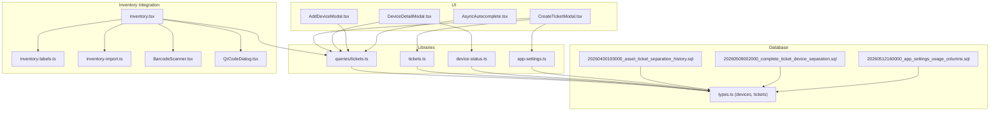
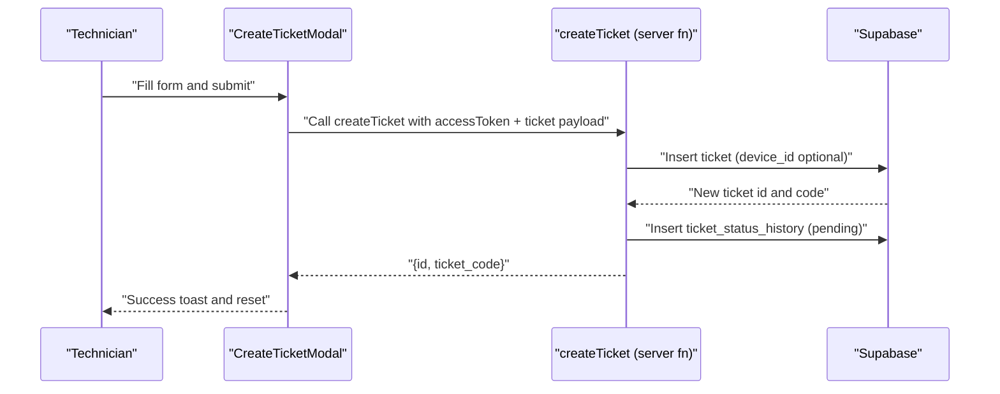
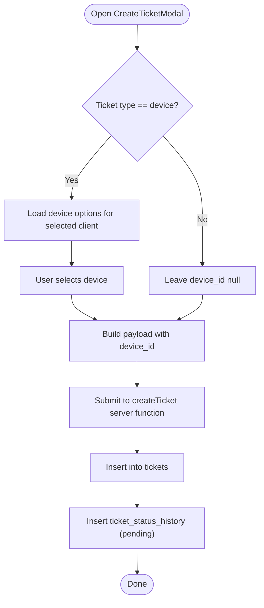
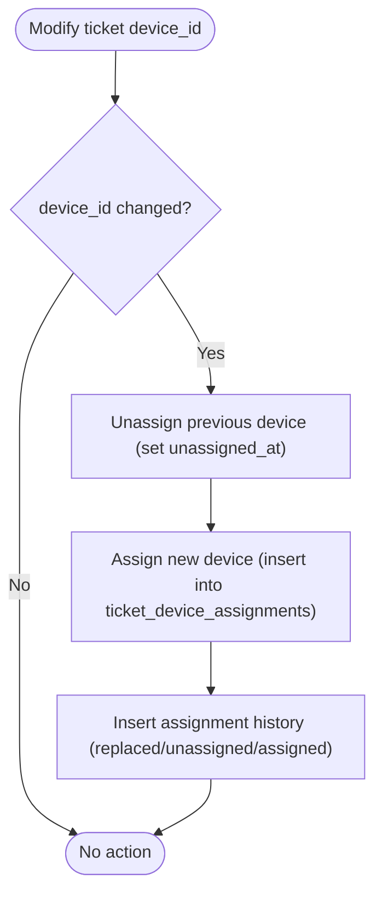
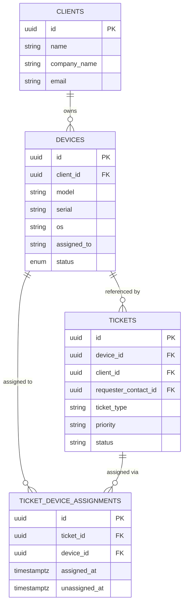
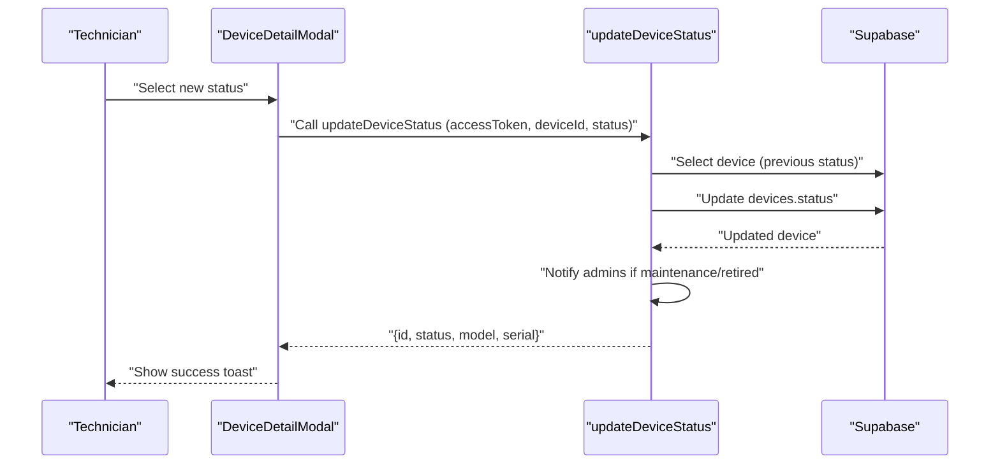
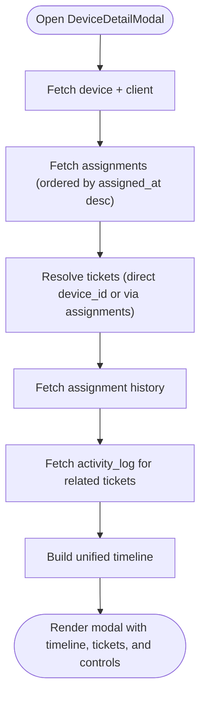
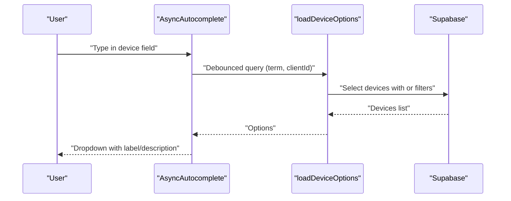
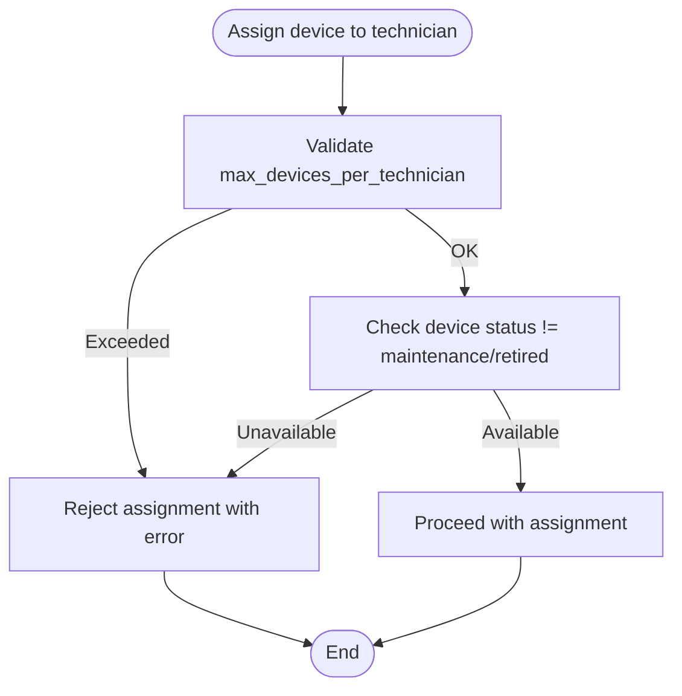
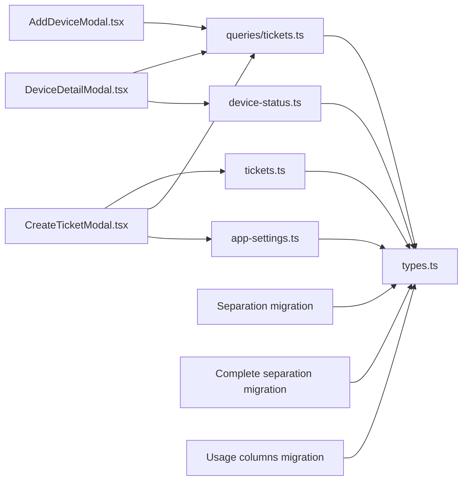

# Ticket-Device Association

<cite>
**Referenced Files in This Document**
- [CreateTicketModal.tsx](file://src/components/pcready/CreateTicketModal.tsx)
- [DeviceDetailModal.tsx](file://src/components/pcready/DeviceDetailModal.tsx)
- [AddDeviceModal.tsx](file://src/components/pcready/AddDeviceModal.tsx)
- [AsyncAutocomplete.tsx](file://src/components/pcready/AsyncAutocomplete.tsx)
- [tickets.ts](file://src/lib/tickets.ts)
- [queries/tickets.ts](file://src/lib/queries/tickets.ts)
- [device-status.ts](file://src/lib/device-status.ts)
- [app-settings.ts](file://src/lib/app-settings.ts)
- [types.ts](file://src/integrations/supabase/types.ts)
- [20260430193000_asset_ticket_separation_history.sql](file://supabase/migrations/20260430193000_asset_ticket_separation_history.sql)
- [20260509002000_complete_ticket_device_separation.sql](file://supabase/migrations/20260509002000_complete_ticket_device_separation.sql)
- [20260512160000_app_settings_usage_columns.sql](file://supabase/migrations/20260512160000_app_settings_usage_columns.sql)
- [inventory.tsx](file://src/routes/_app/inventory.tsx)
- [inventory-labels.ts](file://src/lib/inventory-labels.ts)
- [inventory-import.ts](file://src/lib/inventory-import.ts)
- [BarcodeScanner.tsx](file://src/components/inventory/BarcodeScanner.tsx)
- [QrCodeDialog.tsx](file://src/components/inventory/QrCodeDialog.tsx)
</cite>

## Table of Contents
1. [Introduction](#introduction)
2. [Project Structure](#project-structure)
3. [Core Components](#core-components)
4. [Architecture Overview](#architecture-overview)
5. [Detailed Component Analysis](#detailed-component-analysis)
6. [Dependency Analysis](#dependency-analysis)
7. [Performance Considerations](#performance-considerations)
8. [Troubleshooting Guide](#troubleshooting-guide)
9. [Conclusion](#conclusion)

## Introduction
This document explains the ticket-device association system: how devices are linked to tickets during creation and modification, how device status affects availability, and how the device detail modal integrates device information, history, and current ticket assignments. It also covers device-client relationships, shared device usage, import/export and scanning integration, and common issues such as unavailability conflicts and duplicate assignments.

## Project Structure
The system spans UI components, server functions, Supabase database schema and triggers, and client libraries for queries and settings.

**Diagram sources**
- [CreateTicketModal.tsx:138-300](file://src/components/pcready/CreateTicketModal.tsx#L138-L300)
- [DeviceDetailModal.tsx:118-346](file://src/components/pcready/DeviceDetailModal.tsx#L118-L346)
- [AddDeviceModal.tsx:27-118](file://src/components/pcready/AddDeviceModal.tsx#L27-L118)
- [AsyncAutocomplete.tsx:21-82](file://src/components/pcready/AsyncAutocomplete.tsx#L21-L82)
- [queries/tickets.ts:55-81](file://src/lib/queries/tickets.ts#L55-L81)
- [tickets.ts:50-110](file://src/lib/tickets.ts#L50-L110)
- [device-status.ts:15-55](file://src/lib/device-status.ts#L15-L55)
- [app-settings.ts:141-166](file://src/lib/app-settings.ts#L141-L166)
- [types.ts:384-436](file://src/integrations/supabase/types.ts#L384-L436)
- [20260430193000_asset_ticket_separation_history.sql:4-89](file://supabase/migrations/20260430193000_asset_ticket_separation_history.sql#L4-L89)
- [20260509002000_complete_ticket_device_separation.sql:1-83](file://supabase/migrations/20260509002000_complete_ticket_device_separation.sql#L1-L83)
- [20260512160000_app_settings_usage_columns.sql:1-5](file://supabase/migrations/20260512160000_app_settings_usage_columns.sql#L1-L5)
- [inventory.tsx:61-94](file://src/routes/_app/inventory.tsx#L61-L94)

**Section sources**
- [CreateTicketModal.tsx:138-300](file://src/components/pcready/CreateTicketModal.tsx#L138-L300)
- [DeviceDetailModal.tsx:118-346](file://src/components/pcready/DeviceDetailModal.tsx#L118-L346)
- [AddDeviceModal.tsx:27-118](file://src/components/pcready/AddDeviceModal.tsx#L27-L118)
- [AsyncAutocomplete.tsx:21-82](file://src/components/pcready/AsyncAutocomplete.tsx#L21-L82)
- [queries/tickets.ts:55-81](file://src/lib/queries/tickets.ts#L55-L81)
- [tickets.ts:50-110](file://src/lib/tickets.ts#L50-L110)
- [device-status.ts:15-55](file://src/lib/device-status.ts#L15-L55)
- [app-settings.ts:141-166](file://src/lib/app-settings.ts#L141-L166)
- [types.ts:384-436](file://src/integrations/supabase/types.ts#L384-L436)
- [20260430193000_asset_ticket_separation_history.sql:4-89](file://supabase/migrations/20260430193000_asset_ticket_separation_history.sql#L4-L89)
- [20260509002000_complete_ticket_device_separation.sql:1-83](file://supabase/migrations/20260509002000_complete_ticket_device_separation.sql#L1-L83)
- [20260512160000_app_settings_usage_columns.sql:1-5](file://supabase/migrations/20260512160000_app_settings_usage_columns.sql#L1-L5)
- [inventory.tsx:61-94](file://src/routes/_app/inventory.tsx#L61-L94)

## Core Components
- CreateTicketModal: Collects client, requester, device, and ticket metadata; validates limits; creates tickets and optionally notifies assignees.
- DeviceDetailModal: Displays device inventory details, timeline of assignments/history/activities, and related tickets; allows status updates.
- AddDeviceModal: Adds new devices to a client’s inventory with validation and settings-driven options.
- AsyncAutocomplete: Generic async search UI used for clients, contacts, and devices.
- tickets.ts: Server function to create tickets with device_id and status history initialization.
- queries/tickets.ts: Client-side queries for devices, tickets, assignments, and histories; supports autocomplete and lists.
- device-status.ts: Server function to update device status with notifications for maintenance/retired transitions.
- app-settings.ts: Validates technician device limits and exposes public settings for OS, brands, categories.
- Supabase schema and migrations: Define tables, foreign keys, indexes, and triggers for robust device-ticket associations and history.

**Section sources**
- [CreateTicketModal.tsx:138-300](file://src/components/pcready/CreateTicketModal.tsx#L138-L300)
- [DeviceDetailModal.tsx:118-346](file://src/components/pcready/DeviceDetailModal.tsx#L118-L346)
- [AddDeviceModal.tsx:27-118](file://src/components/pcready/AddDeviceModal.tsx#L27-L118)
- [AsyncAutocomplete.tsx:21-82](file://src/components/pcready/AsyncAutocomplete.tsx#L21-L82)
- [tickets.ts:50-110](file://src/lib/tickets.ts#L50-L110)
- [queries/tickets.ts:55-81](file://src/lib/queries/tickets.ts#L55-L81)
- [device-status.ts:15-55](file://src/lib/device-status.ts#L15-L55)
- [app-settings.ts:141-166](file://src/lib/app-settings.ts#L141-L166)
- [types.ts:384-436](file://src/integrations/supabase/types.ts#L384-L436)

## Architecture Overview
The system separates concerns across UI, server functions, and database triggers:
- UI components collect inputs and delegate to server functions and queries.
- Server functions enforce authentication, rate limits, and business rules (e.g., technician device limits).
- Queries fetch and present data to the UI.
- Database triggers maintain historical records of device-ticket assignments and status changes.

**Diagram sources**
- [CreateTicketModal.tsx:196-300](file://src/components/pcready/CreateTicketModal.tsx#L196-L300)
- [tickets.ts:50-110](file://src/lib/tickets.ts#L50-L110)

**Section sources**
- [CreateTicketModal.tsx:196-300](file://src/components/pcready/CreateTicketModal.tsx#L196-L300)
- [tickets.ts:50-110](file://src/lib/tickets.ts#L50-L110)

## Detailed Component Analysis

### Device Linking During Ticket Creation
- Device selection is optional for non-device tickets; required for device tickets.
- The modal resolves client, contact, and device selections, then constructs a payload with device_id.
- The server function inserts the ticket and initializes status history.

**Diagram sources**
- [CreateTicketModal.tsx:196-300](file://src/components/pcready/CreateTicketModal.tsx#L196-L300)
- [tickets.ts:50-110](file://src/lib/tickets.ts#L50-L110)

**Section sources**
- [CreateTicketModal.tsx:196-300](file://src/components/pcready/CreateTicketModal.tsx#L196-L300)
- [tickets.ts:50-110](file://src/lib/tickets.ts#L50-L110)

### Device Linking During Ticket Modification
- The separation migration introduces a dedicated table for device-ticket assignments and a trigger to track changes.
- When device_id changes on a ticket, the trigger updates the assignment history and marks previous assignments as unassigned.

**Diagram sources**
- [20260509002000_complete_ticket_device_separation.sql:53-82](file://supabase/migrations/20260509002000_complete_ticket_device_separation.sql#L53-L82)
- [20260430193000_asset_ticket_separation_history.sql:49-89](file://supabase/migrations/20260430193000_asset_ticket_separation_history.sql#L49-L89)

**Section sources**
- [20260509002000_complete_ticket_device_separation.sql:53-82](file://supabase/migrations/20260509002000_complete_ticket_device_separation.sql#L53-L82)
- [20260430193000_asset_ticket_separation_history.sql:49-89](file://supabase/migrations/20260430193000_asset_ticket_separation_history.sql#L49-L89)

### Foreign Key Relationships and Schema
- tickets.device_id references devices.id with ON DELETE SET NULL.
- ticket_device_assignments links tickets to devices with cascade delete and restrict on device deletion.
- Indexes optimize lookups for device_id, client_id, requester_contact_id, and assignment history.

**Diagram sources**
- [types.ts:336-436](file://src/integrations/supabase/types.ts#L336-L436)
- [20260430193000_asset_ticket_separation_history.sql:4-12](file://supabase/migrations/20260430193000_asset_ticket_separation_history.sql#L4-L12)
- [20260509002000_complete_ticket_device_separation.sql:1-15](file://supabase/migrations/20260509002000_complete_ticket_device_separation.sql#L1-L15)

**Section sources**
- [types.ts:336-436](file://src/integrations/supabase/types.ts#L336-L436)
- [20260430193000_asset_ticket_separation_history.sql:4-12](file://supabase/migrations/20260430193000_asset_ticket_separation_history.sql#L4-L12)
- [20260509002000_complete_ticket_device_separation.sql:1-15](file://supabase/migrations/20260509002000_complete_ticket_device_separation.sql#L1-L15)

### Device Status Tracking and Availability
- Device status is managed via a server function that validates access and updates the status atomically.
- Status transitions to maintenance or retired trigger admin notifications.
- The device detail modal displays current status and allows authorized users to change it.

**Diagram sources**
- [DeviceDetailModal.tsx:315-346](file://src/components/pcready/DeviceDetailModal.tsx#L315-L346)
- [device-status.ts:15-55](file://src/lib/device-status.ts#L15-L55)

**Section sources**
- [DeviceDetailModal.tsx:315-346](file://src/components/pcready/DeviceDetailModal.tsx#L315-L346)
- [device-status.ts:15-55](file://src/lib/device-status.ts#L15-L55)

### Device Detail Modal Integration
- Loads device, assignments, tickets, history, and activity logs.
- Builds a unified timeline combining assignment history, device status snapshots, maintenance events, and ticket notes.
- Provides quick links to related tickets and status updates.

**Diagram sources**
- [DeviceDetailModal.tsx:149-306](file://src/components/pcready/DeviceDetailModal.tsx#L149-L306)

**Section sources**
- [DeviceDetailModal.tsx:149-306](file://src/components/pcready/DeviceDetailModal.tsx#L149-L306)

### Device Lookup and Autocomplete Workflows
- AsyncAutocomplete provides debounced search with loading states and option rendering.
- Device options are filtered by client and searchable by model, serial, and assigned_to.
- The modal uses this to populate device selection for tickets.

**Diagram sources**
- [AsyncAutocomplete.tsx:21-82](file://src/components/pcready/AsyncAutocomplete.tsx#L21-L82)
- [queries/tickets.ts:55-70](file://src/lib/queries/tickets.ts#L55-L70)

**Section sources**
- [AsyncAutocomplete.tsx:21-82](file://src/components/pcready/AsyncAutocomplete.tsx#L21-L82)
- [queries/tickets.ts:55-70](file://src/lib/queries/tickets.ts#L55-L70)

### Conflict Resolution for Shared Devices
- Technician device limit validation prevents over-assignment.
- The device detail modal surfaces current assignments and history to inform decisions.
- Maintenance/retired device status blocks further assignments.

**Diagram sources**
- [app-settings.ts:141-166](file://src/lib/app-settings.ts#L141-L166)
- [DeviceDetailModal.tsx:315-346](file://src/components/pcready/DeviceDetailModal.tsx#L315-L346)

**Section sources**
- [app-settings.ts:141-166](file://src/lib/app-settings.ts#L141-L166)
- [DeviceDetailModal.tsx:315-346](file://src/components/pcready/DeviceDetailModal.tsx#L315-L346)

### Device-Client Relationship and Multiple References
- One device belongs to one client (client_id FK).
- Multiple tickets can reference the same device via device_id or via assignment history.
- The device detail modal aggregates tickets linked directly and indirectly via assignments.

**Section sources**
- [types.ts:336-436](file://src/integrations/supabase/types.ts#L336-L436)
- [DeviceDetailModal.tsx:180-206](file://src/components/pcready/DeviceDetailModal.tsx#L180-L206)

### Integration with Import/Export and Scanning
- Inventory page supports filtering, pagination, and export to PDF.
- Labels generation and import workflows integrate with device records.
- Barcode and QR code dialogs assist in device discovery and verification.

**Section sources**
- [inventory.tsx:61-94](file://src/routes/_app/inventory.tsx#L61-L94)
- [inventory-labels.ts](file://src/lib/inventory-labels.ts)
- [inventory-import.ts](file://src/lib/inventory-import.ts)
- [BarcodeScanner.tsx](file://src/components/inventory/BarcodeScanner.tsx)
- [QrCodeDialog.tsx](file://src/components/inventory/QrCodeDialog.tsx)

## Dependency Analysis
- UI components depend on server functions and client queries.
- Server functions depend on Supabase client and RLS policies.
- Database triggers depend on assignment and history tables.
- Settings influence device limits and UI options.

**Diagram sources**
- [CreateTicketModal.tsx:138-300](file://src/components/pcready/CreateTicketModal.tsx#L138-L300)
- [DeviceDetailModal.tsx:118-346](file://src/components/pcready/DeviceDetailModal.tsx#L118-L346)
- [AddDeviceModal.tsx:27-118](file://src/components/pcready/AddDeviceModal.tsx#L27-L118)
- [tickets.ts:50-110](file://src/lib/tickets.ts#L50-L110)
- [queries/tickets.ts:55-81](file://src/lib/queries/tickets.ts#L55-L81)
- [device-status.ts:15-55](file://src/lib/device-status.ts#L15-L55)
- [app-settings.ts:141-166](file://src/lib/app-settings.ts#L141-L166)
- [types.ts:384-436](file://src/integrations/supabase/types.ts#L384-L436)
- [20260430193000_asset_ticket_separation_history.sql:4-89](file://supabase/migrations/20260430193000_asset_ticket_separation_history.sql#L4-L89)
- [20260509002000_complete_ticket_device_separation.sql:1-83](file://supabase/migrations/20260509002000_complete_ticket_device_separation.sql#L1-L83)
- [20260512160000_app_settings_usage_columns.sql:1-5](file://supabase/migrations/20260512160000_app_settings_usage_columns.sql#L1-L5)

**Section sources**
- [CreateTicketModal.tsx:138-300](file://src/components/pcready/CreateTicketModal.tsx#L138-L300)
- [DeviceDetailModal.tsx:118-346](file://src/components/pcready/DeviceDetailModal.tsx#L118-L346)
- [AddDeviceModal.tsx:27-118](file://src/components/pcready/AddDeviceModal.tsx#L27-L118)
- [tickets.ts:50-110](file://src/lib/tickets.ts#L50-L110)
- [queries/tickets.ts:55-81](file://src/lib/queries/tickets.ts#L55-L81)
- [device-status.ts:15-55](file://src/lib/device-status.ts#L15-L55)
- [app-settings.ts:141-166](file://src/lib/app-settings.ts#L141-L166)
- [types.ts:384-436](file://src/integrations/supabase/types.ts#L384-L436)
- [20260430193000_asset_ticket_separation_history.sql:4-89](file://supabase/migrations/20260430193000_asset_ticket_separation_history.sql#L4-L89)
- [20260509002000_complete_ticket_device_separation.sql:1-83](file://supabase/migrations/20260509002000_complete_ticket_device_separation.sql#L1-L83)
- [20260512160000_app_settings_usage_columns.sql:1-5](file://supabase/migrations/20260512160000_app_settings_usage_columns.sql#L1-L5)

## Performance Considerations
- Use indexes on frequently queried columns (device_id, client_id, requester_contact_id) to speed up ticket listings and device lookups.
- Debounce autocomplete queries to reduce network load.
- Batch UI invalidations after mutations to avoid excessive re-renders.
- Prefer server-side validation for device limits to prevent unnecessary client retries.

## Troubleshooting Guide
Common issues and resolutions:
- Device unavailability conflicts
  - Symptom: Cannot assign device to technician.
  - Cause: Device status is maintenance/retired or technician device limit exceeded.
  - Resolution: Change device status to available or reduce technician’s active device tickets.
  - References: [device-status.ts:42-52](file://src/lib/device-status.ts#L42-L52), [app-settings.ts:141-166](file://src/lib/app-settings.ts#L141-L166)

- Duplicate assignments
  - Symptom: Multiple tickets claim the same device.
  - Cause: Missing or stale assignment history.
  - Resolution: Use assignment history to reconcile; the trigger ensures only one active assignment per device per ticket.
  - References: [20260509002000_complete_ticket_device_separation.sql:53-82](file://supabase/migrations/20260509002000_complete_ticket_device_separation.sql#L53-L82)

- Device not found in autocomplete
  - Symptom: Device does not appear when searching.
  - Cause: Client filter not applied or search term too short.
  - Resolution: Select a client first; ensure search term meets minimum length.
  - References: [AsyncAutocomplete.tsx:45-67](file://src/components/pcready/AsyncAutocomplete.tsx#L45-L67), [queries/tickets.ts:55-70](file://src/lib/queries/tickets.ts#L55-L70)

- Status synchronization delays
  - Symptom: Device status appears inconsistent in UI.
  - Cause: UI cache not invalidated after status update.
  - Resolution: Trigger query invalidation after status change.
  - References: [DeviceDetailModal.tsx:315-346](file://src/components/pcready/DeviceDetailModal.tsx#L315-L346)

**Section sources**
- [device-status.ts:42-52](file://src/lib/device-status.ts#L42-L52)
- [app-settings.ts:141-166](file://src/lib/app-settings.ts#L141-L166)
- [20260509002000_complete_ticket_device_separation.sql:53-82](file://supabase/migrations/20260509002000_complete_ticket_device_separation.sql#L53-L82)
- [AsyncAutocomplete.tsx:45-67](file://src/components/pcready/AsyncAutocomplete.tsx#L45-L67)
- [queries/tickets.ts:55-70](file://src/lib/queries/tickets.ts#L55-L70)
- [DeviceDetailModal.tsx:315-346](file://src/components/pcready/DeviceDetailModal.tsx#L315-L346)

## Conclusion
The ticket-device association system combines robust database design with intuitive UI workflows. It enforces availability and limit constraints, maintains comprehensive assignment history, and integrates seamlessly with inventory operations and scanning. Administrators can manage device status and settings, while technicians efficiently create and modify tickets with confidence in data integrity and visibility.