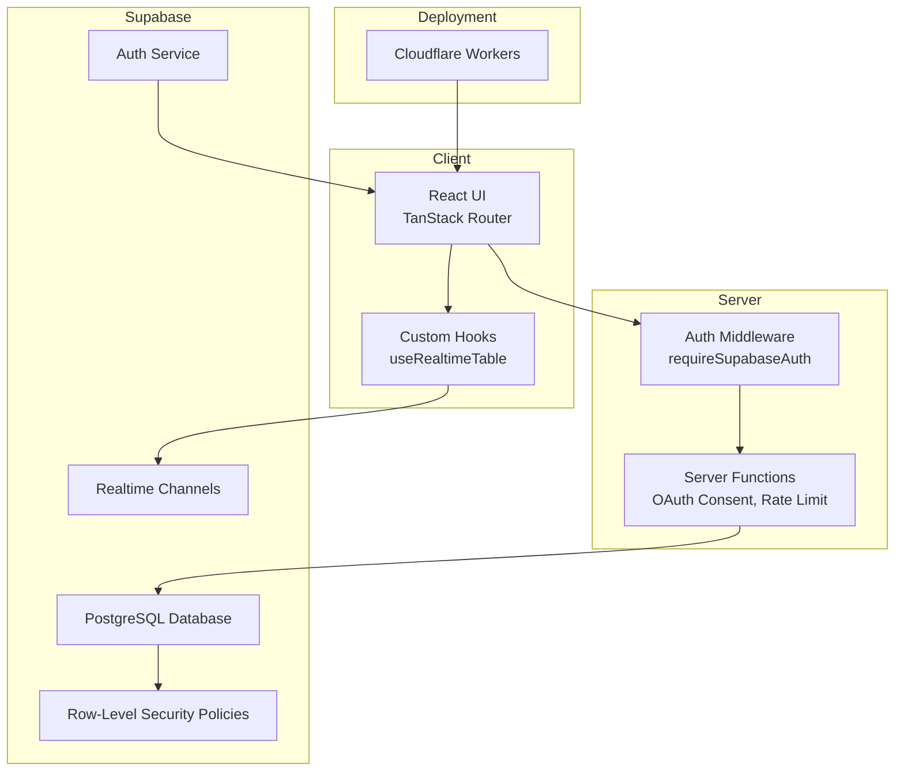
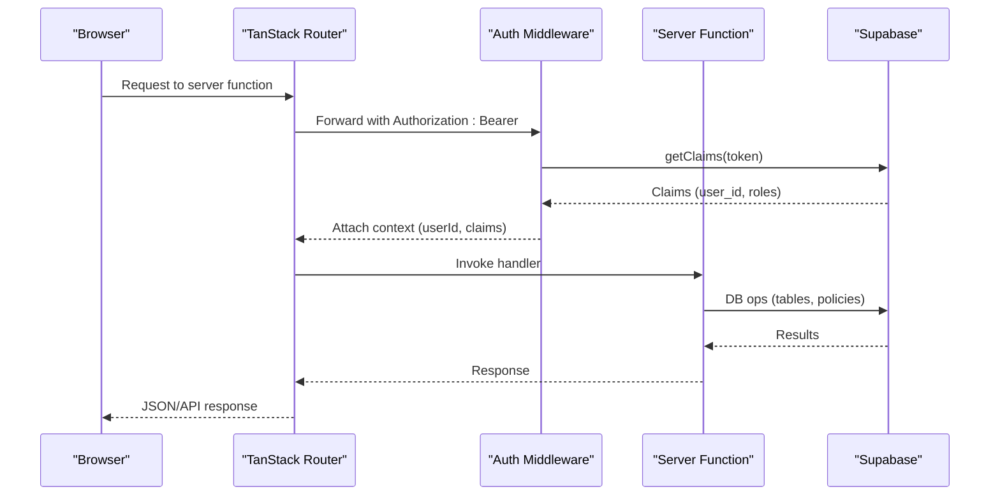
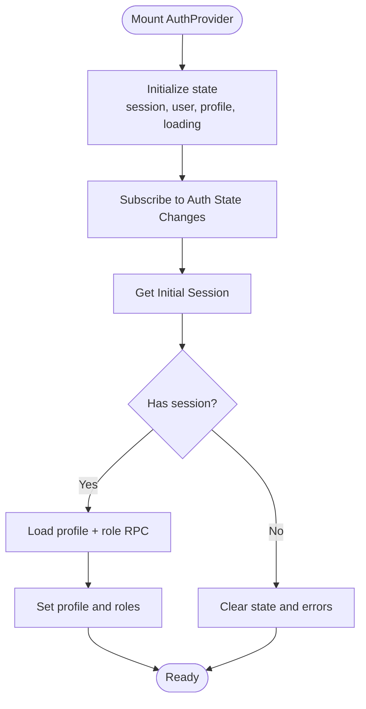
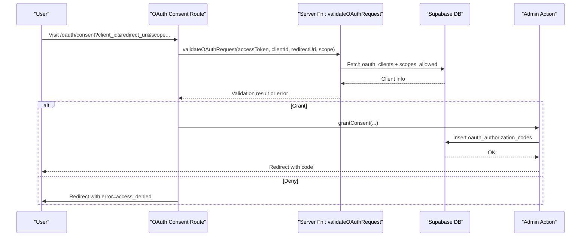
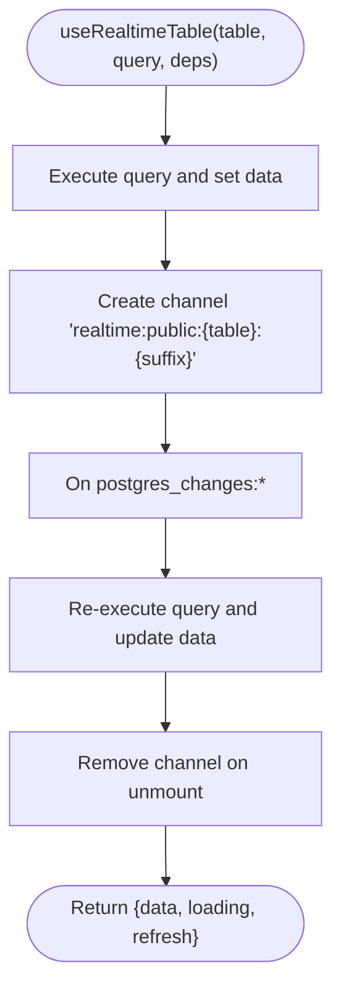
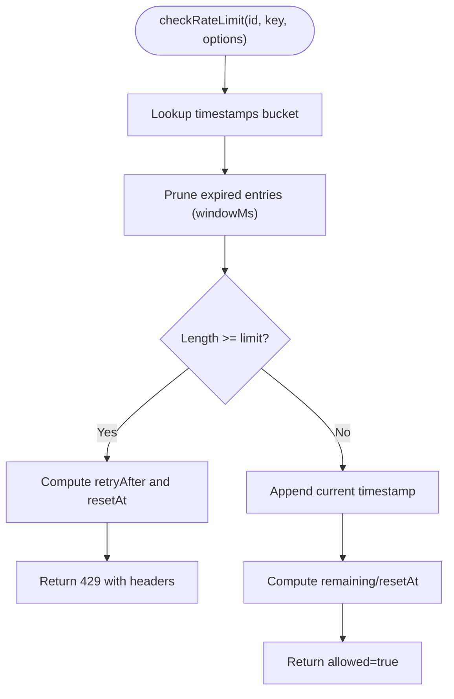
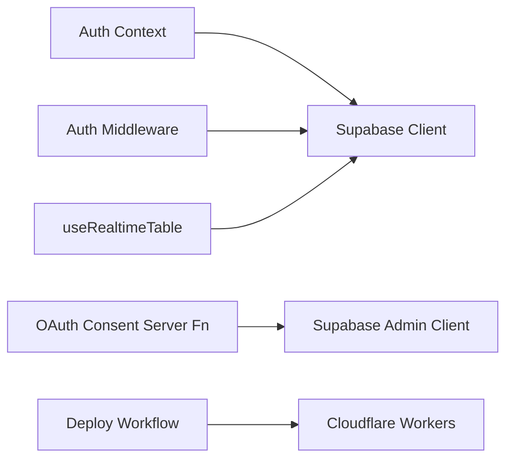

# Troubleshooting and FAQ

<cite>
**Referenced Files in This Document**
- [README.md](file://README.md)
- [wrangler.jsonc](file://wrangler.jsonc)
- [.github/workflows/deploy.yml](file://.github/workflows/deploy.yml)
- [src/lib/auth-context.tsx](file://src/lib/auth-context.tsx)
- [src/integrations/supabase/auth-middleware.ts](file://src/integrations/supabase/auth-middleware.ts)
- [src/routes/_app/oauth.consent.tsx](file://src/routes/_app/oauth.consent.tsx)
- [src/lib/oauth-consent.ts](file://src/lib/oauth-consent.ts)
- [src/hooks/useRealtimeTable.ts](file://src/hooks/useRealtimeTable.ts)
- [src/lib/rate-limit.ts](file://src/lib/rate-limit.ts)
- [src/lib/auth-rate-limit.ts](file://src/lib/auth-rate-limit.ts)
- [src/components/errors/ServerErrorPage.tsx](file://src/components/errors/ServerErrorPage.tsx)
- [supabase/migrations/20260430154500_ticket_code_sequence_trigger.sql](file://supabase/migrations/20260430154500_ticket_code_sequence_trigger.sql)
- [supabase/migrations/20260430143000_admin_user_management_rls.sql](file://supabase/migrations/20260430143000_admin_user_management_rls.sql)
- [supabase/migrations/20260514170000_add_client_website_url.sql](file://supabase/migrations/20260514170000_add_client_website_url.sql)
- [docs/BACKUP.md](file://docs/BACKUP.md)
</cite>

## Table of Contents
1. [Introduction](#introduction)
2. [Project Structure](#project-structure)
3. [Core Components](#core-components)
4. [Architecture Overview](#architecture-overview)
5. [Detailed Component Analysis](#detailed-component-analysis)
6. [Dependency Analysis](#dependency-analysis)
7. [Performance Considerations](#performance-considerations)
8. [Troubleshooting Guide](#troubleshooting-guide)
9. [Conclusion](#conclusion)
10. [Appendices](#appendices)

## Introduction
This document provides a comprehensive troubleshooting guide and FAQ for PCReady. It focuses on diagnosing and resolving common issues across authentication, database migrations, performance, component rendering, debugging techniques, deployment, upgrades, and backups. It also includes practical step-by-step resolutions and diagrams to illustrate key flows.

## Project Structure
PCReady is a React + TypeScript application using TanStack Router, Supabase for authentication, database, and Row-Level Security (RLS), and Cloudflare Workers for deployment. Authentication is handled via Supabase Auth, with server functions protected by a middleware requiring Bearer tokens. Real-time synchronization leverages Supabase Realtime channels. Migrations manage schema changes and policies.

**Diagram sources**
- [src/integrations/supabase/auth-middleware.ts:7-73](file://src/integrations/supabase/auth-middleware.ts#L7-L73)
- [src/lib/oauth-consent.ts:141-194](file://src/lib/oauth-consent.ts#L141-L194)
- [src/hooks/useRealtimeTable.ts:10-49](file://src/hooks/useRealtimeTable.ts#L10-L49)
- [wrangler.jsonc:1-8](file://wrangler.jsonc#L1-L8)

**Section sources**
- [README.md:1-159](file://README.md#L1-L159)
- [wrangler.jsonc:1-8](file://wrangler.jsonc#L1-L8)

## Core Components
- Authentication and session management: centralized provider and hooks.
- OAuth consent flow: validation, grant/deny, and redirect handling.
- Real-time synchronization: reactive data updates via Supabase channels.
- Rate limiting: in-memory sliding window with optional Redis backend.
- Deployment: Cloudflare Workers via GitHub Actions.

**Section sources**
- [src/lib/auth-context.tsx:43-166](file://src/lib/auth-context.tsx#L43-L166)
- [src/routes/_app/oauth.consent.tsx:35-219](file://src/routes/_app/oauth.consent.tsx#L35-L219)
- [src/hooks/useRealtimeTable.ts:10-49](file://src/hooks/useRealtimeTable.ts#L10-L49)
- [src/lib/rate-limit.ts:30-104](file://src/lib/rate-limit.ts#L30-L104)
- [src/lib/auth-rate-limit.ts:18-24](file://src/lib/auth-rate-limit.ts#L18-L24)

## Architecture Overview
The system separates concerns between client, server middleware, server functions, and Supabase services. Requests to server functions are validated by a Bearer-token middleware that verifies claims and attaches context. OAuth consent is handled through server functions that validate clients, scopes, and redirect URIs, then issue authorization codes. Real-time updates synchronize UI with database changes.

**Diagram sources**
- [src/integrations/supabase/auth-middleware.ts:7-73](file://src/integrations/supabase/auth-middleware.ts#L7-L73)
- [src/lib/oauth-consent.ts:141-194](file://src/lib/oauth-consent.ts#L141-L194)

## Detailed Component Analysis

### Authentication Provider and Session Handling
The provider initializes session state, subscribes to Supabase Auth events, loads user profile and role, and exposes helpers for sign-out and profile refresh. It guards against race conditions during concurrent profile loads.

**Diagram sources**
- [src/lib/auth-context.tsx:114-146](file://src/lib/auth-context.tsx#L114-L146)
- [src/lib/auth-context.tsx:52-94](file://src/lib/auth-context.tsx#L52-L94)

**Section sources**
- [src/lib/auth-context.tsx:43-166](file://src/lib/auth-context.tsx#L43-L166)

### OAuth Consent Flow
The consent page validates the incoming request, ensures the client is active and redirect URI is allowed, checks requested scopes against allowed ones, and either grants an authorization code or denies access with appropriate redirects.

**Diagram sources**
- [src/routes/_app/oauth.consent.tsx:35-114](file://src/routes/_app/oauth.consent.tsx#L35-L114)
- [src/lib/oauth-consent.ts:141-194](file://src/lib/oauth-consent.ts#L141-L194)
- [src/lib/oauth-consent.ts:196-254](file://src/lib/oauth-consent.ts#L196-L254)
- [src/lib/oauth-consent.ts:512-520](file://src/lib/oauth-consent.ts#L512-L520)

**Section sources**
- [src/routes/_app/oauth.consent.tsx:35-219](file://src/routes/_app/oauth.consent.tsx#L35-L219)
- [src/lib/oauth-consent.ts:141-254](file://src/lib/oauth-consent.ts#L141-L254)

### Real-Time Synchronization Hook
The hook performs an initial query and subscribes to Supabase Realtime channels for a given table. On any change, it refreshes data and cleans up channels on unmount.

**Diagram sources**
- [src/hooks/useRealtimeTable.ts:10-49](file://src/hooks/useRealtimeTable.ts#L10-L49)

**Section sources**
- [src/hooks/useRealtimeTable.ts:10-49](file://src/hooks/useRealtimeTable.ts#L10-L49)

### Rate Limiting Utilities
The rate limiter implements an in-memory sliding window with periodic pruning. It supports throwing a 429 response with standard rate limit headers and can delegate certain keys to Upstash Redis for multi-instance scaling.

**Diagram sources**
- [src/lib/rate-limit.ts:30-104](file://src/lib/rate-limit.ts#L30-L104)

**Section sources**
- [src/lib/rate-limit.ts:30-104](file://src/lib/rate-limit.ts#L30-L104)
- [src/lib/auth-rate-limit.ts:18-24](file://src/lib/auth-rate-limit.ts#L18-L24)

## Dependency Analysis
- Client depends on Supabase client for auth and DB operations.
- Server functions depend on Supabase Admin client and rely on middleware for token validation.
- Real-time updates depend on Supabase channels and table-specific policies.
- Deployment depends on Cloudflare Workers configuration and GitHub Actions workflow.

**Diagram sources**
- [src/lib/auth-context.tsx:10-11](file://src/lib/auth-context.tsx#L10-L11)
- [src/lib/oauth-consent.ts:4-5](file://src/lib/oauth-consent.ts#L4-L5)
- [src/integrations/supabase/auth-middleware.ts:4-54](file://src/integrations/supabase/auth-middleware.ts#L4-L54)
- [src/hooks/useRealtimeTable.ts:3-4](file://src/hooks/useRealtimeTable.ts#L3-L4)
- [.github/workflows/deploy.yml:48-52](file://.github/workflows/deploy.yml#L48-L52)

**Section sources**
- [src/lib/auth-context.tsx:10-11](file://src/lib/auth-context.tsx#L10-L11)
- [src/lib/oauth-consent.ts:4-5](file://src/lib/oauth-consent.ts#L4-L5)
- [src/integrations/supabase/auth-middleware.ts:4-54](file://src/integrations/supabase/auth-middleware.ts#L4-L54)
- [src/hooks/useRealtimeTable.ts:3-4](file://src/hooks/useRealtimeTable.ts#L3-L4)
- [.github/workflows/deploy.yml:48-52](file://.github/workflows/deploy.yml#L48-L52)

## Performance Considerations
- Pagination and server-side filtering reduce memory usage and improve responsiveness for large datasets.
- Real-time subscriptions update only affected tables; ensure channels are scoped and cleaned up to avoid leaks.
- Use exact counts and controlled PAGE_SIZE to balance accuracy and performance.
- For high traffic, consider offloading rate limiting to Redis-backed implementations.

[No sources needed since this section provides general guidance]

## Troubleshooting Guide

### Authentication Problems

#### Login Failures
Symptoms:
- Immediate redirect to auth screen after login.
- Error messages indicating session verification failure.

Common causes and fixes:
- Missing or incorrect Supabase environment variables on the server.
  - Verify SUPABASE_URL and SUPABASE_PUBLISHABLE_KEY are present and correct in the server environment.
  - Confirm the client exposes only VITE_SUPABASE_* variables and not service role keys.
- Missing Authorization header or invalid Bearer token in server requests.
  - Ensure requests include Authorization: Bearer <token>.
  - Validate token validity and presence in the auth middleware.
- Client-side session not persisted or cleared unexpectedly.
  - Check browser storage and network requests for auth state changes.
  - Confirm the AuthProvider is mounted and not unmounted prematurely.

Resolution steps:
1. Confirm environment variables are set in the deployment context.
2. Verify the auth middleware receives and validates the Bearer token.
3. Inspect the AuthProvider lifecycle and session callbacks.
4. Re-attempt login and monitor console/network for errors.

**Section sources**
- [src/integrations/supabase/auth-middleware.ts:12-20](file://src/integrations/supabase/auth-middleware.ts#L12-L20)
- [src/integrations/supabase/auth-middleware.ts:28-41](file://src/integrations/supabase/auth-middleware.ts#L28-L41)
- [src/lib/auth-context.tsx:114-146](file://src/lib/auth-context.tsx#L114-L146)

#### Session Timeouts
Symptoms:
- Sudden logout or inability to access protected routes.
- Profile loading errors or empty session state.

Common causes and fixes:
- Supabase session expiration or network interruptions.
  - Ensure the client remains connected and the auth subscription is active.
  - Confirm the provider handles onAuthStateChange and getSession correctly.
- Misconfigured Supabase Auth settings or token refresh disabled.

Resolution steps:
1. Check browser console for auth state change logs.
2. Verify getSession and onAuthStateChange handlers.
3. Re-login and confirm session persistence across reloads.

**Section sources**
- [src/lib/auth-context.tsx:114-146](file://src/lib/auth-context.tsx#L114-L146)

#### OAuth Consent Issues
Symptoms:
- Redirect loops or immediate denial with error=access_denied.
- Invalid client_id or invalid redirect_uri errors.
- Invalid scopes returned by the validator.

Common causes and fixes:
- Client not active or redirect_uri not included in allowed list.
  - Activate the OAuth client and ensure redirect_uri matches exactly.
- Requested scopes not subset of allowed scopes.
  - Align requested scopes with client’s scopes_allowed.
- Missing or invalid access token in consent request.
  - Ensure the user is logged in and the access token is present.

Resolution steps:
1. Validate client status and redirect URIs in the database.
2. Confirm requested scopes match allowed scopes.
3. Verify the access token is present and valid.
4. On deny, ensure the redirect includes error=access_denied.

**Section sources**
- [src/lib/oauth-consent.ts:141-194](file://src/lib/oauth-consent.ts#L141-L194)
- [src/lib/oauth-consent.ts:196-254](file://src/lib/oauth-consent.ts#L196-L254)
- [src/routes/_app/oauth.consent.tsx:56-76](file://src/routes/_app/oauth.consent.tsx#L56-L76)
- [src/routes/_app/oauth.consent.tsx:100-114](file://src/routes/_app/oauth.consent.tsx#L100-L114)

### Database Migration Issues

#### Constraint Violations
Symptoms:
- Insert/update fails with foreign key or unique constraint errors.
- Ticket creation fails due to missing or conflicting ticket_code.

Common causes and fixes:
- Missing related records (e.g., client, device, contact).
  - Ensure referenced IDs exist before insert.
- Unique violations (e.g., ticket_code uniqueness).
  - Rely on the server-side sequence and trigger to generate ticket_code; do not supply it manually.

Resolution steps:
1. Verify referential integrity before inserts.
2. Remove manual ticket_code from client-side inserts.
3. Confirm the ticket_code sequence and trigger are applied.

**Section sources**
- [supabase/migrations/20260430154500_ticket_code_sequence_trigger.sql:1-42](file://supabase/migrations/20260430154500_ticket_code_sequence_trigger.sql#L1-L42)
- [README.md:108-111](file://README.md#L108-L111)

#### Sequence Problems
Symptoms:
- Duplicate ticket_code values or gaps after restart.
- Errors indicating sequence exhaustion.

Common causes and fixes:
- Sequence not initialized properly after migration.
  - The migration sets the sequence to the max existing numeric value; verify it was executed.

Resolution steps:
1. Confirm the sequence initialization block ran.
2. Check current sequence value and adjust if needed.

**Section sources**
- [supabase/migrations/20260430154500_ticket_code_sequence_trigger.sql:4-18](file://supabase/migrations/20260430154500_ticket_code_sequence_trigger.sql#L4-L18)

#### RLS Policy Conflicts
Symptoms:
- Admins cannot update or read profiles despite having admin role.
- Access denied errors for authenticated users.

Common causes and fixes:
- RLS policies not matching expected roles or checks.
  - Ensure policies use the has_role function and apply to authenticated users.

Resolution steps:
1. Verify admin RLS policies for profiles.
2. Confirm the has_role function resolves admin role correctly.

**Section sources**
- [supabase/migrations/20260430143000_admin_user_management_rls.sql:5-12](file://supabase/migrations/20260430143000_admin_user_management_rls.sql#L5-L12)

#### Schema Evolution
Symptoms:
- New column additions fail or produce unexpected behavior.
- Website URL column missing from clients.

Common causes and fixes:
- Missing ALTER TABLE statements in migrations.
  - Add the column via a migration and ensure idempotency.

Resolution steps:
1. Create a new migration adding the column.
2. Apply the migration to all environments.

**Section sources**
- [supabase/migrations/20260514170000_add_client_website_url.sql:1-3](file://supabase/migrations/20260514170000_add_client_website_url.sql#L1-L3)

### Performance Problems

#### Slow Page Loads
Symptoms:
- Long initial load times for lists and dashboards.
- Excessive memory usage with large datasets.

Common causes and fixes:
- Missing server-side pagination and filters.
  - Ensure count: "exact" and PAGE_SIZE are used consistently.
- Heavy client-side computations on large arrays.
  - Defer heavy operations to server functions or Web Workers.

Resolution steps:
1. Confirm server-side pagination and filtering are enabled.
2. Reduce batch sizes and leverage virtualized lists where applicable.

**Section sources**
- [README.md:44-48](file://README.md#L44-L48)

#### Real-Time Update Delays
Symptoms:
- UI not updating immediately after DB changes.
- Stale data shown until refresh.

Common causes and fixes:
- Channel subscription not active or removed prematurely.
  - Ensure the hook subscribes to the correct table and cleans up on unmount.

Resolution steps:
1. Verify the channel suffix and table name.
2. Confirm the subscription lifecycle and removal.

**Section sources**
- [src/hooks/useRealtimeTable.ts:33-46](file://src/hooks/useRealtimeTable.ts#L33-L46)

#### Large Dataset Handling
Symptoms:
- Export or report generation hangs or crashes.
- Memory spikes during bulk operations.

Common causes and fixes:
- Generating reports for entire tables instead of filtered subsets.
  - Export only the current filtered page data.

Resolution steps:
1. Use server-side filters and exact counts.
2. Limit export batches and stream results.

**Section sources**
- [README.md:44-48](file://README.md#L44-L48)

### Component Rendering, Theme, and Responsive Design

#### Rendering Issues
Symptoms:
- Components not appearing or flickering.
- Sudden blank screens after navigation.

Common causes and fixes:
- Missing AuthProvider or SSR hydration mismatches.
  - Ensure the provider wraps the app and auth state is loaded before rendering protected views.

Resolution steps:
1. Wrap the app with AuthProvider.
2. Wait for loading=false before rendering protected routes.

**Section sources**
- [src/lib/auth-context.tsx:43-166](file://src/lib/auth-context.tsx#L43-L166)

#### Theme Problems
Symptoms:
- Incorrect color scheme or inconsistent styling.
- Icons or fonts not loading.

Common causes and fixes:
- Theme context not configured or Tailwind variants missing.
  - Ensure ThemeProvider is present and Tailwind classes are applied consistently.

Resolution steps:
1. Verify ThemeProvider setup.
2. Check Tailwind and shadcn/ui component imports.

[No sources needed since this section provides general guidance]

#### Responsive Design Conflicts
Symptoms:
- Layout breaks on mobile or tablet.
- Overflows or clipped content.

Common causes and fixes:
- Missing responsive utilities or fixed widths.
  - Use responsive breakpoints and constrained containers.

Resolution steps:
1. Audit Tailwind responsive classes.
2. Test on multiple viewport sizes.

[No sources needed since this section provides general guidance]

### Debugging Techniques

#### Server Functions
Common causes and fixes:
- Missing environment variables or invalid tokens.
  - Validate SUPABASE_URL/PUBLISHABLE_KEY and Bearer token presence.
- Unauthorized or forbidden responses.
  - Ensure the access token belongs to an admin for admin-only endpoints.

Resolution steps:
1. Log and inspect the auth middleware inputs and outputs.
2. Verify Supabase Admin client usage and RPC calls.
3. Check server function inputs and error responses.

**Section sources**
- [src/integrations/supabase/auth-middleware.ts:7-73](file://src/integrations/supabase/auth-middleware.ts#L7-L73)
- [src/lib/oauth-consent.ts:37-48](file://src/lib/oauth-consent.ts#L37-L48)

#### Database Queries
Common causes and fixes:
- Slow queries due to missing indexes or N+1 selects.
  - Use EXPLAIN/ANALYZE to inspect query plans.
- RLS blocking legitimate reads/writes.
  - Review policies and role checks.

Resolution steps:
1. Profile queries and add indexes where needed.
2. Simplify joins and pre-fetch related data.

[No sources needed since this section provides general guidance]

#### Real-Time Subscriptions
Common causes and fixes:
- Channel not subscribed or receiving too many events.
  - Scope channels to specific tables and avoid broad "*" listeners.

Resolution steps:
1. Confirm channel creation and event filters.
2. Unsubscribe on component unmount.

**Section sources**
- [src/hooks/useRealtimeTable.ts:33-46](file://src/hooks/useRealtimeTable.ts#L33-L46)

### Common Error Messages and Resolutions

- Missing Supabase environment variables on server
  - Cause: Missing SUPABASE_URL or SUPABASE_PUBLISHABLE_KEY.
  - Resolution: Set variables in the server environment and redeploy.

- Unauthorized: No authorization header provided
  - Cause: Missing Authorization header or empty token.
  - Resolution: Include Authorization: Bearer <token> in requests.

- Invalid token
  - Cause: Token malformed or claims missing.
  - Resolution: Validate token format and ensure claims are present.

- Invalid client_id
  - Cause: Client not found or inactive.
  - Resolution: Verify client exists and status is active.

- Invalid redirect_uri
  - Cause: Redirect URI not in allowed list.
  - Resolution: Add the URI to redirect_uris array.

- Invalid scopes
  - Cause: Requested scopes not subset of allowed.
  - Resolution: Adjust scopes to match scopes_allowed.

- Client OAuth disattivato o revocato
  - Cause: Client status is not active.
  - Resolution: Activate the client or choose another.

- Rate limit exceeded
  - Cause: Too many requests within the window.
  - Resolution: Back off and retry after Retry-After seconds.

- 500 Internal Server Error
  - Cause: Unexpected runtime error.
  - Resolution: Check server logs and error boundaries.

**Section sources**
- [src/integrations/supabase/auth-middleware.ts:12-20](file://src/integrations/supabase/auth-middleware.ts#L12-L20)
- [src/integrations/supabase/auth-middleware.ts:28-63](file://src/integrations/supabase/auth-middleware.ts#L28-L63)
- [src/lib/oauth-consent.ts:158-169](file://src/lib/oauth-consent.ts#L158-L169)
- [src/lib/oauth-consent.ts:214-216](file://src/lib/oauth-consent.ts#L214-L216)
- [src/lib/rate-limit.ts:74-90](file://src/lib/rate-limit.ts#L74-L90)
- [src/components/errors/ServerErrorPage.tsx:5-27](file://src/components/errors/ServerErrorPage.tsx#L5-L27)

### Deployment Issues

#### Build Failures
Symptoms:
- Build fails locally or in CI.
- Missing dependencies or incompatible versions.

Common causes and fixes:
- Outdated Bun or Node versions.
  - Use Bun 1.x and Node 22 as per CI workflow.
- Missing lockfile or frozen install.
  - Run bun install with frozen-lockfile.

Resolution steps:
1. Match CI versions: Bun 1.3.13 and Node 22.
2. Run bun install --frozen-lockfile.
3. Rebuild the project.

**Section sources**
- [.github/workflows/deploy.yml:27-32](file://.github/workflows/deploy.yml#L27-L32)

#### Environment Configuration Problems
Symptoms:
- Runtime errors about missing secrets or keys.
- OAuth or Supabase calls failing.

Common causes and fixes:
- Missing GitHub Secrets or wrong values.
  - Ensure SUPABASE_URL, SUPABASE_PUBLISHABLE_KEY, SUPABASE_SERVICE_ROLE_KEY, CLOUDFLARE_API_TOKEN, CLOUDFLARE_ACCOUNT_ID are set.

Resolution steps:
1. Add required secrets to GitHub repository secrets.
2. Verify values match the deployed environment.

**Section sources**
- [.github/workflows/deploy.yml:34-46](file://.github/workflows/deploy.yml#L34-L46)

#### Cloudflare Worker Deployment Errors
Symptoms:
- Deployment fails with compatibility or entrypoint errors.
- Worker not serving requests.

Common causes and fixes:
- Wrong main entrypoint or compatibility flags.
  - Ensure main points to @tanstack/react-start/server-entry and compatibility_date is set.

Resolution steps:
1. Confirm wrangler.jsonc main and compatibility settings.
2. Re-run wrangler deploy with proper credentials.

**Section sources**
- [wrangler.jsonc:1-8](file://wrangler.jsonc#L1-L8)
- [.github/workflows/deploy.yml:48-52](file://.github/workflows/deploy.yml#L48-L52)

### Migration and Upgrade Guides

#### Applying Migrations
Steps:
1. Ensure Supabase project is configured with the migrations directory.
2. Run the migration tool to apply pending migrations.
3. Verify new tables, sequences, triggers, and policies exist.

References:
- Ticket code sequence and trigger: [20260430154500_ticket_code_sequence_trigger.sql:1-42](file://supabase/migrations/20260430154500_ticket_code_sequence_trigger.sql#L1-L42)
- Admin user-management RLS: [20260430143000_admin_user_management_rls.sql:1-13](file://supabase/migrations/20260430143000_admin_user_management_rls.sql#L1-L13)
- Add website_url to clients: [20260514170000_add_client_website_url.sql:1-3](file://supabase/migrations/20260514170000_add_client_website_url.sql#L1-L3)

**Section sources**
- [supabase/migrations/20260430154500_ticket_code_sequence_trigger.sql:1-42](file://supabase/migrations/20260430154500_ticket_code_sequence_trigger.sql#L1-L42)
- [supabase/migrations/20260430143000_admin_user_management_rls.sql:1-13](file://supabase/migrations/20260430143000_admin_user_management_rls.sql#L1-L13)
- [supabase/migrations/20260514170000_add_client_website_url.sql:1-3](file://supabase/migrations/20260514170000_add_client_website_url.sql#L1-L3)

#### Upgrading Application Updates
Steps:
1. Pull latest changes and install dependencies.
2. Run migrations and tests.
3. Build and deploy to staging, then production.

References:
- CI and build commands: [README.md:86-95](file://README.md#L86-L95)

**Section sources**
- [README.md:86-95](file://README.md#L86-L95)

### Performance Optimization Tips for Large-Scale Deployments
- Use exact counts and server-side pagination to minimize payload sizes.
- Offload heavy computations to server functions or background jobs.
- Scale rate limiting with Redis-backed implementations for multi-instance setups.
- Monitor Supabase performance metrics and optimize queries.

[No sources needed since this section provides general guidance]

### Backup and Recovery Procedures
- Daily automated backups are managed by Supabase; retention depends on the plan.
- Manual backup exports are available from Admin Settings.
- Full disaster recovery procedures are documented in the backup guide.

References:
- Backup documentation location: [docs/BACKUP.md](file://docs/BACKUP.md)
- Backup summary in README: [README.md:119-124](file://README.md#L119-L124)

**Section sources**
- [docs/BACKUP.md](file://docs/BACKUP.md)
- [README.md:119-124](file://README.md#L119-L124)

### Frequently Asked Questions

#### Licensing
- PCReady is free and open-source. See repository license for terms.

[No sources needed since this section provides general guidance]

#### Customization
- Extend UI with shadcn/ui components and Tailwind classes.
- Add new server functions under src/lib and expose via TanStack Router server functions.

[No sources needed since this section provides general guidance]

#### Integration Possibilities
- OAuth clients can be created and managed via admin server functions.
- Real-time updates integrate seamlessly with Supabase channels.

**Section sources**
- [src/lib/oauth-consent.ts:294-343](file://src/lib/oauth-consent.ts#L294-L343)
- [src/hooks/useRealtimeTable.ts:33-46](file://src/hooks/useRealtimeTable.ts#L33-L46)

## Conclusion
This guide consolidates troubleshooting strategies for authentication, OAuth, database migrations, performance, rendering, debugging, deployment, upgrades, and backups. Use the referenced files and steps to diagnose and resolve most issues efficiently. For complex scenarios, combine server logs, Supabase monitoring, and incremental testing to isolate root causes.

## Appendices

### Quick Reference: Environment Variables
- SUPABASE_URL, SUPABASE_PUBLISHABLE_KEY, SUPABASE_SERVICE_ROLE_KEY
- VITE_SUPABASE_URL, VITE_SUPABASE_PUBLISHABLE_KEY
- CLOUDFLARE_API_TOKEN, CLOUDFLARE_ACCOUNT_ID
- SUPABASE_DB_URL

**Section sources**
- [.github/workflows/deploy.yml:10-16](file://.github/workflows/deploy.yml#L10-L16)