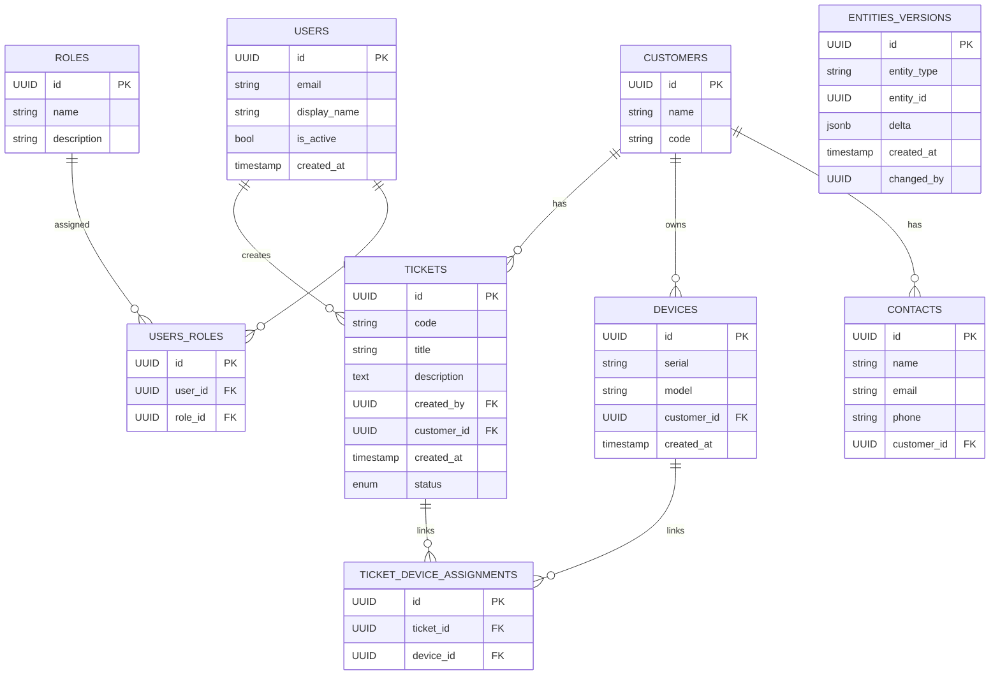

# Modello di Dominio e Diagramma ER

Schema ER (Mermaid)

Descrizione entità (breve)

- `USERS`: utenti dell'app (autenticazione, audit).
- `ROLES`, `USERS_ROLES`: gestione ruoli/permessi.
- `CUSTOMERS`: clienti/aziende.
- `CONTACTS`: referenti per cliente.
- `DEVICES`: dispositivi assegnati a clienti.
- `TICKETS`: record di assistenza/issue.
- `TICKET_DEVICE_ASSIGNMENTS`: associazioni molti-a-molti tra ticket e device.
- `ENTITIES_VERSIONS`: storico/versioning delle entità (per rollback/audit).

Flussi principali

- Creazione ticket:
  1. Utente autenticato richiede endpoint `POST /tickets`.
  2. Validazione input, associa `customer_id` e (opzionale) `device_id`.
  3. Inserimento record in `TICKETS`, evento in audit, possibile creazione entry in `TICKET_DEVICE_ASSIGNMENTS`.

- Creazione dispositivo:
  1. Endpoint `POST /devices` con `customer_id`.
  2. Creazione record in `DEVICES` e associazione al cliente.

- Associazione ticket-dispositivo:
  1. Endpoint `POST /tickets/:id/devices` o batch.
  2. Inserimento in `TICKET_DEVICE_ASSIGNMENTS` e log in `ENTITIES_VERSIONS`.

- Gestione clienti e referenti:
  - CRUD su `CUSTOMERS` e `CONTACTS` con validazioni di unicità e integrità.

Ruoli e autorizzazioni

- Ruoli base: `admin`, `agent`, `viewer`, `client_user`.
- Permessi espressi come controlli applicativi + policy RLS per row-level filtering.

Regole di business chiave (selezione)

- Solo utenti con ruolo `agent` o `admin` possono chiudere ticket.
- I referenti di un cliente possono vedere solo ticket e dispositivi del loro cliente.
- Quando un ticket è creato per un device, il device deve appartenere allo stesso `customer_id` del ticket.

Policy RLS rilevanti (esempi)

- Policy per `TICKETS`: consentire accesso se `auth.role = 'admin' OR` ticket.customer_id = auth.customer_id OR user_has_role('agent').
- Policy per `DEVICES`: consentire SELECT/UPDATE solo a chi ha relazione con `customer_id` o `admin`.

Note

- Tenere sincronizzato questo documento con le migrazioni in `supabase/migrations/`.
