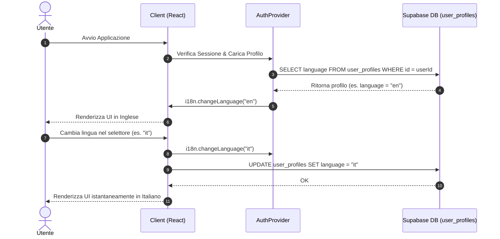

# Spec di Design: Supporto Multilingua (i18n) con react-i18next e Persistenza Supabase

**Data**: 2026-05-23  
**Stato**: Approvato  
**Componenti**: Tutta l'applicazione, Modulo Ticket  
**Autore**: Antigravity

---

## 1. Obiettivo
L'interfaccia dell'applicazione è attualmente solo in italiano. Questa specifica definisce l'aggiunta del supporto multilingua (Italiano ed Inglese) tramite `react-i18next` per l'applicazione React con Vite e la sincronizzazione automatica della preferenza della lingua con la tabella `user_profiles` di Supabase.

---

## 2. Requisiti e Acceptance Criteria
- **Infrastruttura**: Configurazione di `react-i18next`, `i18next` e `i18next-browser-languagedetector` per il rilevamento automatico.
- **Modulo Ticket**: Traduzione completa del modulo Ticket (tabella, filtri, intestazioni, costanti di stato/priorità/tipo).
- **Selettore Lingua**:
  - Presente all'interno del profilo utente (`src/routes/_app/profile.tsx` - già parzialmente predisposto).
  * Aggiunto nella barra laterale sinistra (sidebar) in fondo, accanto/sopra al selettore del Tema.
- **Persistenza**: La lingua dell'utente è salvata nel profilo Supabase (`user_profiles.language`) e viene ripristinata in automatico all'avvio dell'applicazione o dopo il login.

---

## 3. Architettura e Flusso Dati

### Flusso di Sincronizzazione della Lingua


---

## 4. Dettagli Implementativi

### 4.1. Nuova Struttura Cartelle per i18n
Creeremo i file di traduzione sotto `src/i18n/`:
```text
src/
└── i18n/
    ├── index.ts              # Inizializzazione e configurazione i18next
    └── locales/
        ├── it/
        │   ├── common.json   # Stringhe globali e layout
        │   └── tickets.json  # Stringhe del modulo Ticket
        └── en/
            ├── common.json
            └── tickets.json
```

### 4.2. Integrazione con `AuthProvider`
Aggiorneremo `src/lib/auth-context.tsx` e `src/lib/auth-provider.tsx` per caricare `language` durante il caricamento del profilo utente e impostare la lingua attiva in `i18next` all'avvio:
- Selezionare `language` nella query `supabase.from("user_profiles").select("display_name, avatar_url, password_set, language")`.
- Integrare `language` nel tipo `AuthProfile` e nello stato locale di React.
- Chiamare `i18n.changeLanguage(userLang)` non appena il profilo utente viene risolto con successo.

### 4.3. UI - Selettore Lingua nella Sidebar
Aggiungeremo un comodo menu a comparsa (DropdownMenu) nella barra laterale (`src/routes/_app.tsx`) speculare a quello del tema:
- Mostrerà la lingua attiva ("Italiano" o "English") con un check mark.
- Quando selezionato, aggiornerà sia lo stato client `i18n` sia la tabella `user_profiles` tramite la funzione server `updateMyProfile`.

### 4.4. Traduzione del Modulo Ticket
Tutte le stringhe all'interno di `src/routes/_app/tickets.tsx` verranno tradotte usando il hook `useTranslation("tickets")`.
Per le costanti ereditate da `@/lib/pcready` (`STATUS_META`, `PRIORITY_LABEL`, `TICKET_TYPE_LABEL`), useremo la sintassi con fallback dinamico:
- Stato: `t("status." + status, STATUS_META[status].label)`
- Priorità: `t("priority." + priority, PRIORITY_LABEL[priority])`
- Tipo: `t("type." + type, TICKET_TYPE_LABEL[type])`

Questo assicura retrocompatibilità totale con le parti dell'applicazione non ancora tradotte.

---

## 5. Piano di Verifica

### 5.1. Test Manuali
1. **Rilevamento Lingua al Login**: Accedere con un account che ha `language = 'en'` nel database. Verificare che l'intera applicazione e la sidebar vengano renderizzate in inglese fin dall'inizio.
2. **Selettore nella Sidebar**: Cambiare la lingua da "Italiano" ad "English" usando il selettore nella sidebar. Verificare la traduzione immediata dell'interfaccia e dei ticket.
3. **Persistenza su Supabase**: Ricaricare la pagina (F5) e verificare che l'interfaccia mantenga la lingua inglese selezionata. Verificare nel database Supabase che la colonna `language` dell'utente loggato sia stata aggiornata a `'en'`.
4. **Modulo Profilo**: Verificare che cambiando la lingua anche dalla pagina `/profile` (tab Dati Personali) la lingua si aggiorni istantaneamente ovunque.
