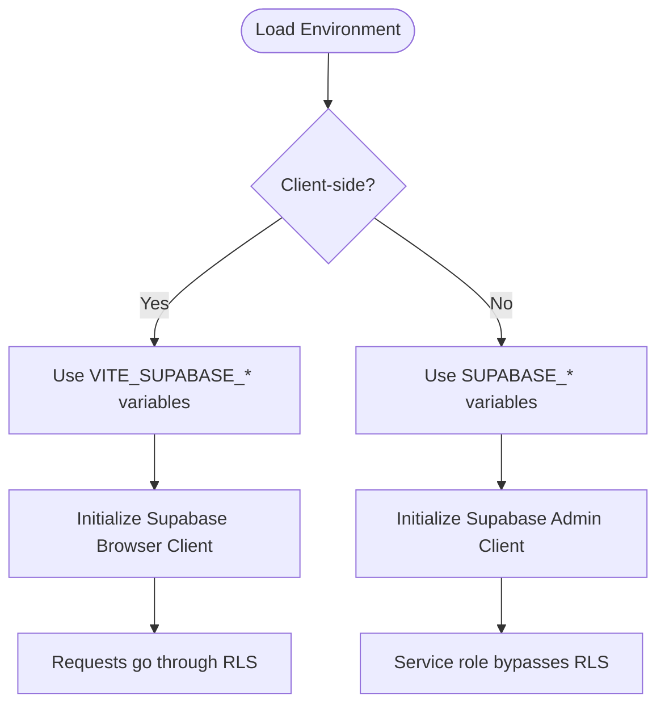

# Environment Variables

pcReady uses environment variables to configure Supabase connections, email delivery, and optional features. This guide explains every variable you need.

## The `.env.example` file

Start by copying the template:

```bash
cp .env.example .env.local
```

The `.env.local` file is git-ignored — never commit secrets.

## Supabase variables

You need two sets of Supabase variables — one for the client (browser) and one for the server.

### Server-side variables

These are read at runtime by server functions (Cloudflare Workers). They must **never** be exposed to the browser.

```bash
SUPABASE_URL=https://your-project.supabase.co
SUPABASE_PUBLISHABLE_KEY=your-anon-key
SUPABASE_SERVICE_ROLE_KEY=your-service-role-key
```

- `SUPABASE_URL` — Your Supabase project URL
- `SUPABASE_PUBLISHABLE_KEY` — The anon/public key (safe for limited client use)
- `SUPABASE_SERVICE_ROLE_KEY` — The secret service role key (**bypasses RLS**, server-only)

### Client-side variables

Prefixed with `VITE_`, these are embedded into the client bundle at build time.

```bash
VITE_SUPABASE_URL=https://your-project.supabase.co
VITE_SUPABASE_PUBLISHABLE_KEY=your-anon-key
```

> **Security:** Never put `SUPABASE_SERVICE_ROLE_KEY` in a `VITE_*` variable.

### Where to find these keys

1. Go to your [Supabase dashboard](https://supabase.com/dashboard)
2. Select your project
3. Navigate to **Settings** → **API**
4. Copy the values under "Project URL" and "Project API keys"

## Client vs Server variable flow



## SMTP / Email variables

Required for email notifications (ticket assignments, completions, SLA alerts):

```bash
SMTP_HOST=smtp.gmail.com
SMTP_PORT=587
SMTP_SECURE=false
SMTP_USER=your-email@gmail.com
SMTP_PASS=your-app-password
SMTP_FROM="PCReady <noreply@yourdomain.com>"
```

The app uses `nodemailer` with these settings. For Gmail, use an [App Password](https://support.google.com/accounts/answer/185833).

## Optional variables

### Deployment label

Shown in the sidebar after the version number:

```bash
VITE_DEPLOYMENT_LABEL=Cloud
```

### Maintenance mode

```bash
VITE_MAINTENANCE_MODE=false
VITE_MAINTENANCE_END=2026-05-14T12:00:00Z
```

- `VITE_MAINTENANCE_MODE` — Set to `true` to show the maintenance page
- `VITE_MAINTENANCE_END` — ISO 8601 timestamp with timezone

> These are build-time variables. Changing them requires rebuilding the client bundle.

### Distributed rate limiting (Upstash Redis)

```bash
UPSTASH_REDIS_REST_URL=your-upstash-url
UPSTASH_REDIS_REST_TOKEN=your-upstash-token
```

When unset, the app uses an in-memory sliding window limiter (single process).

## CI/CD secrets

For GitHub Actions, configure these repository secrets:

| Secret | Used by |
|--------|---------|
| `SUPABASE_URL` | CI, Deploy |
| `SUPABASE_ANON_KEY` | CI |
| `CLOUDFLARE_API_TOKEN` | Deploy |
| `CLOUDFLARE_ACCOUNT_ID` | Deploy |

## Next steps

With your environment configured, proceed to **[Supabase Migrations](/docs#01-onboarding/03-supabase-migrations)** to set up the database schema.
