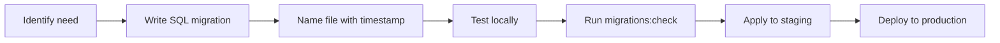

# Supabase Migrations

pcReady uses Supabase-managed Postgres with a migration-based schema evolution system. This guide explains how migrations work, how to apply them, and how the seed system fits in.

## What are migrations?

Migrations are versioned SQL files that define and evolve the database schema. Each migration is a single `.sql` file in `supabase/migrations/`, named with a timestamp prefix. They run in chronological order.

## Migration naming convention

```
YYYYMMDDHHMMSS_descriptive_name.sql
```

Examples from the project:

```
20260430154500_ticket_code_sequence_trigger.sql
20260504170000_add_rls_policies_automation_flows.sql
20260526120000_assistance_bundles.sql
```

The timestamp ensures deterministic ordering. The descriptive name tells you what the migration does.

## Key migrations overview

There are 85+ migrations covering the entire database. Here are the most important groups:

| Migration range | Area |
|----------------|------|
| `20260429*` | Core schema: users, roles, clients, tickets, devices |
| `20260430*` | RLS policies, ticket code trigger, asset/ticket separation |
| `20260503*` | Entity versioning, OAuth tables |
| `20260504*` | Automation flows, RLS policies, app settings |
| `20260507*` | User profiles, notifications, email templates, WIP limits |
| `20260511*` | Activity log, client portal, ticket notes, status history |
| `20260515*` | Device activity, realtime, audit log, automation runs |
| `20260516*` | Attachments, SLA tracking, time tracking, relations |
| `20260520*` | Dashboard widget layout |
| `20260521*` | Device warranty, detail tabs, repair costs, asset tags |
| `20260522*` | Checklist instances |
| `20260523*` | Maintenance schedules, client portal enhancements |
| `20260524*` | Cost management, JSON schema constraints |
| `20260525*` | Calendar events |
| `20260526*` | Assistance bundles |
| `20260603*` | Checklist tags, document signatures, portal auth, hardening |

## Applying migrations

### Via Supabase CLI

```bash
supabase db push
```

This applies all pending migrations to your linked Supabase project.

### Via Supabase dashboard

Open the **SQL Editor** in your Supabase dashboard and run each migration file in order.

## The seed system

pcReady provides two seed files:

| File | Purpose |
|------|---------|
| `supabase/seed.sql` | Essential reference data (roles, email templates) |
| `supabase/seed_demo_full.sql` | Rich demo data (clients, contacts, devices, tickets, checklists) |

Seeds are **idempotent** — they use `ON CONFLICT DO NOTHING` checks and backfill updates, so you can re-run them safely.

### Applying seed data

```bash
# Using psql
psql "postgresql://<user>:<pass>@<host>:<port>/<db>" -f supabase/seed_demo_full.sql
```

## The ticket code trigger

A critical migration is `20260430154500_ticket_code_sequence_trigger.sql`. It creates:

```sql
CREATE SEQUENCE IF NOT EXISTS public.ticket_seq START 1;
```

And a trigger function `set_ticket_code()` that auto-generates unique ticket codes in the format `PCT-000001` before every insert.

```sql
-- Trigger: auto-assign ticket_code before insert
CREATE OR REPLACE FUNCTION public.set_ticket_code()
RETURNS trigger AS $$
BEGIN
  NEW.ticket_code := 'PCT-' || LPAD(nextval('public.ticket_seq')::text, 6, '0');
  RETURN NEW;
END;
$$ LANGUAGE plpgsql;
```

This ensures atomic, collision-free ticket numbering — the client never generates ticket codes.

## Validating migrations

Run the validation script to check for common issues:

```bash
bun run migrations:check
```

This checks:
- Filename pattern (`YYYYMMDDHHMMSS_name.sql`)
- Empty files
- Merge conflict markers (`<<<<<<<`, `=======`)
- Balanced dollar-quoted blocks (`$$...$$`)

## Migration lifecycle



## Best practices

- **One change per migration** — easier to review and roll back
- **Never edit applied migrations** — create a new migration instead
- **Wrap in transactions** — use `BEGIN;` / `COMMIT;` for atomicity
- **Make idempotent** — use `IF NOT EXISTS`, `DROP ... IF EXISTS`
- **Test locally first** — apply to a local Supabase instance before production

## Next steps

Proceed to **[First Run & Quality Checks](/docs#01-onboarding/04-first-run)** to start the dev server and run the test suite.
