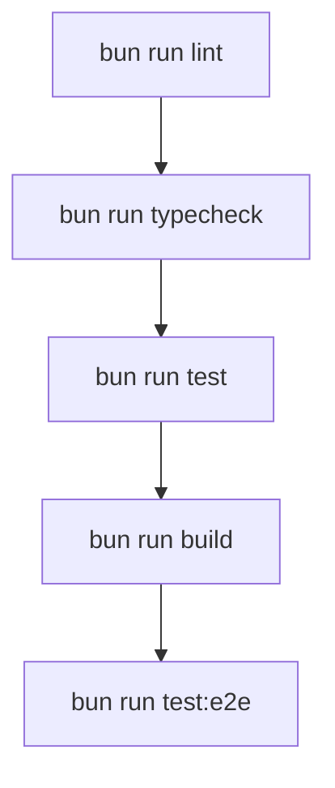

# First Run & Quality Checks

You've cloned the repo, configured your environment, and applied the migrations. Now let's get the app running and verify everything works.

## Starting the dev server

```bash
bun run dev
```

This starts the Vite dev server with hot module replacement (HMR). By default, it listens on port `8080`.

Open [http://localhost:8080](http://localhost:8080) in your browser. You should see the login page.

The dev server uses TanStack Router devtools (visible in the browser console) and React Fast Refresh for instant component updates.

## Building for production

```bash
bun run build
```

This produces an optimized production build in the `dist/` directory. To preview it locally:

```bash
bun run preview
```

The build includes:
- Code splitting (manual chunks for vendor, Supabase, charts, DnD)
- CSS code splitting
- Image optimization (via `vite-plugin-image-optimizer`)
- ESBuild minification

### Bundle analysis

To visualize the bundle composition:

```bash
ANALYZE=true bun run build
```

This generates `dist/stats.html` with a treemap of chunk sizes.

## Quality pipeline



### Linting

```bash
bun run lint
```

Runs ESLint with the flat config (`eslint.config.js`). Includes plugins for React, React Hooks, Prettier, JSDoc, and import ordering.

### Type checking

```bash
bun run typecheck
```

Runs `tsc --noEmit` with strict mode enabled. The project uses path aliases:

```json
// tsconfig.json
{
  "compilerOptions": {
    "paths": {
      "@/*": ["./src/*"],
      "@root/*": ["./*"]
    }
  }
}
```

### Unit tests

```bash
bun run test
```

Runs Vitest with coverage (v8 provider). Tests live in `src/__tests__/`, mirroring the source structure.

```bash
bun run test:watch     # Watch mode
```

### E2E tests

```bash
bun run test:e2e
```

Runs Playwright tests from the `e2e/` directory:

| Test file | What it covers |
|-----------|---------------|
| `auth-flow.spec.ts` | Login, logout, role-based access |
| `kanban-drag.spec.ts` | Kanban drag-and-drop interactions |
| `ticket-flow.spec.ts` | Ticket creation, status transitions |

## Database utilities

### Backup

```bash
bun run db:backup          # Backup local database
bun run db:backup:linked   # Backup linked (production) database
```

### Reset

```bash
bun run db:reset           # Reset local database
bun run db:reset:linked    # Reset linked database
```

These scripts use the Supabase connection from your environment variables.

## CI/CD pipeline

pcReady uses GitHub Actions for continuous integration and deployment:

### CI (Pull Requests)

Triggered on PRs to `main` and `develop`:
1. Install dependencies (`bun install`)
2. TypeScript type checking
3. ESLint
4. Migration validation (`bun run migrations:check`)
5. Production build

### Deploy (Push to main)

Triggered on push to `main`:
1. Build the application
2. Deploy to Cloudflare Workers via Wrangler

Required GitHub Secrets for CI/CD:

- `SUPABASE_URL`
- `SUPABASE_ANON_KEY`
- `CLOUDFLARE_API_TOKEN`
- `CLOUDFLARE_ACCOUNT_ID`

## Troubleshooting

### Missing Supabase variables

If the app fails to start:
- Client-side: verify `VITE_SUPABASE_URL` and `VITE_SUPABASE_PUBLISHABLE_KEY` are set in `.env.local`
- Server-side: verify `SUPABASE_URL` and `SUPABASE_SERVICE_ROLE_KEY` are set

### Migration validation failures

The `migrations:check` script reports:
- **Invalid filename** — check the timestamp format
- **Merge conflict markers** — resolve git conflicts in migration files
- **Unbalanced dollar quotes** — check `$$...$$` blocks in SQL functions

### Port already in use

If port 8080 is taken, update `server.port` in `vite.config.ts`:

```ts
server: {
  host: "::",
  port: 3000,  // Change this
},
```

## Next steps

Your development environment is ready! Proceed to the **[Architecture & Flow](/docs#02-architecture/01-system-overview)** section to understand how the application works under the hood.
