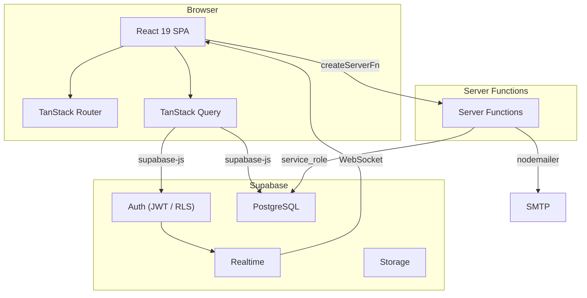
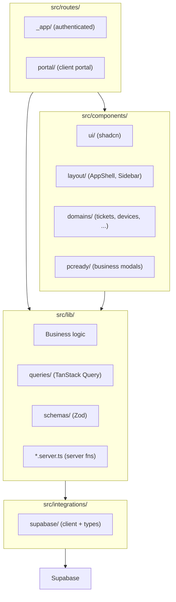

# System Overview

pcReady follows a modern single-page application (SPA) architecture backed by Supabase as a Backend-as-a-Service (BaaS). There is no traditional backend server — business logic runs in server functions.

## Technology stack

| Layer | Technology |
|-------|-----------|
| **Frontend framework** | React 19 with TypeScript |
| **Routing** | TanStack Router + TanStack Start (file-based) |
| **Styling** | Tailwind CSS 4 + shadcn/ui components |
| **State management** | TanStack Query (server state) + React hooks (UI state) |
| **Backend / BaaS** | Supabase (Postgres, Auth, RLS, Realtime, Storage) |
| **Server functions** | TanStack Start `createServerFn` |
| **Build tool** | Vite 7 |
| **Package manager** | Bun |
| **Testing** | Vitest (unit) + Playwright (E2E) |
| **Deployment** | Vite + Bun |

## High-level architecture

## Source tree architecture

## Directory conventions

The project follows strict directory conventions to keep the codebase navigable:

| Directory | Contains | Does NOT contain |
|-----------|----------|-----------------|
| `src/lib/` | Business logic, utilities, Zod schemas, queries | React components, routes, standalone scripts |
| `src/components/` | React UI and domain components | Business logic, route definitions |
| `src/routes/` | TanStack Router file-based routes | Non-route components, business logic |
| `src/hooks/` | Custom React hooks | Components, pure utilities |
| `scripts/` | Standalone Node.js scripts (tooling) | Logic imported by the app |

Import aliases:

- `@/` → `src/` (primary import alias)
- `@root/` → project root (for config files, package.json, etc.)

## Key libraries

| Library | Purpose |
|---------|---------|
| `@tanstack/react-query` | Server state management, caching, refetching |
| `@tanstack/react-router` | Type-safe file-based routing |
| `@tanstack/react-start` | Server function framework (`createServerFn`) |
| `@supabase/supabase-js` | Supabase client (auth, database, realtime) |
| `react-hook-form` + `zod` | Form handling with schema validation |
| `recharts` | Charts and data visualization |
| `reactflow` | Flow diagrams (automation builder) |
| `@uiw/react-codemirror` | Code editor (scripts, SQL) |
| `@react-pdf/renderer` / `pdfkit` | PDF generation (client and server) |
| `@dnd-kit` | Drag-and-drop (kanban board) |
| `nodemailer` | Email delivery (server-side) |
| `shadcn/ui` + `@radix-ui/*` | Accessible UI primitives |
