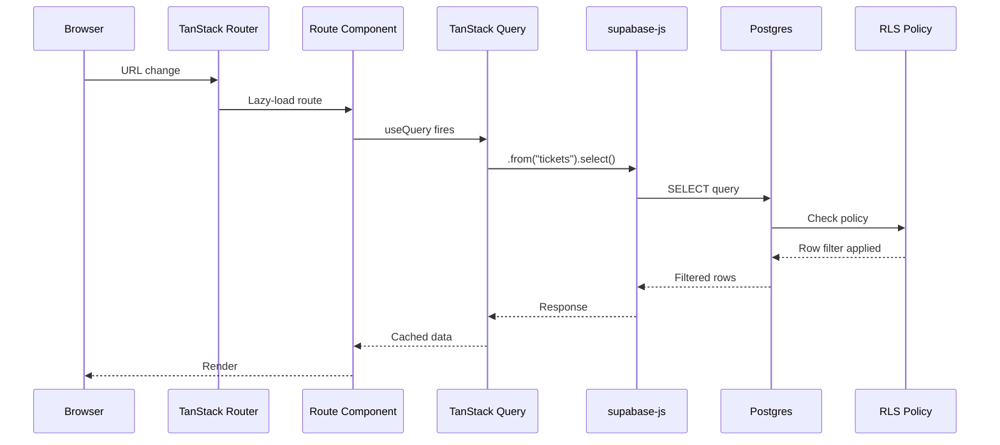
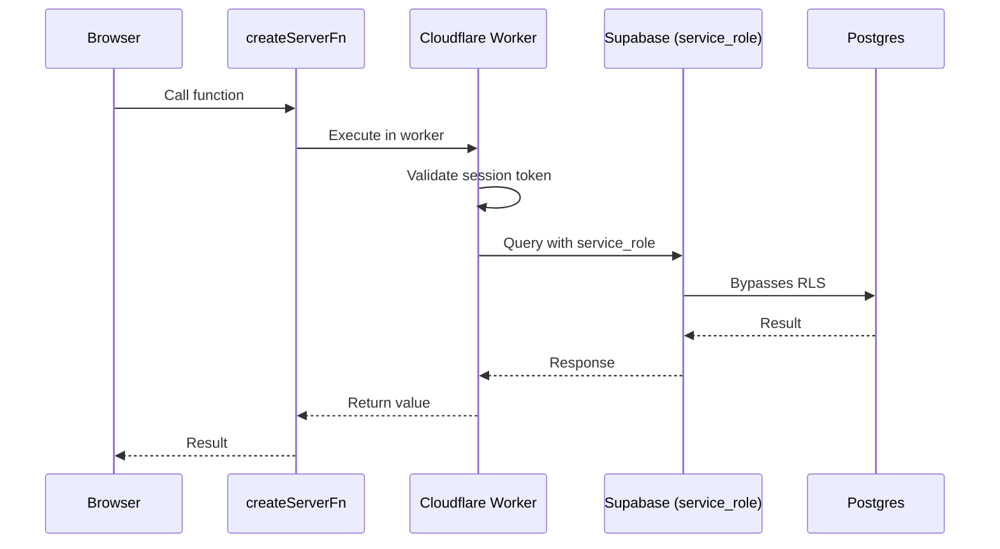

# Data Flow

Understanding how data flows through pcReady is essential for debugging and extending the application. This article traces the complete request lifecycle.

## Request lifecycle



## Server functions

For mutations and sensitive operations, pcReady uses TanStack Start server functions (`createServerFn`). These execute in Cloudflare Workers with access to the Supabase service role key.



Example: ticket creation

```ts
// src/lib/tickets.ts
import { createServerFn } from "@tanstack/react-start";

export const createTicket = createServerFn({ method: "POST" })
  .handler(async ({ data }) => {
    // Runs in Cloudflare Worker
    // Has access to SUPABASE_SERVICE_ROLE_KEY
    const supabase = createAdminClient();

    const { data: ticket, error } = await supabase
      .from("tickets")
      .insert(data)
      .select()
      .single();

    if (error) throw error;
    return ticket;
  });
```

Called from the client like a normal async function:

```tsx
// In a React component
const ticket = await createTicket({ data: { /* ... */ } });
```

## TanStack Query layer

pcReady uses TanStack Query for all server state. Queries are defined in `src/lib/queries/`:

```ts
// src/lib/queries/tickets.ts
export function useTicketList(filters: TicketFilters) {
  return useQuery({
    queryKey: ["tickets", "list", filters],
    queryFn: () => fetchTickets(filters),
    staleTime: 30_000,
  });
}
```

After a mutation, queries are invalidated to trigger refetch:

```ts
const queryClient = useQueryClient();
const mutation = useMutation({
  mutationFn: createTicket,
  onSuccess: () => {
    queryClient.invalidateQueries({ queryKey: ["tickets"] });
  },
});
```

## Supabase client architecture

pcReady initializes two Supabase clients:

### Browser client (`src/integrations/supabase/client.ts`)

```ts
import { createClient } from "@supabase/supabase-js";

export const supabase = createClient(
  import.meta.env.VITE_SUPABASE_URL,
  import.meta.env.VITE_SUPABASE_PUBLISHABLE_KEY,
);
```

- Used for all client-side queries
- Requests go through Row-Level Security (RLS)
- Uses the anon/publishable key

### Admin client (`src/integrations/supabase/client.server.ts`)

```ts
export function createAdminClient() {
  return createClient(
    process.env.SUPABASE_URL!,
    process.env.SUPABASE_SERVICE_ROLE_KEY!,
  );
}
```

- Used in server functions
- Bypasses RLS (service role)
- Never exposed to the browser

## Real-time subscriptions

Supabase Realtime pushes database changes to connected clients via WebSocket:

```ts
// src/hooks/useRealtimeTable.ts
useEffect(() => {
  const channel = supabase
    .channel("tickets-changes")
    .on("postgres_changes",
      { event: "*", schema: "public", table: "tickets" },
      (payload) => {
        // Invalidate TanStack Query cache
        queryClient.invalidateQueries({ queryKey: ["tickets"] });
      }
    )
    .subscribe();

  return () => { supabase.removeChannel(channel); };
}, []);
```

## File-based routing

TanStack Router maps the filesystem to URLs:

| File path | URL |
|-----------|-----|
| `src/routes/_app/dashboard.tsx` | `/dashboard` |
| `src/routes/_app/tickets.tsx` | `/tickets` |
| `src/routes/_app/docs.tsx` | `/docs` |
| `src/routes/portal/index.tsx` | `/portal` |
| `src/routes/portal/tickets/new.tsx` | `/portal/tickets/new` |

The `_app` prefix creates a layout route that wraps authenticated pages with `AppShell`.
