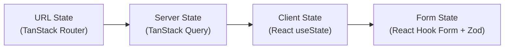

# State Management

pcReady uses a layered state management approach. Each layer handles a specific type of state, preventing the common problem of mixing concerns.



## Layer 1: URL State (TanStack Router)

The URL is the source of truth for navigation and page-level parameters. TanStack Router provides type-safe routing with search params:

```tsx
// src/routes/_app/tickets.tsx
export const Route = createFileRoute("/_app/tickets")({
  validateSearch: (search) => ({
    status: search.status ?? "pending",
    page: search.page ?? 1,
  }),
});

function TicketsPage() {
  const { status, page } = Route.useSearch();
  // ...
}
```

Benefits:
- URLs are shareable and bookmarkable
- Browser back/forward works correctly
- Search params are type-safe

## Layer 2: Server State (TanStack Query)

All data fetched from Supabase is managed by TanStack Query. This provides:

```ts
const { data, isLoading, error } = useQuery({
  queryKey: ["tickets", "list", filters],
  queryFn: () => supabase.from("tickets").select("*").match(filters),
  staleTime: 30_000,       // 30 seconds before refetch
  gcTime: 5 * 60_000,      // 5 minutes garbage collection
});
```

### Query key convention

```ts
// Pattern: ["domain", "operation", ...params]
["tickets", "list", filters]
["devices", "detail", deviceId]
["automations", "runs", flowId]
```

### Mutation + invalidation pattern

```ts
const mutation = useMutation({
  mutationFn: updateTicketStatus,
  onSuccess: () => {
    // Invalidate all ticket queries
    queryClient.invalidateQueries({ queryKey: ["tickets"] });
    // Or: optimistically update the cache
  },
});
```

## Layer 3: Client State (React)

UI-only state stays in React:

```tsx
const [isModalOpen, setIsModalOpen] = useState(false);
const [selectedTab, setSelectedTab] = useState("details");
const [mobileNavOpen, setMobileNavOpen] = useState(false);
```

Never put fetched data in `useState` — use TanStack Query instead.

## Layer 4: Form State (React Hook Form + Zod)

Forms use React Hook Form for performance and Zod for validation:

```tsx
import { useForm } from "react-hook-form";
import { zodResolver } from "@hookform/resolvers/zod";
import { z } from "zod";

const schema = z.object({
  title: z.string().min(1, "Title is required"),
  priority: z.enum(["low", "medium", "high"]),
  client_id: z.string().uuid(),
});

function CreateTicketForm() {
  const form = useForm({
    resolver: zodResolver(schema),
    defaultValues: { title: "", priority: "medium", client_id: "" },
  });

  const onSubmit = form.handleSubmit(async (data) => {
    await createTicket({ data });
  });
}
```

## Auth context

The `AuthProvider` wraps the entire application and provides authentication state:

```tsx
// src/lib/auth-context.tsx
const { session, profile, loading, signOut, refreshProfile } = useAuth();
```

- `session` — Supabase auth session (access token, user)
- `profile` — User profile from `user_profiles` table (role, name, preferences)
- `loading` — True while initial auth check is in progress
- `signOut()` — Log out and redirect
- `refreshProfile()` — Re-fetch profile from server

Roles: `admin`, `tech`, `viewer`. Access control is enforced both client-side (navigation filtering) and server-side (RLS + server function guards).

## Custom domain hooks

Each domain has its own hook encapsulating all data fetching:

| Hook | Domain |
|------|--------|
| `useTickets` | Ticket list, creation, status changes |
| `useDashboardData` | Dashboard analytics, KPIs, widgets |
| `useAutomationRules` | Automation flows, CRUD, execution |
| `useAdminAudit` | Audit logs, presets, exports |

## Mobile detection

The `useIsMobile` hook provides responsive behavior:

```tsx
// src/hooks/use-mobile.tsx
const isMobile = useIsMobile();  // true if viewport < 960px
```

Used throughout the app for adaptive layouts (drawer vs sidebar, modal vs fullscreen).
