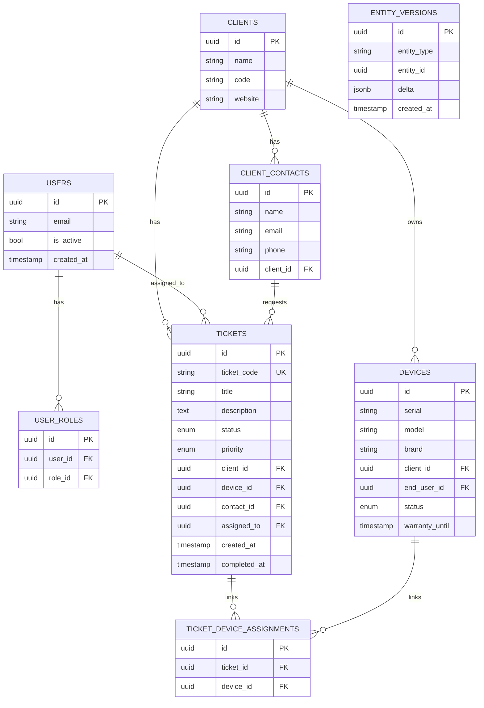

# Entity-Relationship Model

pcReady's database is a Postgres schema managed by Supabase with 85+ migrations. This article maps every entity and relationship.

## Core entities

## Core tables

### `users` — Authentication & identity

Managed by Supabase Auth. Extended by `user_profiles` and `user_roles`.

### `clients` — Companies / organizations

The top-level entity. Each client can have multiple contacts, devices, and tickets.

### `client_contacts` — People at clients

Referents who can be assigned as ticket requesters. Used by the client portal for magic-link authentication.

### `devices` — Physical assets

Tracks hardware inventory: serial numbers, model, brand, OS, warranty dates, and status (`available`, `assigned`, `maintenance`, `retired`). Associated with a client and optionally an end user.

### `tickets` — Work items

The central entity. Each ticket has:
- A unique `ticket_code` (e.g., `PCT-000042`) generated server-side
- A status: `pending` → `in-progress` → `testing` → `ready` → `completed` → `archived`
- A priority: `low`, `medium`, `high`, `critical`
- Foreign keys to `clients`, `devices`, `client_contacts`, and `users` (assignee)

## Feature entities

### Automation system

| Table | Purpose |
|-------|---------|
| `automation_flows` | Flow definitions (triggers, conditions, actions, schedules) |
| `automation_run_logs` | Execution history and outcomes |

### Checklist system

| Table | Purpose |
|-------|---------|
| `checklist_templates` | Reusable checklist definitions (sections + items) |
| `ticket_checklist_instances` | Per-ticket checklist copies |
| `ticket_checklist_responses` | User responses to checklist items |

### Calendar

| Table | Purpose |
|-------|---------|
| `calendar_events` | Scheduled events (interventions, maintenance) |
| `calendar_event_tickets` | Event-to-ticket associations |
| `calendar_event_reminders` | Reminder notifications |

### Costs & finance

| Table | Purpose |
|-------|---------|
| `client_contracts` | SLA contracts (recurring fees, included hours) |
| `client_budgets` | Spending budgets and alert thresholds |
| `ticket_costs` | Labor and material costs per ticket |
| `cost_reports` | Periodic cost aggregations |

### Bundles

| Table | Purpose |
|-------|---------|
| `assistance_bundles` | Prepaid support packages |
| `bundle_assignments` | Client-to-bundle assignments with consumption tracking |

### Other important tables

| Table | Purpose |
|-------|---------|
| `activity_log` | Audit trail of user actions |
| `notifications` | In-app notification records |
| `email_templates` | HTML email templates with variable substitution |
| `app_settings` | Application configuration (key/value) |
| `oauth_clients` | OAuth 2.0 client registrations |
| `maintenance_schedules` | Device maintenance planning |

## Key relationships

- A **client** owns many **devices** and has many **tickets**
- A **ticket** can reference a **device**, a **client_contact**, and an assigned **user**
- **Ticket-device assignments** are many-to-many (a ticket can involve multiple devices)
- **Entity versions** track changes to any entity for audit purposes
- **Activity log** records who did what and when

## Migrations directory

All schema changes are tracked as timestamped SQL files in `supabase/migrations/`. There are 85+ migrations spanning from 2026-04-29 to 2026-06-03.
