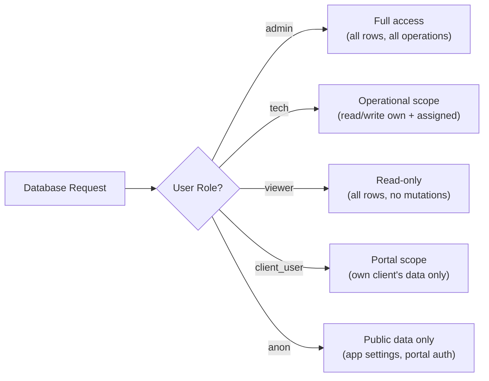

# Row-Level Security Policies

pcReady uses PostgreSQL Row-Level Security (RLS) to enforce data access rules at the database level. Every query from the browser client passes through RLS policies before returning data.

## What is RLS?

Row-Level Security is a PostgreSQL feature that filters which rows a user can see or modify, based on policies attached to each table. It's the **last line of defense** — even if the client code has a bug, RLS prevents unauthorized data access.

## Role-based access model



## Policy examples

### Tickets table

```sql
-- All authenticated users can read tickets (filtered by role in application)
CREATE POLICY "All authed read tickets"
  ON public.tickets
  FOR SELECT
  TO authenticated
  USING (true);

-- Only techs and admins can insert tickets
CREATE POLICY "Tech/admin insert tickets"
  ON public.tickets
  FOR INSERT
  TO authenticated
  WITH CHECK (
    auth.uid() IN (
      SELECT user_id FROM public.user_roles
      WHERE role_id IN (SELECT id FROM public.roles WHERE name IN ('admin', 'tech'))
    )
  );

-- Techs can delete their own tickets
CREATE POLICY "tickets_tech_delete"
  ON public.tickets
  FOR DELETE
  TO authenticated
  USING (
    created_by = auth.uid()
    AND EXISTS (
      SELECT 1 FROM public.user_roles ur
      JOIN public.roles r ON r.id = ur.role_id
      WHERE ur.user_id = auth.uid() AND r.name IN ('admin', 'tech')
    )
  );
```

### Devices table

```sql
CREATE POLICY "All authed read devices"
  ON public.devices
  FOR SELECT
  TO authenticated
  USING (true);
```

### Automation flows

```sql
-- Anyone authenticated can read automation flows
CREATE POLICY "automation_flows_read"
  ON public.automation_flows
  FOR SELECT
  TO authenticated
  USING (true);

-- Only admins can modify flows
-- (Technicians can trigger runs via server functions)
```

### Notifications

```sql
-- Users can only see their own notifications
CREATE POLICY "notifications_own"
  ON public.notifications
  FOR SELECT
  TO authenticated
  USING (user_id = auth.uid());
```

## Bypassing RLS: server functions

Server functions use the Supabase **service role key**, which bypasses all RLS policies. This is used for operations that need unrestricted database access:

```ts
// Server function creates a ticket — bypasses RLS
import { createServerFn } from "@tanstack/react-start";

export const createTicket = createServerFn({ method: "POST" })
  .handler(async ({ data }) => {
    const supabase = createClient(
      process.env.SUPABASE_URL!,
      process.env.SUPABASE_SERVICE_ROLE_KEY!  // Service role → no RLS
    );
    return supabase.from("tickets").insert(data).select().single();
  });
```

> **Security note:** The service role key is stored in `SUPABASE_SERVICE_ROLE_KEY` (NOT `VITE_*`) and is only accessible in server functions running on Cloudflare Workers.

## Key migration files for RLS

| Migration | Tables affected |
|-----------|----------------|
| `20260429202127_*` | Core tables: profiles, tickets, devices, clients |
| `20260430143000_admin_user_management_rls.sql` | Admin user management |
| `20260504170000_add_rls_policies_automation_flows.sql` | Automation flows |
| `20260514210000_tickets_tech_delete_policy.sql` | Ticket deletion for techs |
| `20260523120000_maintenance_schedules.sql` | Maintenance schedules |
| `20260528152634_client_detail_extensions.sql` | Client notes, tags, documents |

## Best practices

- **Least privilege** — Grant only the access each role needs
- **Test with anon key** — Verify that the browser client can't access data it shouldn't
- **Audit policies** — Keep RLS policies in sync with application role changes
- **Never expose service role** — The `SUPABASE_SERVICE_ROLE_KEY` must never appear in client-side code or `VITE_*` variables
