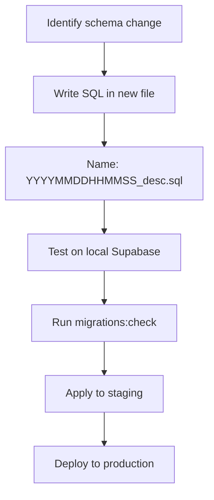

# Migrations Guide

This guide covers the practical aspects of creating and managing database migrations in pcReady.

## Migration philosophy

- **One change per migration** — Easier to review, test, and (if needed) roll back
- **Ordered by timestamp** — Migrations run in chronological order
- **Never edit applied migrations** — Create a new migration to change or undo
- **Forward-only** — Rollback = a new migration that reverses the change

## File naming

```
YYYYMMDDHHMMSS_descriptive_name.sql
```

Examples:
```
20260430154500_ticket_code_sequence_trigger.sql
20260504170000_add_rls_policies_automation_flows.sql
```

The timestamp must be unique and increasing (later timestamps run after earlier ones).

## Writing a migration

Template:

```sql
BEGIN;

-- Your migration SQL here

-- Example: add a column
ALTER TABLE public.tickets
  ADD COLUMN IF NOT EXISTS sla_due_at timestamptz;

-- Example: create a policy
CREATE POLICY "tickets_sla_read"
  ON public.tickets
  FOR SELECT
  TO authenticated
  USING (true);

COMMIT;
```

### Idempotency patterns

Use these patterns so migrations are safe to re-run:

```sql
-- Add column only if it doesn't exist
ALTER TABLE public.tickets
  ADD COLUMN IF NOT EXISTS sla_due_at timestamptz;

-- Create table only if it doesn't exist
CREATE TABLE IF NOT EXISTS public.calendar_events (...);

-- Drop policy before creating (avoids duplicate errors)
DROP POLICY IF EXISTS "my_policy" ON public.my_table;
CREATE POLICY "my_policy" ON public.my_table ...;

-- Create trigger only if it doesn't exist
DO $$ BEGIN
  IF NOT EXISTS (SELECT 1 FROM pg_trigger WHERE tgname = 'my_trigger') THEN
    CREATE TRIGGER my_trigger ...;
  END IF;
END $$;
```

## Creating a migration



### Step-by-step

1. **Create the file** in `supabase/migrations/` with the correct timestamp prefix
2. **Write the SQL** using `BEGIN;` / `COMMIT;` and idempotent patterns
3. **Test locally** — apply to your local Supabase instance
4. **Validate** — run `bun run migrations:check`
5. **Commit** — include the migration in your PR
6. **Deploy** — CI applies migrations to staging, then production

## Testing migrations

```bash
# Apply to local Supabase
supabase db push

# Validate migration files
bun run migrations:check
```

The validation script checks:
- Filename pattern correctness
- Empty files
- Merge conflict markers (`<<<<<<<`, `=======`)
- Balanced dollar-quoted blocks (`$$...$$`)

## Seed data

Two seed files provide initial and demo data:

| File | Use case |
|------|----------|
| `supabase/seed.sql` | Essential data (roles, email templates, app settings) |
| `supabase/seed_demo_full.sql` | Rich demo data for development and testing |

Seeds are idempotent — they use `ON CONFLICT DO NOTHING`:

```sql
INSERT INTO public.roles (id, name, description)
VALUES
  ('00000000-0000-0000-0000-000000000001', 'admin', 'Administrator'),
  ('00000000-0000-0000-0000-000000000002', 'tech', 'Technician')
ON CONFLICT (id) DO NOTHING;
```

Apply seed data:

```bash
psql "postgresql://<user>:<pass>@<host>:<port>/<db>" -f supabase/seed_demo_full.sql
```

## Common patterns

### Adding a table with RLS

```sql
CREATE TABLE IF NOT EXISTS public.my_table (
  id uuid PRIMARY KEY DEFAULT gen_random_uuid(),
  name text NOT NULL,
  created_at timestamptz DEFAULT now()
);

ALTER TABLE public.my_table ENABLE ROW LEVEL SECURITY;

CREATE POLICY "my_table_read"
  ON public.my_table FOR SELECT
  TO authenticated
  USING (true);
```

### Creating a trigger function

```sql
CREATE OR REPLACE FUNCTION public.my_trigger_fn()
RETURNS trigger AS $$
BEGIN
  NEW.updated_at := now();
  RETURN NEW;
END;
$$ LANGUAGE plpgsql;

CREATE TRIGGER my_trigger
  BEFORE UPDATE ON public.my_table
  FOR EACH ROW EXECUTE FUNCTION public.my_trigger_fn();
```

### Backfilling data

```sql
-- Add a column
ALTER TABLE public.tickets ADD COLUMN IF NOT EXISTS client_id uuid;

-- Backfill from related data
UPDATE public.tickets t
SET client_id = d.client_id
FROM public.devices d
WHERE t.device_id = d.id AND t.client_id IS NULL;
```

## Rollback strategy

pcReady uses forward-only migrations. To undo a change:

1. Write a **new migration** that reverses the change
2. Name it with a later timestamp
3. Apply it normally

Example: To remove a column added in migration `20260601120000_add_feature_x.sql`:

```sql
-- New file: 20260602120000_remove_feature_x.sql
BEGIN;
ALTER TABLE public.tickets DROP COLUMN IF EXISTS feature_x;
COMMIT;
```
