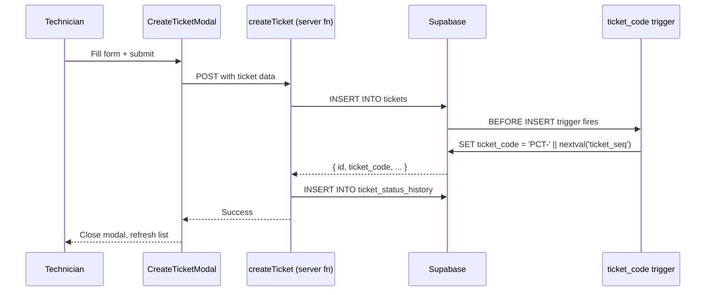
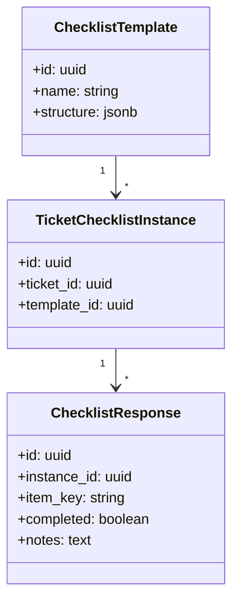

# Ticket Lifecycle

Tickets are the central entity in pcReady. This article covers the full lifecycle from creation to archival, including the supporting systems (checklists, SLA, attachments).

## Status flow

```mermaid
stateDiagram-v2
    [*] --> pending: Ticket created
    pending --> in-progress: Work started
    in-progress --> testing: Ready for verification
    testing --> ready: Verification passed
    ready --> completed: Finalized
    pending --> completed: Fast-track
    in-progress --> completed: Fast-track
    testing --> completed: Fast-track
    ready --> in-progress: Reopened
    completed --> archived: Cleanup
    archived --> [*]
```

## Ticket creation

Tickets are created through `CreateTicketModal` (staff) or the client portal.

### Via the staff UI



### Ticket codes

Ticket codes are generated **server-side** by a PostgreSQL sequence + trigger:

```sql
-- supabase/migrations/20260430154500_ticket_code_sequence_trigger.sql
CREATE SEQUENCE IF NOT EXISTS public.ticket_seq START 1;

CREATE OR REPLACE FUNCTION public.set_ticket_code()
RETURNS trigger AS $$
BEGIN
  NEW.ticket_code := 'PCT-' || LPAD(nextval('public.ticket_seq')::text, 6, '0');
  RETURN NEW;
END;
$$ LANGUAGE plpgsql;
```

This guarantees unique, collision-free codes (e.g., `PCT-000042`) even under concurrent access.

## Status transitions

Each status change is recorded in `ticket_status_history`:

```sql
INSERT INTO public.ticket_status_history
  (ticket_id, old_status, new_status, changed_by)
VALUES
  ($1, 'pending', 'in-progress', auth.uid());
```

Status transitions are validated server-side to prevent invalid state changes.

## Kanban board

The Kanban board (`/kanban`) provides a visual drag-and-drop interface for status management:

- Columns: `pending`, `in-progress`, `testing`, `ready`
- **WIP limits** per column (configurable in app settings)
- **Bulk actions**: select multiple tickets, change status, assign
- **Compact view** toggle for dense displays
- Drag-and-drop powered by `@dnd-kit`

## Checklist system

Checklist templates define standardized procedures:



- Templates are created/edited in the `/checklist` page
- When a ticket is created with a template, an **instance** is copied
- Technicians check off items as they complete them
- Progress is tracked visually (percentage bar)

## SLA tracking

Tickets have SLA deadlines based on priority:

- `critical`: 4 hours
- `high`: 8 hours
- `medium`: 24 hours
- `low`: 72 hours

The `ticket_sla_tracking` migration adds SLA fields to tickets. The system flags approaching deadlines and violations.

## Attachments & notes

- **Attachments**: File uploads stored in Supabase Storage, linked to tickets via `ticket_attachments`
- **Notes**: Public (visible to client) and private (internal) notes stored in `ticket_notes`
- **Time tracking**: Work time entries in `ticket_time_entries` with start/stop functionality

## Client portal

Clients access tickets via magic-link login at `/portal`:

- View their company's tickets
- Create new tickets with category selection
- Receive status update notifications
- Provide feedback on completed tickets
