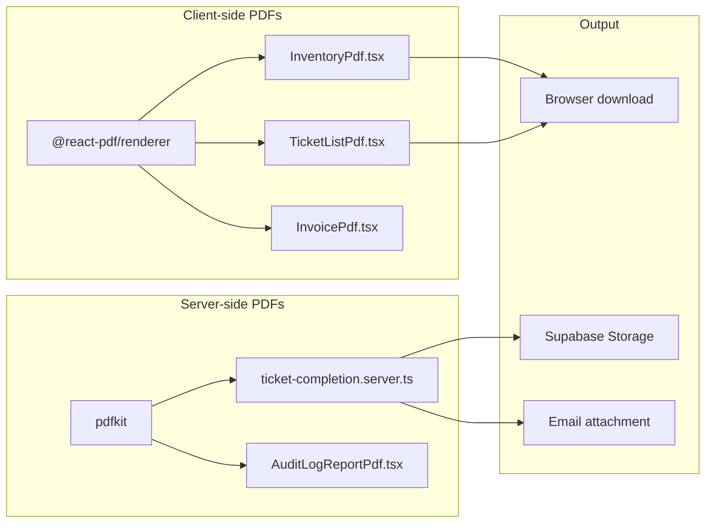

# PDF Generation

pcReady generates PDFs in two modes: client-side (for lists and reports) and server-side (for ticket completion documents emailed to clients).

## Architecture overview



## Client-side PDFs (`@react-pdf/renderer`)

Used for on-demand exports from the browser:

| Component | Purpose | Data source |
|-----------|---------|-------------|
| `InventoryPdf.tsx` | Device inventory export | Current page filters |
| `TicketListPdf.tsx` | Ticket list export | Current page filters |
| `InvoicePdf.tsx` | Cost/invoice report | Selected cost data |

### Row limits

To prevent browser hangs, client-side PDFs are capped at 500 rows:

```ts
const MAX_PDF_ROWS = 500;
<PdfTable rows={rows.slice(0, MAX_PDF_ROWS)} columns={activeColumns} />
```

### Shared PDF primitives

Reusable components in `src/components/pcready/pdf/shared.tsx`:

- `BrandedPage` — Page wrapper with logo and footer
- `PdfSection` — Titled section with metadata
- `PdfTable` — Styled data table
- `StatStrip` — KPI summary row

### Design alignment

The `pdfPalette` object mirrors the app's CSS custom properties, ensuring visual consistency between the UI and exported PDFs.

## Server-side PDFs (`pdfkit`)

Used for ticket completion reports that are attached to emails:

```ts
// src/lib/ticket-completion.server.ts
import PDFDocument from "pdfkit";

async function generateCompletionPdf(ticket: TicketData): Promise<Buffer> {
  const doc = new PDFDocument({ size: "A4", margin: 50 });
  const chunks: Buffer[] = [];

  doc.on("data", (chunk: Buffer) => chunks.push(chunk));

  // Build PDF content
  doc.fontSize(20).text("Verbale di completamento", { align: "center" });
  // ... ticket details, checklist results, costs ...

  doc.end();

  return Buffer.concat(chunks);
}
```

### Error handling

If `pdfkit` fails to load (e.g., in restricted environments), the system falls back to a minimal valid PDF with an error message:

```ts
const RAW_ERROR_PDF_BYTES =
  "%PDF-1.4\n" +
  "1 0 obj<</Type/Catalog/Pages 2 0 R>>endobj\n" +
  // ... minimal valid PDF structure ...
  "BT /F1 12 Tf 50 750 Td (Errore generazione PDF) Tj ET\n";
```

### PDF delivery

Generated PDFs are:
1. Uploaded to Supabase Storage
2. Attached to the ticket
3. Emailed to the client via `nodemailer` with the PDF link
