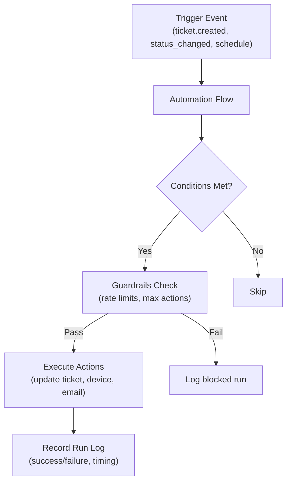
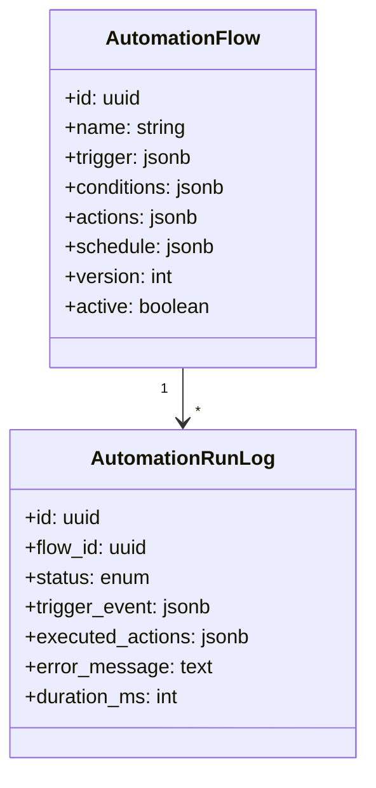

# Automation System

pcReady's automation system enables rule-based workflows: when an event occurs, check conditions, then execute actions.

## Architecture



## Domain model



## Triggers

Flows are activated by events:

| Trigger type | Events |
|-------------|--------|
| `ticket.created` | New ticket created |
| `ticket.status_changed` | Status transitions (e.g., pending → in-progress) |
| `ticket.updated` | Any ticket field change |
| `device.updated` | Device field changes |
| `schedule` | Cron-based recurring execution |

Schedule example (cron expression):

```json
{
  "type": "schedule",
  "cron": "0 8 * * 1",
  "description": "Every Monday at 8:00 AM"
}
```

## Conditions

Conditions filter when actions should execute. They support field comparisons:

| Operator | Description |
|----------|-------------|
| `equals` | Field equals value |
| `not_equals` | Field does not equal value |
| `contains` | String contains substring |
| `greater_than` | Number comparison |
| `less_than` | Number comparison |
| `in` | Value is in a list |
| `is_empty` | Field is null/empty |

Conditions can be grouped with AND/OR logic:

```json
{
  "operator": "and",
  "conditions": [
    { "field": "priority", "operator": "equals", "value": "critical" },
    { "field": "status", "operator": "equals", "value": "pending" }
  ]
}
```

## Actions

Supported actions:

| Action | Description |
|--------|-------------|
| `update_ticket` | Modify ticket fields (status, priority, assignee) |
| `update_device` | Modify device fields (status, location) |
| `send_email` | Send templated email via nodemailer |
| `create_notification` | Create in-app notification |

Email action example:

```json
{
  "type": "send_email",
  "template": "ticket_assigned",
  "to": "{{assignee.email}}",
  "variables": {
    "ticket_code": "{{ticket.ticket_code}}",
    "client_name": "{{ticket.client_name}}"
  }
}
```

Variables use `{{path.to.field}}` syntax and are resolved from the trigger event's context.

## Flow builder UI

The `AutomationWizard` component provides a step-by-step interface:

1. **Trigger step** — Select the event type
2. **Conditions step** — Build condition groups
3. **Actions step** — Configure actions
4. **Schedule step** — Set cron (if applicable)
5. **Review step** — Summary before saving

Flows are stored as JSON in the `automation_flows` table, versioned, and track change notes.

## Validation & guardrails

### Flow validation (`flow-validation.ts`)

Validates flow structure before saving:
- Required fields present
- Condition operators are valid for field types
- Actions reference valid targets
- No circular dependencies

### Guardrails (`automation-guardrails.ts`)

Runtime safety checks:
- **Rate limiting**: Max executions per flow per hour
- **Action limits**: Max actions per flow
- **Dry-run mode**: Test flows without side effects

## Run logs & monitoring

Each flow execution is logged:

```ts
// src/lib/automation-runs.ts
export const executeAutomationFlow = createServerFn({ method: "POST" })
  .handler(async ({ data }) => {
    const start = Date.now();
    try {
      // Execute flow
      const result = await runFlow(data.flowId);
      await logRun({ flowId: data.flowId, status: "success", durationMs: Date.now() - start });
      return result;
    } catch (error) {
      await logRun({ flowId: data.flowId, status: "error", errorMessage: error.message });
      throw error;
    }
  });
```

### KPI dashboard

The automations page shows:
- **Success rate** (percentage)
- **Total runs** (count)
- **Last run time**
- **Per-flow statistics**

## Versioning

Each flow update increments a version number and records change notes. This provides an audit trail and the ability to review flow evolution over time.
