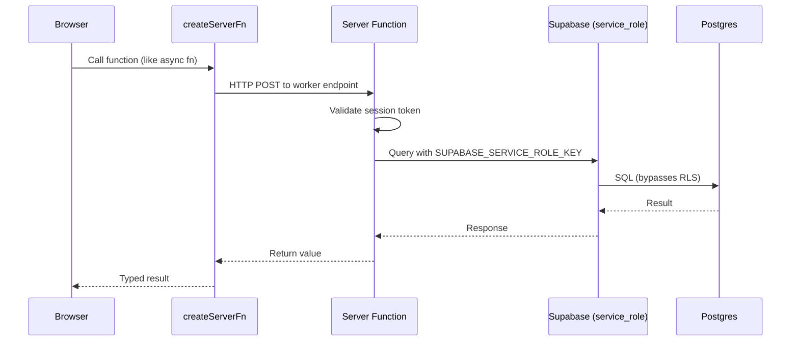

# Supabase Server Functions

pcReady uses TanStack Start's `createServerFn` to define server-side logic that executes with access to the Supabase service role key.

## Server function pattern



## How they execute

Server functions run server-side — not in Supabase Edge Functions. This means:

- Access to Node.js-compatible APIs
- Access to environment variables (`SUPABASE_SERVICE_ROLE_KEY`, `SMTP_*`, etc.)
- Not subject to Supabase Edge Function limits

## Creating a server function

```ts
// src/lib/tickets.ts
import { createServerFn } from "@tanstack/react-start";

export const createTicket = createServerFn({ method: "POST" })
  .validator((data: unknown) => ticketSchema.parse(data))
  .handler(async ({ data }) => {
    const supabase = createAdminClient();

    // Validate user authorization
    const { data: profile } = await supabase
      .from("user_profiles")
      .select("role")
      .eq("user_id", data.userId)
      .single();

    if (!profile || !["admin", "tech"].includes(profile.role)) {
      throw new Error("Unauthorized");
    }

    // Execute mutation
    const { data: ticket, error } = await supabase
      .from("tickets")
      .insert(data)
      .select()
      .single();

    if (error) throw error;

    // Log activity
    await supabase.from("activity_log").insert({
      action: "ticket.created",
      entity_type: "ticket",
      entity_id: ticket.id,
    });

    return ticket;
  });
```

Called from the client:

```tsx
// In a React component
const ticket = await createTicket({
  data: {
    title: "Setup new workstation",
    clientId: "...",
    priority: "high",
  },
});
```

## Key server functions

| File | Functions |
|------|-----------|
| `src/lib/tickets.ts` | `createTicket` |
| `src/lib/ticket-completion.ts` | `completeTicketServer` |
| `src/lib/device-status.ts` | `updateDeviceStatus` |
| `src/lib/admin-users.ts` | `listAdminUsers`, `inviteAdminUser`, `deleteAdminUser` |
| `src/lib/automation-runs.ts` | `executeAutomationFlow`, `executeDryRun`, `runAutomationNow` |
| `src/lib/notifications.ts` | `createNotification`, `listNotifications`, `markNotificationRead` |
| `src/lib/audit-log.ts` | `getAuditLog`, `exportAuditLog`, `saveAuditPreset` |
| `src/lib/dashboard-analytics.ts` | `getDashboardAnalytics`, `getTechnicianStats` |
| `src/lib/app-settings.ts` | `getAppSettings`, `updateAppSettings` |
| `src/lib/email-templates.ts` | `listEmailTemplates`, `sendTestEmail` |
| `src/lib/export-data.ts` | `exportAllData` |

## Authentication & authorization

Server functions validate the caller's session before executing:

```ts
.handler(async ({ data }) => {
  // Get session from request context
  const session = await getSession();

  if (!session) {
    throw new Error("Not authenticated");
  }

  // Role check
  const profile = await getProfile(session.user.id);
  if (profile.role !== "admin") {
    throw new Error("Admin access required");
  }
  // ...
});
```

File naming convention: `*.server.ts` files contain server-only code and should never be imported directly in client components.

## Rate limiting

Rate limiting prevents abuse:

```ts
// src/lib/auth-rate-limit.ts
import { createServerFn } from "@tanstack/react-start";

export const assertStaffLoginRateLimit = createServerFn({ method: "POST" })
  .handler(async ({ data }) => {
    // In-memory sliding window (single worker)
    // or distributed via Upstash Redis when configured
    const allowed = await rateLimiter.check(data.email);
    if (!allowed) {
      throw new Error("Too many attempts. Try again later.");
    }
  });
```

When `UPSTASH_REDIS_REST_URL` is configured, rate limits are distributed across worker instances.

## Error handling

Server functions return structured errors:

```ts
try {
  const result = await createTicket({ data });
} catch (error) {
  // error.message contains user-friendly message
  // Server-side: full error is logged to activity_log
}
```

## File locations

Server-only modules live in `src/lib/*.server.ts`:

- `ticket-completion.server.ts` — PDF generation + email
- `automation-runs.server.ts` — Flow execution engine
- `notifications.server.ts` — Email dispatch
- `staff-auth.server.ts` — Staff login
- `admin-users.server.ts` — User management
