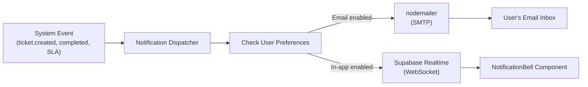

# Webhooks & Notifications

pcReady sends notifications through two channels: email (via nodemailer) and in-app (via Supabase Realtime).

## Notification pipeline



## Email notifications

Emails are sent via `nodemailer` using the SMTP configuration from environment variables:

```ts
// src/lib/notifications.server.ts
import nodemailer from "nodemailer";

const transporter = nodemailer.createTransport({
  host: process.env.SMTP_HOST,
  port: Number(process.env.SMTP_PORT),
  secure: process.env.SMTP_SECURE === "true",
  auth: {
    user: process.env.SMTP_USER,
    pass: process.env.SMTP_PASS,
  },
});

export async function sendTicketCompletedEmail(params: {
  to: string;
  ticketCode: string;
  clientName: string;
  pdfUrl: string;
}) {
  const template = await getEmailTemplate("ticket_completed");

  const html = fillTemplate(template.html, {
    ticket_code: params.ticketCode,
    client_name: params.clientName,
    pdf_link: params.pdfUrl,
    organization_name: "PCReady",
  });

  await transporter.sendMail({
    from: process.env.SMTP_FROM,
    to: params.to,
    subject: `Ticket ${params.ticketCode} completato`,
    html,
  });
}
```

### Email templates

Templates are stored in the `email_templates` database table:

| Template key | Trigger |
|-------------|---------|
| `ticket_completed` | Ticket marked as completed |
| `ticket_assigned` | Ticket assigned to a technician |
| `checklist_completed` | Checklist fully checked off |
| `portal_ticket_created` | Client creates a ticket |
| `portal_ticket_status_changed` | Client ticket status update |

Templates use `{{variable_name}}` syntax for substitution. Both HTML and plain text versions are stored.

## In-app notifications

In-app notifications are created as database records and delivered in real-time:

```ts
// src/lib/notifications.ts
export const createNotification = createServerFn({ method: "POST" })
  .handler(async ({ data }) => {
    const { data: notification } = await supabase
      .from("notifications")
      .insert({
        user_id: data.userId,
        type: data.type,
        title: data.title,
        message: data.message,
        link: data.link,
      })
      .select()
      .single();

    return notification;
  });
```

### NotificationBell component

The `NotificationBell` component in the TopBar:
- Shows unread count badge
- Drops down `NotificationInbox` on click
- Supports mark-as-read, mark-all-read, delete

### Real-time delivery

Notifications appear instantly via Supabase Realtime:

```ts
const channel = supabase
  .channel("notifications")
  .on("postgres_changes",
    { event: "INSERT", schema: "public", table: "notifications" },
    (payload) => {
      queryClient.invalidateQueries({ queryKey: ["notifications"] });
    }
  )
  .subscribe();
```

## Notification preferences

Users control which channels they receive per notification type:

```sql
-- user_profiles table includes:
email_notifications boolean DEFAULT true,
in_app_notifications boolean DEFAULT true
```

Additional per-notification-type preferences are stored in `notification_channel_preferences`.

## OAuth 2.0

pcReady also functions as an OAuth 2.0 provider for third-party integrations:

- **Client management** — Register, rotate secrets, manage lifecycle
- **Consent flow** — User-authorized access with scope selection
- **Authorization codes** — Standard OAuth 2.0 authorization code grant
- **Token exchange** — Code → access token

Key files:

| File | Responsibility |
|------|---------------|
| `src/lib/oauth-consent.ts` | Consent flow, client management |
| `src/routes/_app/oauth.consent.tsx` | Consent UI |
| `supabase/migrations/20260503120001_oauth_tables.sql` | OAuth tables and RLS |
